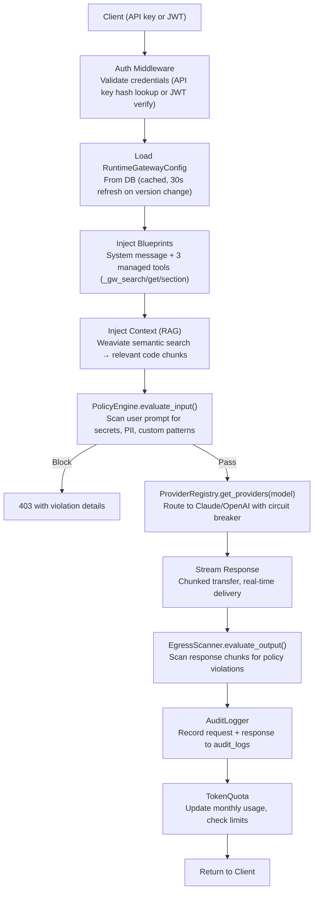
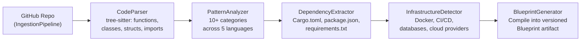
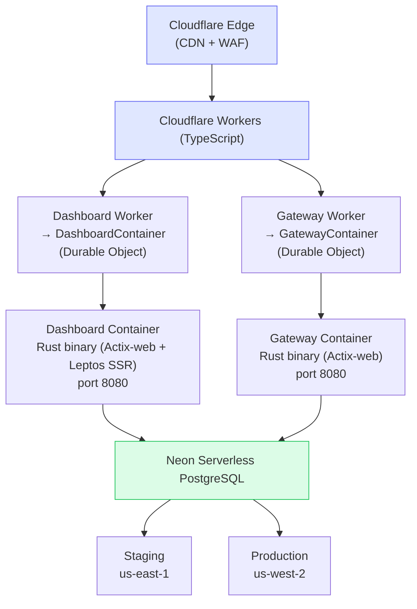
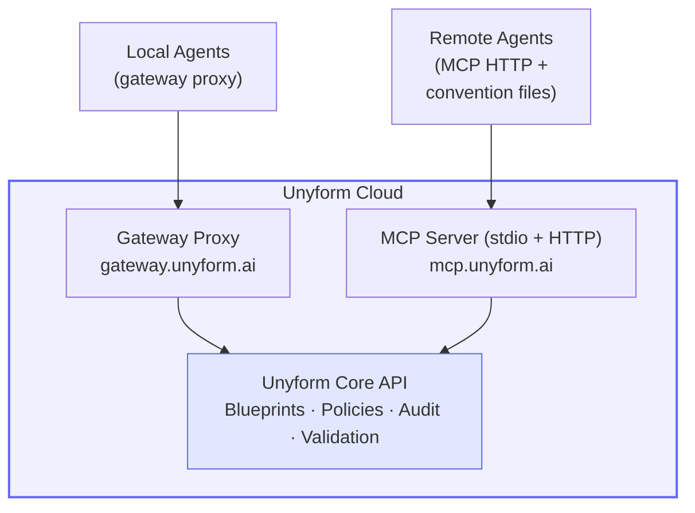
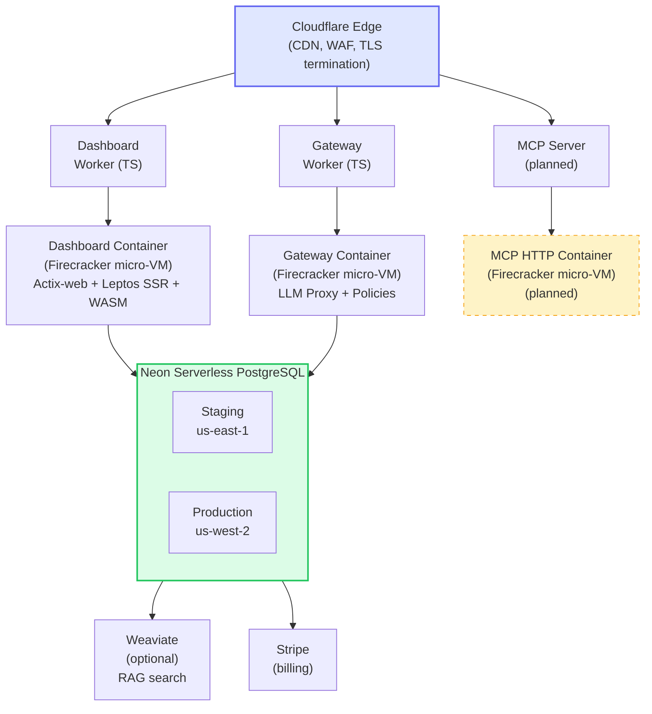
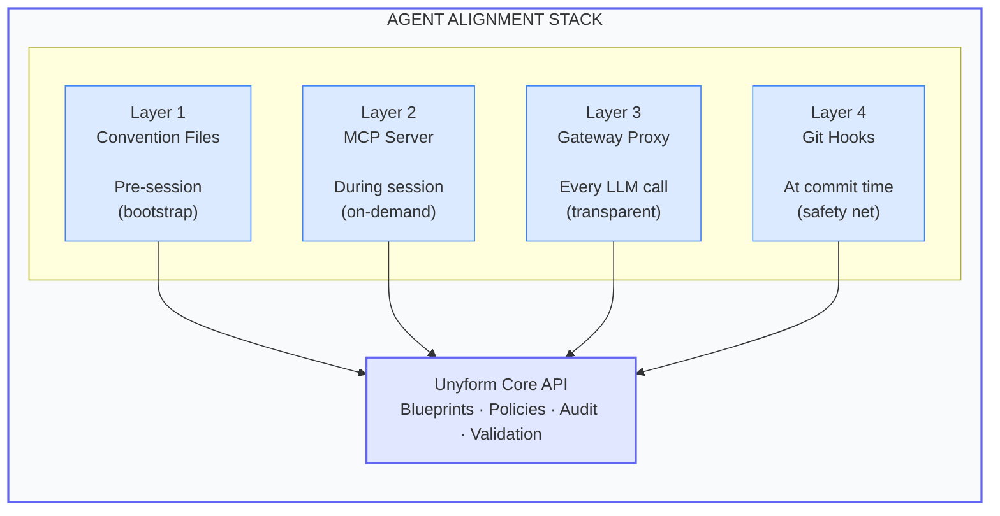
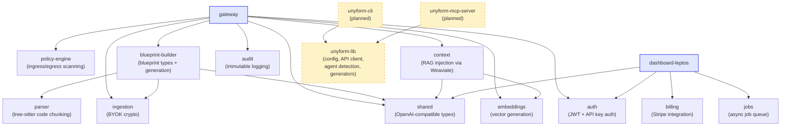

# Unyform.ai — Architecture Review

**Date**: 2026-03-07
**Author**: Architecture Review (Staff+ level)
**Branch**: `feature/mvp-phase2-3`
**Audience**: Investors, CTO-level reviewers, security auditors
**Classification**: Confidential — Internal & Investor Use

---

## Table of Contents

1. [System Overview & Mission](#1-system-overview--mission)
2. [Current Architecture (As-Built)](#2-current-architecture-as-built)
3. [Security Posture & Cryptographic Design](#3-security-posture--cryptographic-design)
4. [MVP Architecture — Agent Integration Stack](#4-mvp-architecture--agent-integration-stack)
5. [SOC 1 Readiness Assessment](#5-soc-1-readiness-assessment)
6. [SOC 2 Readiness Assessment](#6-soc-2-readiness-assessment)
7. [Evolution Timeline](#7-evolution-timeline)
8. [System Diagrams](#8-system-diagrams)
9. [Risk Assessment Matrix](#9-risk-assessment-matrix)
10. [Engineering Roadmap & Resource Plan](#10-engineering-roadmap--resource-plan)

---

## 1. System Overview & Mission

### What Unyform Is

Unyform is a **real-time AI alignment runtime** — the governance layer between autonomous coding agents and organizational codebases. Every AI interaction is policy-checked, blueprint-aligned, audit-logged, and observable.

The core product surfaces are:

| Surface | Function |
|---------|----------|
| **Gateway** | LLM proxy that intercepts all AI traffic, injects organizational context, enforces policies, and audits every request/response |
| **Blueprint Builder** | Extracts organizational coding patterns, technology stacks, and architecture from analyzed repositories |
| **Policy Engine** | Evaluates content against configurable rules — detects secrets, PII, and custom patterns in both ingress and egress |
| **Dashboard** | Leptos SSR + WASM application for organization management, analytics, and configuration |
| **Agent Stack** (planned) | CLI + MCP server + convention file generator for direct integration with 7+ autonomous coding agents |

### Why This Matters

Autonomous coding agents (Claude Code, Codex, Devin, Cursor, Windsurf, aider, OpenHands) are becoming the primary way developers write code. These agents produce output at unprecedented speed — but without alignment to organizational standards, they generate technical debt, security violations, and architectural inconsistency at equal speed.

Unyform ensures that **all agent output — regardless of where the agent runs — aligns with organizational blueprints and policies**. The system provides measurable alignment metrics, real-time intervention, and an immutable audit trail.

### Technology Stack

| Layer | Technology |
|-------|-----------|
| Language | Rust (workspace, 18 crates) |
| Web Framework | Actix-web (gateway + dashboard server) |
| Frontend | Leptos SSR + client-side hydration via WASM |
| Database | Neon Serverless PostgreSQL (us-east-1 staging, us-west-2 production) |
| Deployment | Cloudflare Workers + Containers (Firecracker micro-VMs) |
| CI/CD | GitHub Actions (lint, test, build, deploy-on-push) |
| CSS | Tailwind v4 |
| Code Parsing | Tree-sitter (6+ languages) |
| Vector Search | Weaviate (optional, for RAG context injection) |
| Billing | Stripe (subscriptions, webhooks) |

---

## 2. Current Architecture (As-Built)

### 2.1 Workspace Structure

The Rust workspace contains **18 crates** organized by domain:

```
crates/
├── shared/              # Common types (OpenAI-compatible chat protocol)
├── auth/                # Argon2id passwords, JWT, API keys, MFA, OAuth
├── audit/               # HMAC-SHA256 tamper-evident event chain
├── gateway/             # LLM proxy — the core product runtime
├── policy-engine/       # Content scanning (secrets, PII, custom regex)
├── blueprint-builder/   # Pattern extraction from analyzed repos
├── parser/              # Tree-sitter code chunking (Rust, TS, Python, Go, Java, JS)
├── ingestion/           # GitHub connector, BYOK encryption, smart file scanning
├── context/             # Weaviate-backed semantic code search (RAG)
├── embeddings/          # OpenAI + optional local ONNX embeddings
├── billing/             # Stripe integration (products, subscriptions, webhooks)
├── jobs/                # Async job queue (PostgreSQL + Redis backends)
├── dashboard-leptos/    # Leptos SSR dashboard (Actix-web server)
├── dashboard/           # Legacy dashboard types (being consolidated)
├── seed/                # Database seeder (6 test users with Argon2id hashes)
├── mech-crate/          # Blueprint code generation (planned)
├── unyform-lib/         # Shared library for CLI + MCP server (planned)
├── unyform-cli/         # CLI binary: init, generate, validate (planned)
└── unyform-mcp-server/  # MCP server for agent integration (planned)
```

### 2.2 Database Schema

**34 migrations** (sequential, idempotent) define the production schema across these entity groups:

**Identity & Access:**
- `users` (Argon2id password hash, email, name)
- `organizations` + `org_members` (owner/admin/developer/viewer roles)
- `sessions` (SHA-256 hashed tokens, idle + absolute expiration)
- `user_credentials`, `mfa_core`, `trusted_devices`
- `auth_events` (HMAC-SHA256 chain hash for tamper detection)
- `email_verification_tokens`, `password_reset_tokens`
- `sso_configuration`

**Core Product:**
- `gateways` (slug, status, org_id, config_version, monthly_token_limit)
- `gateway_providers` (encrypted API keys via BYOK, provider_type, priority)
- `gateway_policies` (enforcement: enforce/warn/disabled)
- `gateway_blueprints` (attached blueprints with priority ordering)
- `gateway_api_keys` (SHA-256 hashed, scoped: `gw:invoke`, `gw:config`)
- `gateway_usage` (per-request token tracking: prompt, completion, total, duration_ms)
- `blueprints` + `blueprint_versions` (org-scoped, versioned content)
- `policies` (name, rules JSONB, scope, enforcement)

**Infrastructure:**
- `jobs` (UUID PK, JSONB params/progress/result, LISTEN/NOTIFY triggers)
- `audit_logs` (immutable: org_id, user_id, action, resource, request_ip, details JSONB)
- `contact_requests`, `email_login_codes`
- `plans`, `plan_prices`, `subscriptions` (Stripe-backed billing)
- `byok_keys`, `repo_connections` (BYOK encryption + GitHub OAuth)

**Index design** is production-appropriate: composite indexes on (gateway_id, created_at DESC) for usage queries, partial indexes on `status='pending'` for job dequeue, and INET type for IP addresses.

### 2.3 Gateway Architecture (Core Product Runtime)

The gateway is the highest-value crate — it's the runtime enforcement point for all AI traffic.

**Request flow:**



**Key architectural decisions:**

| Decision | Rationale |
|----------|-----------|
| **OpenAI-compatible API format** | Drop-in replacement for any OpenAI SDK client — agents don't need code changes |
| **Managed tools** (`_gw_search_blueprints`, `_gw_get_blueprint`, `_gw_get_blueprint_section`) | LLM discovers blueprints on-demand rather than bloating the system prompt |
| **Multi-provider with circuit breaker** | Failover across Claude/OpenAI; non-retryable errors (400) fail fast; 3-failure threshold with 30s cooldown |
| **BYOK encryption** | User-controlled master key → org DEK → per-provider API key encryption. No key escrow. |
| **Config cache with version-based invalidation** | In-memory `Arc<RwLock>` cache, 30s background poll checks `config_version` column — avoids DB round-trip per request |
| **Streaming-first** | All LLM responses stream — no buffering. Egress scanner processes chunks incrementally |

**Provider implementations:**
- `ClaudeProvider` — Anthropic API (claude-3-* models), streaming via SSE
- `OpenAiProvider` — OpenAI API (gpt-4, gpt-3.5-turbo), streaming via SSE
- Registry supports runtime-loaded providers from DB (BYOK-managed API keys)

**Token quota management:**
- Per-gateway monthly limits (configurable, NULL = unlimited)
- Warning threshold (default 80%)
- Fails open on DB errors (availability > enforcement for quota)
- Status enum: `Unlimited | Ok(QuotaInfo) | Exceeded(QuotaInfo)`

### 2.4 Blueprint Builder

Extracts organizational knowledge from codebases through multi-stage analysis:

**Pipeline:**


**Pattern categories detected:** Error Handling, Naming, Structure, API Design, Testing, Documentation, Security, Performance, Architecture, Observability.

**Language support:** Rust (Result<T,E>, Anyhow, Tracing), TypeScript (Try-catch, Jest, JSDoc), Python (try-except, pytest, docstrings), Go, Java.

**Blueprint artifact:** Exportable as YAML or JSON. Contains patterns with confidence scores, dependency stacks, infrastructure configs. Method `generate_ai_rules()` produces agent-consumable convention text.

### 2.5 Policy Engine

Content scanning engine with three policy types:

| Type | Detects | Patterns |
|------|---------|----------|
| **Secrets** | API keys, passwords, tokens, private keys | Pre-compiled regex patterns |
| **PII** | Email, phone, SSN, credit card numbers | Pre-compiled regex patterns |
| **CustomRegex** | Org-defined patterns | User-configured via dashboard |

**Evaluation modes:** `evaluate_input()` (scan user prompts), `evaluate_output()` (scan LLM responses), `evaluate_scoped()` (direction-aware ingress/egress).

**Actions:** Allow, Block (return 403 with violation details), Redact (mask matched content).

**Default policy set:** `no-secrets` with Severity::Critical — blocks all detected secrets.

### 2.6 Supporting Infrastructure

**Ingestion Pipeline:**
- GitHub OAuth connector with rate limiting
- SmartScan: excludes node_modules, target, vendor, .git
- 70+ indexable extensions
- MAX_FILE_SIZE: 1MB per file
- BYOK encryption for GitHub tokens (XChaCha20-Poly1305)

**Context Service (RAG):**
- Weaviate vector DB for semantic code search
- Embedding via OpenAI (`text-embedding-3-large`) or local ONNX
- Filtered by org_id, repo_id, language, chunk_type, min_score
- Injected into system message for context-aware LLM responses

**Job Queue:**
- PostgreSQL backend with `LISTEN/NOTIFY` for real-time progress
- SSE endpoint at `/api/jobs/{job_id}/progress` for dashboard streaming
- Single worker per dashboard instance (spawned at startup)
- `SKIP LOCKED` dequeue prevents double-processing

**Billing:**
- Stripe integration: products, prices, customers, subscriptions, invoices
- Webhook signature verification
- Dashboard-exposed subscription management

### 2.7 Deployment Architecture

**Production topology:**



**Container resources:** 0.0625 vCPU (1/16), 256 MiB RAM, 2 GB disk per instance. No haproxy — Rust binary runs directly as PID 1.

**Scaling:**
- Staging: max 2 instances per service
- Production: max 5 instances per service
- Idle timeout: 15 minutes (cold start on next request: 30-60s)

**Production routes:**
- `unyform.ai/*` + `app.unyform.ai/*` → Dashboard
- `gateway.unyform.ai/*` → Gateway

**CI/CD pipeline:**
1. **PR to main:** lint (fmt + clippy), test (postgres:16 service container), build (release)
2. **Push to main:** path-filtered deploy — only deploys services with changed files
3. **Health check:** 15 retries × 10s delay (accommodates cold start)

**Dockerfile strategy:** Multi-stage builds (base → builder → production). Dashboard additionally builds WASM + Tailwind CSS. Both produce `debian:bookworm-slim` production images with migrations bundled.

---

## 3. Security Posture & Cryptographic Design

### 3.1 Authentication & Session Management

| Mechanism | Implementation | Status |
|-----------|---------------|--------|
| **Password hashing** | Argon2id (64 MiB memory, 3 iterations, 32-byte salt) | Production |
| **Session tokens** | SHA-256 hashed before storage; dual expiration (idle + absolute) | Production |
| **JWT** | RS256 signed tokens; configurable expiration (1h access, 7d refresh) | Production |
| **API keys** | SHA-256 hashed; prefix-based lookup (`unyf_`); scoped (`gw:invoke`, `gw:config`) | Production |
| **MFA** | TOTP (RFC 6238); AES-256-GCM encrypted secrets; backup codes | Production |
| **OAuth** | GitHub OAuth2 flow | Production |
| **Email login codes** | Time-limited, single-use | Production |

### 3.2 Encryption Architecture

**At rest:**
- BYOK (Bring Your Own Key) for provider API keys:
  - Master key → KDF → master KEK (key encryption key)
  - Per-org DEK (data encryption key) encrypted with master KEK
  - Per-provider API key encrypted with DEK
  - Stored as `api_key_encrypted` (BYTEA) + `api_key_iv` (BYTEA)
- MFA secrets: AES-256-GCM with per-user IV
- GitHub tokens: XChaCha20-Poly1305 with key derivation

**In transit:**
- All Neon connections: `sslmode=require` (TLS via rustls)
- Cloudflare edge: automatic TLS termination
- Inter-service: Workers → Containers communication is private network

### 3.3 Audit & Compliance Infrastructure

**Immutable audit log:**
- `audit_logs` table: org_id, user_id, action, resource_type, resource_id, request_ip (INET), details (JSONB), created_at
- Indexed on (org_id), (user_id), (action), (created_at DESC)
- Append-only by application convention

**Tamper-evident auth events:**
- `auth_events` table with HMAC-SHA256 chain hash
- Each event's hash incorporates the previous event's hash → hash chain
- Fields: user_id, event_type, ip_address, success, metadata (JSONB)
- Breaking the chain is detectable during audits

**Gateway audit trail:**
- Every LLM request/response is logged with: timestamp, tokens used, model, policy checks, blueprint injections
- Token usage tracked per API key in `gateway_usage` table

### 3.4 Identified Security Gaps

| Gap | Severity | Mitigation Plan |
|-----|----------|----------------|
| **No per-IP/user rate limiting** | Medium | `rate_limit_rpm` config exists (default 60) but enforcement not yet wired into middleware |
| **CORS allows `*` by default** | Low | Configurable via `CORS_ALLOWED_ORIGINS` env; logs warning when set to `*` |
| **No CSRF tokens on dashboard** | Medium | Leptos SSR uses same-origin forms; add explicit CSRF tokens for state-changing operations |
| **Password strength feedback only** | Low | `get_strength_feedback()` advises but doesn't enforce minimum strength |
| **Single JWT secret type** | Low | Currently HS256 with shared secret; plan migration to RS256 with key rotation |
| **No IP allowlisting for gateways** | Low | Planned as enterprise feature |

### 3.5 Security Strengths

1. **Defense in depth for AI traffic:** Policy engine scans both ingress (user prompts) and egress (LLM responses) with configurable enforcement modes
2. **Zero key escrow:** BYOK architecture means Unyform never has plaintext access to customer LLM provider keys at rest
3. **Tamper-evident audit chain:** HMAC-SHA256 chain hash on auth events provides cryptographic proof of event sequence integrity
4. **Least privilege API keys:** Gateway API keys are scoped (`gw:invoke`, `gw:config`), hashed (SHA-256), and rotatable
5. **Type-safe SQL:** sqlx compile-time checked queries eliminate SQL injection at the language level
6. **Memory-safe runtime:** Rust eliminates buffer overflows, use-after-free, and data races at compile time

---

## 4. MVP Architecture — Agent Integration Stack

### 4.1 Problem Statement

Autonomous coding agents produce code at unprecedented speed. Without alignment, they generate:
- Inconsistent architecture (each agent session starts from scratch)
- Security violations (agents don't know org policies)
- Naming convention drift (no organizational memory)
- Unmeasurable compliance (no audit trail for agent actions)

Unyform's existing gateway intercepts LLM traffic from agents that can be proxied. But remote/managed agents (Devin, Codex Cloud) run on machines we don't control. The agent integration stack closes this gap.

### 4.2 Multi-Surface Adaptive Architecture

Four independent alignment layers. Each is valuable alone. More layers = stronger guarantees.



### Layer 1: Dynamic Convention Files

Generated at agent startup (not committed to git). Bootstrap alignment and instruct agents to use other layers.

| Agent | Convention File | Generation Trigger |
|-------|----------------|-------------------|
| Claude Code | `CLAUDE.md` | `.claude/hooks/PreSession` |
| Codex CLI | `AGENTS.md` | Shell hook or wrapper |
| Cursor | `.cursor/rules/unyform.mdc` | File watcher on workspace open |
| Windsurf | `.windsurfrules` | File watcher on workspace open |
| aider | `.aider.conf.yml` | Manual or shell hook |
| OpenHands | Agent config | Manual or shell hook |
| Devin | Session instructions | Manual upload |

Convention file content: MCP server connection details, gateway endpoint, architecture conventions, coding patterns, active policies — all compiled from live blueprints.

### Layer 2: MCP Server (Universal Integration)

12 tools across 4 categories:

**Blueprint Tools:**
- `search_blueprints(query, context?)` — find relevant blueprint sections
- `get_blueprint(id, section?)` — fetch full or partial blueprint
- `get_conventions(file_path)` — conventions for file type/location

**Policy Tools:**
- `check_policy(action, content)` — ALLOW / WARN / BLOCK + reason
- `validate_output(file_path, content)` — policy violations in content
- `get_policies()` — active policies for this repo

**Steering Tools:**
- `request_approval(action, rationale)` — APPROVED / DENIED / MODIFY(suggestion)
- `report_action(action, result)` — logged to audit trail
- `get_guidance(task_description)` — blueprint-informed approach suggestion

**Context Tools:**
- `get_ecosystem_context(repo?)` — cross-repo relationships
- `get_architecture(path?)` — module structure, layer boundaries
- `get_recent_decisions()` — recent org decisions

7 MCP resources (`unyform://blueprints`, `unyform://policies`, etc.) and 5 MCP prompts (new-endpoint, new-component, review-checklist, migration, test-pattern).

**Transport modes:** stdio (local agents) and Streamable HTTP (remote/cloud agents).

### Layer 3: Gateway Enhancements

- **Agent identification** via `X-Unyform-Agent`, `X-Unyform-Agent-Version`, `X-Unyform-Session` headers
- **Session-aware blueprint injection** — full blueprints on first request, delta on subsequent; token-budgeted to 30% of context window
- **Policy enforcement modes** — Passive (log), Active (inject corrective instructions), Strict (block + require re-submission)

### Layer 4: Git Hook Validator

Final safety net. Pre-commit hook runs `unyform validate --staged` against the same Unyform Validation API used by MCP server and gateway.

Validates: naming conventions, architecture compliance, policy checks (secrets/PII), import structure, test presence.

### 4.3 New Crates

| Crate | Purpose | Binary |
|-------|---------|--------|
| `unyform-lib` | Shared library: config, error types, API client, agent detection, convention file generator | — |
| `unyform-cli` | CLI: `unyform init`, `generate`, `validate`, `mcp`, `status`, `login` | `unyform` |
| `unyform-mcp-server` | MCP server: stdio + HTTP transport, 12 tools, 7 resources, 5 prompts | `unyform-mcp` |

### 4.4 Agent Coverage Matrix

| Agent | L1: Convention | L2: MCP | L3: Gateway | L4: Git Hooks |
|-------|---------------|---------|-------------|---------------|
| Claude Code | CLAUDE.md | stdio (native) | `ANTHROPIC_BASE_URL` | pre-commit |
| Codex CLI | AGENTS.md | stdio (native) | `OPENAI_BASE_URL` | pre-commit |
| Codex Cloud | AGENTS.md | HTTP (cloud) | N/A | pre-commit |
| Devin | Session instructions | HTTP (cloud) | N/A | pre-commit |
| Cursor | .cursor/rules/*.mdc | MCP config | Partial | pre-commit |
| Windsurf | .windsurfrules | MCP config | Partial | pre-commit |
| aider | .aider.conf.yml | N/A (pending) | `OPENAI_API_BASE` | pre-commit |
| OpenHands | Agent config | MCP (V1) | `LLM_BASE_URL` | pre-commit |

---

## 5. SOC 1 Readiness Assessment

SOC 1 (System and Organization Controls 1) focuses on controls relevant to financial reporting. For Unyform, this primarily concerns billing accuracy and financial data integrity.

### 5.1 Controls in Place

| Control Area | Status | Evidence |
|-------------|--------|----------|
| **Billing accuracy** | Ready | Stripe integration with webhook signature verification; subscription lifecycle managed by Stripe (single source of truth) |
| **Usage metering** | Ready | `gateway_usage` table tracks per-request token counts (prompt + completion + total); timestamped, per-API-key |
| **Quota enforcement** | Ready | Monthly token limits enforced per-gateway with configurable warning thresholds |
| **Financial audit trail** | Partial | Stripe provides invoice history; Unyform audit_logs capture subscription events |
| **Access controls for billing** | Ready | Org membership with role-based access (owner/admin/developer/viewer); billing operations restricted to owner/admin |
| **Data integrity** | Ready | PostgreSQL ACID transactions; sqlx compile-time checked queries |

### 5.2 Gaps for SOC 1

| Gap | Priority | Remediation |
|-----|----------|-------------|
| No dedicated financial reporting views | Medium | Add dashboard views for usage reports, invoice history, metering reconciliation |
| Stripe webhook retry handling | Low | Current implementation handles webhooks but doesn't reconcile missed events |
| Usage data retention policy | Medium | Define retention period; implement archival for gateway_usage (high-volume table) |

### 5.3 Assessment

**SOC 1 readiness: ~70%.** The financial controls are structurally sound — Stripe handles payment processing, usage metering is per-request, and access controls are role-based. Remaining work is primarily reporting and data lifecycle management.

---

## 6. SOC 2 Readiness Assessment

SOC 2 evaluates controls across five Trust Services Criteria: Security, Availability, Processing Integrity, Confidentiality, and Privacy.

### 6.1 Security

| Control | Status | Evidence |
|---------|--------|----------|
| **Authentication** | Strong | Argon2id (64 MiB, 3 iter), JWT, API key hashing (SHA-256), MFA (TOTP + AES-256-GCM) |
| **Authorization** | Strong | Role-based org membership, scoped API keys, org-isolated data |
| **Encryption at rest** | Strong | BYOK for provider keys, AES-256-GCM for MFA secrets, XChaCha20-Poly1305 for GitHub tokens |
| **Encryption in transit** | Strong | TLS everywhere (Neon sslmode=require, Cloudflare edge TLS) |
| **Audit logging** | Strong | Immutable audit_logs + tamper-evident auth_events (HMAC-SHA256 chain) |
| **Vulnerability management** | Partial | `cargo audit` in CI; no automated dependency scanning pipeline yet |
| **Network segmentation** | Strong | Cloudflare Containers: private network mode (only Worker can reach container) |
| **Input validation** | Strong | Type-safe Rust + sqlx compile-time query checking eliminates injection classes |
| **Rate limiting** | Gap | Config exists but enforcement not wired into middleware |
| **Incident response** | Gap | No formal incident response runbook |

### 6.2 Availability

| Control | Status | Evidence |
|---------|--------|----------|
| **Health checks** | Ready | `/health` + `/ready` endpoints on both services; 15-retry deployment health check |
| **Auto-scaling** | Partial | Cloudflare Containers scale 1-5 instances; cold start is 30-60s |
| **Circuit breaker** | Ready | Per-provider circuit breaker (3 failures → 30s cooldown → half-open probe) |
| **Graceful shutdown** | Ready | Configurable shutdown_timeout_secs (default 30s) |
| **Backup & recovery** | Partial | Neon provides point-in-time recovery; no application-level backup procedures documented |
| **Disaster recovery** | Gap | Single-region per environment; no cross-region failover |
| **SLA monitoring** | Gap | Health endpoints exist but no SLA dashboard or alerting pipeline |

### 6.3 Processing Integrity

| Control | Status | Evidence |
|---------|--------|----------|
| **Data validation** | Strong | Compile-time SQL checking, Rust type system, policy engine validation |
| **Transaction integrity** | Strong | PostgreSQL ACID; SKIP LOCKED for job queue prevents double-processing |
| **Error handling** | Strong | Structured error types (thiserror), job failure tracking with retry counts |
| **Idempotency** | Partial | Job queue has delivery tracking; API endpoints need idempotency keys |
| **Data completeness** | Ready | NOT NULL constraints on critical columns; foreign key integrity |

### 6.4 Confidentiality

| Control | Status | Evidence |
|---------|--------|----------|
| **Data classification** | Gap | No formal data classification scheme |
| **Access controls** | Strong | Org-scoped data isolation; role-based access; scoped API keys |
| **Encryption** | Strong | BYOK, AES-256-GCM, XChaCha20-Poly1305 (see section 3.2) |
| **Key management** | Strong | BYOK architecture — customer controls master key; no key escrow |
| **Secret detection** | Strong | Policy engine scans ingress/egress for API keys, passwords, tokens |
| **Data retention** | Gap | No formal retention/deletion policies |

### 6.5 Privacy

| Control | Status | Evidence |
|---------|--------|----------|
| **PII detection** | Strong | Policy engine detects emails, phones, SSNs, credit cards in AI traffic |
| **Data minimization** | Partial | Audit logs capture request_ip; review whether all logged data is necessary |
| **Consent management** | Gap | No privacy consent management system |
| **Right to deletion** | Gap | No automated data deletion workflow |
| **Privacy policy** | Gap | Requires legal review and publication |

### 6.6 Overall SOC 2 Assessment

| Criteria | Readiness | Key Strength | Key Gap |
|----------|-----------|-------------|---------|
| Security | **75%** | BYOK + tamper-evident audit + type-safe code | Rate limiting, incident response |
| Availability | **55%** | Circuit breaker, health checks | DR, SLA monitoring, cold start latency |
| Processing Integrity | **80%** | Compile-time SQL, ACID, SKIP LOCKED | Idempotency keys |
| Confidentiality | **70%** | BYOK, zero key escrow, policy engine | Data classification, retention |
| Privacy | **40%** | PII detection in policy engine | Consent, deletion, privacy policy |

**Composite SOC 2 readiness: ~65%.** The security and processing integrity foundations are strong — Rust's type system, BYOK encryption, and tamper-evident audit chains are above-average for a startup at this stage. The primary gaps are operational (incident response, SLA monitoring, data lifecycle) rather than architectural.

---

## 7. Evolution Timeline

### Phase 0: Current State (Complete)
- 18-crate Rust workspace compiles clean
- Gateway: streaming LLM proxy with policy enforcement, blueprint injection, multi-provider failover
- Blueprint Builder: pattern analysis across 5 languages, 10+ categories
- Policy Engine: secrets/PII/custom regex scanning on ingress + egress
- Dashboard: Leptos SSR + WASM with auth, org management, billing
- Deployment: Cloudflare Workers + Containers, GitHub Actions CI/CD
- Database: 34 migrations on Neon Serverless PostgreSQL

### Phase 1: Agent Integration — CLI + Convention Files (2-3 weeks)
- `unyform-lib`: config, error types, API client, agent detection, convention generator
- `unyform-cli`: `init`, `generate`, `validate`, `login`, `status` commands
- Git hook validator (pre-commit → `unyform validate --staged`)
- Convention file templates for 7 agents
- **Milestone:** `unyform init` in a repo → all agent configs generated in < 5 seconds

### Phase 2: Agent Integration — MCP Server (2-3 weeks, parallel with Phase 1)
- `unyform-mcp-server`: stdio transport, 12 tools, 7 resources, 5 prompts
- Wire MCP server into CLI's `mcp` command
- Integration tests for MCP protocol
- **Milestone:** Claude Code connects to MCP server → queries blueprints and checks policies

### Phase 3: Agent Integration — Gateway Enhancements (1-2 weeks, parallel)
- Agent identification headers
- Session-aware blueprint injection with token budgeting
- Policy enforcement modes (Passive/Active/Strict)
- Validation API endpoints (`/v1/orgs/{org}/validate`, `/policies/check`, `/conventions`)
- **Milestone:** Agent produces code → gateway enforces policy → audit trail shows full session

### Phase 4: Agent Integration — Cloud MCP + HTTP Transport (1 week)
- Streamable HTTP transport for `mcp.unyform.ai`
- Cloud-hosted MCP server for remote agents (Devin, Codex Cloud)
- **Milestone:** Devin connects to `mcp.unyform.ai` → queries blueprints and validates output

### Phase 5: Observability & Metrics (2-3 weeks)
- Agent session timeline (live dashboard view)
- Drift metrics: blueprint adherence, policy compliance, steering effectiveness
- Compliance scorecard per repo/team/agent
- Drift alerts (threshold-based notifications)
- **Milestone:** Org admin sees real-time alignment scores across all agents

### Phase 6: Active Steering (2-3 weeks)
- `request_approval` protocol implementation
- Steering levels: Advisory, Gated, Strict
- Feedback loop: blueprints consistently ignored → surface for review
- Agent comparison analytics
- **Milestone:** Agent creates non-conforming endpoint → Unyform suggests correction → agent adjusts

---

## 8. System Diagrams

### 8.1 Production Deployment Topology



### 8.2 Data Flow — AI Agent Request



### 8.3 Crate Dependency Graph



---

## 9. Risk Assessment Matrix

### 9.1 Technical Risks

| Risk | Probability | Impact | Severity | Mitigation |
|------|------------|--------|----------|------------|
| **Cold start latency** (30-60s on Firecracker) | High | Medium | **High** | Pre-warm instances; keep-alive pings; evaluate Cloudflare's `min_instances` option |
| **Single-region deployment** per environment | Medium | High | **High** | Add cross-region failover; Neon supports read replicas in multiple regions |
| **256 MiB RAM constraint** per container | Medium | Medium | **Medium** | Monitor memory usage; ACTIX_WORKERS=2 already configured; evaluate Cloudflare larger tiers |
| **Job queue single-worker bottleneck** | Medium | Low | **Medium** | Add horizontal worker scaling; current single-worker per Dashboard instance is adequate for early scale |
| **Weaviate dependency for RAG** | Low | Low | **Low** | Context injection fails gracefully (documented fallback); RAG is optional per gateway config |
| **Tree-sitter language coverage** | Low | Low | **Low** | 6 languages covers 90%+ of enterprise code; new languages are additive |

### 9.2 Security Risks

| Risk | Probability | Impact | Severity | Mitigation |
|------|------------|--------|----------|------------|
| **API key leak** (customer LLM provider keys) | Low | Critical | **High** | BYOK encryption (no plaintext at rest); key rotation via dashboard; scoped keys limit blast radius |
| **Gateway bypass** (agent ignores proxy) | Medium | Medium | **Medium** | Layer 4 git hooks catch at commit; MCP server logs independently; defense in depth |
| **Prompt injection via MCP** | Low | Medium | **Medium** | MCP responses are structured data (typed tool outputs); content scanning on ingress/egress |
| **Missing rate limiting** | Medium | Medium | **Medium** | Config exists (default 60 RPM); wire into Actix middleware — estimated 1-2 days of work |
| **CORS wildcard in production** | Low | Low | **Low** | Configurable via env; logs warning when set to `*`; restrict before GA |

### 9.3 Business Risks

| Risk | Probability | Impact | Severity | Mitigation |
|------|------------|--------|----------|------------|
| **Agent ecosystem fragmentation** | Medium | High | **High** | Multi-surface architecture (4 layers) handles any agent topology; convention files work for ALL agents |
| **MCP protocol instability** | Low | Medium | **Medium** | MCP is Anthropic-backed standard gaining broad adoption; our implementation is transport-agnostic |
| **Provider API changes** (OpenAI/Anthropic) | Medium | Medium | **Medium** | Provider abstraction via trait; new providers are additive; circuit breaker handles transient failures |
| **Neon serverless scaling limits** | Low | Medium | **Medium** | Connection pooling configured; Neon scales automatically; fallback to self-hosted PostgreSQL if needed |
| **Competitive moat** | Medium | High | **High** | Deep integration across 7+ agents; BYOK security model; blueprint intelligence (pattern extraction, not just rules) differentiates from static linters |

### 9.4 Operational Risks

| Risk | Probability | Impact | Severity | Mitigation |
|------|------------|--------|----------|------------|
| **No incident response runbook** | High | Medium | **High** | Write runbook before GA; define escalation paths; set up PagerDuty/Opsgenie |
| **No SLA monitoring/alerting** | High | Medium | **High** | Add Cloudflare Analytics dashboard; set up uptime monitoring (e.g., Better Uptime) |
| **Deployment rollback procedure** | Medium | Medium | **Medium** | Cloudflare Workers support rollback; document procedure; add canary deployment option |
| **Database migration failures** | Low | High | **Medium** | Migrations are sequential and idempotent; reset-db.sh script exists; test migrations in CI |

---

## 10. Engineering Roadmap & Resource Plan

### 10.1 Immediate Priorities (Next 30 Days)

| Priority | Task | Effort | Dependencies |
|----------|------|--------|-------------|
| **P0** | Wire rate limiting into Actix middleware | 1-2 days | None |
| **P0** | Implement `unyform-lib` (config, API client, agent detection, generators) | 1 week | None |
| **P0** | Implement `unyform-cli` (init, generate, validate) | 1 week | unyform-lib |
| **P0** | Implement `unyform-mcp-server` (stdio, 12 tools, resources, prompts) | 1 week | unyform-lib |
| **P1** | Gateway agent identification headers | 2 days | None |
| **P1** | Validation API endpoints (/validate, /policies/check, /conventions) | 3 days | None |
| **P1** | Session-aware blueprint injection | 3 days | Agent ID headers |
| **P1** | Policy enforcement modes (Passive/Active/Strict) | 2 days | None |

### 10.2 Medium-Term (30-90 Days)

| Priority | Task | Effort | Dependencies |
|----------|------|--------|-------------|
| **P1** | Streamable HTTP transport for cloud MCP | 3 days | MCP server |
| **P1** | Integration tests (CLI + MCP + gateway) | 1 week | All Phase 1-3 |
| **P1** | Agent session timeline dashboard | 1 week | Agent ID headers |
| **P2** | Drift metrics (adherence, compliance, steering effectiveness) | 1 week | Session timeline |
| **P2** | Active steering (`request_approval` protocol) | 1 week | MCP server |
| **P2** | SOC 2 gap remediation (incident response, SLA monitoring) | 2 weeks | — |
| **P2** | CSRF tokens for dashboard | 2 days | — |
| **P2** | Formal data retention policies | 1 week | Legal review |

### 10.3 Long-Term (90-180 Days)

| Priority | Task | Effort | Dependencies |
|----------|------|--------|-------------|
| **P2** | Cross-region failover (production DR) | 2 weeks | Neon multi-region |
| **P2** | Agent comparison analytics | 1 week | Drift metrics |
| **P3** | Blueprint feedback loop (ignored blueprints → review) | 1 week | Drift metrics |
| **P3** | SOC 2 Type II audit preparation | 4-6 weeks | All P2 items |
| **P3** | `unyform` binary distribution (brew tap, npm wrapper, curl installer) | 1 week | CLI stable |
| **P3** | Advanced pattern analysis (ML clustering) | 2-3 weeks | Blueprint builder |

### 10.4 Team Structure Recommendation

For the current phase (pre-GA), the codebase supports a **2-3 engineer team**:

| Role | Focus |
|------|-------|
| **Backend/Platform Engineer** | Gateway enhancements, validation API, MCP server, agent integration |
| **Full-Stack Engineer** | Dashboard features (session timeline, drift metrics, compliance scorecard), CLI |
| **Security/DevOps** (part-time or contractor) | SOC 2 gap remediation, incident response, monitoring, rate limiting |

The Rust workspace structure (18 crates with clear boundaries) supports parallel development without merge conflicts. The agent integration plan has 3 parallelizable tracks after Phase 1 (unyform-lib) completes.

### 10.5 Key Metrics to Track

| Metric | Target | Measures |
|--------|--------|----------|
| **Time to alignment** | < 5 seconds | `unyform init` + `generate` in new repo |
| **Blueprint adherence** | > 80% | % of agent outputs matching blueprint conventions |
| **Policy compliance** | > 95% | % of actions passing policy checks |
| **Gateway latency overhead** | < 50ms p99 | Added latency from policy checks + blueprint injection |
| **Cold start time** | < 15s | Target for Firecracker container boot |
| **Uptime** | 99.9% | Gateway availability (SLA-critical) |

---

## Appendix A: Migration Inventory

34 sequential migrations (20240101000001 through 20240101000032, with gaps). Full listing available in `migrations/` directory. Key migrations:

- 000001-000004: Users, organizations, org_members, API keys
- 000005-000006: Blueprints (originally "recipes", renamed in PR #8)
- 000007: Audit logs
- 000008-000019: Auth system (sessions, MFA, trusted devices, SSO, credentials)
- 000020: BYOK + repo connections
- 000021: Job queue
- 000022-000026: Policy engine + gateway (core product tables)
- 000027-000029: Billing (plans, prices, subscriptions)
- 000030-000032: Contact requests, email login codes, gateway recipe tools

## Appendix B: Environment Variables

### Dashboard
```
DATABASE_URL          # Neon PostgreSQL connection string
SESSION_SECRET        # Session signing key
MFA_ENCRYPTION_KEY    # AES-256-GCM key for MFA secrets
STRIPE_SECRET_KEY     # Stripe API key
STRIPE_WEBHOOK_SECRET # Stripe webhook signing secret
SENDGRID_API_KEY      # Email delivery
FROM_EMAIL            # Sender email address
APP_BASE_URL          # Dashboard URL (for email links)
RUST_LOG              # Tracing log level
```

### Gateway
```
DATABASE_URL                     # Neon PostgreSQL connection string
ANTHROPIC_API_KEY                # Claude provider (optional if BYOK)
OPENAI_API_KEY                   # OpenAI provider (optional if BYOK)
BYOK_MASTER_KEY                  # Master key for BYOK encryption
JWT_SECRET                       # JWT signing key
GATEWAY_SLUG                     # DB-backed mode identifier
REDIS_URL                        # Redis for caching (optional)
CORS_ALLOWED_ORIGINS             # CORS origin list (default: *)
RATE_LIMIT_RPM                   # Rate limit per API key (default: 60)
LLM_TIMEOUT_SECS                 # Provider timeout (default: 120)
CIRCUIT_BREAKER_FAILURE_THRESHOLD # Failures before open (default: 3)
CIRCUIT_BREAKER_COOLDOWN_SECS    # Cooldown period (default: 30)
DB_MAX_CONNECTIONS               # Pool size (default: 10)
MAX_REQUEST_BODY_BYTES           # Request size limit (default: 1MB)
SHUTDOWN_TIMEOUT_SECS            # Graceful shutdown (default: 30)
GITHUB_CLIENT_ID                 # GitHub OAuth (optional)
GITHUB_CLIENT_SECRET             # GitHub OAuth (optional)
```

## Appendix C: References

- Design doc: `docs/plans/2026-03-04-autonomous-agent-integration-design.md`
- Implementation plan: `docs/plans/2026-03-04-autonomous-agent-integration-plan.md`
- Unified MVP plan: `docs/plans/2026-03-02-unified-mvp-plan.md`
- Vision doc: `docs/unyform-reframe-01.md`
- Feature prompts: `docs/unyform_feature_prompts/` (21 prompts, build order)
