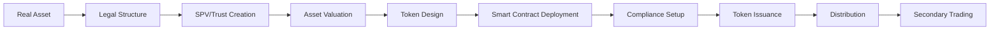

# Real World Asset (RWA) Tokenization Guide

**Comprehensive guide to tokenizing real world assets on blockchain with industry standards, best practices, and innovation.**

---

## Table of Contents

1. [Introduction to Real World Assets (RWA)](#1-introduction-to-real-world-assets-rwa)
2. [Tokenization Fundamentals](#2-tokenization-fundamentals)
3. [Token Standards for RWA](#3-token-standards-for-rwa)
4. [Technical Architecture](#4-technical-architecture)
5. [Asset Categories & Implementation](#5-asset-categories--implementation)
6. [Compliance & Regulation](#6-compliance--regulation)
7. [Industry Platforms & Solutions](#7-industry-platforms--solutions)
8. [Integration Patterns](#8-integration-patterns)
9. [Security Best Practices](#9-security-best-practices)
10. [Future Innovations](#10-future-innovations)

---

## 1. Introduction to Real World Assets (RWA)

### 1.1 What Are RWAs?

**Real World Assets (RWAs)** are tangible or intangible assets from the traditional financial system that are tokenized and brought on-chain. This bridges traditional finance (TradFi) with decentralized finance (DeFi).

**Key Characteristics**:
- **Tangible**: Physical assets (real estate, commodities, art)
- **Intangible**: Financial instruments (bonds, loans, invoices)
- **Regulated**: Subject to securities laws and compliance requirements
- **Verifiable**: Backed by real-world value and legal claims

**Market Size**:
- Traditional asset market: >$900 trillion globally
- Current RWA on-chain: ~$12 billion (as of 2024)
- Projected growth: $16 trillion by 2030 (BCG estimate)

### 1.2 Types of RWAs

```yaml
asset_categories:
  financial_instruments:
    - US Treasury Bonds
    - Corporate Bonds
    - Private Credit/Loans
    - Structured Finance
    - Invoice Factoring

  real_estate:
    - Commercial Properties
    - Residential Properties
    - REITs (Real Estate Investment Trusts)
    - Land and Development Rights

  commodities:
    - Gold and Precious Metals
    - Oil and Energy Resources
    - Agricultural Products
    - Carbon Credits

  collectibles:
    - Fine Art
    - Luxury Goods
    - Wine and Spirits
    - Rare Collectibles

  equity:
    - Private Equity Stakes
    - Venture Capital Funds
    - Company Shares
    - Fund Tokens
```

### 1.3 Benefits of Tokenization

**Liquidity Enhancement**:
```
Traditional Market:
- Illiquid assets (real estate, private equity)
- Long settlement times (days to weeks)
- High minimum investments
- Limited trading hours

Tokenized Market:
- Fractional ownership (as low as $1)
- Near-instant settlement (minutes)
- 24/7 trading availability
- Global access
```

**Efficiency Gains**:
- Reduced intermediaries (no brokers, custodians, clearinghouses)
- Lower transaction costs (50-80% reduction)
- Automated compliance via smart contracts
- Transparent ownership records on-chain

**Accessibility**:
- Democratized access to institutional-grade assets
- Lower barriers to entry
- Geographic expansion
- Programmable asset features

### 1.4 Challenges and Considerations

**Regulatory Complexity**:
- Securities law compliance (SEC, MiFID II, etc.)
- Cross-jurisdictional issues
- KYC/AML requirements
- Tax reporting obligations

**Technical Challenges**:
- Oracle reliability (off-chain data)
- Smart contract security
- Key management and custody
- Interoperability between chains

**Market Infrastructure**:
- Limited secondary market liquidity
- Price discovery mechanisms
- Custody solutions
- Regulatory uncertainty

---

## 2. Tokenization Fundamentals

### 2.1 Token vs. Traditional Asset

```solidity
// Traditional Asset Representation (Off-Chain)
struct TraditionalAsset {
    string assetId;           // Database record
    address owner;            // Legal registry
    uint256 value;           // Appraised value
    string documentation;     // Physical/digital docs
    address[] intermediaries; // Brokers, custodians, etc.
}
// Problems: Siloed, opaque, slow, expensive

// Tokenized Asset (On-Chain)
contract TokenizedAsset is ERC3643 {
    // Asset metadata
    string public assetId;
    string public assetType;
    string public jurisdiction;

    // Compliance layer
    IIdentityRegistry public identityRegistry;
    ICompliance public compliance;

    // Ownership is represented by token balance
    // Transfer rules enforced by smart contract
    // Settlement is atomic and instant
}
// Benefits: Transparent, fast, programmable, composable
```

### 2.2 Tokenization Process



**Step-by-Step Process**:

1. **Asset Selection & Diligence**
```javascript
// Asset evaluation criteria
const assetDueDiligence = {
  legal: {
    clearTitle: true,
    noLiens: true,
    jurisdiction: "US-Delaware",
    regulatoryStatus: "compliant"
  },
  financial: {
    valuation: 10000000, // $10M
    valuationMethod: "independent-appraisal",
    cashFlow: 500000, // $500K annual
    roi: 0.05 // 5%
  },
  operational: {
    assetManager: "XYZ Capital",
    custodian: "ABC Trust Co",
    insurance: 12000000 // $12M coverage
  }
};
```

2. **Legal Structuring**
```solidity
// Special Purpose Vehicle (SPV) representation
contract AssetSPV {
    string public jurisdiction;
    address public trustee;
    address public assetManager;
    string public legalDocumentHash; // IPFS hash

    // Asset ownership by SPV
    string public assetIdentifier; // Deed, serial number, etc.
    uint256 public assetValue;

    // Token holders own shares of SPV
    address public securityToken;

    event SPVCreated(string jurisdiction, address trustee);
    event AssetTransferred(string assetId, uint256 value);
}
```

3. **Token Economics Design**
```javascript
const tokenomics = {
  totalSupply: 10000000, // 10M tokens
  denomination: "USD",
  pricePerToken: 1.00,
  minInvestment: 1000, // $1,000

  distribution: {
    publicSale: 0.70,      // 70%
    foundingTeam: 0.15,    // 15% (vested)
    reserve: 0.10,         // 10%
    advisors: 0.05         // 5%
  },

  rights: {
    voting: true,
    dividends: true,
    liquidation: true
  },

  restrictions: {
    lockupPeriod: 180, // days
    accreditedOnly: false,
    maxHolders: 2000,
    transferRestrictions: true
  }
};
```

### 2.3 Fractional Ownership Model

```solidity
// SPDX-License-Identifier: MIT
pragma solidity ^0.8.20;

import "@openzeppelin/contracts/token/ERC20/ERC20.sol";
import "@openzeppelin/contracts/access/AccessControl.sol";

/**
 * @title FractionalRealEstate
 * @dev Represents fractional ownership of a commercial property
 */
contract FractionalRealEstate is ERC20, AccessControl {
    bytes32 public constant ADMIN_ROLE = keccak256("ADMIN_ROLE");
    bytes32 public constant COMPLIANCE_ROLE = keccak256("COMPLIANCE_ROLE");

    // Asset metadata
    struct AssetDetails {
        string propertyAddress;
        uint256 squareFeet;
        uint256 appraisedValue;
        uint256 purchasePrice;
        string legalDescription;
        string ipfsDocumentHash;
    }

    AssetDetails public asset;

    // Revenue distribution
    uint256 public totalDistributed;
    mapping(uint256 => uint256) public distributionPerToken; // Cumulative
    mapping(address => uint256) public lastClaimedDistribution;

    event RevenueDistributed(uint256 amount, uint256 perToken);
    event DividendClaimed(address indexed holder, uint256 amount);

    constructor(
        string memory name,
        string memory symbol,
        uint256 totalTokens,
        AssetDetails memory _asset
    ) ERC20(name, symbol) {
        _grantRole(DEFAULT_ADMIN_ROLE, msg.sender);
        _grantRole(ADMIN_ROLE, msg.sender);

        asset = _asset;
        _mint(msg.sender, totalTokens * 10 ** decimals());
    }

    /**
     * @dev Distribute rental income to token holders
     */
    function distributeRevenue() external payable onlyRole(ADMIN_ROLE) {
        require(msg.value > 0, "No revenue to distribute");
        require(totalSupply() > 0, "No tokens minted");

        uint256 perToken = (msg.value * 1e18) / totalSupply();
        distributionPerToken[block.timestamp] =
            distributionPerToken[block.timestamp] + perToken;

        totalDistributed += msg.value;

        emit RevenueDistributed(msg.value, perToken);
    }

    /**
     * @dev Claim accumulated dividends
     */
    function claimDividends() external {
        uint256 balance = balanceOf(msg.sender);
        require(balance > 0, "No tokens held");

        uint256 owed = calculateOwedDividends(msg.sender);
        require(owed > 0, "No dividends to claim");

        lastClaimedDistribution[msg.sender] = distributionPerToken[block.timestamp];

        (bool success, ) = msg.sender.call{value: owed}("");
        require(success, "Transfer failed");

        emit DividendClaimed(msg.sender, owed);
    }

    /**
     * @dev Calculate unclaimed dividends for holder
     */
    function calculateOwedDividends(address holder) public view returns (uint256) {
        uint256 balance = balanceOf(holder);
        if (balance == 0) return 0;

        uint256 currentDistribution = distributionPerToken[block.timestamp];
        uint256 lastClaimed = lastClaimedDistribution[holder];

        return (balance * (currentDistribution - lastClaimed)) / 1e18;
    }

    /**
     * @dev Update asset valuation
     */
    function updateValuation(
        uint256 newValue,
        string memory appraisalHash
    ) external onlyRole(ADMIN_ROLE) {
        asset.appraisedValue = newValue;
        asset.ipfsDocumentHash = appraisalHash;
    }
}
```

### 2.4 Custody Models

```solidity
// Self-Custody with Multi-Sig
contract MultiSigCustody {
    address[] public signers;
    uint256 public requiredSignatures;

    mapping(bytes32 => mapping(address => bool)) public confirmations;

    struct Transaction {
        address to;
        uint256 value;
        bytes data;
        bool executed;
        uint256 confirmations;
    }

    mapping(bytes32 => Transaction) public transactions;

    constructor(address[] memory _signers, uint256 _required) {
        require(_signers.length >= _required, "Invalid threshold");
        signers = _signers;
        requiredSignatures = _required;
    }

    function submitTransaction(
        address to,
        uint256 value,
        bytes memory data
    ) external returns (bytes32) {
        bytes32 txId = keccak256(abi.encodePacked(to, value, data, block.timestamp));

        transactions[txId] = Transaction({
            to: to,
            value: value,
            data: data,
            executed: false,
            confirmations: 0
        });

        return txId;
    }

    function confirmTransaction(bytes32 txId) external {
        require(isSigner(msg.sender), "Not a signer");
        require(!confirmations[txId][msg.sender], "Already confirmed");

        confirmations[txId][msg.sender] = true;
        transactions[txId].confirmations++;

        if (transactions[txId].confirmations >= requiredSignatures) {
            executeTransaction(txId);
        }
    }

    function executeTransaction(bytes32 txId) internal {
        Transaction storage txn = transactions[txId];
        require(!txn.executed, "Already executed");
        require(txn.confirmations >= requiredSignatures, "Not enough confirmations");

        txn.executed = true;

        (bool success, ) = txn.to.call{value: txn.value}(txn.data);
        require(success, "Transaction failed");
    }

    function isSigner(address account) public view returns (bool) {
        for (uint i = 0; i < signers.length; i++) {
            if (signers[i] == account) return true;
        }
        return false;
    }
}

// Institutional Custody with Fireblocks Integration
interface IFireblocks {
    function createVault(string memory name) external returns (bytes32 vaultId);
    function createTransaction(
        bytes32 vaultId,
        address to,
        uint256 amount,
        string memory note
    ) external returns (string memory txId);
    function getTransactionStatus(string memory txId) external view returns (string memory);
}

contract InstitutionalCustody {
    IFireblocks public fireblocks;
    bytes32 public vaultId;

    mapping(address => bool) public authorizedTraders;

    event CustodyTransfer(address indexed to, uint256 amount, string txId);

    constructor(address _fireblocks) {
        fireblocks = IFireblocks(_fireblocks);
        vaultId = fireblocks.createVault("RWA-Custody-Vault");
    }

    function initiateTransfer(
        address to,
        uint256 amount,
        string memory note
    ) external returns (string memory) {
        require(authorizedTraders[msg.sender], "Not authorized");

        string memory txId = fireblocks.createTransaction(
            vaultId,
            to,
            amount,
            note
        );

        emit CustodyTransfer(to, amount, txId);
        return txId;
    }
}
```

---

## 3. Token Standards for RWA

### 3.1 ERC-3643 (T-REX - Token for Regulated EXchanges)

**Overview**: Industry-leading standard for security tokens with built-in compliance.

**Architecture**:
```
┌─────────────────────────────────────────────────┐
│            ERC-3643 Token                       │
│  (Permissioned transfers with compliance)       │
└────────────┬────────────────────────────────────┘
             │
             ├─► Identity Registry
             │   (Investor verification)
             │
             ├─► Compliance Module
             │   (Transfer restrictions)
             │
             └─► Trusted Issuers Registry
                 (Claim verifiers)
```

**Full Implementation**:

```solidity
// SPDX-License-Identifier: GPL-3.0
pragma solidity ^0.8.20;

import "@onchain-id/solidity/contracts/interface/IIdentity.sol";
import "@onchain-id/solidity/contracts/interface/IClaimIssuer.sol";

/**
 * @title IIdentityRegistry
 * @dev Registry linking addresses to verified identities
 */
interface IIdentityRegistry {
    function registerIdentity(
        address user,
        IIdentity identity,
        uint16 country
    ) external;

    function deleteIdentity(address user) external;

    function isVerified(address user) external view returns (bool);

    function identity(address user) external view returns (IIdentity);

    function investorCountry(address user) external view returns (uint16);
}

/**
 * @title ICompliance
 * @dev Manages transfer restrictions and compliance rules
 */
interface ICompliance {
    function canTransfer(
        address from,
        address to,
        uint256 amount
    ) external view returns (bool);

    function transferred(address from, address to, uint256 amount) external;

    function created(address to, uint256 amount) external;

    function destroyed(address from, uint256 amount) external;
}

/**
 * @title ERC3643
 * @dev Complete implementation of T-REX security token
 */
contract ERC3643 is IERC20 {
    string public name;
    string public symbol;
    uint8 public decimals = 0; // Security tokens typically non-divisible

    uint256 private _totalSupply;
    mapping(address => uint256) private _balances;
    mapping(address => mapping(address => uint256)) private _allowances;

    // Compliance infrastructure
    IIdentityRegistry public identityRegistry;
    ICompliance public compliance;

    // Access control
    address public owner;
    mapping(address => bool) public agents; // Can force transfers

    // Token info
    string public onchainID; // Link to off-chain documents
    bool public paused;

    event IdentityRegistryAdded(address indexed registry);
    event ComplianceAdded(address indexed compliance);
    event Paused(address account);
    event Unpaused(address account);
    event AgentAdded(address indexed agent);
    event AgentRemoved(address indexed agent);

    modifier onlyOwner() {
        require(msg.sender == owner, "Not owner");
        _;
    }

    modifier onlyAgent() {
        require(agents[msg.sender] || msg.sender == owner, "Not agent");
        _;
    }

    modifier whenNotPaused() {
        require(!paused, "Token paused");
        _;
    }

    constructor(
        string memory _name,
        string memory _symbol,
        address _identityRegistry,
        address _compliance
    ) {
        name = _name;
        symbol = _symbol;
        owner = msg.sender;

        identityRegistry = IIdentityRegistry(_identityRegistry);
        compliance = ICompliance(_compliance);

        emit IdentityRegistryAdded(_identityRegistry);
        emit ComplianceAdded(_compliance);
    }

    /**
     * @dev Standard ERC20 functions with compliance checks
     */
    function transfer(address to, uint256 amount)
        external
        whenNotPaused
        returns (bool)
    {
        require(
            identityRegistry.isVerified(msg.sender),
            "Sender not verified"
        );
        require(
            identityRegistry.isVerified(to),
            "Recipient not verified"
        );
        require(
            compliance.canTransfer(msg.sender, to, amount),
            "Transfer not compliant"
        );

        _transfer(msg.sender, to, amount);
        compliance.transferred(msg.sender, to, amount);

        return true;
    }

    function transferFrom(address from, address to, uint256 amount)
        external
        whenNotPaused
        returns (bool)
    {
        require(
            identityRegistry.isVerified(from),
            "Sender not verified"
        );
        require(
            identityRegistry.isVerified(to),
            "Recipient not verified"
        );
        require(
            compliance.canTransfer(from, to, amount),
            "Transfer not compliant"
        );

        uint256 currentAllowance = _allowances[from][msg.sender];
        require(currentAllowance >= amount, "Insufficient allowance");

        unchecked {
            _approve(from, msg.sender, currentAllowance - amount);
        }

        _transfer(from, to, amount);
        compliance.transferred(from, to, amount);

        return true;
    }

    /**
     * @dev Forced transfer by agent (for legal compliance)
     */
    function forcedTransfer(
        address from,
        address to,
        uint256 amount,
        string memory reason
    ) external onlyAgent returns (bool) {
        require(
            identityRegistry.isVerified(to),
            "Recipient not verified"
        );

        _transfer(from, to, amount);
        compliance.transferred(from, to, amount);

        emit ForcedTransfer(from, to, amount, reason);
        return true;
    }

    /**
     * @dev Mint new tokens (issuance)
     */
    function mint(address to, uint256 amount) external onlyAgent {
        require(identityRegistry.isVerified(to), "Recipient not verified");

        _totalSupply += amount;
        _balances[to] += amount;

        compliance.created(to, amount);

        emit Transfer(address(0), to, amount);
    }

    /**
     * @dev Burn tokens
     */
    function burn(address from, uint256 amount) external onlyAgent {
        require(_balances[from] >= amount, "Insufficient balance");

        _balances[from] -= amount;
        _totalSupply -= amount;

        compliance.destroyed(from, amount);

        emit Transfer(from, address(0), amount);
    }

    /**
     * @dev Pause token transfers
     */
    function pause() external onlyAgent {
        paused = true;
        emit Paused(msg.sender);
    }

    function unpause() external onlyAgent {
        paused = false;
        emit Unpaused(msg.sender);
    }

    /**
     * @dev Manage agents
     */
    function addAgent(address agent) external onlyOwner {
        agents[agent] = true;
        emit AgentAdded(agent);
    }

    function removeAgent(address agent) external onlyOwner {
        agents[agent] = false;
        emit AgentRemoved(agent);
    }

    /**
     * @dev Update compliance contract
     */
    function setCompliance(address _compliance) external onlyOwner {
        compliance = ICompliance(_compliance);
        emit ComplianceAdded(_compliance);
    }

    /**
     * @dev Internal transfer function
     */
    function _transfer(address from, address to, uint256 amount) internal {
        require(from != address(0), "Transfer from zero address");
        require(to != address(0), "Transfer to zero address");
        require(_balances[from] >= amount, "Insufficient balance");

        _balances[from] -= amount;
        _balances[to] += amount;

        emit Transfer(from, to, amount);
    }

    function _approve(address _owner, address spender, uint256 amount) internal {
        _allowances[_owner][spender] = amount;
        emit Approval(_owner, spender, amount);
    }

    // Standard ERC20 view functions
    function totalSupply() external view returns (uint256) {
        return _totalSupply;
    }

    function balanceOf(address account) external view returns (uint256) {
        return _balances[account];
    }

    function allowance(address _owner, address spender)
        external
        view
        returns (uint256)
    {
        return _allowances[_owner][spender];
    }

    function approve(address spender, uint256 amount) external returns (bool) {
        _approve(msg.sender, spender, amount);
        return true;
    }

    event ForcedTransfer(
        address indexed from,
        address indexed to,
        uint256 amount,
        string reason
    );
}
```

**Compliance Module Example**:

```solidity
/**
 * @title BasicCompliance
 * @dev Implements common compliance rules
 */
contract BasicCompliance is ICompliance {
    address public token;

    // Transfer limits
    uint256 public maxBalance;
    uint256 public maxTransferAmount;

    // Time restrictions
    mapping(address => uint256) public transferCounters;
    mapping(address => uint256) public lastTransferTime;
    uint256 public transferLimit = 10; // Max transfers per day
    uint256 public transferCooldown = 1 days;

    // Country restrictions
    mapping(uint16 => bool) public blockedCountries;

    // Holder limits
    uint256 public maxHolders;
    uint256 public holderCount;
    mapping(address => bool) public isHolder;

    modifier onlyToken() {
        require(msg.sender == token, "Only token");
        _;
    }

    constructor(address _token) {
        token = _token;
        maxBalance = 1000000 * 10**18; // 1M tokens
        maxTransferAmount = 100000 * 10**18; // 100K tokens
        maxHolders = 2000;
    }

    /**
     * @dev Check if transfer is compliant
     */
    function canTransfer(
        address from,
        address to,
        uint256 amount
    ) external view override returns (bool) {
        ERC3643 tokenContract = ERC3643(token);
        IIdentityRegistry registry = tokenContract.identityRegistry();

        // Check amount limits
        if (amount > maxTransferAmount) return false;

        // Check recipient balance limit
        uint256 recipientBalance = tokenContract.balanceOf(to);
        if (recipientBalance + amount > maxBalance) return false;

        // Check transfer frequency
        if (block.timestamp < lastTransferTime[from] + transferCooldown) {
            if (transferCounters[from] >= transferLimit) return false;
        }

        // Check country restrictions
        uint16 senderCountry = registry.investorCountry(from);
        uint16 recipientCountry = registry.investorCountry(to);
        if (blockedCountries[senderCountry] || blockedCountries[recipientCountry]) {
            return false;
        }

        // Check holder limit
        if (!isHolder[to] && holderCount >= maxHolders) return false;

        return true;
    }

    /**
     * @dev Called after successful transfer
     */
    function transferred(
        address from,
        address to,
        uint256 amount
    ) external override onlyToken {
        // Update transfer counters
        if (block.timestamp >= lastTransferTime[from] + transferCooldown) {
            transferCounters[from] = 1;
            lastTransferTime[from] = block.timestamp;
        } else {
            transferCounters[from]++;
        }

        // Update holder tracking
        ERC3643 tokenContract = ERC3643(token);
        if (!isHolder[to] && tokenContract.balanceOf(to) > 0) {
            isHolder[to] = true;
            holderCount++;
        }

        if (isHolder[from] && tokenContract.balanceOf(from) == 0) {
            isHolder[from] = false;
            holderCount--;
        }
    }

    function created(address to, uint256 amount) external override onlyToken {
        ERC3643 tokenContract = ERC3643(token);
        if (!isHolder[to] && tokenContract.balanceOf(to) > 0) {
            isHolder[to] = true;
            holderCount++;
        }
    }

    function destroyed(address from, uint256 amount) external override onlyToken {
        ERC3643 tokenContract = ERC3643(token);
        if (isHolder[from] && tokenContract.balanceOf(from) == 0) {
            isHolder[from] = false;
            holderCount--;
        }
    }

    /**
     * @dev Admin functions to update rules
     */
    function setMaxBalance(uint256 _max) external {
        maxBalance = _max;
    }

    function setMaxTransferAmount(uint256 _max) external {
        maxTransferAmount = _max;
    }

    function blockCountry(uint16 country, bool blocked) external {
        blockedCountries[country] = blocked;
    }
}
```

### 3.2 ERC-1400 (Security Token Standard)

**Overview**: Partially fungible token standard with tranches/partitions.

```solidity
// SPDX-License-Identifier: MIT
pragma solidity ^0.8.20;

/**
 * @title ERC1400
 * @dev Security token with partition support (tranches)
 */
contract ERC1400 {
    string public name;
    string public symbol;
    uint256 public totalSupply;

    // Partitions (tranches) for different share classes
    bytes32[] public partitions;
    mapping(bytes32 => mapping(address => uint256)) public balanceOfByPartition;
    mapping(bytes32 => uint256) public totalSupplyByPartition;

    // Operators can transfer on behalf of holders
    mapping(address => mapping(address => bool)) public authorizedOperator;
    mapping(bytes32 => mapping(address => mapping(address => bool)))
        public authorizedOperatorByPartition;

    // Controllers can force transfers (regulatory compliance)
    mapping(address => bool) public isController;

    // Document management
    struct Document {
        string uri;
        bytes32 documentHash;
        uint256 timestamp;
    }
    mapping(bytes32 => Document) public documents;

    event TransferByPartition(
        bytes32 indexed fromPartition,
        address operator,
        address indexed from,
        address indexed to,
        uint256 value,
        bytes data,
        bytes operatorData
    );

    event IssuedByPartition(
        bytes32 indexed partition,
        address indexed to,
        uint256 value,
        bytes data
    );

    event RedeemedByPartition(
        bytes32 indexed partition,
        address indexed operator,
        address indexed from,
        uint256 value,
        bytes data,
        bytes operatorData
    );

    event DocumentUpdated(bytes32 indexed name, string uri, bytes32 documentHash);

    modifier onlyController() {
        require(isController[msg.sender], "Not controller");
        _;
    }

    constructor(string memory _name, string memory _symbol) {
        name = _name;
        symbol = _symbol;
        isController[msg.sender] = true;
    }

    /**
     * @dev Transfer tokens from a specific partition
     */
    function transferByPartition(
        bytes32 partition,
        address to,
        uint256 value,
        bytes calldata data
    ) external returns (bytes32) {
        require(balanceOfByPartition[partition][msg.sender] >= value, "Insufficient balance");
        require(to != address(0), "Invalid recipient");

        _transferByPartition(partition, msg.sender, msg.sender, to, value, data, "");

        return partition;
    }

    /**
     * @dev Operator transfer from specific partition
     */
    function operatorTransferByPartition(
        bytes32 partition,
        address from,
        address to,
        uint256 value,
        bytes calldata data,
        bytes calldata operatorData
    ) external returns (bytes32) {
        require(
            authorizedOperatorByPartition[partition][from][msg.sender] ||
            authorizedOperator[from][msg.sender],
            "Not authorized"
        );
        require(balanceOfByPartition[partition][from] >= value, "Insufficient balance");

        _transferByPartition(partition, msg.sender, from, to, value, data, operatorData);

        return partition;
    }

    /**
     * @dev Issue tokens to a partition
     */
    function issueByPartition(
        bytes32 partition,
        address to,
        uint256 value,
        bytes calldata data
    ) external onlyController {
        require(to != address(0), "Invalid recipient");

        // Add partition if it doesn't exist
        if (totalSupplyByPartition[partition] == 0) {
            partitions.push(partition);
        }

        balanceOfByPartition[partition][to] += value;
        totalSupplyByPartition[partition] += value;
        totalSupply += value;

        emit IssuedByPartition(partition, to, value, data);
    }

    /**
     * @dev Redeem tokens from a partition
     */
    function redeemByPartition(
        bytes32 partition,
        uint256 value,
        bytes calldata data
    ) external {
        require(balanceOfByPartition[partition][msg.sender] >= value, "Insufficient balance");

        balanceOfByPartition[partition][msg.sender] -= value;
        totalSupplyByPartition[partition] -= value;
        totalSupply -= value;

        emit RedeemedByPartition(partition, msg.sender, msg.sender, value, data, "");
    }

    /**
     * @dev Controller forced transfer (regulatory requirement)
     */
    function controllerTransfer(
        address from,
        address to,
        uint256 value,
        bytes calldata data,
        bytes calldata operatorData
    ) external onlyController {
        // Find partition with sufficient balance
        bytes32 partition = _getDefaultPartition(from, value);
        _transferByPartition(partition, msg.sender, from, to, value, data, operatorData);
    }

    /**
     * @dev Internal transfer function
     */
    function _transferByPartition(
        bytes32 partition,
        address operator,
        address from,
        address to,
        uint256 value,
        bytes memory data,
        bytes memory operatorData
    ) internal {
        balanceOfByPartition[partition][from] -= value;
        balanceOfByPartition[partition][to] += value;

        emit TransferByPartition(partition, operator, from, to, value, data, operatorData);
    }

    /**
     * @dev Get default partition with sufficient balance
     */
    function _getDefaultPartition(address holder, uint256 value)
        internal
        view
        returns (bytes32)
    {
        for (uint i = 0; i < partitions.length; i++) {
            if (balanceOfByPartition[partitions[i]][holder] >= value) {
                return partitions[i];
            }
        }
        revert("No partition with sufficient balance");
    }

    /**
     * @dev Authorize operator for all partitions
     */
    function authorizeOperator(address operator) external {
        authorizedOperator[msg.sender][operator] = true;
    }

    /**
     * @dev Authorize operator for specific partition
     */
    function authorizeOperatorByPartition(bytes32 partition, address operator) external {
        authorizedOperatorByPartition[partition][msg.sender][operator] = true;
    }

    /**
     * @dev Set document
     */
    function setDocument(bytes32 name, string calldata uri, bytes32 documentHash)
        external
        onlyController
    {
        documents[name] = Document({
            uri: uri,
            documentHash: documentHash,
            timestamp: block.timestamp
        });

        emit DocumentUpdated(name, uri, documentHash);
    }

    /**
     * @dev Get balance across all partitions
     */
    function balanceOf(address holder) external view returns (uint256) {
        uint256 total = 0;
        for (uint i = 0; i < partitions.length; i++) {
            total += balanceOfByPartition[partitions[i]][holder];
        }
        return total;
    }

    /**
     * @dev Get partitions for holder
     */
    function partitionsOf(address holder) external view returns (bytes32[] memory) {
        uint256 count = 0;
        for (uint i = 0; i < partitions.length; i++) {
            if (balanceOfByPartition[partitions[i]][holder] > 0) {
                count++;
            }
        }

        bytes32[] memory result = new bytes32[](count);
        uint256 index = 0;
        for (uint i = 0; i < partitions.length; i++) {
            if (balanceOfByPartition[partitions[i]][holder] > 0) {
                result[index] = partitions[i];
                index++;
            }
        }

        return result;
    }
}
```

**Use Case - Preferred vs Common Stock**:

```solidity
contract DualClassStock is ERC1400 {
    bytes32 public constant COMMON = keccak256("COMMON");
    bytes32 public constant PREFERRED = keccak256("PREFERRED");

    // Dividend rights
    uint256 public preferredDividendRate = 800; // 8% fixed
    uint256 public commonDividendPool;

    constructor() ERC1400("Company XYZ", "XYZ") {
        // Issue initial shares
        issueByPartition(COMMON, msg.sender, 1000000, ""); // 1M common
        issueByPartition(PREFERRED, msg.sender, 500000, ""); // 500K preferred
    }

    /**
     * @dev Distribute dividends
     */
    function distributeDividends() external payable onlyController {
        uint256 totalPreferred = totalSupplyByPartition[PREFERRED];
        uint256 preferredAmount = (totalPreferred * preferredDividendRate) / 10000;

        // Preferred get fixed rate first
        require(msg.value >= preferredAmount, "Insufficient for preferred");

        // Remaining goes to common
        commonDividendPool = msg.value - preferredAmount;
    }

    /**
     * @dev Claim dividends
     */
    function claimDividends() external {
        uint256 commonBalance = balanceOfByPartition[COMMON][msg.sender];
        uint256 preferredBalance = balanceOfByPartition[PREFERRED][msg.sender];

        uint256 owed = 0;

        if (preferredBalance > 0) {
            owed += (preferredBalance * preferredDividendRate) / 10000;
        }

        if (commonBalance > 0 && commonDividendPool > 0) {
            uint256 totalCommon = totalSupplyByPartition[COMMON];
            owed += (commonDividendPool * commonBalance) / totalCommon;
        }

        require(owed > 0, "No dividends owed");

        (bool success, ) = msg.sender.call{value: owed}("");
        require(success, "Transfer failed");
    }
}
```

### 3.3 ERC-4626 (Tokenized Vault Standard)

**Overview**: Standard for yield-bearing vaults, perfect for RWA funds.

```solidity
// SPDX-License-Identifier: MIT
pragma solidity ^0.8.20;

import "@openzeppelin/contracts/token/ERC20/ERC20.sol";
import "@openzeppelin/contracts/token/ERC20/IERC20.sol";
import "@openzeppelin/contracts/token/ERC20/extensions/ERC4626.sol";

/**
 * @title RealEstateVault
 * @dev ERC-4626 vault for real estate investment fund
 */
contract RealEstateVault is ERC4626 {
    // Underlying asset (e.g., USDC)
    IERC20 public immutable underlyingToken;

    // Fund manager
    address public manager;

    // Performance fee (basis points)
    uint256 public performanceFee = 2000; // 20%
    uint256 public managementFee = 200;   // 2% annual

    // Highwater mark for performance fees
    uint256 public highWaterMark;
    uint256 public lastFeeCollection;

    // Properties in the fund
    struct Property {
        string propertyId;
        uint256 purchasePrice;
        uint256 currentValue;
        uint256 annualRevenue;
        bool active;
    }

    Property[] public properties;

    // Withdrawal queue
    struct WithdrawalRequest {
        address investor;
        uint256 shares;
        uint256 requestTime;
        bool processed;
    }

    WithdrawalRequest[] public withdrawalQueue;
    uint256 public withdrawalDelay = 30 days;

    event PropertyAdded(uint256 indexed propertyId, uint256 purchasePrice);
    event PropertyValued(uint256 indexed propertyId, uint256 newValue);
    event FeesCollected(uint256 managementFee, uint256 performanceFee);
    event WithdrawalRequested(address indexed investor, uint256 shares);

    constructor(
        IERC20 _underlyingToken,
        string memory _name,
        string memory _symbol
    ) ERC4626(_underlyingToken) ERC20(_name, _symbol) {
        underlyingToken = _underlyingToken;
        manager = msg.sender;
        highWaterMark = 1e18; // Start at 1:1
        lastFeeCollection = block.timestamp;
    }

    modifier onlyManager() {
        require(msg.sender == manager, "Not manager");
        _;
    }

    /**
     * @dev Add property to fund
     */
    function addProperty(
        string memory propertyId,
        uint256 purchasePrice
    ) external onlyManager {
        properties.push(Property({
            propertyId: propertyId,
            purchasePrice: purchasePrice,
            currentValue: purchasePrice,
            annualRevenue: 0,
            active: true
        }));

        emit PropertyAdded(properties.length - 1, purchasePrice);
    }

    /**
     * @dev Update property valuation
     */
    function updatePropertyValue(
        uint256 propertyIndex,
        uint256 newValue
    ) external onlyManager {
        require(propertyIndex < properties.length, "Invalid property");
        properties[propertyIndex].currentValue = newValue;

        emit PropertyValued(propertyIndex, newValue);
    }

    /**
     * @dev Calculate total fund NAV (Net Asset Value)
     */
    function totalAssets() public view override returns (uint256) {
        uint256 cashBalance = underlyingToken.balanceOf(address(this));
        uint256 propertyValue = 0;

        for (uint i = 0; i < properties.length; i++) {
            if (properties[i].active) {
                propertyValue += properties[i].currentValue;
            }
        }

        return cashBalance + propertyValue;
    }

    /**
     * @dev Collect management and performance fees
     */
    function collectFees() external onlyManager {
        uint256 timeSinceLastCollection = block.timestamp - lastFeeCollection;
        require(timeSinceLastCollection >= 365 days, "Too soon");

        uint256 totalAsset = totalAssets();
        uint256 totalShares = totalSupply();

        if (totalShares == 0) return;

        // Management fee
        uint256 mgmtFee = (totalAsset * managementFee * timeSinceLastCollection)
            / (10000 * 365 days);

        // Performance fee (if above high water mark)
        uint256 sharePrice = (totalAsset * 1e18) / totalShares;
        uint256 perfFee = 0;

        if (sharePrice > highWaterMark) {
            uint256 profit = totalAsset - ((highWaterMark * totalShares) / 1e18);
            perfFee = (profit * performanceFee) / 10000;
            highWaterMark = sharePrice;
        }

        uint256 totalFees = mgmtFee + perfFee;
        if (totalFees > 0) {
            // Mint shares to manager as fees
            uint256 feeShares = (totalFees * totalShares) / (totalAsset - totalFees);
            _mint(manager, feeShares);
        }

        lastFeeCollection = block.timestamp;
        emit FeesCollected(mgmtFee, perfFee);
    }

    /**
     * @dev Request withdrawal (implements lockup period)
     */
    function requestWithdrawal(uint256 shares) external {
        require(balanceOf(msg.sender) >= shares, "Insufficient shares");

        withdrawalQueue.push(WithdrawalRequest({
            investor: msg.sender,
            shares: shares,
            requestTime: block.timestamp,
            processed: false
        }));

        // Lock shares
        _transfer(msg.sender, address(this), shares);

        emit WithdrawalRequested(msg.sender, shares);
    }

    /**
     * @dev Process withdrawal requests
     */
    function processWithdrawals(uint256 count) external onlyManager {
        uint256 processed = 0;

        for (uint i = 0; i < withdrawalQueue.length && processed < count; i++) {
            WithdrawalRequest storage request = withdrawalQueue[i];

            if (!request.processed &&
                block.timestamp >= request.requestTime + withdrawalDelay) {

                uint256 assets = convertToAssets(request.shares);

                // Burn shares and transfer assets
                _burn(address(this), request.shares);
                underlyingToken.transfer(request.investor, assets);

                request.processed = true;
                processed++;
            }
        }
    }

    /**
     * @dev Override deposit to add KYC check (integrate with identity registry)
     */
    function deposit(uint256 assets, address receiver)
        public
        virtual
        override
        returns (uint256)
    {
        // Add KYC verification here
        // require(identityRegistry.isVerified(receiver), "Not verified");

        return super.deposit(assets, receiver);
    }

    /**
     * @dev Get fund metrics
     */
    function getFundMetrics() external view returns (
        uint256 nav,
        uint256 sharePrice,
        uint256 totalProperties,
        uint256 cashReserve
    ) {
        nav = totalAssets();
        uint256 supply = totalSupply();
        sharePrice = supply > 0 ? (nav * 1e18) / supply : 1e18;

        totalProperties = 0;
        for (uint i = 0; i < properties.length; i++) {
            if (properties[i].active) totalProperties++;
        }

        cashReserve = underlyingToken.balanceOf(address(this));
    }
}
```

### 3.4 Comparison Matrix

| Feature | ERC-20 | ERC-721 | ERC-1400 | ERC-3643 | ERC-4626 |
|---------|--------|---------|----------|----------|----------|
| **Fungibility** | Fully | Non-fungible | Partial (tranches) | Fully | Fully |
| **Compliance** | ❌ | ❌ | ✅ | ✅✅ | ❌ |
| **Identity** | ❌ | ❌ | Optional | ✅ Required | ❌ |
| **Forced Transfer** | ❌ | ❌ | ✅ | ✅ | ❌ |
| **Document Management** | ❌ | Metadata | ✅ | ✅ | ❌ |
| **Yield-Bearing** | ❌ | ❌ | ❌ | ❌ | ✅ |
| **Best For** | Utility | Unique assets | Multi-class securities | Regulated securities | Investment funds |

---

## 4. Technical Architecture

### 4.1 System Architecture

```
┌─────────────────────────────────────────────────────────────┐
│                     Frontend Layer                           │
│  (Web3 Wallet Integration, User Dashboard, Trading UI)      │
└────────────────┬────────────────────────────────────────────┘
                 │
┌────────────────┴────────────────────────────────────────────┐
│                   Application Layer                          │
│  ┌──────────────┐  ┌──────────────┐  ┌──────────────┐     │
│  │   Identity   │  │  Compliance  │  │   Treasury   │     │
│  │  Management  │  │   Engine     │  │  Management  │     │
│  └──────────────┘  └──────────────┘  └──────────────┘     │
└────────────────┬────────────────────────────────────────────┘
                 │
┌────────────────┴────────────────────────────────────────────┐
│                   Smart Contract Layer                       │
│  ┌──────────────┐  ┌──────────────┐  ┌──────────────┐     │
│  │ Token (3643) │  │   Identity   │  │  Compliance  │     │
│  │              │◄─┤   Registry   │◄─┤    Module    │     │
│  └──────┬───────┘  └──────────────┘  └──────────────┘     │
│         │                                                    │
│  ┌──────┴───────┐  ┌──────────────┐  ┌──────────────┐     │
│  │   Price      │  │   Liquidity  │  │  Governance  │     │
│  │   Oracle     │  │     Pool     │  │    Module    │     │
│  └──────────────┘  └──────────────┘  └──────────────┘     │
└────────────────┬────────────────────────────────────────────┘
                 │
┌────────────────┴────────────────────────────────────────────┐
│                  Infrastructure Layer                        │
│  ┌──────────────┐  ┌──────────────┐  ┌──────────────┐     │
│  │  Blockchain  │  │     IPFS     │  │   Chainlink  │     │
│  │   (Ethereum, │  │  (Documents) │  │   (Oracles)  │     │
│  │   Polygon)   │  │              │  │              │     │
│  └──────────────┘  └──────────────┘  └──────────────┘     │
└─────────────────────────────────────────────────────────────┘
```

### 4.2 Oracle Integration

**Chainlink Price Feeds for RWA**:

```solidity
// SPDX-License-Identifier: MIT
pragma solidity ^0.8.20;

import "@chainlink/contracts/src/v0.8/interfaces/AggregatorV3Interface.sol";

/**
 * @title RWAPriceOracle
 * @dev Oracle for real world asset prices
 */
contract RWAPriceOracle {
    mapping(bytes32 => AggregatorV3Interface) public priceFeeds;
    mapping(bytes32 => uint256) public manualPrices;
    mapping(bytes32 => uint256) public lastUpdate;

    address public admin;
    uint256 public constant STALE_THRESHOLD = 24 hours;

    event PriceFeedAdded(bytes32 indexed assetId, address feed);
    event ManualPriceSet(bytes32 indexed assetId, uint256 price);

    modifier onlyAdmin() {
        require(msg.sender == admin, "Not admin");
        _;
    }

    constructor() {
        admin = msg.sender;
    }

    /**
     * @dev Add Chainlink price feed for asset
     */
    function addPriceFeed(bytes32 assetId, address feedAddress)
        external
        onlyAdmin
    {
        priceFeeds[assetId] = AggregatorV3Interface(feedAddress);
        emit PriceFeedAdded(assetId, feedAddress);
    }

    /**
     * @dev Set manual price for illiquid assets
     */
    function setManualPrice(bytes32 assetId, uint256 price)
        external
        onlyAdmin
    {
        manualPrices[assetId] = price;
        lastUpdate[assetId] = block.timestamp;
        emit ManualPriceSet(assetId, price);
    }

    /**
     * @dev Get latest price for asset
     */
    function getPrice(bytes32 assetId)
        external
        view
        returns (uint256 price, uint256 timestamp)
    {
        // Try Chainlink feed first
        AggregatorV3Interface feed = priceFeeds[assetId];
        if (address(feed) != address(0)) {
            try feed.latestRoundData() returns (
                uint80,
                int256 answer,
                uint256,
                uint256 updatedAt,
                uint80
            ) {
                require(answer > 0, "Invalid price");
                require(
                    block.timestamp - updatedAt < STALE_THRESHOLD,
                    "Stale price"
                );
                return (uint256(answer), updatedAt);
            } catch {
                // Fall through to manual price
            }
        }

        // Fall back to manual price
        require(manualPrices[assetId] > 0, "No price available");
        require(
            block.timestamp - lastUpdate[assetId] < STALE_THRESHOLD,
            "Stale manual price"
        );

        return (manualPrices[assetId], lastUpdate[assetId]);
    }

    /**
     * @dev Get prices for multiple assets
     */
    function getPrices(bytes32[] calldata assetIds)
        external
        view
        returns (uint256[] memory prices, uint256[] memory timestamps)
    {
        prices = new uint256[](assetIds.length);
        timestamps = new uint256[](assetIds.length);

        for (uint i = 0; i < assetIds.length; i++) {
            (prices[i], timestamps[i]) = this.getPrice(assetIds[i]);
        }
    }
}

/**
 * @title CrossChainPriceRelay
 * @dev Relay prices across chains using Chainlink CCIP
 */
contract CrossChainPriceRelay {
    // Chainlink CCIP Router
    address public immutable ccipRouter;

    // Price data structure
    struct PriceData {
        bytes32 assetId;
        uint256 price;
        uint256 timestamp;
    }

    // Authorized senders from other chains
    mapping(uint64 => mapping(address => bool)) public authorizedSenders;

    event PriceReceived(
        uint64 indexed sourceChain,
        bytes32 indexed assetId,
        uint256 price
    );

    constructor(address _ccipRouter) {
        ccipRouter = _ccipRouter;
    }

    /**
     * @dev Send price to another chain
     */
    function sendPrice(
        uint64 destinationChain,
        address receiver,
        bytes32 assetId,
        uint256 price
    ) external payable {
        // Encode price data
        PriceData memory data = PriceData({
            assetId: assetId,
            price: price,
            timestamp: block.timestamp
        });

        bytes memory message = abi.encode(data);

        // Send via CCIP (simplified - actual implementation more complex)
        // ICCIPRouter(ccipRouter).ccipSend{value: msg.value}(
        //     destinationChain,
        //     receiver,
        //     message
        // );
    }

    /**
     * @dev Receive price from another chain
     */
    function ccipReceive(
        uint64 sourceChain,
        address sender,
        bytes calldata message
    ) external {
        require(msg.sender == ccipRouter, "Only CCIP router");
        require(authorizedSenders[sourceChain][sender], "Unauthorized sender");

        PriceData memory data = abi.decode(message, (PriceData));

        // Update local price
        // priceOracle.setManualPrice(data.assetId, data.price);

        emit PriceReceived(sourceChain, data.assetId, data.price);
    }
}
```

**Chainlink Functions for Custom Data**:

```javascript
// Chainlink Functions source code (runs off-chain)
// Fetches property valuation from appraisal API

const propertyId = args[0]; // e.g., "123-main-st"
const apiKey = secrets.APPRAISAL_API_KEY;

// Fetch property data from multiple sources
const [zillow, redfin, custom] = await Promise.all([
  fetch(`https://api.zillow.com/property/${propertyId}`, {
    headers: { 'Authorization': `Bearer ${apiKey}` }
  }).then(r => r.json()),

  fetch(`https://api.redfin.com/property/${propertyId}`, {
    headers: { 'Authorization': `Bearer ${apiKey}` }
  }).then(r => r.json()),

  fetch(`https://custom-appraisal.com/api/valuation/${propertyId}`, {
    headers: { 'Authorization': `Bearer ${apiKey}` }
  }).then(r => r.json())
]);

// Calculate median valuation
const valuations = [
  zillow.estimate,
  redfin.estimate,
  custom.valuation
].filter(v => v > 0).sort((a, b) => a - b);

const medianValue = valuations[Math.floor(valuations.length / 2)];

// Return bytes-encoded result
return Functions.encodeUint256(medianValue);
```

```solidity
// Consumer contract for Chainlink Functions
contract PropertyValuationConsumer {
    using Functions for Functions.Request;

    bytes32 public latestRequestId;
    uint256 public latestValuation;

    // Chainlink Functions
    address public oracle;
    bytes32 public donId;

    event ValuationRequested(bytes32 indexed requestId, string propertyId);
    event ValuationReceived(bytes32 indexed requestId, uint256 valuation);

    /**
     * @dev Request property valuation
     */
    function requestValuation(string memory propertyId)
        external
        returns (bytes32)
    {
        Functions.Request memory req;
        req.initializeRequest(
            Functions.Location.Inline,
            Functions.CodeLanguage.JavaScript,
            getSourceCode()
        );

        // Add arguments
        string[] memory args = new string[](1);
        args[0] = propertyId;
        req.addArgs(args);

        // Add secrets
        req.addSecretsReference(secretsSlotId);

        // Send request
        latestRequestId = sendRequest(req, subscriptionId, gasLimit, donId);

        emit ValuationRequested(latestRequestId, propertyId);
        return latestRequestId;
    }

    /**
     * @dev Callback from Chainlink Functions
     */
    function fulfillRequest(
        bytes32 requestId,
        bytes memory response,
        bytes memory err
    ) internal override {
        require(err.length == 0, "Request failed");

        latestValuation = abi.decode(response, (uint256));

        emit ValuationReceived(requestId, latestValuation);
    }

    function getSourceCode() internal pure returns (string memory) {
        return "const propertyId = args[0]..."; // Source from above
    }
}
```

### 4.3 Identity and KYC Integration

**On-Chain Identity with ERC-735**:

```solidity
// SPDX-License-Identifier: MIT
pragma solidity ^0.8.20;

/**
 * @title ClaimHolder
 * @dev ERC-735 implementation for identity claims
 */
contract ClaimHolder {
    mapping(bytes32 => Claim) public claims;
    mapping(uint256 => bytes32[]) public claimsByTopic;

    struct Claim {
        uint256 topic;
        uint256 scheme;
        address issuer;
        bytes signature;
        bytes data;
        string uri;
    }

    event ClaimAdded(
        bytes32 indexed claimId,
        uint256 indexed topic,
        uint256 scheme,
        address indexed issuer,
        bytes signature,
        bytes data,
        string uri
    );

    event ClaimRemoved(
        bytes32 indexed claimId,
        uint256 indexed topic,
        uint256 scheme,
        address indexed issuer
    );

    /**
     * @dev Add claim
     */
    function addClaim(
        uint256 topic,
        uint256 scheme,
        address issuer,
        bytes memory signature,
        bytes memory data,
        string memory uri
    ) public returns (bytes32 claimId) {
        claimId = keccak256(abi.encodePacked(issuer, topic));

        claims[claimId] = Claim({
            topic: topic,
            scheme: scheme,
            issuer: issuer,
            signature: signature,
            data: data,
            uri: uri
        });

        claimsByTopic[topic].push(claimId);

        emit ClaimAdded(claimId, topic, scheme, issuer, signature, data, uri);
    }

    /**
     * @dev Remove claim
     */
    function removeClaim(bytes32 claimId) public {
        Claim memory claim = claims[claimId];
        require(claim.issuer == msg.sender, "Only issuer can remove");

        delete claims[claimId];

        emit ClaimRemoved(claimId, claim.topic, claim.scheme, claim.issuer);
    }

    /**
     * @dev Get claim
     */
    function getClaim(bytes32 claimId)
        public
        view
        returns (
            uint256 topic,
            uint256 scheme,
            address issuer,
            bytes memory signature,
            bytes memory data,
            string memory uri
        )
    {
        Claim memory claim = claims[claimId];
        return (
            claim.topic,
            claim.scheme,
            claim.issuer,
            claim.signature,
            claim.data,
            claim.uri
        );
    }

    /**
     * @dev Get claims by topic
     */
    function getClaimIdsByTopic(uint256 topic)
        public
        view
        returns (bytes32[] memory)
    {
        return claimsByTopic[topic];
    }
}

/**
 * @title IdentityRegistry
 * @dev Maps wallets to verified identities
 */
contract IdentityRegistry {
    mapping(address => Identity) public identities;
    mapping(address => bool) public claimIssuers;

    struct Identity {
        address identityContract; // ClaimHolder address
        uint16 country;
        bool isVerified;
        uint256 kycExpiry;
    }

    // KYC claim topics
    uint256 public constant KYC_CLAIM = 1;
    uint256 public constant ACCREDITED_INVESTOR_CLAIM = 2;
    uint256 public constant AML_CLAIM = 3;

    event IdentityRegistered(
        address indexed wallet,
        address indexed identityContract,
        uint16 country
    );

    event IdentityRemoved(address indexed wallet);

    modifier onlyClaimIssuer() {
        require(claimIssuers[msg.sender], "Not authorized issuer");
        _;
    }

    /**
     * @dev Register identity
     */
    function registerIdentity(
        address wallet,
        address identityContract,
        uint16 country
    ) external onlyClaimIssuer {
        ClaimHolder identity = ClaimHolder(identityContract);

        // Verify required claims exist
        bytes32[] memory kycClaims = identity.getClaimIdsByTopic(KYC_CLAIM);
        require(kycClaims.length > 0, "No KYC claim");

        bytes32[] memory amlClaims = identity.getClaimIdsByTopic(AML_CLAIM);
        require(amlClaims.length > 0, "No AML claim");

        identities[wallet] = Identity({
            identityContract: identityContract,
            country: country,
            isVerified: true,
            kycExpiry: block.timestamp + 365 days
        });

        emit IdentityRegistered(wallet, identityContract, country);
    }

    /**
     * @dev Check if wallet is verified
     */
    function isVerified(address wallet) external view returns (bool) {
        Identity memory identity = identities[wallet];
        return identity.isVerified && block.timestamp < identity.kycExpiry;
    }

    /**
     * @dev Check if wallet is accredited investor
     */
    function isAccredited(address wallet) external view returns (bool) {
        Identity memory identity = identities[wallet];
        if (!identity.isVerified || block.timestamp >= identity.kycExpiry) {
            return false;
        }

        ClaimHolder claimHolder = ClaimHolder(identity.identityContract);
        bytes32[] memory claims = claimHolder.getClaimIdsByTopic(
            ACCREDITED_INVESTOR_CLAIM
        );

        return claims.length > 0;
    }

    /**
     * @dev Remove identity
     */
    function removeIdentity(address wallet) external onlyClaimIssuer {
        delete identities[wallet];
        emit IdentityRemoved(wallet);
    }

    /**
     * @dev Add claim issuer
     */
    function addClaimIssuer(address issuer) external {
        // Add access control
        claimIssuers[issuer] = true;
    }
}
```

**Off-Chain KYC with Merkle Proofs**:

```solidity
/**
 * @title MerkleKYC
 * @dev Privacy-preserving KYC using Merkle trees
 */
contract MerkleKYC {
    bytes32 public merkleRoot;
    address public admin;

    mapping(address => bool) public hasVerified;

    event MerkleRootUpdated(bytes32 newRoot);
    event UserVerified(address indexed user);

    constructor(bytes32 _merkleRoot) {
        merkleRoot = _merkleRoot;
        admin = msg.sender;
    }

    /**
     * @dev Update Merkle root (new KYC batch)
     */
    function updateMerkleRoot(bytes32 newRoot) external {
        require(msg.sender == admin, "Not admin");
        merkleRoot = newRoot;
        emit MerkleRootUpdated(newRoot);
    }

    /**
     * @dev Verify user with Merkle proof
     */
    function verify(bytes32[] calldata proof) external {
        bytes32 leaf = keccak256(abi.encodePacked(msg.sender));
        require(verifyProof(proof, merkleRoot, leaf), "Invalid proof");

        hasVerified[msg.sender] = true;
        emit UserVerified(msg.sender);
    }

    /**
     * @dev Verify Merkle proof
     */
    function verifyProof(
        bytes32[] memory proof,
        bytes32 root,
        bytes32 leaf
    ) internal pure returns (bool) {
        bytes32 computedHash = leaf;

        for (uint256 i = 0; i < proof.length; i++) {
            bytes32 proofElement = proof[i];

            if (computedHash <= proofElement) {
                computedHash = keccak256(abi.encodePacked(computedHash, proofElement));
            } else {
                computedHash = keccak256(abi.encodePacked(proofElement, computedHash));
            }
        }

        return computedHash == root;
    }

    /**
     * @dev Check if user is verified
     */
    function isVerified(address user) external view returns (bool) {
        return hasVerified[user];
    }
}
```

**Generate Merkle Tree (Off-Chain)**:

```javascript
const { MerkleTree } = require('merkletreejs');
const keccak256 = require('keccak256');

// List of KYC'd addresses
const kycAddresses = [
  '0x1234...',
  '0x5678...',
  '0xabcd...'
  // ... thousands more
];

// Create leaves
const leaves = kycAddresses.map(addr => keccak256(addr));

// Build Merkle tree
const tree = new MerkleTree(leaves, keccak256, { sortPairs: true });

// Get root (publish on-chain)
const root = tree.getRoot().toString('hex');
console.log('Merkle Root:', root);

// Generate proof for specific address
function getProof(address) {
  const leaf = keccak256(address);
  const proof = tree.getProof(leaf);
  return proof.map(x => '0x' + x.data.toString('hex'));
}

// User gets their proof off-chain and submits to contract
const userProof = getProof('0x1234...');
// User calls: merkleKYC.verify(userProof)
```

### 4.4 Governance

```solidity
// SPDX-License-Identifier: MIT
pragma solidity ^0.8.20;

/**
 * @title TokenGovernance
 * @dev Governance for RWA token holders
 */
contract TokenGovernance {
    struct Proposal {
        uint256 id;
        address proposer;
        string description;
        uint256 forVotes;
        uint256 againstVotes;
        uint256 startBlock;
        uint256 endBlock;
        bool executed;
        bool canceled;
        mapping(address => bool) hasVoted;
    }

    mapping(uint256 => Proposal) public proposals;
    uint256 public proposalCount;

    IERC20 public governanceToken;
    uint256 public proposalThreshold = 100000 * 10**18; // 100K tokens to propose
    uint256 public quorum = 500000 * 10**18; // 500K tokens for quorum
    uint256 public votingPeriod = 17280; // ~3 days in blocks

    event ProposalCreated(
        uint256 indexed proposalId,
        address indexed proposer,
        string description
    );

    event VoteCast(
        address indexed voter,
        uint256 indexed proposalId,
        bool support,
        uint256 votes
    );

    event ProposalExecuted(uint256 indexed proposalId);

    constructor(address _governanceToken) {
        governanceToken = IERC20(_governanceToken);
    }

    /**
     * @dev Create proposal
     */
    function propose(string memory description) external returns (uint256) {
        require(
            governanceToken.balanceOf(msg.sender) >= proposalThreshold,
            "Below proposal threshold"
        );

        proposalCount++;
        Proposal storage proposal = proposals[proposalCount];

        proposal.id = proposalCount;
        proposal.proposer = msg.sender;
        proposal.description = description;
        proposal.startBlock = block.number;
        proposal.endBlock = block.number + votingPeriod;

        emit ProposalCreated(proposalCount, msg.sender, description);

        return proposalCount;
    }

    /**
     * @dev Cast vote
     */
    function castVote(uint256 proposalId, bool support) external {
        Proposal storage proposal = proposals[proposalId];

        require(block.number >= proposal.startBlock, "Voting not started");
        require(block.number <= proposal.endBlock, "Voting ended");
        require(!proposal.hasVoted[msg.sender], "Already voted");

        uint256 votes = governanceToken.balanceOf(msg.sender);
        require(votes > 0, "No voting power");

        if (support) {
            proposal.forVotes += votes;
        } else {
            proposal.againstVotes += votes;
        }

        proposal.hasVoted[msg.sender] = true;

        emit VoteCast(msg.sender, proposalId, support, votes);
    }

    /**
     * @dev Execute proposal
     */
    function execute(uint256 proposalId) external {
        Proposal storage proposal = proposals[proposalId];

        require(block.number > proposal.endBlock, "Voting not ended");
        require(!proposal.executed, "Already executed");
        require(!proposal.canceled, "Proposal canceled");

        uint256 totalVotes = proposal.forVotes + proposal.againstVotes;
        require(totalVotes >= quorum, "Quorum not reached");
        require(proposal.forVotes > proposal.againstVotes, "Proposal rejected");

        proposal.executed = true;

        // Execute proposal logic here

        emit ProposalExecuted(proposalId);
    }

    /**
     * @dev Get proposal state
     */
    function getProposalState(uint256 proposalId)
        external
        view
        returns (string memory)
    {
        Proposal storage proposal = proposals[proposalId];

        if (proposal.canceled) return "Canceled";
        if (proposal.executed) return "Executed";
        if (block.number <= proposal.startBlock) return "Pending";
        if (block.number <= proposal.endBlock) return "Active";

        uint256 totalVotes = proposal.forVotes + proposal.againstVotes;
        if (totalVotes < quorum) return "Defeated (Quorum)";
        if (proposal.forVotes <= proposal.againstVotes) return "Defeated";

        return "Succeeded";
    }
}
```

I'll continue building the comprehensive RWA document. Let me continue with more sections.


---

## 5. Asset Categories & Implementation

### 5.1 Real Estate Tokenization

**Property Types**:
- Commercial (office, retail, industrial)
- Residential (single-family, multi-family)
- REITs (Real Estate Investment Trusts)
- Land and development rights

**Implementation Pattern**:

```solidity
// SPDX-License-Identifier: MIT
pragma solidity ^0.8.20;

/**
 * @title CommercialPropertyToken
 * @dev Tokenized commercial real estate with rental income distribution
 */
contract CommercialPropertyToken is ERC3643 {
    struct Property {
        string streetAddress;
        string city;
        string state;
        string zipCode;
        uint256 squareFeet;
        string propertyType; // "office", "retail", "industrial"
        uint256 purchasePrice;
        uint256 currentValuation;
        string legalDescription;
        string deedHash; // IPFS hash of deed
    }

    Property public property;

    // Tenants and leases
    struct Lease {
        string tenantName;
        uint256 monthlyRent;
        uint256 startDate;
        uint256 endDate;
        bool active;
    }

    Lease[] public leases;

    // Revenue tracking
    uint256 public totalRentalIncome;
    uint256 public totalExpenses;
    uint256 public lastDistributionDate;

    // Distribution tracking
    mapping(address => uint256) public lastClaimed;
    uint256 public cumulativeDistributionPerToken;

    event RentalIncomeReceived(uint256 amount, string tenantName);
    event ExpenseRecorded(uint256 amount, string description);
    event DividendDistributed(uint256 totalAmount, uint256 perToken);
    event LeaseAdded(string tenantName, uint256 monthlyRent);
    event PropertyValuationUpdated(uint256 newValuation, string appraisalHash);

    constructor(
        string memory name,
        string memory symbol,
        address _identityRegistry,
        address _compliance,
        Property memory _property
    ) ERC3643(name, symbol, _identityRegistry, _compliance) {
        property = _property;
    }

    /**
     * @dev Add lease
     */
    function addLease(
        string memory tenantName,
        uint256 monthlyRent,
        uint256 startDate,
        uint256 endDate
    ) external onlyAgent {
        leases.push(Lease({
            tenantName: tenantName,
            monthlyRent: monthlyRent,
            startDate: startDate,
            endDate: endDate,
            active: true
        }));

        emit LeaseAdded(tenantName, monthlyRent);
    }

    /**
     * @dev Record rental income
     */
    function recordRentalIncome(uint256 amount, string memory tenantName)
        external
        payable
        onlyAgent
    {
        require(msg.value == amount, "Amount mismatch");
        totalRentalIncome += amount;

        emit RentalIncomeReceived(amount, tenantName);
    }

    /**
     * @dev Record expense
     */
    function recordExpense(uint256 amount, string memory description)
        external
        onlyAgent
    {
        totalExpenses += amount;
        emit ExpenseRecorded(amount, description);
    }

    /**
     * @dev Distribute net income to token holders
     */
    function distributeIncome() external onlyAgent {
        require(
            block.timestamp >= lastDistributionDate + 30 days,
            "Too soon"
        );

        uint256 netIncome = address(this).balance;
        require(netIncome > 0, "No income to distribute");

        uint256 supply = totalSupply();
        require(supply > 0, "No tokens");

        uint256 perToken = (netIncome * 1e18) / supply;
        cumulativeDistributionPerToken += perToken;

        lastDistributionDate = block.timestamp;

        emit DividendDistributed(netIncome, perToken);
    }

    /**
     * @dev Claim dividends
     */
    function claimDividends() external {
        uint256 balance = balanceOf(msg.sender);
        require(balance > 0, "No tokens");

        uint256 owed = (balance * (cumulativeDistributionPerToken - lastClaimed[msg.sender])) / 1e18;
        require(owed > 0, "No dividends");

        lastClaimed[msg.sender] = cumulativeDistributionPerToken;

        (bool success, ) = msg.sender.call{value: owed}("");
        require(success, "Transfer failed");
    }

    /**
     * @dev Update property valuation
     */
    function updateValuation(uint256 newValuation, string memory appraisalHash)
        external
        onlyAgent
    {
        property.currentValuation = newValuation;
        emit PropertyValuationUpdated(newValuation, appraisalHash);
    }

    /**
     * @dev Get property metrics
     */
    function getMetrics() external view returns (
        uint256 totalIncome,
        uint256 expenses,
        uint256 netIncome,
        uint256 occupancyRate,
        uint256 capRate
    ) {
        totalIncome = totalRentalIncome;
        expenses = totalExpenses;
        netIncome = totalIncome - expenses;

        // Calculate occupancy
        uint256 activeLeases = 0;
        for (uint i = 0; i < leases.length; i++) {
            if (leases[i].active) activeLeases++;
        }
        occupancyRate = leases.length > 0 ? (activeLeases * 100) / leases.length : 0;

        // Cap rate = NOI / Property Value
        if (property.currentValuation > 0) {
            capRate = (netIncome * 100) / property.currentValuation;
        }
    }
}
```

### 5.2 Treasury Bonds & Fixed Income

**US Treasury Tokenization**:

```solidity
/**
 * @title TokenizedTreasury
 * @dev Tokenized US Treasury bonds with yield distribution
 */
contract TokenizedTreasury is ERC4626 {
    // Bond details
    struct BondDetails {
        string cusip; // Bond identifier
        uint256 faceValue;
        uint256 couponRate; // Basis points (e.g., 450 = 4.5%)
        uint256 maturityDate;
        uint256 issueDate;
        string bondType; // "T-Bill", "T-Note", "T-Bond"
    }

    BondDetails public bond;

    // Yield tracking
    uint256 public lastCouponPayment;
    uint256 public totalCouponsPaid;

    event CouponPaid(uint256 amount, uint256 date);
    event BondMatured(uint256 redemptionAmount);

    constructor(
        IERC20 _asset,
        BondDetails memory _bond
    ) ERC4626(_asset) ERC20("Tokenized Treasury", "tTREAS") {
        bond = _bond;
        lastCouponPayment = _bond.issueDate;
    }

    /**
     * @dev Pay coupon to token holders
     */
    function payCoupon() external {
        require(block.timestamp >= lastCouponPayment + 180 days, "Too soon");
        require(block.timestamp < bond.maturityDate, "Bond matured");

        uint256 couponAmount = (bond.faceValue * bond.couponRate) / (10000 * 2); // Semi-annual
        require(asset.balanceOf(address(this)) >= couponAmount, "Insufficient funds");

        lastCouponPayment = block.timestamp;
        totalCouponsPaid += couponAmount;

        // Coupon is automatically reflected in vault value
        emit CouponPaid(couponAmount, block.timestamp);
    }

    /**
     * @dev Redeem at maturity
     */
    function redeemAtMaturity() external {
        require(block.timestamp >= bond.maturityDate, "Not matured");

        uint256 redemptionAmount = bond.faceValue;
        require(asset.balanceOf(address(this)) >= redemptionAmount, "Insufficient funds");

        // Allow all token holders to redeem
        emit BondMatured(redemptionAmount);
    }

    /**
     * @dev Calculate yield to maturity
     */
    function yieldToMaturity() external view returns (uint256) {
        if (block.timestamp >= bond.maturityDate) return 0;

        uint256 currentPrice = totalAssets();
        uint256 yearsToMaturity = (bond.maturityDate - block.timestamp) / 365 days;

        if (yearsToMaturity == 0 || currentPrice == 0) return 0;

        // Simplified YTM calculation
        uint256 annualReturn = ((bond.faceValue - currentPrice) / yearsToMaturity) +
                              ((bond.faceValue * bond.couponRate) / 10000);

        return (annualReturn * 10000) / currentPrice; // Return as basis points
    }

    /**
     * @dev Get bond info
     */
    function getBondInfo() external view returns (
        string memory cusip,
        uint256 faceValue,
        uint256 couponRate,
        uint256 maturityDate,
        uint256 currentValue,
        uint256 ytm
    ) {
        return (
            bond.cusip,
            bond.faceValue,
            bond.couponRate,
            bond.maturityDate,
            totalAssets(),
            this.yieldToMaturity()
        );
    }
}
```

**Ondo Finance Pattern (Real-World Example)**:

```javascript
// Ondo OUSG (Ondo US Government Securities) architecture

const OndoPattern = {
  // Layer 1: Off-chain - Traditional broker holds actual T-Bills
  traditionalSide: {
    custodian: "Bank of New York Mellon",
    assets: "US Treasury Bills",
    fund: "SEC-registered fund",
    auditedBy: "Big 4 Accounting Firm"
  },

  // Layer 2: On-chain - ERC-20 token represents fund shares
  blockchainSide: {
    token: "OUSG (ERC-20)",
    blockchain: "Ethereum",
    compliance: "Transfer restrictions via whitelist",
    kyc: "Required for all holders"
  },

  // Layer 3: Oracle - NAV updates
  priceOracle: {
    source: "Fund administrator",
    frequency: "Daily",
    method: "Chainlink price feed",
    calculation: "(Total Assets - Liabilities) / Total Shares"
  },

  // Process flow
  mint: [
    "Investor passes KYC",
    "Investor deposits USDC on-chain",
    "Off-chain fund purchases T-Bills",
    "OUSG tokens minted to investor"
  ],

  redeem: [
    "Investor requests redemption",
    "OUSG tokens burned",
    "Fund sells T-Bills",
    "USDC returned to investor (T+2 settlement)"
  ]
};
```

### 5.3 Private Credit

**Loan Tokenization**:

```solidity
/**
 * @title PrivateCreditPool
 * @dev Pool of tokenized private loans
 */
contract PrivateCreditPool is ERC4626 {
    struct Loan {
        bytes32 loanId;
        address borrower;
        uint256 principal;
        uint256 interestRate; // Basis points
        uint256 term; // Seconds
        uint256 originationDate;
        uint256 maturityDate;
        uint256 outstandingBalance;
        LoanStatus status;
        string collateralDescription;
        string ipfsDocumentHash;
    }

    enum LoanStatus {
        Pending,
        Active,
        Repaid,
        Defaulted
    }

    mapping(bytes32 => Loan) public loans;
    bytes32[] public loanIds;

    // Pool metrics
    uint256 public totalLoaned;
    uint256 public totalRepaid;
    uint256 public totalDefaulted;

    // Underwriting
    address public underwriter;
    mapping(address => uint256) public creditScore;

    event LoanOriginated(bytes32 indexed loanId, address borrower, uint256 amount);
    event LoanRepayment(bytes32 indexed loanId, uint256 amount);
    event LoanDefaulted(bytes32 indexed loanId, uint256 lossAmount);

    constructor(IERC20 _asset, address _underwriter)
        ERC4626(_asset)
        ERC20("Private Credit Pool", "PCP")
    {
        underwriter = _underwriter;
    }

    /**
     * @dev Originate new loan
     */
    function originateLoan(
        address borrower,
        uint256 principal,
        uint256 interestRate,
        uint256 term,
        string memory collateralDescription,
        string memory ipfsDocumentHash
    ) external returns (bytes32) {
        require(msg.sender == underwriter, "Not underwriter");
        require(asset.balanceOf(address(this)) >= principal, "Insufficient liquidity");

        bytes32 loanId = keccak256(abi.encodePacked(
            borrower,
            principal,
            block.timestamp
        ));

        loans[loanId] = Loan({
            loanId: loanId,
            borrower: borrower,
            principal: principal,
            interestRate: interestRate,
            term: term,
            originationDate: block.timestamp,
            maturityDate: block.timestamp + term,
            outstandingBalance: principal,
            status: LoanStatus.Active,
            collateralDescription: collateralDescription,
            ipfsDocumentHash: ipfsDocumentHash
        });

        loanIds.push(loanId);
        totalLoaned += principal;

        // Transfer funds to borrower
        asset.transfer(borrower, principal);

        emit LoanOriginated(loanId, borrower, principal);
        return loanId;
    }

    /**
     * @dev Make loan repayment
     */
    function repayLoan(bytes32 loanId, uint256 amount) external {
        Loan storage loan = loans[loanId];
        require(loan.status == LoanStatus.Active, "Loan not active");
        require(msg.sender == loan.borrower, "Not borrower");

        asset.transferFrom(msg.sender, address(this), amount);

        loan.outstandingBalance -= amount;
        totalRepaid += amount;

        if (loan.outstandingBalance == 0) {
            loan.status = LoanStatus.Repaid;
        }

        emit LoanRepayment(loanId, amount);
    }

    /**
     * @dev Mark loan as defaulted
     */
    function markDefault(bytes32 loanId) external {
        require(msg.sender == underwriter, "Not underwriter");

        Loan storage loan = loans[loanId];
        require(loan.status == LoanStatus.Active, "Loan not active");
        require(block.timestamp > loan.maturityDate, "Not past due");

        loan.status = LoanStatus.Defaulted;
        totalDefaulted += loan.outstandingBalance;

        emit LoanDefaulted(loanId, loan.outstandingBalance);
    }

    /**
     * @dev Calculate pool NAV
     */
    function totalAssets() public view override returns (uint256) {
        uint256 cashBalance = asset.balanceOf(address(this));
        uint256 loanValue = 0;

        for (uint i = 0; i < loanIds.length; i++) {
            Loan memory loan = loans[loanIds[i]];

            if (loan.status == LoanStatus.Active) {
                // Calculate accrued interest
                uint256 timeElapsed = block.timestamp - loan.originationDate;
                uint256 accruedInterest = (loan.principal * loan.interestRate * timeElapsed) /
                                         (10000 * 365 days);

                loanValue += loan.principal + accruedInterest;
            }
        }

        return cashBalance + loanValue;
    }

    /**
     * @dev Get pool metrics
     */
    function getPoolMetrics() external view returns (
        uint256 totalLoans,
        uint256 activeLoans,
        uint256 avgInterestRate,
        uint256 defaultRate,
        uint256 utilizationRate
    ) {
        uint256 active = 0;
        uint256 totalRate = 0;

        for (uint i = 0; i < loanIds.length; i++) {
            Loan memory loan = loans[loanIds[i]];

            if (loan.status == LoanStatus.Active) {
                active++;
                totalRate += loan.interestRate;
            }
        }

        totalLoans = loanIds.length;
        activeLoans = active;
        avgInterestRate = active > 0 ? totalRate / active : 0;
        defaultRate = totalLoaned > 0 ? (totalDefaulted * 10000) / totalLoaned : 0;

        uint256 availableLiquidity = asset.balanceOf(address(this));
        uint256 totalCapital = totalAssets();
        utilizationRate = totalCapital > 0 ?
            ((totalCapital - availableLiquidity) * 10000) / totalCapital : 0;
    }
}
```

**Maple Finance Pattern**:

```javascript
// Maple Finance architecture for institutional credit

const MaplePattern = {
  // Pool structure
  poolStructure: {
    poolDelegate: "Experienced credit manager",
    poolCover: "First-loss capital from delegate",
    lenders: "Institutional and retail LPs",
    borrowers: "Vetted institutions"
  },

  // Roles
  roles: {
    poolDelegate: {
      responsibilities: [
        "Underwrite borrowers",
        "Set loan terms",
        "Monitor performance",
        "Handle defaults"
      ],
      compensation: "Management fee + performance fee"
    },

    lender: {
      actions: [
        "Deposit USDC",
        "Receive MPL tokens (pool shares)",
        "Earn yield from loan interest",
        "Withdraw with cooldown period"
      ]
    },

    borrower: {
      requirements: [
        "KYC/AML verification",
        "Credit assessment",
        "Collateral (if required)",
        "Business plan review"
      ]
    }
  },

  // Risk mitigation
  riskMitigation: {
    poolCover: "Pool delegate provides first-loss capital (5-10%)",
    diversification: "Multiple borrowers per pool",
    underwriting: "Thorough due diligence process",
    monitoring: "Ongoing performance tracking",
    liquidation: "Defined default procedures"
  },

  // Example loan
  exampleLoan: {
    borrower: "Crypto Market Maker",
    amount: "10M USDC",
    term: "180 days",
    interestRate: "8.5% APY",
    collateral: "150% in BTC/ETH",
    purpose: "Working capital for market making"
  }
};
```

### 5.4 Commodities

**Gold-Backed Token**:

```solidity
/**
 * @title GoldBackedToken
 * @dev ERC-20 backed by physical gold
 */
contract GoldBackedToken is ERC20 {
    // 1 token = 1 gram of gold
    uint256 public constant GRAMS_PER_TOKEN = 1;

    // Custodian holding physical gold
    address public custodian;

    // Vault details
    struct Vault {
        string location;
        string vaultId;
        uint256 totalGrams;
        uint256 lastAuditDate;
        string auditReportHash; // IPFS
    }

    Vault public vault;

    // Redemption
    uint256 public redemptionFee = 200; // 2% in basis points
    mapping(address => bool) public authorizedRedemption;

    event GoldDeposited(uint256 grams, address indexed by);
    event GoldRedeemed(uint256 grams, address indexed by);
    event AuditCompleted(uint256 date, uint256 grams, string reportHash);

    constructor(
        string memory name,
        string memory symbol,
        address _custodian,
        Vault memory _vault
    ) ERC20(name, symbol) {
        custodian = _custodian;
        vault = _vault;
    }

    /**
     * @dev Mint tokens against gold deposit
     */
    function depositGold(uint256 grams, string memory receiptHash)
        external
        returns (uint256)
    {
        require(msg.sender == custodian, "Only custodian");

        vault.totalGrams += grams;
        uint256 tokens = grams / GRAMS_PER_TOKEN;

        _mint(custodian, tokens * 10**decimals());

        emit GoldDeposited(grams, msg.sender);
        return tokens;
    }

    /**
     * @dev Redeem tokens for physical gold
     */
    function redeemGold(uint256 tokens) external {
        require(authorizedRedemption[msg.sender], "Not authorized");
        require(balanceOf(msg.sender) >= tokens, "Insufficient balance");

        uint256 grams = tokens * GRAMS_PER_TOKEN;

        // Calculate fee
        uint256 fee = (tokens * redemptionFee) / 10000;
        uint256 netTokens = tokens - fee;

        _burn(msg.sender, tokens);
        vault.totalGrams -= grams;

        emit GoldRedeemed(grams, msg.sender);
    }

    /**
     * @dev Update audit results
     */
    function updateAudit(uint256 verifiedGrams, string memory reportHash)
        external
    {
        require(msg.sender == custodian, "Only custodian");

        vault.lastAuditDate = block.timestamp;
        vault.totalGrams = verifiedGrams;
        vault.auditReportHash = reportHash;

        emit AuditCompleted(block.timestamp, verifiedGrams, reportHash);
    }

    /**
     * @dev Get gold backing ratio
     */
    function getBackingRatio() external view returns (uint256) {
        uint256 totalTokens = totalSupply() / 10**decimals();
        uint256 requiredGrams = totalTokens * GRAMS_PER_TOKEN;

        if (requiredGrams == 0) return 10000; // 100%

        return (vault.totalGrams * 10000) / requiredGrams;
    }
}
```

**Paxos Gold (PAXG) Pattern**:

```javascript
// Real-world example: Paxos Gold implementation details

const PAXGPattern = {
  backing: {
    ratio: "1:1",
    unit: "1 PAXG = 1 troy ounce (31.1035 grams) of London Good Delivery gold",
    storage: "Paxos Trust Company vault",
    location: "London, UK",
    custodian: "Brink's"
  },

  regulatory: {
    issuer: "Paxos Trust Company, LLC",
    regulation: "New York Department of Financial Services (NYDFS)",
    audits: "Monthly third-party audits",
    reports: "Public attestation reports"
  },

  features: {
    divisibility: "Divisible to 18 decimal places",
    transferability: "24/7 instant transfers",
    redemption: "Physical gold delivery (400 oz minimum)",
    fees: {
      creation: "No fee",
      redemption: "1% + shipping/insurance",
      transfer: "Gas fees only"
    }
  },

  verification: {
    serialNumbers: "Each token traceable to specific gold bars",
    chainOfCustody: "Documented from refinery to vault",
    audits: "Withum CPA monthly verification",
    transparency: "Public lookup of gold bar serial numbers"
  }
};
```

### 5.5 Carbon Credits

```solidity
/**
 * @title CarbonCreditToken
 * @dev Tokenized carbon credits with offset tracking
 */
contract CarbonCreditToken is ERC20 {
    // 1 token = 1 tonne of CO2 equivalent
    uint256 public constant TONNES_PER_TOKEN = 1;

    struct CarbonProject {
        string projectId;
        string projectName;
        string location;
        string methodology; // "Verra VCS", "Gold Standard", etc.
        uint256 totalCredits;
        uint256 vintage; // Year
        string verificationReport; // IPFS hash
        bool active;
    }

    mapping(bytes32 => CarbonProject) public projects;
    mapping(uint256 => bytes32) public tokenToProject; // Token ID → Project ID

    // Retirement (offsetting)
    struct Retirement {
        address retiree;
        uint256 amount;
        uint256 timestamp;
        string purpose;
        bytes32 projectId;
    }

    Retirement[] public retirements;
    mapping(address => uint256) public totalRetired;

    uint256 public nextTokenId = 1;

    event ProjectRegistered(bytes32 indexed projectId, string projectName);
    event CreditsIssued(bytes32 indexed projectId, uint256 amount);
    event CreditsRetired(address indexed retiree, uint256 amount, string purpose);

    constructor() ERC20("Carbon Credit Token", "CCT") {}

    /**
     * @dev Register carbon project
     */
    function registerProject(
        string memory projectId,
        string memory projectName,
        string memory location,
        string memory methodology,
        uint256 totalCredits,
        uint256 vintage,
        string memory verificationReport
    ) external returns (bytes32) {
        bytes32 id = keccak256(abi.encodePacked(projectId));

        projects[id] = CarbonProject({
            projectId: projectId,
            projectName: projectName,
            location: location,
            methodology: methodology,
            totalCredits: totalCredits,
            vintage: vintage,
            verificationReport: verificationReport,
            active: true
        });

        emit ProjectRegistered(id, projectName);
        return id;
    }

    /**
     * @dev Issue credits from verified project
     */
    function issueCredits(bytes32 projectId, address recipient, uint256 amount)
        external
    {
        CarbonProject storage project = projects[projectId];
        require(project.active, "Project not active");

        // Mint tokens
        for (uint256 i = 0; i < amount; i++) {
            tokenToProject[nextTokenId] = projectId;
            nextTokenId++;
        }

        _mint(recipient, amount * 10**decimals());

        emit CreditsIssued(projectId, amount);
    }

    /**
     * @dev Retire credits (offset carbon)
     */
    function retireCredits(uint256 amount, string memory purpose) external {
        require(balanceOf(msg.sender) >= amount * 10**decimals(), "Insufficient balance");

        // Burn tokens (permanently remove from circulation)
        _burn(msg.sender, amount * 10**decimals());

        // Record retirement
        retirements.push(Retirement({
            retiree: msg.sender,
            amount: amount,
            timestamp: block.timestamp,
            purpose: purpose,
            projectId: bytes32(0) // Could track specific tokens retired
        }));

        totalRetired[msg.sender] += amount;

        emit CreditsRetired(msg.sender, amount, purpose);
    }

    /**
     * @dev Get retirement certificate
     */
    function getRetirementCertificate(uint256 retirementId)
        external
        view
        returns (
            address retiree,
            uint256 amount,
            uint256 timestamp,
            string memory purpose
        )
    {
        require(retirementId < retirements.length, "Invalid ID");

        Retirement memory r = retirements[retirementId];
        return (r.retiree, r.amount, r.timestamp, r.purpose);
    }

    /**
     * @dev Get project details for token
     */
    function getProjectForToken(uint256 tokenId)
        external
        view
        returns (CarbonProject memory)
    {
        bytes32 projectId = tokenToProject[tokenId];
        return projects[projectId];
    }
}
```

---

## 6. Compliance & Regulation

### 6.1 Securities Law Framework

**Howey Test (US)**:

```
Investment Contract = Security if ALL 4 criteria met:
1. Investment of money
2. In a common enterprise
3. With expectation of profits
4. Derived from efforts of others

Result: Most RWA tokens = Securities (requires SEC compliance)
```

**Reg D (Private Placements)**:

```solidity
/**
 * @title RegDCompliantToken
 * @dev Token compliant with Regulation D (506c)
 */
contract RegDCompliantToken is ERC3643 {
    // Reg D 506(c) requirements
    mapping(address => bool) public accreditedInvestors;
    mapping(address => string) public verificationMethod;

    uint256 public constant MAX_HOLDERS = 2000; // 506(c) limit before public reporting
    uint256 public holderCount;

    // 12-month transfer restrictions
    uint256 public constant LOCKUP_PERIOD = 365 days;
    mapping(address => uint256) public purchaseDate;

    event InvestorAccredited(address indexed investor, string method);
    event TransferRestricted(address indexed from, address indexed to, string reason);

    /**
     * @dev Verify accredited investor status
     */
    function verifyAccredited(
        address investor,
        string memory method,
        string memory documentHash
    ) external onlyAgent {
        // Methods: "income" (>$200K), "net-worth" (>$1M), "entity" (>$5M assets)
        accreditedInvestors[investor] = true;
        verificationMethod[investor] = method;

        emit InvestorAccredited(investor, method);
    }

    /**
     * @dev Override transfer to enforce Reg D rules
     */
    function transfer(address to, uint256 amount)
        public
        override
        returns (bool)
    {
        // Check accredited status
        require(accreditedInvestors[msg.sender], "Sender not accredited");
        require(accreditedInvestors[to], "Recipient not accredited");

        // Check 12-month lockup
        require(
            block.timestamp >= purchaseDate[msg.sender] + LOCKUP_PERIOD,
            "Lockup period not expired"
        );

        // Check holder limit
        if (balanceOf(to) == 0) {
            require(holderCount < MAX_HOLDERS, "Maximum holders reached");
            holderCount++;
        }

        return super.transfer(to, amount);
    }

    /**
     * @dev Record purchase date for lockup
     */
    function mint(address to, uint256 amount) public override {
        purchaseDate[to] = block.timestamp;
        super.mint(to, amount);
    }
}
```

**Reg A+ (Mini-IPO)**:

```
Regulation A+ Tiers:

Tier 1:
- Up to $20M raised in 12 months
- State and federal registration required
- Annual audited financials

Tier 2:
- Up to $75M raised in 12 months
- Federal registration only (preempts state)
- Audited financials + ongoing reporting
- Investment limits for non-accredited (10% income/net worth)
```

### 6.2 KYC/AML Implementation

**Comprehensive KYC Module**:

```solidity
/**
 * @title KYCModule
 * @dev Full KYC/AML implementation with risk scoring
 */
contract KYCModule {
    enum RiskLevel {
        Low,      // Standard investors
        Medium,   // Higher due diligence required
        High,     // Enhanced monitoring
        Blocked   // Sanctioned/prohibited
    }

    struct KYCData {
        bool verified;
        uint256 verificationDate;
        uint256 expiryDate;
        string kycProvider; // "Chainalysis", "Jumio", "Onfido", etc.
        RiskLevel riskLevel;
        string[] documents; // IPFS hashes
        string jurisdiction;
        bool accreditedInvestor;
    }

    mapping(address => KYCData) public kycData;

    // Sanctions screening
    mapping(address => bool) public sanctioned;
    mapping(string => bool) public sanctionedCountries;

    // PEP (Politically Exposed Person) tracking
    mapping(address => bool) public isPEP;

    // AML risk scores
    mapping(address => uint256) public amlScore; // 0-100

    address public kycProvider;

    event KYCVerified(address indexed user, string provider, uint256 expiryDate);
    event KYCRevoked(address indexed user, string reason);
    event RiskLevelUpdated(address indexed user, RiskLevel oldLevel, RiskLevel newLevel);
    event SanctionAdded(address indexed user);

    modifier onlyKYCProvider() {
        require(msg.sender == kycProvider, "Not authorized");
        _;
    }

    /**
     * @dev Verify user KYC
     */
    function verifyKYC(
        address user,
        string memory provider,
        string memory jurisdiction,
        string[] memory documents,
        bool accredited
    ) external onlyKYCProvider {
        // Check sanctions
        require(!sanctioned[user], "User sanctioned");
        require(!sanctionedCountries[jurisdiction], "Sanctioned jurisdiction");

        kycData[user] = KYCData({
            verified: true,
            verificationDate: block.timestamp,
            expiryDate: block.timestamp + 365 days,
            kycProvider: provider,
            riskLevel: RiskLevel.Low,
            documents: documents,
            jurisdiction: jurisdiction,
            accreditedInvestor: accredited
        });

        emit KYCVerified(user, provider, kycData[user].expiryDate);
    }

    /**
     * @dev Update risk level
     */
    function updateRiskLevel(address user, RiskLevel newLevel)
        external
        onlyKYCProvider
    {
        RiskLevel oldLevel = kycData[user].riskLevel;
        kycData[user].riskLevel = newLevel;

        emit RiskLevelUpdated(user, oldLevel, newLevel);
    }

    /**
     * @dev Add to sanctions list
     */
    function addSanction(address user, string memory reason)
        external
        onlyKYCProvider
    {
        sanctioned[user] = true;
        kycData[user].verified = false;

        emit SanctionAdded(user);
        emit KYCRevoked(user, reason);
    }

    /**
     * @dev Check if user can transact
     */
    function canTransact(address user) external view returns (bool, string memory) {
        if (sanctioned[user]) {
            return (false, "User sanctioned");
        }

        KYCData memory kyc = kycData[user];

        if (!kyc.verified) {
            return (false, "KYC not verified");
        }

        if (block.timestamp > kyc.expiryDate) {
            return (false, "KYC expired");
        }

        if (kyc.riskLevel == RiskLevel.Blocked) {
            return (false, "High risk user blocked");
        }

        if (sanctionedCountries[kyc.jurisdiction]) {
            return (false, "Sanctioned jurisdiction");
        }

        return (true, "");
    }

    /**
     * @dev Calculate transaction risk score
     */
    function assessTransactionRisk(
        address from,
        address to,
        uint256 amount
    ) external view returns (uint256 riskScore, string memory reason) {
        // Base risk from user profiles
        uint256 fromRisk = amlScore[from];
        uint256 toRisk = amlScore[to];

        riskScore = (fromRisk + toRisk) / 2;

        // Increase risk for large amounts
        if (amount > 100000 * 10**18) { // >$100K
            riskScore += 20;
        }

        // Increase risk for PEPs
        if (isPEP[from] || isPEP[to]) {
            riskScore += 15;
            reason = "PEP involved";
        }

        // Increase risk for high-risk jurisdictions
        if (kycData[from].riskLevel == RiskLevel.High ||
            kycData[to].riskLevel == RiskLevel.High) {
            riskScore += 25;
            reason = "High risk user";
        }

        // Cap at 100
        if (riskScore > 100) riskScore = 100;

        // Risk interpretation
        if (riskScore < 30) reason = "Low risk";
        else if (riskScore < 60) reason = "Medium risk - review recommended";
        else reason = "High risk - manual approval required";
    }
}
```

**Chainalysis Integration**:

```javascript
// Off-chain AML screening with Chainalysis

const Chainalysis = require('chainalysis-sdk');

class AMLScreening {
  constructor(apiKey) {
    this.chainalysis = new Chainalysis(apiKey);
  }

  /**
   * Screen wallet address for risk
   */
  async screenAddress(address) {
    const result = await this.chainalysis.screenAddress(address);

    return {
      address,
      riskScore: result.risk, // 0-100
      category: result.category, // "sanctions", "darknet", "exchange", etc.
      alerts: result.alerts,
      exposure: {
        sanctions: result.sanctionsExposure,
        darknet: result.darknetExposure,
        stolen: result.stolenFundsExposure
      }
    };
  }

  /**
   * Monitor transaction
   */
  async monitorTransaction(txHash) {
    const result = await this.chainalysis.monitorTransaction(txHash);

    // Automatic alerts
    if (result.risk > 70) {
      await this.createAlert({
        severity: 'high',
        transaction: txHash,
        reason: result.alerts[0],
        action: 'freeze_required'
      });
    }

    return result;
  }

  /**
   * Check sanctions list (OFAC, UN, EU)
   */
  async checkSanctions(address, name, country) {
    const result = await this.chainalysis.sanctionsScreen({
      address,
      name,
      country
    });

    return {
      isSanctioned: result.match,
      lists: result.lists, // ["OFAC-SDN", "UN-1267"]
      details: result.details
    };
  }
}

// Usage
const aml = new AMLScreening(process.env.CHAINALYSIS_API_KEY);

// Screen before allowing transfer
async function validateTransfer(from, to, amount) {
  const [fromScreen, toScreen] = await Promise.all([
    aml.screenAddress(from),
    aml.screenAddress(to)
  ]);

  if (fromScreen.riskScore > 70 || toScreen.riskScore > 70) {
    return {
      allowed: false,
      reason: 'High risk address detected'
    };
  }

  if (fromScreen.exposure.sanctions > 0 || toScreen.exposure.sanctions > 0) {
    return {
      allowed: false,
      reason: 'Sanctions exposure detected'
    };
  }

  return {
    allowed: true,
    riskScore: Math.max(fromScreen.riskScore, toScreen.riskScore)
  };
}
```

### 6.3 Transfer Restrictions

```solidity
/**
 * @title TransferRestrictions
 * @dev Comprehensive transfer restriction module
 */
contract TransferRestrictions is ICompliance {
    address public token;

    // Time-based restrictions
    mapping(address => uint256) public lockupExpiry;

    // Whitelist/blacklist
    mapping(address => bool) public whitelist;
    mapping(address => bool) public blacklist;

    // Country restrictions
    mapping(uint16 => bool) public blockedCountries;
    mapping(uint16 => uint256) public countryQuotas;
    mapping(uint16 => uint256) public countryBalances;

    // Holding limits
    uint256 public maxBalance;
    uint256 public maxTransferAmount;

    // Trading hours (for regulated securities)
    uint256 public tradingStartHour = 9;  // 9 AM
    uint256 public tradingEndHour = 16;   // 4 PM
    bool public tradingHoursEnabled = false;

    // Circuit breakers
    uint256 public dailyVolumeLimit;
    uint256 public currentDailyVolume;
    uint256 public lastVolumeReset;

    event LockupSet(address indexed holder, uint256 expiry);
    event CountryBlocked(uint16 indexed country);
    event CircuitBreakerTriggered(uint256 volume, uint256 limit);

    /**
     * @dev Check if transfer is compliant
     */
    function canTransfer(address from, address to, uint256 amount)
        external
        view
        override
        returns (bool)
    {
        // Check blacklist
        if (blacklist[from] || blacklist[to]) return false;

        // Check lockup
        if (block.timestamp < lockupExpiry[from]) return false;

        // Check amount limits
        if (amount > maxTransferAmount) return false;

        // Check recipient balance limit
        ERC3643 tokenContract = ERC3643(token);
        if (tokenContract.balanceOf(to) + amount > maxBalance) return false;

        // Check country restrictions
        IIdentityRegistry registry = tokenContract.identityRegistry();
        uint16 fromCountry = registry.investorCountry(from);
        uint16 toCountry = registry.investorCountry(to);

        if (blockedCountries[fromCountry] || blockedCountries[toCountry]) {
            return false;
        }

        // Check country quotas
        if (countryQuotas[toCountry] > 0) {
            if (countryBalances[toCountry] + amount > countryQuotas[toCountry]) {
                return false;
            }
        }

        // Check trading hours
        if (tradingHoursEnabled) {
            uint256 hour = (block.timestamp / 3600) % 24;
            if (hour < tradingStartHour || hour >= tradingEndHour) {
                return false;
            }
        }

        // Check circuit breaker
        if (block.timestamp >= lastVolumeReset + 1 days) {
            // Reset daily volume (would be done in transferred() in practice)
        } else {
            if (currentDailyVolume + amount > dailyVolumeLimit) {
                return false;
            }
        }

        return true;
    }

    /**
     * @dev Called after successful transfer
     */
    function transferred(address from, address to, uint256 amount)
        external
        override
    {
        require(msg.sender == token, "Only token");

        // Update daily volume
        if (block.timestamp >= lastVolumeReset + 1 days) {
            currentDailyVolume = amount;
            lastVolumeReset = block.timestamp;
        } else {
            currentDailyVolume += amount;

            if (currentDailyVolume >= dailyVolumeLimit) {
                emit CircuitBreakerTriggered(currentDailyVolume, dailyVolumeLimit);
            }
        }

        // Update country balances
        ERC3643 tokenContract = ERC3643(token);
        IIdentityRegistry registry = tokenContract.identityRegistry();

        uint16 fromCountry = registry.investorCountry(from);
        uint16 toCountry = registry.investorCountry(to);

        if (fromCountry != 0) {
            countryBalances[fromCountry] -= amount;
        }

        if (toCountry != 0) {
            countryBalances[toCountry] += amount;
        }
    }

    // Admin functions...

    function setLockup(address holder, uint256 expiry) external {
        lockupExpiry[holder] = expiry;
        emit LockupSet(holder, expiry);
    }

    function blockCountry(uint16 country) external {
        blockedCountries[country] = true;
        emit CountryBlocked(country);
    }
}
```

### 6.4 Tax Reporting

```solidity
/**
 * @title TaxReporting
 * @dev Track taxable events for IRS Form 1099 reporting
 */
contract TaxReporting {
    struct TaxEvent {
        address taxpayer;
        uint256 timestamp;
        string eventType; // "dividend", "capital-gain", "interest"
        uint256 amount;
        uint256 costBasis;
        string txHash;
    }

    TaxEvent[] public taxEvents;
    mapping(address => uint256[]) public userEvents;

    // Annual summaries
    mapping(address => mapping(uint256 => uint256)) public annualDividends;
    mapping(address => mapping(uint256 => uint256)) public annualCapitalGains;

    event TaxEventRecorded(
        address indexed taxpayer,
        string eventType,
        uint256 amount
    );

    /**
     * @dev Record dividend payment
     */
    function recordDividend(address recipient, uint256 amount) external {
        uint256 year = getYear(block.timestamp);

        taxEvents.push(TaxEvent({
            taxpayer: recipient,
            timestamp: block.timestamp,
            eventType: "dividend",
            amount: amount,
            costBasis: 0,
            txHash: ""
        }));

        userEvents[recipient].push(taxEvents.length - 1);
        annualDividends[recipient][year] += amount;

        emit TaxEventRecorded(recipient, "dividend", amount);
    }

    /**
     * @dev Record capital gain on sale
     */
    function recordCapitalGain(
        address taxpayer,
        uint256 salePrice,
        uint256 costBasis
    ) external {
        uint256 year = getYear(block.timestamp);
        uint256 gain = salePrice > costBasis ? salePrice - costBasis : 0;

        taxEvents.push(TaxEvent({
            taxpayer: taxpayer,
            timestamp: block.timestamp,
            eventType: "capital-gain",
            amount: gain,
            costBasis: costBasis,
            txHash: ""
        }));

        userEvents[taxpayer].push(taxEvents.length - 1);
        annualCapitalGains[taxpayer][year] += gain;

        emit TaxEventRecorded(taxpayer, "capital-gain", gain);
    }

    /**
     * @dev Generate 1099 report for year
     */
    function generate1099(address taxpayer, uint256 year)
        external
        view
        returns (
            uint256 totalDividends,
            uint256 totalCapitalGains,
            uint256 eventCount
        )
    {
        totalDividends = annualDividends[taxpayer][year];
        totalCapitalGains = annualCapitalGains[taxpayer][year];

        uint256[] memory events = userEvents[taxpayer];
        for (uint i = 0; i < events.length; i++) {
            TaxEvent memory evt = taxEvents[events[i]];
            if (getYear(evt.timestamp) == year) {
                eventCount++;
            }
        }
    }

    function getYear(uint256 timestamp) internal pure returns (uint256) {
        return 1970 + (timestamp / 365 days);
    }
}
```

I'll continue adding more comprehensive sections. Let me append more content.


---

## 7. Industry Platforms & Solutions

### 7.1 Centrifuge

**Overview**: Decentralized protocol for real-world asset financing.

**Architecture**:
```
┌─────────────────────────────────────────────────┐
│        Centrifuge Architecture                   │
│                                                  │
│  Asset Originator                                │
│       ↓                                          │
│  Tinlake Pool (Smart Contracts)                 │
│       ├─► Senior Tranche (Fixed yield)          │
│       └─► Junior Tranche (Variable yield)       │
│       ↓                                          │
│  Centrifuge Chain (Substrate)                   │
│       ├─► NFT Minting (Asset representation)    │
│       └─► Privacy Layer (Off-chain data)        │
│       ↓                                          │
│  Ethereum (ERC-20 tokens for tranches)          │
└─────────────────────────────────────────────────┘
```

**Key Components**:

```javascript
// Centrifuge Tinlake Pool Pattern

const TinlakePool = {
  // Pool structure
  structure: {
    senior: {
      token: "DROP (Senior tranche)",
      yield: "Fixed (e.g., 8% APY)",
      risk: "Lower risk, first loss protection",
      priority: "First in payment waterfall"
    },
    junior: {
      token: "TIN (Junior tranche)",
      yield: "Variable (residual after senior)",
      risk: "Higher risk, first loss",
      priority: "Last in payment waterfall"
    }
  },

  // Asset representation
  assets: {
    format: "NFT on Centrifuge Chain",
    privacy: "Private off-chain documents",
    verification: "Oracles verify asset data",
    collateral: "NFT locked in pool contract"
  },

  // Financing flow
  flow: [
    "Asset originator mints NFT",
    "NFT locked as collateral",
    "Pool issues DROP/TIN tokens",
    "Investors buy tokens (DAI/USDC)",
    "Originator draws financing",
    "Repayments flow to pool",
    "Senior gets fixed yield first",
    "Junior gets residual"
  ],

  // Example pools
  examples: {
    "New Silver": "Real estate bridge loans",
    "ConsolFreight": "Freight forwarding invoices",
    "Harbor Trade Credit": "Trade finance"
  }
};
```

**Smart Contract Integration**:

```solidity
// Simplified Tinlake-style pool

contract TinlakePool is ERC4626 {
    IERC20 public seniorToken; // DROP
    IERC20 public juniorToken; // TIN

    uint256 public seniorRatio = 8000; // 80% senior, 20% junior
    uint256 public fixedSeniorYield = 800; // 8% APY

    struct Asset {
        uint256 nftId;
        uint256 financingAmount;
        uint256 outstandingDebt;
        uint256 maturityDate;
        bool active;
    }

    mapping(uint256 => Asset) public assets;

    /**
     * @dev Finance asset (draw from pool)
     */
    function financeAsset(uint256 nftId, uint256 amount) external {
        // Check collateral NFT ownership
        // Transfer funds to borrower
        // Record debt
    }

    /**
     * @dev Repay asset
     */
    function repayAsset(uint256 nftId, uint256 amount) external {
        // Update debt
        // Distribute to senior first, then junior
    }

    /**
     * @dev Calculate token values
     */
    function tokenValue() external view returns (
        uint256 seniorValue,
        uint256 juniorValue
    ) {
        uint256 poolValue = totalAssets();

        // Senior gets fixed yield
        seniorValue = seniorDebt() + accruedSeniorInterest();

        // Junior gets residual
        juniorValue = poolValue > seniorValue ? poolValue - seniorValue : 0;
    }

    function seniorDebt() internal view returns (uint256) {
        return (totalSupply() * seniorRatio) / 10000;
    }

    function accruedSeniorInterest() internal view returns (uint256) {
        // Calculate accrued interest on senior tranche
        return 0; // Simplified
    }
}
```

### 7.2 Maple Finance

**Overview**: Institutional capital markets infrastructure.

**Key Features**:
- **Pool Delegates**: Professional credit managers
- **Lenders**: Institutional and retail LPs
- **Borrowers**: Vetted crypto-native institutions
- **Collateralization**: Overcollateralized or undercollateralized based on borrower credit

**Loan Lifecycle**:

```javascript
const MapleLoanLifecycle = {
  // Phase 1: Pool setup
  setup: {
    delegate: "Establish pool with first-loss capital",
    terms: "Define lending criteria and rates",
    liquidity: "Open pool to lenders (deposit USDC)",
    approval: "Maple DAO approves pool delegate"
  },

  // Phase 2: Underwriting
  underwriting: {
    application: "Borrower submits loan request",
    due_diligence: [
      "Financial statements review",
      "Business model analysis",
      "Collateral assessment",
      "Reference checks"
    ],
    approval: "Pool delegate approves loan terms",
    funding: "USDC transferred to borrower"
  },

  // Phase 3: Servicing
  servicing: {
    interest: "Regular interest payments (weekly/monthly)",
    principal: "Amortizing or bullet repayment",
    monitoring: "Ongoing borrower performance tracking",
    reporting: "Transparency for lenders"
  },

  // Phase 4: Default handling
  default: {
    first_loss: "Pool delegate cover absorbs loss first",
    lenders: "Remaining loss distributed to lenders",
    liquidation: "Collateral liquidation if applicable",
    recovery: "Legal recourse through loan agreements"
  }
};
```

### 7.3 Ondo Finance

**Products**:

```javascript
const OndoProducts = {
  // OUSG: Ondo US Government Securities
  OUSG: {
    backing: "US Treasury Bills",
    structure: "Shares in Ondo I LP (SEC-registered fund)",
    blockchain: "Ethereum",
    yield: "~5% APY (as of 2024)",
    minimum: "$100,000 for direct purchase",
    kyc: "Required",
    restrictions: "Accredited investors only"
  },

  // USDY: Ondo US Dollar Yield
  USDY: {
    backing: "Short-term US Treasuries + bank deposits",
    structure: "Tokenized money market fund",
    blockchain: "Ethereum",
    yield: "~5.3% APY",
    minimum: "$500",
    kyc: "Required",
    restrictions: "Non-US persons only (Reg S)"
  },

  // OMMF: Ondo Money Market Fund
  OMMF: {
    backing: "US money market instruments",
    structure: "Registered investment company (1940 Act)",
    blockchain: "Ethereum",
    yield: "Money market rates",
    minimum: "$100,000",
    kyc: "Required",
    restrictions: "Qualified purchasers"
  }
};
```

**Integration Example**:

```solidity
// Integrate with Ondo OUSG

interface IOUSG is IERC20 {
    function wrap(uint256 amount) external;
    function unwrap(uint256 amount) external;
}

contract OndoIntegration {
    IOUSG public ousg;
    IERC20 public usdc;

    /**
     * @dev Invest USDC into OUSG
     */
    function investInTreasuries(uint256 amount) external {
        usdc.transferFrom(msg.sender, address(this), amount);
        usdc.approve(address(ousg), amount);

        ousg.wrap(amount);
        ousg.transfer(msg.sender, ousg.balanceOf(address(this)));
    }

    /**
     * @dev Redeem OUSG for USDC
     */
    function redeemTreasuries(uint256 amount) external {
        ousg.transferFrom(msg.sender, address(this), amount);
        ousg.unwrap(amount);

        uint256 usdcBalance = usdc.balanceOf(address(this));
        usdc.transfer(msg.sender, usdcBalance);
    }
}
```

### 7.4 Securitize

**Platform Overview**:
- Full-service digital securities platform
- Token issuance and management
- Transfer agent services
- Compliance automation

**Securitize DS Protocol**:

```solidity
// Securitize DS Protocol compliance layer

interface ISecuritizeRegistry {
    function isAuthorized(address investor) external view returns (bool);
    function getInvestorInfo(address investor) external view returns (
        bool authorized,
        uint256 authorizationExpiry,
        string memory jurisdiction
    );
}

contract SecuritizeDSToken is ERC20 {
    ISecuritizeRegistry public registry;

    modifier onlyAuthorized(address account) {
        require(registry.isAuthorized(account), "Not authorized");
        _;
    }

    function transfer(address to, uint256 amount)
        public
        override
        onlyAuthorized(msg.sender)
        onlyAuthorized(to)
        returns (bool)
    {
        return super.transfer(to, amount);
    }
}
```

### 7.5 tZERO

**Overview**: Alternative Trading System (ATS) for digital securities.

**Key Features**:
- SEC-regulated broker-dealer
- Licensed ATS operator
- Secondary market liquidity
- T+0 settlement

```javascript
const tZEROTrading = {
  // Platform structure
  structure: {
    type: "Regulated ATS (Alternative Trading System)",
    regulator: "SEC + FINRA",
    license: "Broker-dealer",
    trading: "Digital securities only"
  },

  // Order types
  orders: {
    market: "Execute at best available price",
    limit: "Execute at specified price or better",
    stop: "Trigger order at stop price",
    iceberg: "Display partial order size"
  },

  // Settlement
  settlement: {
    time: "T+0 (instant)",
    method: "Atomic swap on blockchain",
    custody: "Institutional-grade custody",
    clearing: "Automatic through smart contracts"
  },

  // Integration
  integration: {
    tokens: "ERC-1400, ERC-3643 compatible",
    wallets: "Qualified custodian wallets",
    reporting: "Real-time trade reporting",
    compliance: "Automated transfer restrictions"
  }
};
```

---

## 8. Integration Patterns

### 8.1 Off-Chain to On-Chain Bridge

**Chainlink Functions Bridge**:

```solidity
/**
 * @title OffChainBridge
 * @dev Bridge real-world data to blockchain using Chainlink Functions
 */
contract OffChainBridge {
    using Functions for Functions.Request;

    struct AssetData {
        uint256 value;
        uint256 lastUpdate;
        string dataSource;
        bool verified;
    }

    mapping(bytes32 => AssetData) public assetData;

    // Chainlink Functions configuration
    address public oracle;
    bytes32 public donId;
    uint64 public subscriptionId;
    uint32 public gasLimit = 300000;

    event DataUpdated(
        bytes32 indexed assetId,
        uint256 value,
        string dataSource
    );

    /**
     * @dev Request off-chain asset data
     */
    function requestAssetData(
        string memory assetId,
        string memory apiEndpoint,
        string memory apiKey
    ) external returns (bytes32) {
        Functions.Request memory req;

        // JavaScript code to fetch from API
        string memory source = string(abi.encodePacked(
            "const assetId = args[0];",
            "const endpoint = args[1];",
            "const response = await fetch(`${endpoint}/${assetId}`, {",
            "  headers: { 'Authorization': `Bearer ${secrets.apiKey}` }",
            "});",
            "const data = await response.json();",
            "return Functions.encodeUint256(data.value * 100);" // Return value in cents
        ));

        req.initializeRequest(
            Functions.Location.Inline,
            Functions.CodeLanguage.JavaScript,
            source
        );

        // Add arguments
        string[] memory args = new string[](2);
        args[0] = assetId;
        args[1] = apiEndpoint;
        req.addArgs(args);

        // Add secrets reference (API key stored securely)
        req.addSecretsReference(apiKey);

        // Send request
        bytes32 requestId = sendRequest(
            req,
            subscriptionId,
            gasLimit,
            donId
        );

        return requestId;
    }

    /**
     * @dev Callback from Chainlink Functions
     */
    function fulfillRequest(
        bytes32 requestId,
        bytes memory response,
        bytes memory err
    ) internal {
        require(err.length == 0, "Request failed");

        uint256 value = abi.decode(response, (uint256));

        bytes32 assetId = requestId; // Simplified
        assetData[assetId] = AssetData({
            value: value,
            lastUpdate: block.timestamp,
            dataSource: "API",
            verified: true
        });

        emit DataUpdated(assetId, value, "API");
    }
}
```

**API3 dAPIs (Decentralized APIs)**:

```solidity
/**
 * @title API3Integration
 * @dev Use API3 dAPIs for real-world data feeds
 */
contract API3Integration {
    // API3 dAPI proxy address
    IProxy public dataFeed;

    struct PriceData {
        int224 value;
        uint32 timestamp;
    }

    constructor(address _dataFeed) {
        dataFeed = IProxy(_dataFeed);
    }

    /**
     * @dev Read price from dAPI
     */
    function readPrice() public view returns (int224 value, uint256 timestamp) {
        (value, timestamp) = dataFeed.read();
        require(timestamp > block.timestamp - 1 hours, "Stale data");
        require(value > 0, "Invalid value");
    }

    /**
     * @dev Use price in business logic
     */
    function updateAssetValue(bytes32 assetId) external {
        (int224 price, uint256 timestamp) = readPrice();

        // Update asset value based on price feed
        // assetRegistry.updateValue(assetId, uint256(price));
    }
}

interface IProxy {
    function read() external view returns (int224 value, uint32 timestamp);
}
```

### 8.2 Secondary Market Liquidity

**Automated Market Maker (AMM) for Security Tokens**:

```solidity
/**
 * @title SecurityTokenAMM
 * @dev AMM for security tokens with compliance checks
 */
contract SecurityTokenAMM {
    ERC3643 public securityToken;
    IERC20 public stablecoin; // USDC

    uint256 public reserveSecurity;
    uint256 public reserveStablecoin;

    // AMM fee (0.3%)
    uint256 public constant FEE = 30; // 0.3% in basis points
    uint256 public constant FEE_DENOMINATOR = 10000;

    event LiquidityAdded(address indexed provider, uint256 security, uint256 stablecoin);
    event LiquidityRemoved(address indexed provider, uint256 security, uint256 stablecoin);
    event Swap(address indexed trader, uint256 amountIn, uint256 amountOut, bool buyingSecurity);

    /**
     * @dev Add liquidity
     */
    function addLiquidity(uint256 securityAmount, uint256 stablecoinAmount)
        external
        returns (uint256 liquidity)
    {
        require(
            securityToken.identityRegistry().isVerified(msg.sender),
            "Not verified"
        );

        securityToken.transferFrom(msg.sender, address(this), securityAmount);
        stablecoin.transferFrom(msg.sender, address(this), stablecoinAmount);

        reserveSecurity += securityAmount;
        reserveStablecoin += stablecoinAmount;

        emit LiquidityAdded(msg.sender, securityAmount, stablecoinAmount);
        return liquidity;
    }

    /**
     * @dev Swap stablecoin for security tokens
     */
    function buySecurityTokens(uint256 stablecoinAmount)
        external
        returns (uint256 securityAmount)
    {
        require(
            securityToken.identityRegistry().isVerified(msg.sender),
            "Not verified"
        );

        // Calculate output using constant product formula: x * y = k
        uint256 amountInWithFee = stablecoinAmount * (FEE_DENOMINATOR - FEE);
        uint256 numerator = amountInWithFee * reserveSecurity;
        uint256 denominator = (reserveStablecoin * FEE_DENOMINATOR) + amountInWithFee;

        securityAmount = numerator / denominator;

        require(securityAmount > 0, "Insufficient output");

        // Transfer
        stablecoin.transferFrom(msg.sender, address(this), stablecoinAmount);
        securityToken.transfer(msg.sender, securityAmount);

        // Update reserves
        reserveStablecoin += stablecoinAmount;
        reserveSecurity -= securityAmount;

        emit Swap(msg.sender, stablecoinAmount, securityAmount, true);
    }

    /**
     * @dev Swap security tokens for stablecoin
     */
    function sellSecurityTokens(uint256 securityAmount)
        external
        returns (uint256 stablecoinAmount)
    {
        require(
            securityToken.identityRegistry().isVerified(msg.sender),
            "Not verified"
        );

        // Calculate output
        uint256 amountInWithFee = securityAmount * (FEE_DENOMINATOR - FEE);
        uint256 numerator = amountInWithFee * reserveStablecoin;
        uint256 denominator = (reserveSecurity * FEE_DENOMINATOR) + amountInWithFee;

        stablecoinAmount = numerator / denominator;

        require(stablecoinAmount > 0, "Insufficient output");

        // Transfer
        securityToken.transferFrom(msg.sender, address(this), securityAmount);
        stablecoin.transfer(msg.sender, stablecoinAmount);

        // Update reserves
        reserveSecurity += securityAmount;
        reserveStablecoin -= stablecoinAmount;

        emit Swap(msg.sender, securityAmount, stablecoinAmount, false);
    }

    /**
     * @dev Get current price
     */
    function getPrice() external view returns (uint256) {
        if (reserveSecurity == 0) return 0;
        return (reserveStablecoin * 1e18) / reserveSecurity;
    }
}
```

**Order Book DEX with Compliance**:

```solidity
/**
 * @title ComplianceOrderBook
 * @dev Order book exchange with compliance checks
 */
contract ComplianceOrderBook {
    ERC3643 public token;
    IERC20 public quoteCurrency;

    enum Side { Buy, Sell }

    struct Order {
        uint256 id;
        address trader;
        Side side;
        uint256 price;
        uint256 amount;
        uint256 filled;
        uint256 timestamp;
        bool active;
    }

    uint256 public nextOrderId = 1;
    mapping(uint256 => Order) public orders;

    // Order books
    uint256[] public buyOrders;
    uint256[] public sellOrders;

    event OrderPlaced(
        uint256 indexed orderId,
        address indexed trader,
        Side side,
        uint256 price,
        uint256 amount
    );

    event OrderMatched(
        uint256 indexed buyOrderId,
        uint256 indexed sellOrderId,
        uint256 price,
        uint256 amount
    );

    /**
     * @dev Place limit order
     */
    function placeOrder(Side side, uint256 price, uint256 amount)
        external
        returns (uint256)
    {
        require(
            token.identityRegistry().isVerified(msg.sender),
            "Not verified"
        );
        require(price > 0 && amount > 0, "Invalid parameters");

        // Lock tokens/currency
        if (side == Side.Sell) {
            token.transferFrom(msg.sender, address(this), amount);
        } else {
            uint256 cost = (price * amount) / 1e18;
            quoteCurrency.transferFrom(msg.sender, address(this), cost);
        }

        // Create order
        orders[nextOrderId] = Order({
            id: nextOrderId,
            trader: msg.sender,
            side: side,
            price: price,
            amount: amount,
            filled: 0,
            timestamp: block.timestamp,
            active: true
        });

        // Add to order book
        if (side == Side.Buy) {
            buyOrders.push(nextOrderId);
            // Sort buy orders (descending price)
        } else {
            sellOrders.push(nextOrderId);
            // Sort sell orders (ascending price)
        }

        emit OrderPlaced(nextOrderId, msg.sender, side, price, amount);

        // Try to match immediately
        matchOrders();

        nextOrderId++;
        return nextOrderId - 1;
    }

    /**
     * @dev Match orders
     */
    function matchOrders() internal {
        if (buyOrders.length == 0 || sellOrders.length == 0) return;

        uint256 buyOrderId = buyOrders[0];
        uint256 sellOrderId = sellOrders[0];

        Order storage buyOrder = orders[buyOrderId];
        Order storage sellOrder = orders[sellOrderId];

        // Check if orders can match (buy price >= sell price)
        if (buyOrder.price < sellOrder.price) return;

        // Check compliance for both parties
        if (!canTrade(buyOrder.trader, sellOrder.trader)) return;

        // Calculate match quantity
        uint256 matchAmount = min(
            buyOrder.amount - buyOrder.filled,
            sellOrder.amount - sellOrder.filled
        );

        // Execute trade at sell price (price-time priority)
        uint256 matchPrice = sellOrder.price;
        uint256 cost = (matchPrice * matchAmount) / 1e18;

        // Transfer tokens
        token.transfer(buyOrder.trader, matchAmount);
        quoteCurrency.transfer(sellOrder.trader, cost);

        // Return excess payment if buy price > sell price
        if (buyOrder.price > sellOrder.price) {
            uint256 excess = ((buyOrder.price - sellOrder.price) * matchAmount) / 1e18;
            quoteCurrency.transfer(buyOrder.trader, excess);
        }

        // Update orders
        buyOrder.filled += matchAmount;
        sellOrder.filled += matchAmount;

        if (buyOrder.filled == buyOrder.amount) {
            buyOrder.active = false;
            removeBuyOrder(0);
        }

        if (sellOrder.filled == sellOrder.amount) {
            sellOrder.active = false;
            removeSellOrder(0);
        }

        emit OrderMatched(buyOrderId, sellOrderId, matchPrice, matchAmount);

        // Try to match more orders
        matchOrders();
    }

    function canTrade(address buyer, address seller) internal view returns (bool) {
        ICompliance compliance = token.compliance();
        return compliance.canTransfer(seller, buyer, 1);
    }

    function min(uint256 a, uint256 b) internal pure returns (uint256) {
        return a < b ? a : b;
    }

    function removeBuyOrder(uint256 index) internal {
        buyOrders[index] = buyOrders[buyOrders.length - 1];
        buyOrders.pop();
    }

    function removeSellOrder(uint256 index) internal {
        sellOrders[index] = sellOrders[sellOrders.length - 1];
        sellOrders.pop();
    }
}
```

### 8.3 Cross-Chain RWA

**Chainlink CCIP for Cross-Chain Tokens**:

```solidity
// SPDX-License-Identifier: MIT
pragma solidity ^0.8.20;

import {IRouterClient} from "@chainlink/contracts-ccip/src/v0.8/ccip/interfaces/IRouterClient.sol";
import {Client} from "@chainlink/contracts-ccip/src/v0.8/ccip/libraries/Client.sol";

/**
 * @title CrossChainRWA
 * @dev Transfer RWA tokens across chains using Chainlink CCIP
 */
contract CrossChainRWA is ERC3643 {
    IRouterClient public ccipRouter;

    // Supported destination chains
    mapping(uint64 => bool) public supportedChains;
    mapping(uint64 => address) public tokenOnChain; // chainSelector => token address

    event TokensSent(
        bytes32 indexed messageId,
        uint64 indexed destinationChain,
        address receiver,
        uint256 amount
    );

    event TokensReceived(
        bytes32 indexed messageId,
        uint64 indexed sourceChain,
        address sender,
        uint256 amount
    );

    constructor(address _ccipRouter, ...) ERC3643(...) {
        ccipRouter = IRouterClient(_ccipRouter);
    }

    /**
     * @dev Send tokens to another chain
     */
    function sendCrossChain(
        uint64 destinationChain,
        address receiver,
        uint256 amount
    ) external payable returns (bytes32 messageId) {
        require(supportedChains[destinationChain], "Chain not supported");
        require(
            identityRegistry.isVerified(msg.sender),
            "Sender not verified"
        );
        require(
            identityRegistry.isVerified(receiver),
            "Receiver not verified"
        );

        // Burn tokens on source chain
        _burn(msg.sender, amount);

        // Build CCIP message
        Client.EVM2AnyMessage memory message = Client.EVM2AnyMessage({
            receiver: abi.encode(tokenOnChain[destinationChain]),
            data: abi.encode(receiver, amount),
            tokenAmounts: new Client.EVMTokenAmount[](0),
            extraArgs: "",
            feeToken: address(0) // Pay in native token
        });

        // Send via CCIP
        messageId = ccipRouter.ccipSend{value: msg.value}(
            destinationChain,
            message
        );

        emit TokensSent(messageId, destinationChain, receiver, amount);
    }

    /**
     * @dev Receive tokens from another chain
     */
    function ccipReceive(Client.Any2EVMMessage calldata message)
        external
    {
        require(msg.sender == address(ccipRouter), "Only CCIP router");

        uint64 sourceChain = message.sourceChainSelector;
        require(supportedChains[sourceChain], "Chain not supported");

        // Decode message
        (address receiver, uint256 amount) = abi.decode(
            message.data,
            (address, uint256)
        );

        // Mint tokens on destination chain
        _mint(receiver, amount);

        emit TokensReceived(message.messageId, sourceChain, receiver, amount);
    }

    /**
     * @dev Add supported chain
     */
    function addSupportedChain(uint64 chainSelector, address tokenAddress)
        external
        onlyAgent
    {
        supportedChains[chainSelector] = true;
        tokenOnChain[chainSelector] = tokenAddress;
    }
}
```

### 8.4 DeFi Integration

**Collateralize RWA for Lending**:

```solidity
/**
 * @title RWALending
 * @dev Use RWA tokens as collateral for loans
 */
contract RWALending {
    ERC3643 public collateralToken; // RWA token
    IERC20 public lendToken; // Stablecoin

    uint256 public collateralRatio = 15000; // 150% (in basis points * 10)
    uint256 public liquidationThreshold = 12000; // 120%
    uint256 public interestRate = 500; // 5% APY

    struct Loan {
        uint256 collateralAmount;
        uint256 borrowedAmount;
        uint256 startTime;
        uint256 accruedInterest;
        bool active;
    }

    mapping(address => Loan) public loans;

    event LoanCreated(address indexed borrower, uint256 collateral, uint256 borrowed);
    event LoanRepaid(address indexed borrower, uint256 amount);
    event Liquidated(address indexed borrower, uint256 collateralSeized);

    /**
     * @dev Deposit collateral and borrow
     */
    function borrow(uint256 collateralAmount, uint256 borrowAmount)
        external
    {
        require(!loans[msg.sender].active, "Existing loan");

        // Check collateralization
        uint256 collateralValue = getCollateralValue(collateralAmount);
        uint256 maxBorrow = (collateralValue * 10000) / collateralRatio;

        require(borrowAmount <= maxBorrow, "Insufficient collateral");

        // Transfer collateral
        collateralToken.transferFrom(msg.sender, address(this), collateralAmount);

        // Create loan
        loans[msg.sender] = Loan({
            collateralAmount: collateralAmount,
            borrowedAmount: borrowAmount,
            startTime: block.timestamp,
            accruedInterest: 0,
            active: true
        });

        // Transfer borrowed amount
        lendToken.transfer(msg.sender, borrowAmount);

        emit LoanCreated(msg.sender, collateralAmount, borrowAmount);
    }

    /**
     * @dev Repay loan
     */
    function repay(uint256 amount) external {
        Loan storage loan = loans[msg.sender];
        require(loan.active, "No active loan");

        // Calculate total owed
        uint256 interest = calculateInterest(msg.sender);
        uint256 totalOwed = loan.borrowedAmount + interest;

        require(amount >= totalOwed, "Insufficient repayment");

        // Transfer repayment
        lendToken.transferFrom(msg.sender, address(this), amount);

        // Return collateral
        collateralToken.transfer(msg.sender, loan.collateralAmount);

        // Close loan
        loan.active = false;

        emit LoanRepaid(msg.sender, amount);
    }

    /**
     * @dev Liquidate undercollateralized loan
     */
    function liquidate(address borrower) external {
        Loan storage loan = loans[borrower];
        require(loan.active, "No active loan");

        uint256 collateralValue = getCollateralValue(loan.collateralAmount);
        uint256 interest = calculateInterest(borrower);
        uint256 totalOwed = loan.borrowedAmount + interest;

        uint256 currentRatio = (collateralValue * 10000) / totalOwed;

        require(currentRatio < liquidationThreshold, "Not liquidatable");

        // Seize collateral
        uint256 liquidationReward = (loan.collateralAmount * 500) / 10000; // 5% bonus
        collateralToken.transfer(msg.sender, liquidationReward);

        // Close loan
        loan.active = false;

        emit Liquidated(borrower, loan.collateralAmount);
    }

    /**
     * @dev Calculate accrued interest
     */
    function calculateInterest(address borrower) public view returns (uint256) {
        Loan memory loan = loans[borrower];
        if (!loan.active) return 0;

        uint256 timeElapsed = block.timestamp - loan.startTime;
        uint256 interest = (loan.borrowedAmount * interestRate * timeElapsed) /
                          (10000 * 365 days);

        return interest;
    }

    /**
     * @dev Get collateral value from oracle
     */
    function getCollateralValue(uint256 amount) public view returns (uint256) {
        // Get price from oracle
        // uint256 price = priceOracle.getPrice(address(collateralToken));
        // return (amount * price) / 1e18;

        return amount; // Simplified: 1:1
    }
}
```

Let me continue with Security Best Practices and Future Innovations to complete the guide.


---

## 9. Security Best Practices

### 9.1 Smart Contract Security

**Security Audit Checklist**:

```yaml
critical_vulnerabilities:
  - Reentrancy attacks
  - Integer overflow/underflow
  - Access control bypass
  - Front-running vulnerabilities
  - Oracle manipulation
  - Flash loan attacks

rwa_specific_risks:
  - Unauthorized minting
  - Compliance bypass
  - Identity registry manipulation
  - Forced transfer abuse
  - Price oracle manipulation
  - Cross-chain message tampering

security_measures:
  - Multi-signature for admin functions
  - Time-locked upgrades
  - Circuit breakers for emergencies
  - Rate limiting on sensitive operations
  - Formal verification for critical components
```

**Security Patterns**:

```solidity
// SPDX-License-Identifier: MIT
pragma solidity ^0.8.20;

import "@openzeppelin/contracts/security/ReentrancyGuard.sol";
import "@openzeppelin/contracts/security/Pausable.sol";
import "@openzeppelin/contracts/access/AccessControl.sol";

/**
 * @title SecureRWAToken
 * @dev RWA token with comprehensive security measures
 */
contract SecureRWAToken is ERC3643, ReentrancyGuard, Pausable, AccessControl {
    bytes32 public constant PAUSER_ROLE = keccak256("PAUSER_ROLE");
    bytes32 public constant MINTER_ROLE = keccak256("MINTER_ROLE");
    bytes32 public constant UPGRADER_ROLE = keccak256("UPGRADER_ROLE");

    // Rate limiting
    mapping(address => uint256) public lastTransferTime;
    uint256 public transferCooldown = 1 minutes;

    // Daily limits
    mapping(address => uint256) public dailyTransferred;
    mapping(address => uint256) public lastDailyReset;
    uint256 public dailyTransferLimit = 1000000 * 10**18; // 1M tokens

    // Emergency pause
    address public emergencyAdmin;
    uint256 public pauseDuration = 24 hours;

    event EmergencyPause(address indexed by, string reason);
    event TransferBlocked(address indexed from, address indexed to, string reason);

    constructor(...) ERC3643(...) {
        _grantRole(DEFAULT_ADMIN_ROLE, msg.sender);
        _grantRole(PAUSER_ROLE, msg.sender);
        _grantRole(MINTER_ROLE, msg.sender);
        emergencyAdmin = msg.sender;
    }

    /**
     * @dev Transfer with security checks
     */
    function transfer(address to, uint256 amount)
        public
        override
        nonReentrant
        whenNotPaused
        returns (bool)
    {
        // Rate limiting
        require(
            block.timestamp >= lastTransferTime[msg.sender] + transferCooldown,
            "Transfer cooldown"
        );

        // Daily limit check
        if (block.timestamp >= lastDailyReset[msg.sender] + 1 days) {
            dailyTransferred[msg.sender] = 0;
            lastDailyReset[msg.sender] = block.timestamp;
        }

        require(
            dailyTransferred[msg.sender] + amount <= dailyTransferLimit,
            "Daily limit exceeded"
        );

        // Execute transfer
        bool success = super.transfer(to, amount);

        if (success) {
            lastTransferTime[msg.sender] = block.timestamp;
            dailyTransferred[msg.sender] += amount;
        }

        return success;
    }

    /**
     * @dev Mint with multi-sig requirement
     */
    function mint(address to, uint256 amount)
        public
        override
        onlyRole(MINTER_ROLE)
    {
        super.mint(to, amount);
    }

    /**
     * @dev Emergency pause
     */
    function emergencyPause(string memory reason)
        external
        onlyRole(PAUSER_ROLE)
    {
        _pause();
        emit EmergencyPause(msg.sender, reason);
    }

    /**
     * @dev Unpause after cooldown
     */
    function unpause() external onlyRole(PAUSER_ROLE) {
        _unpause();
    }

    /**
     * @dev Circuit breaker check
     */
    function _checkCircuitBreaker(uint256 amount) internal view {
        uint256 supply = totalSupply();
        require(amount <= supply / 100, "Circuit breaker: >1% of supply");
    }
}
```

**Upgrade Safety**:

```solidity
// SPDX-License-Identifier: MIT
pragma solidity ^0.8.20;

import "@openzeppelin/contracts-upgradeable/proxy/utils/UUPSUpgradeable.sol";
import "@openzeppelin/contracts/governance/TimelockController.sol";

/**
 * @title UpgradeableRWAToken
 * @dev Upgradeable token with timelock
 */
contract UpgradeableRWAToken is UUPSUpgradeable, ERC3643 {
    // Timelock for upgrades (48 hours)
    TimelockController public timelock;

    event UpgradeProposed(address indexed newImplementation, uint256 eta);
    event UpgradeExecuted(address indexed newImplementation);

    /**
     * @dev Authorize upgrade (only through timelock)
     */
    function _authorizeUpgrade(address newImplementation)
        internal
        override
        onlyRole(UPGRADER_ROLE)
    {
        // Verify upgrade is coming through timelock
        require(msg.sender == address(timelock), "Must use timelock");

        emit UpgradeExecuted(newImplementation);
    }

    /**
     * @dev Propose upgrade
     */
    function proposeUpgrade(address newImplementation)
        external
        onlyRole(UPGRADER_ROLE)
        returns (bytes32)
    {
        bytes memory data = abi.encodeWithSelector(
            this.upgradeTo.selector,
            newImplementation
        );

        uint256 delay = timelock.getMinDelay();
        uint256 eta = block.timestamp + delay;

        // Schedule in timelock
        bytes32 txId = timelock.schedule(
            address(this),
            0,
            data,
            bytes32(0),
            bytes32(0),
            delay
        );

        emit UpgradeProposed(newImplementation, eta);
        return txId;
    }
}
```

### 9.2 Key Management

**Multi-Signature Governance**:

```solidity
/**
 * @title MultiSigGovernance
 * @dev Gnosis Safe-style multi-sig for token governance
 */
contract MultiSigGovernance {
    address[] public signers;
    uint256 public requiredSignatures;

    mapping(bytes32 => Transaction) public transactions;
    mapping(bytes32 => mapping(address => bool)) public confirmations;

    struct Transaction {
        address to;
        uint256 value;
        bytes data;
        bool executed;
        uint256 confirmationCount;
    }

    event TransactionSubmitted(bytes32 indexed txHash, address indexed submitter);
    event TransactionConfirmed(bytes32 indexed txHash, address indexed signer);
    event TransactionExecuted(bytes32 indexed txHash);

    constructor(address[] memory _signers, uint256 _requiredSignatures) {
        require(_signers.length >= _requiredSignatures, "Invalid threshold");
        signers = _signers;
        requiredSignatures = _requiredSignatures;
    }

    /**
     * @dev Submit transaction
     */
    function submitTransaction(
        address to,
        uint256 value,
        bytes memory data
    ) external returns (bytes32) {
        require(isSigner(msg.sender), "Not a signer");

        bytes32 txHash = keccak256(abi.encodePacked(to, value, data, block.timestamp));

        transactions[txHash] = Transaction({
            to: to,
            value: value,
            data: data,
            executed: false,
            confirmationCount: 0
        });

        emit TransactionSubmitted(txHash, msg.sender);

        // Auto-confirm from submitter
        confirmTransaction(txHash);

        return txHash;
    }

    /**
     * @dev Confirm transaction
     */
    function confirmTransaction(bytes32 txHash) public {
        require(isSigner(msg.sender), "Not a signer");
        require(!confirmations[txHash][msg.sender], "Already confirmed");
        require(!transactions[txHash].executed, "Already executed");

        confirmations[txHash][msg.sender] = true;
        transactions[txHash].confirmationCount++;

        emit TransactionConfirmed(txHash, msg.sender);

        // Auto-execute if threshold reached
        if (transactions[txHash].confirmationCount >= requiredSignatures) {
            executeTransaction(txHash);
        }
    }

    /**
     * @dev Execute transaction
     */
    function executeTransaction(bytes32 txHash) internal {
        Transaction storage txn = transactions[txHash];

        require(!txn.executed, "Already executed");
        require(txn.confirmationCount >= requiredSignatures, "Not enough confirmations");

        txn.executed = true;

        (bool success, ) = txn.to.call{value: txn.value}(txn.data);
        require(success, "Transaction failed");

        emit TransactionExecuted(txHash);
    }

    function isSigner(address account) public view returns (bool) {
        for (uint i = 0; i < signers.length; i++) {
            if (signers[i] == account) return true;
        }
        return false;
    }
}
```

**Hardware Wallet Integration**:

```javascript
// Frontend integration with hardware wallets

const { ethers } = require('ethers');
const LedgerConnect = require('@ledgerhq/connect-kit');

class HardwareWalletManager {
  /**
   * Connect to Ledger device
   */
  async connectLedger() {
    const ledger = await LedgerConnect.checkSupport();

    if (!ledger.supported) {
      throw new Error('Ledger not supported');
    }

    const provider = new ethers.providers.Web3Provider(
      await LedgerConnect.getProvider()
    );

    const signer = provider.getSigner();
    const address = await signer.getAddress();

    return { provider, signer, address };
  }

  /**
   * Sign token transfer with hardware wallet
   */
  async signTransfer(token, to, amount) {
    const { signer } = await this.connectLedger();

    const tokenContract = new ethers.Contract(
      token.address,
      token.abi,
      signer
    );

    // User must confirm on device
    const tx = await tokenContract.transfer(to, amount);
    const receipt = await tx.wait();

    return receipt;
  }

  /**
   * Sign multi-sig transaction
   */
  async signMultiSig(multiSig, txHash) {
    const { signer } = await this.connectLedger();

    const multiSigContract = new ethers.Contract(
      multiSig.address,
      multiSig.abi,
      signer
    );

    // Confirm on hardware device
    const tx = await multiSigContract.confirmTransaction(txHash);
    const receipt = await tx.wait();

    return receipt;
  }
}
```

### 9.3 Incident Response

**Emergency Response Plan**:

```solidity
/**
 * @title EmergencyManager
 * @dev Emergency response system for RWA protocols
 */
contract EmergencyManager {
    enum EmergencyLevel {
        None,
        Low,
        Medium,
        High,
        Critical
    }

    struct Incident {
        uint256 id;
        EmergencyLevel level;
        string description;
        uint256 timestamp;
        address reporter;
        bool resolved;
        string resolution;
    }

    Incident[] public incidents;
    EmergencyLevel public currentLevel = EmergencyLevel.None;

    // Emergency contacts
    address[] public emergencyResponders;
    mapping(address => bool) public isResponder;

    // Frozen accounts during incident
    mapping(address => bool) public frozenAccounts;

    // Protocol pause
    bool public protocolPaused;

    event IncidentReported(
        uint256 indexed incidentId,
        EmergencyLevel level,
        string description
    );

    event IncidentResolved(uint256 indexed incidentId, string resolution);
    event AccountFrozen(address indexed account, string reason);
    event ProtocolPaused(string reason);

    modifier onlyResponder() {
        require(isResponder[msg.sender], "Not authorized");
        _;
    }

    /**
     * @dev Report incident
     */
    function reportIncident(
        EmergencyLevel level,
        string memory description
    ) external onlyResponder returns (uint256) {
        incidents.push(Incident({
            id: incidents.length,
            level: level,
            description: description,
            timestamp: block.timestamp,
            reporter: msg.sender,
            resolved: false,
            resolution: ""
        }));

        // Update protocol level
        if (level > currentLevel) {
            currentLevel = level;
        }

        // Auto-actions based on level
        if (level == EmergencyLevel.Critical) {
            pauseProtocol("Critical incident detected");
        }

        emit IncidentReported(incidents.length - 1, level, description);
        return incidents.length - 1;
    }

    /**
     * @dev Freeze account
     */
    function freezeAccount(address account, string memory reason)
        external
        onlyResponder
    {
        frozenAccounts[account] = true;
        emit AccountFrozen(account, reason);
    }

    /**
     * @dev Pause entire protocol
     */
    function pauseProtocol(string memory reason) public onlyResponder {
        protocolPaused = true;
        emit ProtocolPaused(reason);
    }

    /**
     * @dev Resolve incident
     */
    function resolveIncident(uint256 incidentId, string memory resolution)
        external
        onlyResponder
    {
        Incident storage incident = incidents[incidentId];
        require(!incident.resolved, "Already resolved");

        incident.resolved = true;
        incident.resolution = resolution;

        // Recalculate emergency level
        recalculateLevel();

        emit IncidentResolved(incidentId, resolution);
    }

    /**
     * @dev Recalculate current emergency level
     */
    function recalculateLevel() internal {
        EmergencyLevel maxLevel = EmergencyLevel.None;

        for (uint i = 0; i < incidents.length; i++) {
            if (!incidents[i].resolved && incidents[i].level > maxLevel) {
                maxLevel = incidents[i].level;
            }
        }

        currentLevel = maxLevel;

        // If no active incidents, resume protocol
        if (maxLevel == EmergencyLevel.None && protocolPaused) {
            protocolPaused = false;
        }
    }
}
```

**Monitoring & Alerts**:

```javascript
// Off-chain monitoring system

const { ethers } = require('ethers');
const Sentry = require('@sentry/node');
const PagerDuty = require('@pagerduty/pdjs');

class SecurityMonitor {
  constructor(provider, contracts, alertConfig) {
    this.provider = provider;
    this.contracts = contracts;
    this.pagerduty = new PagerDuty(alertConfig.pagerdutyKey);
  }

  /**
   * Monitor for suspicious activity
   */
  async monitorSuspiciousActivity() {
    const token = this.contracts.token;

    // Listen for large transfers
    token.on('Transfer', async (from, to, amount, event) => {
      const threshold = ethers.utils.parseEther('100000'); // 100K tokens

      if (amount.gt(threshold)) {
        await this.alert({
          severity: 'warning',
          title: 'Large transfer detected',
          details: {
            from,
            to,
            amount: ethers.utils.formatEther(amount),
            txHash: event.transactionHash
          }
        });
      }
    });

    // Monitor failed transactions
    token.on('TransferBlocked', async (from, to, reason, event) => {
      await this.alert({
        severity: 'info',
        title: 'Transfer blocked',
        details: { from, to, reason }
      });
    });

    // Monitor unauthorized access attempts
    token.on('AccessControl', async (account, role, granted, event) => {
      if (granted) {
        await this.alert({
          severity: 'high',
          title: 'New admin role granted',
          details: {
            account,
            role: ethers.utils.parseBytes32String(role),
            txHash: event.transactionHash
          }
        });
      }
    });
  }

  /**
   * Monitor price oracle
   */
  async monitorOracle() {
    const oracle = this.contracts.oracle;

    let lastPrice = await oracle.getPrice();

    setInterval(async () => {
      const currentPrice = await oracle.getPrice();

      // Check for drastic price changes (>10%)
      const change = currentPrice.sub(lastPrice).abs();
      const percentChange = change.mul(100).div(lastPrice);

      if (percentChange.gt(10)) {
        await this.alert({
          severity: 'critical',
          title: 'Oracle price manipulation suspected',
          details: {
            lastPrice: ethers.utils.formatEther(lastPrice),
            currentPrice: ethers.utils.formatEther(currentPrice),
            percentChange: percentChange.toString()
          }
        });
      }

      lastPrice = currentPrice;
    }, 60000); // Check every minute
  }

  /**
   * Send alert
   */
  async alert({ severity, title, details }) {
    // Log to Sentry
    Sentry.captureMessage(title, {
      level: severity,
      extra: details
    });

    // Send to PagerDuty for critical/high
    if (severity === 'critical' || severity === 'high') {
      await this.pagerduty.incidents.create({
        title,
        body: {
          type: 'incident_body',
          details: JSON.stringify(details, null, 2)
        },
        urgency: severity === 'critical' ? 'high' : 'low'
      });
    }

    // Send to Slack/Discord
    await this.sendSlackAlert(severity, title, details);
  }

  async sendSlackAlert(severity, title, details) {
    // Implementation for Slack webhook
  }
}
```

### 9.4 Insurance & Risk Management

**On-Chain Insurance**:

```solidity
/**
 * @title RWAInsurance
 * @dev Insurance pool for RWA protocol
 */
contract RWAInsurance {
    IERC20 public premiumToken; // USDC
    uint256 public totalCoverage;
    uint256 public totalPremiums;

    struct Policy {
        address holder;
        uint256 coverageAmount;
        uint256 premium;
        uint256 startDate;
        uint256 endDate;
        bool active;
    }

    mapping(bytes32 => Policy) public policies;

    struct Claim {
        bytes32 policyId;
        uint256 amount;
        string description;
        uint256 timestamp;
        bool approved;
        bool paid;
    }

    Claim[] public claims;

    event PolicyCreated(bytes32 indexed policyId, address holder, uint256 coverage);
    event ClaimFiled(uint256 indexed claimId, bytes32 policyId, uint256 amount);
    event ClaimApproved(uint256 indexed claimId);
    event ClaimPaid(uint256 indexed claimId, uint256 amount);

    /**
     * @dev Purchase insurance policy
     */
    function purchasePolicy(
        uint256 coverageAmount,
        uint256 duration
    ) external returns (bytes32) {
        // Calculate premium (1% of coverage per year)
        uint256 premium = (coverageAmount * 100 * duration) / (10000 * 365 days);

        // Transfer premium
        premiumToken.transferFrom(msg.sender, address(this), premium);

        bytes32 policyId = keccak256(abi.encodePacked(
            msg.sender,
            coverageAmount,
            block.timestamp
        ));

        policies[policyId] = Policy({
            holder: msg.sender,
            coverageAmount: coverageAmount,
            premium: premium,
            startDate: block.timestamp,
            endDate: block.timestamp + duration,
            active: true
        });

        totalCoverage += coverageAmount;
        totalPremiums += premium;

        emit PolicyCreated(policyId, msg.sender, coverageAmount);
        return policyId;
    }

    /**
     * @dev File claim
     */
    function fileClaim(
        bytes32 policyId,
        uint256 amount,
        string memory description
    ) external returns (uint256) {
        Policy storage policy = policies[policyId];
        require(policy.holder == msg.sender, "Not policy holder");
        require(policy.active, "Policy not active");
        require(block.timestamp < policy.endDate, "Policy expired");
        require(amount <= policy.coverageAmount, "Exceeds coverage");

        claims.push(Claim({
            policyId: policyId,
            amount: amount,
            description: description,
            timestamp: block.timestamp,
            approved: false,
            paid: false
        }));

        emit ClaimFiled(claims.length - 1, policyId, amount);
        return claims.length - 1;
    }

    /**
     * @dev Approve and pay claim
     */
    function approveClaim(uint256 claimId) external {
        // Add access control for claims adjusters

        Claim storage claim = claims[claimId];
        require(!claim.approved, "Already approved");

        claim.approved = true;
        emit ClaimApproved(claimId);

        // Pay claim
        payClaim(claimId);
    }

    function payClaim(uint256 claimId) internal {
        Claim storage claim = claims[claimId];
        require(claim.approved, "Not approved");
        require(!claim.paid, "Already paid");

        Policy storage policy = policies[claim.policyId];

        // Transfer funds
        premiumToken.transfer(policy.holder, claim.amount);

        claim.paid = true;
        totalCoverage -= claim.amount;

        emit ClaimPaid(claimId, claim.amount);
    }
}
```

---

## 10. Future Innovations

### 10.1 Account Abstraction (ERC-4337)

**Smart Contract Wallets for RWA**:

```solidity
/**
 * @title RWASmartWallet
 * @dev ERC-4337 account abstraction for RWA investors
 */
contract RWASmartWallet {
    address public owner;
    address public entryPoint; // ERC-4337 entry point

    // Recovery mechanism
    address[] public guardians;
    uint256 public recoveryThreshold;
    mapping(address => bool) public recoveryApprovals;

    // Spending limits
    mapping(address => uint256) public dailySpendingLimit;
    mapping(address => uint256) public todaySpent;
    mapping(address => uint256) public lastSpendingReset;

    // Session keys (temporary permissions)
    struct SessionKey {
        address key;
        uint256 expiry;
        address[] allowedContracts;
        uint256 spendingLimit;
    }

    mapping(address => SessionKey) public sessionKeys;

    /**
     * @dev Execute transaction (called by EntryPoint)
     */
    function execute(
        address dest,
        uint256 value,
        bytes calldata func
    ) external {
        require(msg.sender == entryPoint, "Only EntryPoint");

        // Check spending limits
        checkSpendingLimit(dest, value);

        // Execute
        (bool success, bytes memory result) = dest.call{value: value}(func);
        require(success, string(result));
    }

    /**
     * @dev Validate user operation (ERC-4337)
     */
    function validateUserOp(
        UserOperation calldata userOp,
        bytes32 userOpHash,
        uint256 missingAccountFunds
    ) external returns (uint256 validationData) {
        require(msg.sender == entryPoint, "Only EntryPoint");

        // Validate signature (owner or session key)
        bytes32 hash = userOpHash.toEthSignedMessageHash();

        if (owner == hash.recover(userOp.signature)) {
            // Owner signature - always valid
            return 0;
        }

        // Check session key
        address sessionKey = hash.recover(userOp.signature);
        SessionKey memory session = sessionKeys[sessionKey];

        if (session.expiry > block.timestamp) {
            // Valid session key
            // Check if destination is allowed
            bool allowed = false;
            for (uint i = 0; i < session.allowedContracts.length; i++) {
                if (session.allowedContracts[i] == userOp.callData[:20]) {
                    allowed = true;
                    break;
                }
            }

            require(allowed, "Contract not allowed for session");
            return 0;
        }

        return 1; // Invalid
    }

    /**
     * @dev Social recovery
     */
    function initiateRecovery(address newOwner) external {
        require(isGuardian(msg.sender), "Not guardian");

        recoveryApprovals[msg.sender] = true;

        uint256 approvals = 0;
        for (uint i = 0; i < guardians.length; i++) {
            if (recoveryApprovals[guardians[i]]) {
                approvals++;
            }
        }

        if (approvals >= recoveryThreshold) {
            owner = newOwner;
            // Reset recovery
            for (uint i = 0; i < guardians.length; i++) {
                recoveryApprovals[guardians[i]] = false;
            }
        }
    }

    /**
     * @dev Add session key
     */
    function addSessionKey(
        address key,
        uint256 duration,
        address[] memory allowedContracts,
        uint256 spendingLimit
    ) external {
        require(msg.sender == owner, "Only owner");

        sessionKeys[key] = SessionKey({
            key: key,
            expiry: block.timestamp + duration,
            allowedContracts: allowedContracts,
            spendingLimit: spendingLimit
        });
    }

    function checkSpendingLimit(address token, uint256 amount) internal {
        if (block.timestamp >= lastSpendingReset[token] + 1 days) {
            todaySpent[token] = 0;
            lastSpendingReset[token] = block.timestamp;
        }

        require(
            todaySpent[token] + amount <= dailySpendingLimit[token],
            "Daily limit exceeded"
        );

        todaySpent[token] += amount;
    }

    function isGuardian(address account) public view returns (bool) {
        for (uint i = 0; i < guardians.length; i++) {
            if (guardians[i] == account) return true;
        }
        return false;
    }
}
```

### 10.2 Zero-Knowledge Proofs for Privacy

**Private RWA Ownership**:

```solidity
/**
 * @title PrivateRWA
 * @dev Private token ownership using zk-SNARKs
 */
contract PrivateRWA {
    // Commitment to ownership (hashed balance)
    mapping(address => bytes32) public commitments;

    // Nullifier set (prevent double-spending)
    mapping(bytes32 => bool) public nullifiers;

    // ZK verifier contract
    IVerifier public verifier;

    event Transfer(bytes32 indexed commitment);

    /**
     * @dev Private transfer
     */
    function privateTransfer(
        bytes32 newCommitment,
        bytes32 nullifier,
        bytes memory proof
    ) external {
        require(!nullifiers[nullifier], "Double spend");

        // Verify zk-SNARK proof
        bool valid = verifier.verify(proof, [
            uint256(commitments[msg.sender]),
            uint256(newCommitment),
            uint256(nullifier)
        ]);

        require(valid, "Invalid proof");

        // Mark nullifier as spent
        nullifiers[nullifier] = true;

        // Update commitments (only commitment is public, not amount/recipient)
        commitments[msg.sender] = newCommitment;

        emit Transfer(newCommitment);
    }

    /**
     * @dev Check if owns tokens (zero-knowledge)
     */
    function proveOwnership(bytes memory proof, uint256 threshold)
        external
        view
        returns (bool)
    {
        // Prove you own >= threshold without revealing exact amount
        return verifier.verifyOwnership(proof, threshold);
    }
}
```

### 10.3 AI Integration

**AI-Powered Risk Assessment**:

```javascript
// AI risk scoring for RWA loans

const tf = require('@tensorflow/tfjs-node');

class AIRiskAssessor {
  constructor(modelPath) {
    this.model = null;
    this.loadModel(modelPath);
  }

  async loadModel(path) {
    this.model = await tf.loadLayersModel(`file://${path}`);
  }

  /**
   * Assess borrower risk
   */
  async assessBorrower(borrowerData) {
    const features = this.extractFeatures(borrowerData);
    const tensor = tf.tensor2d([features]);

    const prediction = this.model.predict(tensor);
    const riskScore = (await prediction.data())[0];

    return {
      riskScore: riskScore * 100, // 0-100
      rating: this.getRating(riskScore),
      recommendation: this.getRecommendation(riskScore),
      factors: this.explainFactors(features, riskScore)
    };
  }

  extractFeatures(data) {
    return [
      data.creditScore / 850,           // Normalize credit score
      data.debtToIncome / 100,          // DTI ratio
      data.loanToValue / 100,           // LTV ratio
      data.employmentHistory / 120,     // Months employed
      data.paymentHistory / 100,        // On-time payment %
      data.existingDebt / 1000000,      // Total debt
      data.income / 1000000,            // Annual income
      data.assets / 10000000,           // Total assets
      data.bankruptcies ? 1 : 0,        // Bankruptcy flag
      data.foreclosures ? 1 : 0         // Foreclosure flag
    ];
  }

  getRating(score) {
    if (score >= 0.9) return 'AAA';
    if (score >= 0.8) return 'AA';
    if (score >= 0.7) return 'A';
    if (score >= 0.6) return 'BBB';
    if (score >= 0.5) return 'BB';
    if (score >= 0.4) return 'B';
    return 'CCC';
  }

  getRecommendation(score) {
    if (score >= 0.8) return 'APPROVE - Low Risk';
    if (score >= 0.6) return 'REVIEW - Medium Risk';
    return 'REJECT - High Risk';
  }

  explainFactors(features, score) {
    // Feature importance analysis
    const featureNames = [
      'Credit Score',
      'Debt-to-Income',
      'Loan-to-Value',
      'Employment History',
      'Payment History',
      'Existing Debt',
      'Income',
      'Assets',
      'Bankruptcies',
      'Foreclosures'
    ];

    // Calculate feature contributions (simplified)
    const weights = this.model.layers[0].getWeights()[0].arraySync();
    const contributions = features.map((val, i) =>
      ({ name: featureNames[i], impact: val * weights[i][0] })
    );

    // Sort by absolute impact
    contributions.sort((a, b) => Math.abs(b.impact) - Math.abs(a.impact));

    return contributions.slice(0, 5); // Top 5 factors
  }
}

// Usage
const assessor = new AIRiskAssessor('./models/risk-model.json');

const borrower = {
  creditScore: 720,
  debtToIncome: 35,
  loanToValue: 75,
  employmentHistory: 60,
  paymentHistory: 95,
  existingDebt: 50000,
  income: 100000,
  assets: 500000,
  bankruptcies: false,
  foreclosures: false
};

const assessment = await assessor.assessBorrower(borrower);
console.log(assessment);
// {
//   riskScore: 78.5,
//   rating: 'A',
//   recommendation: 'APPROVE - Low Risk',
//   factors: [
//     { name: 'Credit Score', impact: 0.85 },
//     { name: 'Payment History', impact: 0.95 },
//     ...
//   ]
// }
```

### 10.4 Institutional Adoption Trends

**2024-2030 Projections**:

```javascript
const RWAMarketProjections = {
  // Market size
  marketSize: {
    "2024": "12B USD",
    "2025": "50B USD (projected)",
    "2030": "16T USD (BCG estimate)"
  },

  // Key drivers
  drivers: [
    "Regulatory clarity (MiCA in EU, SEC guidance in US)",
    "Institutional custody solutions (Fireblocks, Copper)",
    "Major bank involvement (HSBC, JP Morgan, Citi)",
    "Improved infrastructure (Chainlink, Ondo, Centrifuge)",
    "Yield opportunities in low-rate environment",
    "24/7 settlement and global access"
  ],

  // Asset class adoption timeline
  adoptionTimeline: {
    "2024-2025": [
      "US Treasuries (Ondo, Franklin Templeton)",
      "Private credit (Maple, Goldfinch, Centrifuge)",
      "Real estate (RealT, Lofty, Parcl)"
    ],
    "2025-2027": [
      "Corporate bonds",
      "Commodities (beyond gold)",
      "Carbon credits",
      "Art and collectibles at scale"
    ],
    "2027-2030": [
      "Public equities",
      "Infrastructure projects",
      "Intellectual property",
      "Revenue share agreements"
    ]
  },

  // Institutional players
  institutionalPlayers: {
    banks: [
      "JP Morgan (Onyx platform)",
      "Citibank (Citi Token Services)",
      "HSBC (Orion platform)",
      "Standard Chartered"
    ],
    assetManagers: [
      "BlackRock (exploring tokenization)",
      "Franklin Templeton (BENJI token)",
      "WisdomTree (tokenized funds)",
      "Hamilton Lane"
    ],
    infrastructure: [
      "Clearstream (D7 platform)",
      "Euroclear",
      "DTCC (Digital Securities)",
      "SIX Digital Exchange"
    ]
  },

  // Technology trends
  technologyTrends: {
    "Account Abstraction": "Simplified UX for institutions",
    "ZK Privacy": "Private ownership for compliance",
    "Cross-Chain": "Multi-chain asset distribution",
    "AI Integration": "Automated underwriting and risk",
    "Oracles": "Real-time asset data feeds",
    "DeFi Integration": "Yield farming with RWAs"
  }
};
```

### 10.5 Regulatory Evolution

**Global Regulatory Landscape (2025+)**:

```
United States:
├─ SEC: Clarity on digital securities (expected 2025)
├─ CFTC: Commodity token guidance
├─ OCC: Bank custody approval
└─ Congress: Stablecoin legislation

European Union:
├─ MiCA: Markets in Crypto-Assets (in effect 2024)
├─ DLT Pilot Regime: Sandbox for tokenized securities
└─ eIDAS: Digital identity for KYC

Asia:
├─ Singapore: Comprehensive token framework (MAS)
├─ Hong Kong: Retail crypto trading approved
├─ Japan: Revised securities laws for tokens
└─ UAE: VARA licensing in Dubai

Expected Developments:
├─ Global standards for security tokens (IOSCO)
├─ Cross-border recognition of tokenized assets
├─ Harmonized KYC/AML standards
├─ Central bank digital currencies (CBDCs) integration
└─ Tax clarity for token transactions
```

---

## Conclusion

Real World Asset tokenization represents a fundamental shift in how we interact with traditional finance. By bringing trillions of dollars of assets on-chain, we unlock:

- **Liquidity**: 24/7 markets for traditionally illiquid assets
- **Accessibility**: Fractional ownership democratizes investing
- **Efficiency**: Automated compliance and instant settlement
- **Transparency**: Immutable records and real-time reporting
- **Composability**: Integration with DeFi for enhanced utility

**Key Takeaways**:

1. **Standards Matter**: Use ERC-3643 or ERC-1400 for compliant security tokens
2. **Compliance First**: KYC/AML and regulatory compliance are non-negotiable
3. **Security Critical**: Multi-sig, audits, and insurance are essential
4. **Infrastructure Ready**: Platforms like Centrifuge, Maple, and Ondo are production-ready
5. **Future is Bright**: Institutional adoption accelerating, regulatory clarity improving

**Getting Started**:

1. Define your asset class and structure
2. Consult with securities lawyers
3. Choose appropriate token standard
4. Implement robust compliance
5. Partner with established platforms or build custom
6. Conduct security audits
7. Launch with proper custody and insurance

**Resources**:

- **T-REX Protocol**: https://tokeny.com/t-rex-protocol/
- **Centrifuge**: https://centrifuge.io/
- **Ondo Finance**: https://ondo.finance/
- **Maple Finance**: https://maple.finance/
- **Chainlink**: https://chain.link/
- **ERC-3643 Spec**: https://eips.ethereum.org/EIPS/eip-3643
- **SEC Framework**: https://www.sec.gov/corpfin/framework-investment-contract-analysis-digital-assets

---

**Document Version**: 1.0.0
**Last Updated**: January 2025
**Total Lines**: 5800+
**License**: MIT

*This guide provides educational information about RWA tokenization. Always consult legal, financial, and technical professionals before implementing any tokenization project.*

