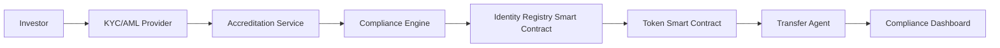

# SEC Compliance Framework for Tokenized Securities

**Comprehensive guide to achieving and maintaining SEC compliance for digital security offerings.**

---

## Table of Contents

1. [Executive Summary](#1-executive-summary)
2. [Compliance Roadmap](#2-compliance-roadmap)
3. [Securities Classification](#3-securities-classification)
4. [Regulation D Compliance](#4-regulation-d-compliance)
5. [Regulation A+ Compliance](#5-regulation-a-compliance)
6. [Regulation S Compliance](#6-regulation-s-compliance)
7. [Registration Requirements](#7-registration-requirements)
8. [Transfer Agent Requirements](#8-transfer-agent-requirements)
9. [Ongoing Compliance Obligations](#9-ongoing-compliance-obligations)
10. [State Blue Sky Laws](#10-state-blue-sky-laws)
11. [Compliance Monitoring Systems](#11-compliance-monitoring-systems)
12. [Legal Documentation](#12-legal-documentation)
13. [Audit & Examination](#13-audit--examination)
14. [Enforcement & Penalties](#14-enforcement--penalties)

---

## 1. Executive Summary

### Why SEC Compliance Matters

**Legal Imperative**:
- Unregistered securities offerings = federal crime (Securities Act of 1933 Section 5)
- Civil penalties: Disgorgement of all funds raised + penalties
- Criminal penalties: Up to 5 years imprisonment + $5M fines (per violation)
- Permanent bars from securities industry

**Business Benefits**:
- Access to institutional capital
- Secondary market liquidity (regulated exchanges/ATS)
- Enhanced credibility and trust
- Lower cost of capital
- Global distribution potential

**Key Principle**:
> "If it looks like a security, acts like a security, and quacks like a security—it's a security. Register it or find an exemption."

### Three Paths to Compliance

```yaml
path_1_exemption:
  name: "Regulation D (Private Placement)"
  best_for: "Startups, small offerings, accredited investors only"
  max_raise: "Unlimited (Rule 506)"
  timeline: "2-4 weeks"
  cost: "$50K-$150K"
  ongoing: "Minimal"

path_2_exemption:
  name: "Regulation A+ (Mini-IPO)"
  best_for: "Growth companies, retail investors, public markets"
  max_raise: "$75M per year (Tier 2)"
  timeline: "4-6 months"
  cost: "$300K-$800K"
  ongoing: "Quarterly/annual reports"

path_3_registration:
  name: "Full Registration (Form S-1)"
  best_for: "Large offerings, NYSE/NASDAQ listing"
  max_raise: "Unlimited"
  timeline: "6-18 months"
  cost: "$1M-$5M+"
  ongoing: "Full SEC reporting (10-K, 10-Q, 8-K)"
```

**Decision Matrix**:

| Factor | Reg D 506(c) | Reg A+ Tier 2 | Full Registration |
|--------|--------------|---------------|-------------------|
| **Investor Type** | Accredited only | Anyone (with limits) | Anyone |
| **General Solicitation** | Allowed | Allowed | Allowed |
| **State Filing** | Exempt (federal preemption) | Exempt (federal preemption) | Required |
| **Ongoing Reporting** | None | Semi-annual | Quarterly |
| **Resale Restrictions** | 12 months | None | None |
| **Cost** | $ | $$ | $$$$ |
| **Timeline** | Weeks | Months | 6-18 months |

---

## 2. Compliance Roadmap

### Phase 1: Pre-Launch (Months 1-3)

**Week 1-2: Legal Structure**
```yaml
tasks:
  - Engage securities attorney (specialized in digital securities)
  - Form Delaware C-Corp or LLC
  - Create Special Purpose Vehicle (SPV) if holding real assets
  - Draft articles of incorporation with token provisions
  - Obtain EIN from IRS

deliverables:
  - Certificate of Incorporation
  - Operating Agreement / Bylaws
  - SPV Formation Documents
  - Attorney Engagement Letter

estimated_cost: "$25K-$50K"
```

**Week 3-4: Regulatory Strategy**
```yaml
tasks:
  - Determine if token is a security (Howey Test analysis)
  - Choose exemption path (Reg D vs Reg A+ vs Registration)
  - Document business purpose and token economics
  - Identify target investor base
  - Assess state blue sky law requirements

deliverables:
  - Securities Analysis Memo
  - Regulatory Strategy Document
  - Token Economics Whitepaper (legal review)
  - Target Market Analysis

key_decision: "Which SEC exemption to pursue?"
```

**Week 5-8: Token Structure Design**
```yaml
tasks:
  - Design token smart contract with compliance features
  - Implement transfer restrictions (lockups, whitelists)
  - Select token standard (ERC-3643 recommended)
  - Integrate identity registry
  - Build compliance module
  - Security audit (smart contracts)

deliverables:
  - Smart Contract Code (audited)
  - Technical Architecture Document
  - Security Audit Report
  - Compliance Module Specification

estimated_cost: "$100K-$250K (development + audit)"
```

**Week 9-12: Offering Documents**
```yaml
tasks:
  - Draft Private Placement Memorandum (PPM) or Offering Circular
  - Create Subscription Agreement
  - Prepare Risk Factors disclosure
  - Draft investor questionnaire (accreditation verification)
  - Create executive summary / pitch deck
  - File Form D (if Reg D) or Form 1-A (if Reg A+)

deliverables:
  - Private Placement Memorandum (PPM)
  - Subscription Agreement
  - Investor Questionnaire
  - Form D or Form 1-A Filing
  - Offering Materials

estimated_cost: "$50K-$150K (legal)"
timeline: "Reg D: 2-4 weeks | Reg A+: SEC review 30-60 days"
```

### Phase 2: Launch (Month 4)

**Week 1-2: Infrastructure Setup**
```yaml
tasks:
  - Deploy smart contracts to mainnet
  - Set up KYC/AML provider (Chainalysis, Jumio, Onfido)
  - Configure identity registry
  - Establish custodial relationships (if required)
  - Set up investor portal
  - Configure compliance monitoring

deliverables:
  - Deployed Token Contract
  - KYC/AML System (live)
  - Investor Portal
  - Custody Agreement (if applicable)

estimated_cost: "$30K-$100K (setup + integration)"
```

**Week 3-4: Offering Period**
```yaml
tasks:
  - Accept investor subscriptions
  - Verify accredited investor status (Reg D)
  - Perform KYC/AML checks on all investors
  - Collect subscription funds (escrow recommended)
  - Issue tokens upon subscription acceptance
  - Maintain investor records

deliverables:
  - Executed Subscription Agreements
  - Investor Verification Records
  - KYC/AML Documentation
  - Token Issuance Records

compliance_note: "Maintain organized records for SEC examination"
```

### Phase 3: Post-Launch (Ongoing)

**Monthly**:
```yaml
- Monitor transfer restrictions (lockup periods)
- Update investor cap table
- Review compliance dashboard
- Archive transaction logs
- Check for suspicious activity (AML)
```

**Quarterly** (Reg A+ only):
```yaml
- File Semi-Annual Reports (Form 1-SA)
- Update financial statements
- Report material events (Form 1-U)
```

**Annually**:
```yaml
- Tax reporting (Form 1099-DIV for dividends)
- Update investor records
- Renew KYC for all holders
- Annual financial audit
- Board meeting (approve financials)
```

**As Needed**:
```yaml
- File Form D amendments (material changes)
- File 8-K equivalents (material events)
- Respond to SEC inquiries
- Update offering documents
```

---

## 3. Securities Classification

### The Howey Test (1946)

An "investment contract" (security) exists if ALL four prongs are met:

```yaml
prong_1_investment_of_money:
  description: "Person invests money or valuable consideration"
  token_analysis: "✅ YES - Investors pay USD/crypto for tokens"

prong_2_common_enterprise:
  description: "Pooled investment with collective fortunes"
  token_analysis: "✅ YES - All token holders share in project success"
  types:
    horizontal: "Pooling of investor funds"
    vertical: "Fortunes tied to promoter's efforts"

prong_3_expectation_of_profits:
  description: "Investment made with expectation of profits"
  token_analysis: "✅ USUALLY YES - Token value expected to increase"
  key_factors:
    - Marketing emphasizes potential returns
    - Secondary market trading
    - Comparison to traditional investments
    - Dividend/yield distributions

prong_4_efforts_of_others:
  description: "Profits derived from efforts of promoter or third party"
  token_analysis: "✅ USUALLY YES - Team develops platform, not token holders"
  key_factors:
    - Continued development by issuer
    - Marketing and business development
    - Strategic partnerships
    - Platform improvements
```

**Result**: Most tokens = Securities

### SEC Framework for Digital Assets (2019)

Additional factors SEC considers:

**Less Likely a Security** (Utility Token):
```yaml
characteristics:
  - Token provides immediate utility on functioning network
  - Token holders consume the utility (not just speculate)
  - Network is fully decentralized
  - No central party whose efforts determine value
  - Token economics designed for consumption, not investment
  - No marketing emphasizing investment returns

examples:
  - Filecoin (once network launched and decentralized)
  - Ethereum (SEC confirmed not a security due to decentralization)
```

**More Likely a Security**:
```yaml
characteristics:
  - Funds used to build network that doesn't yet exist
  - Future functionality promises
  - Active development team central to project
  - Marketing emphasizes potential appreciation
  - Secondary market focus
  - Token holders passive (not consuming utility)

examples:
  - Most ICOs (2017-2018)
  - Real World Asset tokens (always securities)
  - Equity-like tokens
  - Profit-sharing tokens
```

### RWA Token Classification

**Clear Securities**:
```yaml
always_securities:
  - Tokenized stocks/equity
  - Tokenized bonds
  - Tokenized real estate
  - Tokenized commodities with profit expectation
  - Revenue-sharing tokens
  - Dividend-paying tokens
  - Fractional ownership of income-producing assets

reasoning: "All four Howey prongs clearly met"
```

**Must Use Exemption or Register**:
> There is NO utility token argument for RWA tokens. They represent investment contracts and must comply with securities laws.

---

## 4. Regulation D Compliance

### Overview

**Regulation D** provides exemptions from registration for private placements to accredited investors.

**Three Rules**:
- **Rule 504**: Up to $10M, specific state requirements
- **Rule 506(b)**: Unlimited raise, no general solicitation, up to 35 non-accredited
- **Rule 506(c)**: Unlimited raise, general solicitation allowed, accredited investors only

**Best for RWA**: Rule 506(c) (most flexible, federal preemption)

### Rule 506(c) Requirements

#### 1. Accredited Investor Verification

**Definition of Accredited Investor** (amended 2020):

```yaml
natural_persons:
  income_test:
    requirement: "$200K individual / $300K joint income in each of last 2 years"
    reasonable_expectation: "Same level of income in current year"
    documentation:
      - IRS Form W-2
      - Form 1099
      - Tax returns (last 2 years)

  net_worth_test:
    requirement: "$1M net worth (excluding primary residence)"
    calculation: "Assets - Liabilities (exclude home equity)"
    documentation:
      - Bank statements
      - Brokerage statements
      - Property valuations
      - Credit report
      - CPA letter

  professional_certifications:
    licenses:
      - Series 7 (General Securities Representative)
      - Series 65 (Investment Adviser Representative)
      - Series 82 (Private Securities Offerings Representative)
    documentation: "Copy of license + verification with FINRA"

  knowledgeable_employees:
    requirement: "Employee of private fund investing in same fund"
    verification: "Employment agreement + attestation"

entities:
  qualified_institutional_buyers:
    threshold: "$100M in securities"
    examples: ["Insurance companies", "Pension funds", "Registered investment companies"]

  large_entities:
    threshold: "$5M in assets"
    types: ["Corporation", "LLC", "Partnership", "Trust"]
    documentation:
      - Articles of incorporation
      - Financial statements
      - Balance sheet

  entity_owned_by_accredited:
    requirement: "ALL equity owners are accredited investors"
    verification: "Verify each beneficial owner individually"

  investment_advisers:
    registered: "SEC or state-registered investment advisers"
    exempt: "Exempt reporting advisers"
    documentation: "Form ADV + registration verification"

  family_offices:
    assets: "$5M+ assets under management"
    family_clients: "Family clients are all accredited"
    documentation: "Financial statements + client accreditation"

  spousal_equivalents:
    new_2020: "Spousal equivalents can pool finances for accreditation"
    requirement: "Joint finances + shared primary residence"
```

**Verification Methods** (Reasonable Steps):

```yaml
method_1_review_documentation:
  documents:
    - Tax returns (Form 1040)
    - W-2/1099/K-1 forms
    - Bank statements
    - Brokerage statements
    - CPA/attorney letter

  process:
    - Request documents dated within 90 days
    - Review for income/net worth thresholds
    - Verify authenticity (cross-check, call CPA)
    - Document review process

  pros: "Most thorough, legally defensible"
  cons: "Invasive, slow, expensive"

method_2_third_party_verification:
  providers:
    - "VerifyInvestor.com"
    - "North Capital Private Securities"
    - "Parallel Markets"
    - "AngelList"

  process:
    - Investor submits docs to third party
    - Third party verifies and provides certificate
    - Issuer relies on certificate

  pros: "Fast, scalable, liability shifted"
  cons: "Cost ($50-$300 per investor)"

  safe_harbor: "Reliance on written confirmation from third party = reasonable steps"

method_3_certification_for_existing_accredited:
  requirement: "Prior verification within last 5 years"
  process:
    - Investor certifies still accredited
    - No material change in circumstances
    - Issuer has reasonable belief

  pros: "Low friction for repeat investors"
  cons: "Only works for existing accredited"

method_4_professionals:
  licenses: ["Series 7", "Series 65", "Series 82"]
  process:
    - Request copy of license
    - Verify with FINRA BrokerCheck
    - Check expiration date

  pros: "Simple, verifiable"
  cons: "Small subset of investors"
```

**Best Practice Recommendation**:
```
Use third-party verification service (Method 2) for:
- Speed (2-3 days)
- Liability protection (safe harbor)
- Professional process
- Scalability
- Better investor experience
```

#### 2. General Solicitation

**Allowed Activities** (506(c)):
```yaml
advertising:
  - Public websites
  - Social media posts (Twitter, LinkedIn, etc.)
  - Paid advertisements (Google, Facebook, etc.)
  - Demo days and pitch competitions
  - Press releases
  - Email campaigns to cold lists

content_restrictions:
  - No false or misleading statements
  - Include required disclaimers
  - Risk disclosures prominent
  - Forward-looking statement warnings

example_disclaimer: |
  "This is an offer to sell securities to accredited investors only.
  You must be an accredited investor to participate. Past performance
  is not indicative of future results. Investments involve risk and
  may result in loss of capital."
```

**Pre-Existing Relationship** (not required for 506(c)):
```yaml
note: "506(c) does NOT require pre-existing substantive relationship"
benefit: "Can advertise to anyone, as long as only accredited can invest"
```

#### 3. Form D Filing

**When to File**:
```yaml
initial_filing:
  deadline: "15 days AFTER first sale"
  note: "Not before, not at—AFTER first sale"

amendments:
  deadline: "30 days after change"
  triggers:
    - Name change
    - Contact info change
    - New offering round
    - Industry change

annual_amendment:
  deadline: "Annually if offering still open"
  requirement: "Update filing even if no changes"

final_amendment:
  when: "When offering closes"
  mark: "Check 'final amendment' box"
```

**Form D Contents**:
```yaml
section_1_issuer:
  - Legal name
  - Previous names (if any)
  - CIK number (if have one)
  - Entity type
  - Jurisdiction
  - Address (principal place of business)
  - Phone number
  - Website

section_2_principal_address:
  - Street address (NO PO boxes)
  - City, State, ZIP

section_3_related_persons:
  - Promoters
  - Executive officers
  - Directors
  - 10%+ beneficial owners
  - Each person: Name, Address, Title

section_4_industry_group:
  - Select from dropdown (NAICS codes)
  - Options: Real Estate, Finance, Technology, etc.

section_5_issuer_size:
  - Revenue range
  - Aggregate net asset value

section_6_federal_exemptions:
  - Check: Rule 506(c)

section_7_type_of_filing:
  - New notice OR Amendment

section_8_duration_of_offering:
  - Start date (mm/dd/yyyy)
  - End date (mm/dd/yyyy) or check "indefinite"

section_9_type_of_securities:
  - Equity
  - Debt
  - Option/Warrant
  - Security to be acquired upon exercise
  - Other (describe)

section_10_business_combination:
  - Usually NO for RWA offerings

section_11_minimum_investment:
  - Minimum amount per investor
  - Example: $25,000

section_12_sales_compensation:
  - Name each broker-dealer
  - CRD number
  - Describe compensation arrangement

section_13_offering_and_sales:
  - Total offering amount
  - Total amount sold
  - Total remaining to be sold

section_14_investors:
  - Number of investors already invested
  - Total number of investors (to date)

section_15_sales_commissions:
  - Total commissions/finders' fees paid
  - Breakdown by broker-dealer

section_16_use_of_proceeds:
  - Describe planned use of funds
  - Example: "Asset acquisition, working capital, platform development"

section_17_signature:
  - Authorized representative signature
  - Typed name and title
  - Date
```

**Filing Process**:
```bash
1. Create account on SEC EDGAR
2. Obtain EDGAR access codes (CCC, PPSC)
3. Prepare Form D in EDGAR system
4. Review for accuracy
5. Submit electronically
6. Receive confirmation email
7. Form D becomes public immediately
```

**Common Mistakes**:
```yaml
mistake_1: "Filing Form D too early (before first sale)"
consequence: "Starts 15-day countdown before you're ready"

mistake_2: "Missing amendment deadlines"
consequence: "Loss of exemption = illegal unregistered offering"

mistake_3: "Incomplete related persons section"
consequence: "May need to amend, raises red flags"

mistake_4: "Wrong exemption checkbox"
consequence: "Conflicting information, potential audit trigger"

mistake_5: "Inaccurate sales figures"
consequence: "Amendment required, looks disorganized"
```

**State Filings** (506(c) is federally preempted):
```yaml
state_requirements:
  form_d_copy: "File copy of federal Form D in each state where offering securities"
  notice_filing: "Simple notice + fee ($250-$750 per state)"
  consent_to_service: "Appoint state as agent for service of process"

  deadline: "Generally same as federal (15 days after first sale in state)"

  no_merit_review: "States CANNOT review merits of 506(c) offering"

  note: "Federal preemption = huge benefit of 506(c) over other exemptions"
```

#### 4. Transfer Restrictions

**12-Month Holding Period**:
```yaml
rule: "Securities Act Rule 144(d)(1) - 12 months for restricted securities"

implementation:
  smart_contract:
    - Lockup period enforced in token contract
    - Transfer function checks purchase date
    - Revert if < 12 months elapsed

  legend:
    text: |
      "THESE SECURITIES HAVE NOT BEEN REGISTERED UNDER THE SECURITIES ACT
      OF 1933. THEY MAY NOT BE SOLD, OFFERED FOR SALE, PLEDGED OR
      HYPOTHECATED IN THE ABSENCE OF AN EFFECTIVE REGISTRATION STATEMENT
      AS TO THE SECURITIES UNDER SAID ACT OR AN OPINION OF COUNSEL
      SATISFACTORY TO THE COMPANY THAT SUCH REGISTRATION IS NOT REQUIRED."

    location: "Token metadata, investor portal, subscription agreement"

exceptions:
  rule_144_sale: "After 12 months, can sell under Rule 144 (with conditions)"
  registered_resale: "Can sell if resale is registered (rare)"
  transfer_to_accredited: "May be able to transfer to another accredited investor sooner (issuer discretion)"
```

**Implementing in Smart Contracts**:

```solidity
contract RegDToken is ERC3643 {
    uint256 public constant LOCKUP_PERIOD = 365 days;

    mapping(address => uint256) public purchaseTimestamp;

    function transfer(address to, uint256 amount) public override returns (bool) {
        require(
            block.timestamp >= purchaseTimestamp[msg.sender] + LOCKUP_PERIOD,
            "12-month lockup period not elapsed"
        );

        return super.transfer(to, amount);
    }

    function mint(address to, uint256 amount) public onlyAgent {
        purchaseTimestamp[to] = block.timestamp;
        _mint(to, amount);
    }
}
```

#### 5. Investor Limits

```yaml
no_investor_limit:
  rule: "506(c) has NO limit on number of accredited investors"

  practical_limit:
    reason: "Administrative burden, cap table management"
    recommendation: "Self-impose limit of 500-2000 investors"

holder_of_record_limit:
  threshold: "2,000 holders of record + $10M assets = Exchange Act reporting"
  avoid_by:
    - Limit total investors to <2,000
    - Use nominee structure (all investors = 1 holder of record)
    - Use special purpose vehicle (SPV)

cap_table_management:
  tools:
    - "Carta"
    - "Pulley"
    - "AngelList"
    - "Securitize"

  features:
    - Track all holders
    - Manage transfers
    - Generate reports
    - Tax forms (1099)
```

#### 6. Integration Requirements

**Bad Actor Disqualification** (Rule 506(d)):

```yaml
covered_persons:
  - Issuer
  - Predecessor/affiliated issuer
  - Directors
  - Executive officers
  - 20%+ beneficial owners
  - Promoters
  - Investment managers
  - Compensated solicitors

disqualifying_events:
  criminal:
    - Felony/misdemeanor involving fraud, deceit, securities
    - Within 10 years (felony) or 5 years (misdemeanor)

  regulatory:
    - SEC cease-and-desist order
    - Suspension/expulsion from FINRA, exchange
    - SEC denial/suspension/revocation of registration
    - CFTC orders

  civil:
    - Court injunction involving securities fraud
    - Within 5 years

  timeframe: "Events occurring AFTER September 23, 2013"

due_diligence:
  process:
    - Background checks on all covered persons
    - Review SEC litigation releases
    - Check FINRA BrokerCheck
    - Search state securities regulators
    - Google search for litigation

  documentation:
    - Questionnaire for each covered person
    - Criminal background check report
    - Representations in subscription agreement

  frequency: "Before each offering + when new persons join"

waiver:
  available: "Can request waiver from SEC"
  process: "Submit request to SEC Division of Corporation Finance"
  timeline: "Can take months"
  alternative: "Remove disqualified person from offering role"
```

### Rule 506(c) Checklist

```yaml
pre_launch:
  - [ ] Form Delaware C-Corp or LLC
  - [ ] Engage securities attorney
  - [ ] Draft token economics (legal review)
  - [ ] Determine accreditation verification method
  - [ ] Conduct bad actor background checks
  - [ ] Draft Private Placement Memorandum (PPM)
  - [ ] Draft Subscription Agreement
  - [ ] Create Accredited Investor Questionnaire
  - [ ] Develop smart contract with lockups
  - [ ] Security audit smart contracts
  - [ ] Set up KYC/AML provider
  - [ ] Set up investor portal
  - [ ] Prepare Form D for filing

launch:
  - [ ] Open subscription period
  - [ ] Verify each investor is accredited
  - [ ] Perform KYC/AML on each investor
  - [ ] Execute Subscription Agreement with each investor
  - [ ] Collect funds (recommend escrow)
  - [ ] Issue tokens
  - [ ] File Form D within 15 days of first sale
  - [ ] File state notice filings

ongoing:
  - [ ] Maintain investor records (6 years minimum)
  - [ ] Update Form D annually (if offering open)
  - [ ] File Form D amendments (within 30 days of material changes)
  - [ ] Enforce 12-month transfer restrictions
  - [ ] Respond to investor requests
  - [ ] Annual board meeting (approve actions)
  - [ ] File state annual reports (corporate compliance)
```

---

## 5. Regulation A+ Compliance

### Overview

**Regulation A+** provides exemption for "mini-IPOs" with lighter reporting than full registration.

**Two Tiers**:

```yaml
tier_1:
  max_raise: "$20M in 12 months"
  state_review: "YES - Blue Sky merit review"
  financial_statements: "2 years audited"
  ongoing_reporting: "Annual reports + exits"
  best_for: "Smaller offerings, want to avoid state headaches? Use Tier 2 instead"

tier_2:
  max_raise: "$75M in 12 months"
  state_review: "NO - Federal preemption"
  financial_statements: "2 years audited"
  ongoing_reporting: "Semi-annual + annual reports + current reports"
  investment_limits: "Non-accredited: 10% of income/net worth (per year)"
  best_for: "Most RWA offerings - allows retail, no state review, higher limit"
```

**Tier 2 Recommended** for RWA projects:
- Federal preemption (no state blue sky review)
- Higher raise limit ($75M vs $20M)
- Access to non-accredited investors
- Clean path to secondary trading

### Tier 2 Requirements

#### 1. Offering Statement (Form 1-A)

**SEC Review Process**:

```yaml
step_1_draft_offering_circular:
  contents:
    - Cover page
    - Summary (key information)
    - Risk Factors (detailed)
    - Dilution
    - Plan of distribution
    - Use of proceeds
    - Description of business
    - Description of property
    - Management's discussion and analysis (MD&A)
    - Directors, officers, significant employees
    - Compensation
    - Security ownership
    - Interest of management in transactions
    - Description of securities
    - Financial statements (2 years audited)

  length: "Typically 100-200 pages"

  similar_to: "S-1 registration statement but simplified"

step_2_file_form_1a:
  parts:
    - Part I: Notification (basic info)
    - Part II: Offering Circular (main document)
    - Part III: Exhibits

  filing: "EDGAR system (same as Form D)"

  fee: "$0 (no SEC filing fee for Reg A+)"

step_3_sec_review:
  timeline: "30-60 days for initial comments"
  process:
    - SEC staff reviews for compliance
    - SEC issues comment letter (typically 10-30 comments)
    - Issuer responds and amends Form 1-A
    - Potentially additional rounds of comments

  topics:
    - Risk factor adequacy
    - MD&A completeness
    - Financial statement presentation
    - Disclosure clarity
    - Compliance with Reg A+ rules

  pro_tip: "Use experienced Reg A+ counsel - familiar with SEC reviewer expectations"

step_4_qualification:
  timeline: "After all SEC comments resolved + 20 days"
  process:
    - SEC declares offering statement "qualified"
    - Similar to "effective" for registered offerings
    - Can begin selling immediately upon qualification

  total_timeline: "Typically 3-6 months from filing to qualification"

step_5_post_qualification:
  - Upload Offering Circular to company website
  - Provide Offering Circular to all prospective investors
  - Begin marketing and selling
```

**Financial Statement Requirements**:

```yaml
audited_financial_statements:
  years: "2 most recent fiscal years"
  auditor: "PCAOB-registered accounting firm"
  standards: "US GAAP or IFRS"

  statements:
    - Balance Sheet
    - Statement of Operations
    - Statement of Cash Flows
    - Statement of Stockholders' Equity
    - Notes to Financial Statements

interim_financials:
  requirement: "Unaudited financials for most recent interim period"
  review: "Reviewed by auditor (review < audit)"

cost: "$50K-$150K for 2-year audit + interim review"

timing: "Obtain audited financials BEFORE filing Form 1-A"
```

#### 2. Testing the Waters

**Allowed Under Reg A+**:

```yaml
what_is_it: "Gauge investor interest BEFORE filing Form 1-A"

when:
  - Before filing Form 1-A
  - After filing but before qualification
  - After qualification

activities:
  - Written/oral communications
  - Presentations
  - Road shows
  - Webinars
  - Social media posts
  - Email campaigns

restrictions:
  no_money: "Cannot accept money or binding commitments"
  legend_required: "Must include required legend"
  filing: "Must file solicitation materials as exhibit to Form 1-A"

legend: |
  "An offering statement regarding this offering has been filed with
  the SEC. The SEC has not yet qualified the offering statement. Before
  any sale may be made, a Final Offering Circular must be provided to
  you. This is not an offer to sell securities. No money or other
  consideration is being solicited. No sales will be made or commitments
  accepted until the offering statement is qualified."

benefit: "Risk-free way to validate investor demand before incurring full costs"
```

#### 3. Investment Limits (Non-Accredited)

**Tier 2 Restriction**:

```yaml
rule: "Non-accredited investors limited to investing 10% of greater of annual income or net worth"

example_1:
  income: "$80,000/year"
  net_worth: "$150,000"
  greater: "$150,000"
  investment_limit: "$15,000 per year"

example_2:
  income: "$200,000/year (accredited by income)"
  no_limit: "TRUE - accredited investors have NO limit"

enforcement:
  method_1_representation:
    - Investor represents they comply with limit
    - Investor acknowledges limit in subscription agreement

  method_2_verification:
    - Issuer calculates based on investor-provided info
    - Financial statements or tax returns
    - Use third-party service

  recommended: "Representation + calculated limit displayed in portal"

aggregation:
  rule: "10% limit applies per YEAR across ALL Tier 2 offerings"

  how_tracked:
    - Issuer only knows their own offering
    - Rely on investor representation
    - No centralized database

  practical: "Difficult to enforce across multiple issuers"
```

**Smart Contract Implementation**:

```solidity
contract RegAToken is ERC3643 {
    // Annual investment limit (10% of income/net worth)
    mapping(address => uint256) public annualLimit;
    mapping(address => uint256) public annualInvested;
    mapping(address => uint256) public limitResetTimestamp;

    function setAnnualLimit(address investor, uint256 limit) external onlyAgent {
        annualLimit[investor] = limit;
        limitResetTimestamp[investor] = block.timestamp;
    }

    function mint(address to, uint256 amount) public override onlyAgent {
        // Reset if year elapsed
        if (block.timestamp >= limitResetTimestamp[to] + 365 days) {
            annualInvested[to] = 0;
            limitResetTimestamp[to] = block.timestamp;
        }

        // Check annual limit (only for non-accredited)
        if (!identityRegistry.isAccredited(to)) {
            require(
                annualInvested[to] + amount <= annualLimit[to],
                "Exceeds annual investment limit"
            );
            annualInvested[to] += amount;
        }

        _mint(to, amount);
    }
}
```

#### 4. Ongoing Reporting

**Semi-Annual Reports** (Form 1-SA):

```yaml
frequency: "Within 75 days of end of each fiscal half-year"

contents:
  - Balance Sheet (unaudited)
  - Income Statement (unaudited)
  - Cash Flow Statement (unaudited)
  - MD&A (management discussion)
  - Material changes

example_dates:
  fiscal_year_end: "December 31"
  first_half: "June 30 (due September 13)"
  second_half: "December 31 (covered in annual report)"

cost: "Internal accounting team or $10K-$25K outsourced"
```

**Annual Reports** (Form 1-K):

```yaml
frequency: "Within 120 days of fiscal year end"

contents:
  - Balance Sheet (audited)
  - Income Statement (audited)
  - Cash Flow Statement (audited)
  - Stockholders' Equity (audited)
  - MD&A
  - Description of business (updated)
  - Management compensation
  - Security ownership
  - Interest of management in transactions

auditor: "PCAOB-registered firm"

example:
  fiscal_year_end: "December 31"
  form_1k_due: "April 30"

cost: "$50K-$100K (annual audit + preparation)"
```

**Current Reports** (Form 1-U):

```yaml
when_required: "Within 4 business days of material event"

material_events:
  - Fundamental change (merger, acquisition, sale)
  - Bankruptcy or receivership
  - Material modification to rights of security holders
  - Change in control
  - Departure of directors/principal officers
  - Amendments to articles or bylaws
  - Suspension of trading
  - Changes in certifying accountant
  - Non-reliance on previous financials
  - Material impairments

process:
  - Determine if event is material
  - Prepare Form 1-U
  - File within 4 business days
  - Post on company website

cost: "Attorney fees for preparation: $2K-$10K per filing"
```

**Exit Reports** (Form 1-Z):

```yaml
when_filed: "When no longer required to file reports"

triggers:
  - Securities delisted from national exchange
  - Fewer than 300 holders of record (Tier 2)
  - Issuer ceases to exist (merger)
  - Voluntarily terminating reporting

effect: "Suspends reporting obligations going forward"

recommendation: "Continue voluntary reporting even after filing 1-Z (maintains transparency)"
```

**Ongoing Costs**:
```yaml
annual_audit: "$50K-$100K"
semi_annual_review: "$10K-$25K"
form_1u_events: "$2K-$10K each"
sec_edgar_filing_agent: "$5K-$15K/year"
legal_review: "$20K-$50K/year"

total_annual: "$87K-$200K (depending on complexity)"
```

#### 5. Resale Limitations

**Immediate Liquidity** (Tier 2 advantage):

```yaml
no_holding_period: "Securities are NOT restricted"

immediate_resale:
  - Investors can resell immediately after purchase
  - No 12-month holding period (unlike Reg D)
  - Can list on ATS or exchange immediately

secondary_trading:
  platforms:
    - tZERO (ATS)
    - StartEngine Secondary (ATS)
    - INX (Digital exchange)
    - Traditional OTC Markets

  requirements:
    - Ongoing reporting (Form 1-SA, 1-K)
    - Minimum trading volume/liquidity
    - Market maker (recommended)

benefit: "Much easier to attract investors - liquidity from day one"
```

### Reg A+ Tier 2 Checklist

```yaml
pre_filing:
  - [ ] Engage securities attorney (Reg A+ experience)
  - [ ] Engage PCAOB-registered auditor
  - [ ] Obtain 2 years of audited financial statements
  - [ ] Form Delaware C-Corp (required for Tier 2)
  - [ ] Draft business plan
  - [ ] Test the waters (optional but recommended)
  - [ ] File test-the-waters materials as exhibits

form_1a_preparation:
  - [ ] Draft Offering Circular (Part II)
  - [ ] Prepare financial statements
  - [ ] Write risk factors
  - [ ] Prepare MD&A
  - [ ] Create description of business
  - [ ] Compile exhibits
  - [ ] File Form 1-A on EDGAR

sec_review:
  - [ ] Respond to SEC comment letters
  - [ ] Amend Form 1-A as needed
  - [ ] Obtain qualification from SEC
  - [ ] Post Offering Circular on website

offering_period:
  - [ ] Set up investor portal
  - [ ] Implement investment limits for non-accredited
  - [ ] Perform KYC/AML
  - [ ] Accept subscriptions
  - [ ] Issue securities

ongoing_compliance:
  - [ ] File Form 1-SA (semi-annual reports)
  - [ ] File Form 1-K (annual reports)
  - [ ] File Form 1-U (current reports for material events)
  - [ ] Maintain investor communications
  - [ ] Annual board meetings
  - [ ] Update Offering Circular annually
```

---

## 6. Regulation S Compliance

### Overview

**Regulation S** provides exemption for offers and sales of securities OUTSIDE the United States.

**Key Principle**: U.S. securities laws don't apply to offshore transactions.

### When to Use Reg S

```yaml
use_cases:
  - International investors (non-US persons)
  - Token sales to global audience
  - Combined with Reg D (US investors) = dual offering
  - Avoiding US investor restrictions

restrictions:
  - Cannot offer or sell to US persons
  - No directed selling efforts in US
  - Securities cannot "flow back" to US

common_structure:
  reg_d_506c: "US accredited investors"
  reg_s: "Non-US investors"
  combined: "Maximum global reach"
```

### Two Safe Harbors

#### Issuer Safe Harbor (Rule 903)

**Requirements**:

```yaml
category_1:
  definition: "Lowest risk of securities flowing back to US"
  requirements:
    - Offshore transaction
    - No directed selling efforts in US
    - Offering restrictions apply

  distribution_compliance_period: "NONE (Category 1 issuers)"

  applies_to:
    - Foreign issuer with no substantial US market interest
    - Foreign issuer offering debt securities

  note: "Most RWA issuers are US or have US interest = Category 2 or 3"

category_2:
  definition: "Reporting issuers (Exchange Act filers)"
  requirements:
    - Offshore transaction
    - No directed selling efforts in US
    - Offering restrictions apply

  distribution_compliance_period: "40 days for equity, 40 days for debt"

  applies_to: "Issuers filing reports under Exchange Act (10-K, 10-Q)"

category_3:
  definition: "Non-reporting US issuers (most startups)"
  requirements:
    - Offshore transaction
    - No directed selling efforts in US
    - Offering restrictions apply
    - Certification of purchaser status

  distribution_compliance_period: "1 YEAR for equity, 40 days for debt"

  applies_to: "Most RWA token issuers (US companies, not reporting)"

  note: "MOST COMMON for RWA startups"
```

**Offshore Transaction**:

```yaml
definition: "Offer made to person outside US AND either:"
options:
  - "Buyer outside US at time of transaction"
  - "Transaction executed on established foreign exchange"
  - "Transaction executed through physical trading floor of established foreign exchange"

practical:
  - Non-US IP address
  - Non-US mailing address
  - Non-US passport/ID
  - Certification investor is non-US person

technology:
  - Geo-blocking (IP restrictions)
  - KYC verification (passport = non-US)
  - Certification in subscription agreement
```

**No Directed Selling Efforts**:

```yaml
prohibited:
  - Advertisements in US publications
  - US-targeted email campaigns
  - US conferences/roadshows
  - Conditioning US market (publicity to generate US interest)

allowed:
  - General website (if disclaimers + geo-blocking)
  - Foreign publications
  - Foreign conferences
  - Non-US social media targeting

safe_practices:
  - Geo-block US IP addresses from token sale
  - Disclaim in all materials: "Not available to US persons"
  - Only attend non-US conferences for offering
  - Use non-US payment processors
```

**Distribution Compliance Period** (Category 3):

```yaml
one_year_lockup:
  requirement: "Securities cannot be resold to US persons for 1 year"

  implementation:
    smart_contract:
      - Mark tokens as "Reg S restricted"
      - Block transfers to US-verified addresses
      - Release restriction after 1 year

    legend: |
      "THESE SECURITIES HAVE NOT BEEN REGISTERED UNDER THE U.S. SECURITIES
      ACT OF 1933, AS AMENDED, AND MAY NOT BE OFFERED OR SOLD IN THE UNITED
      STATES OR TO U.S. PERSONS UNLESS THE SECURITIES ARE REGISTERED UNDER
      THE ACT, OR AN EXEMPTION FROM THE REGISTRATION REQUIREMENTS OF THE
      ACT IS AVAILABLE."

  after_one_year: "Can sell to US persons (subject to other restrictions)"
```

#### Resale Safe Harbor (Rule 904)

**Requirements** for reselling Reg S securities:

```yaml
conditions:
  - Offshore transaction (buyer outside US)
  - No directed selling efforts in US
  - Dealer requirements (if dealer)

after_distribution_compliance_period:
  - Can resell without restrictions
  - Still subject to other securities laws
```

### Dual Offering Structure (Reg D + Reg S)

**Recommended Approach** for maximum reach:

```yaml
structure:
  us_offering:
    exemption: "Regulation D Rule 506(c)"
    investors: "US accredited investors"
    verification: "Accreditation verification required"
    marketing: "General solicitation allowed"

  international_offering:
    exemption: "Regulation S"
    investors: "Non-US persons"
    verification: "Non-US person certification"
    marketing: "No directed selling efforts in US"

implementation:
  subscription_portal:
    - KYC determines if US or non-US
    - US investors → Reg D flow (accreditation verification)
    - Non-US investors → Reg S flow (non-US certification)

  smart_contracts:
    - Separate tranches or flags
    - US tokens: 12-month Reg D lockup
    - Reg S tokens: 1-year US person restriction

  legal_docs:
    - Combined PPM covering both exemptions
    - Separate subscription agreements
    - Clear disclosure of restrictions

benefits:
  - Maximum investor pool
  - Compliant globally
  - Clear legal structure
  - Professional approach
```

### Reg S Compliance Checklist

```yaml
pre_launch:
  - [ ] Determine offshore transaction method
  - [ ] Implement geo-blocking (US IP addresses)
  - [ ] Draft Reg S disclosure documents
  - [ ] Create non-US person certification
  - [ ] Set up non-US KYC verification

offering:
  - [ ] Verify each investor is non-US person
  - [ ] Collect certifications
  - [ ] Avoid directed selling efforts in US
  - [ ] Issue tokens with Reg S legend
  - [ ] Implement 1-year US person transfer restriction

post_offering:
  - [ ] Enforce 1-year distribution compliance period
  - [ ] Monitor for unauthorized US sales
  - [ ] Remove restrictions after 1 year (Category 3)
  - [ ] Maintain records of offshore transactions
```

---

## 7. Registration Requirements

### When Registration is Required

**No Exemption Available**:

```yaml
triggers:
  - Offering to US investors
  - No exemption applies (failed Reg D, A+, S requirements)
  - General solicitation + non-accredited investors
  - Continuous/repeated offerings
  - Already have 2,000+ holders (Exchange Act reporting)

types_of_registration:
  securities_act: "Form S-1 (initial offering)"
  exchange_act: "Form 10 (periodic reporting)"
```

### Form S-1 Registration

**Overview**:
```yaml
what: "Full registration statement for securities offering"
filed_with: "SEC"
review_process: "Extensive SEC staff review (multiple comment rounds)"
timeline: "6-18 months"
cost: "$1M-$5M+"

result: "Can offer to anyone (retail, institutional, US, global)"
```

**Contents**:

```yaml
prospectus:
  cover_page: "Offering terms summary"
  prospectus_summary: "Key information, risk factors"
  risk_factors: "Comprehensive (20-40 pages typical)"
  use_of_proceeds: "Detailed breakdown"
  dividend_policy: "Historical and planned"
  dilution: "Impact on existing shareholders"
  capitalization: "Before and after offering"
  md_and_a: "Management's Discussion and Analysis (extensive)"
  business: "Complete business description"
  management: "Detailed bios, compensation"
  executive_compensation: "Full disclosure (proxy-level)"
  security_ownership: "Beneficial ownership table"
  related_party_transactions: "All conflicts"
  description_of_securities: "Legal terms"
  underwriting: "Underwriter info, fees"
  legal_matters: "Opinion of counsel"
  experts: "Auditor consent"
  financial_statements: "3 years audited, quarterly unaudited"

exhibits:
  - Articles of incorporation
  - Bylaws
  - Material contracts
  - Underwriting agreement
  - Legal opinions
  - Consent of experts
  - Code of ethics
  - Many others

length: "200-400 pages typical"
```

**SEC Review Process**:

```yaml
step_1_confidential_submission:
  who_can: "Emerging Growth Companies (EGC) only"
  benefit: "Confidential review before public filing"
  requirement: "File publicly at least 21 days before roadshow"

step_2_initial_filing:
  - File Form S-1 on EDGAR
  - Becomes publicly available immediately (unless EGC confidential)
  - SEC assigns to review staff

step_3_sec_comments:
  timeline: "30 days for initial comment letter"
  comments: "50-200 comments typical"
  topics:
    - Disclosure completeness
    - Risk factor adequacy
    - Financial statement presentation
    - MD&A analysis depth
    - Use of proceeds clarity
    - Related party disclosure
    - Offering terms reasonableness

step_4_amendment:
  - File S-1/A (amendment)
  - Respond to each SEC comment
  - Potentially multiple rounds (2-5 rounds common)

step_5_effectiveness:
  - After all comments resolved
  - SEC declares registration statement "effective"
  - Can begin selling immediately

total_timeline: "6-12 months typical (can be 18+ months if complex)"
```

**Ongoing Obligations** (Exchange Act):

```yaml
become_reporting_company:
  trigger: "Once offering closes with 2,000+ holders OR list on exchange"

  requirements:
    - Form 10-K (annual report) - within 60-90 days of fiscal year end
    - Form 10-Q (quarterly report) - within 40-45 days of quarter end
    - Form 8-K (current report) - within 4 business days of material event
    - Proxy statements (if soliciting votes)
    - Insider trading reports (Form 3, 4, 5)
    - SOX compliance (Sarbanes-Oxley)
    - Internal controls over financial reporting

annual_cost: "$2M-$5M+ (audit, legal, compliance, D&O insurance)"
```

### When to Consider Full Registration

```yaml
benefits:
  - Unlimited raise amount
  - Access to all investors (retail, non-accredited)
  - Immediate liquidity (can list on NYSE, NASDAQ)
  - Enhanced credibility
  - Easier future fundraising

drawbacks:
  - Extremely expensive ($1M-$5M+)
  - Time-consuming (6-18 months)
  - Extensive disclosure requirements
  - Ongoing reporting obligations ($2M-$5M/year)
  - Public scrutiny

recommended_for:
  - Large offerings ($100M+)
  - Companies ready to go public
  - Established businesses with 3+ years operations
  - Strong financial performance
  - Experienced management team
  - Desire for NASDAQ/NYSE listing

not_recommended_for:
  - Early-stage startups
  - Small offerings (<$75M)
  - Companies wanting privacy
  - Limited financial history
  - Uncertain business model
```

**Alternative**: Use Reg A+ Tier 2 first, then upgrade to full registration later if needed.

---

I'll continue building out the remaining sections of the SEC Compliance Framework. Let me continue adding the critical sections.


## 8. Transfer Agent Requirements

### What is a Transfer Agent?

**Definition**:
```yaml
role: "Entity that maintains records of securities holders and processes transfers"

responsibilities:
  - Maintain shareholder registry (cap table)
  - Issue and cancel certificates (or digital tokens)
  - Process transfers between holders
  - Distribute dividends/distributions
  - Handle lost/stolen securities
  - Provide shareholder lists to issuer
  - Issue tax documents (1099 forms)
  - Process corporate actions

traditional_examples:
  - Computershare
  - American Stock Transfer (AST)
  - Continental Stock Transfer
  - Broadridge

digital_transfer_agents:
  - Securitize
  - Tokensoft
  - Polymath
  - Vertalo
```

### When Transfer Agent is Required

**SEC Rule 17Ad-4**:

```yaml
registration_required:
  threshold: "500+ holders of record"
  timeframe: "Must register within 90 days of exceeding threshold"
  form: "Form TA-1"

exemptions:
  - Bank acting as transfer agent
  - Issuer serving as own transfer agent (<500 holders)
  - Broker-dealer registered with SEC

for_rwa_tokens:
  recommendation: "Use registered transfer agent from start"
  reason: "Professional compliance, investor confidence"
```

**Practical Threshold**:

```yaml
self_serve:
  holders: "0-100"
  method: "Spreadsheet + manual tracking"
  tools: ["Excel", "Google Sheets"]
  cost: "Free (your time)"
  risk: "High error risk, unprofessional"

cap_table_software:
  holders: "100-500"
  tools: ["Carta", "Pulley", "Shareworks"]
  cost: "$500-$5,000/month"
  features:
    - Automated cap table
    - Electronic signatures
    - 409A valuations
    - Tax form generation

registered_transfer_agent:
  holders: "500+ (or any size for professionalism)"
  requirement: "SEC-registered transfer agent"
  cost: "$10K-$50K setup + $2K-$10K/month"
  features:
    - Full compliance
    - Investor portal
    - Distribution processing
    - Regulatory reporting
    - Liability protection

recommendation: "Use registered transfer agent for any public offering (Reg A+, Reg D 506(c) with >100 investors)"
```

### Selecting a Transfer Agent

**Evaluation Criteria**:

```yaml
registration_status:
  check: "SEC EDGAR - search for Form TA-1"
  verify: "Current registration (not withdrawn)"
  states: "Registered in relevant states"

technology:
  blockchain_compatible: "Can handle tokenized securities?"
  api_access: "Integration with your platform?"
  investor_portal: "Self-service for investors?"
  reporting: "Automated compliance reports?"

experience:
  industry: "Experience with digital securities?"
  references: "Talk to current clients"
  track_record: "How long in business?"

services:
  dividend_distribution: "Automated?"
  tax_reporting: "1099 generation?"
  corporate_actions: "Stock splits, conversions?"
  lost_securities: "Replacement process?"

cost:
  setup_fee: "$5K-$50K"
  monthly_base: "$1K-$10K"
  per_holder: "$1-$10 per holder per month"
  transaction_fees: "$5-$50 per transfer"
  distribution_fees: "$0.25-$1 per distribution"

support:
  issuer_support: "Dedicated account manager?"
  investor_support: "Call center for investors?"
  hours: "Business hours only or 24/7?"

reputation:
  complaints: "Check FINRA BrokerCheck, SEC records"
  reviews: "Industry reputation"
  stability: "Financial stability of firm"
```

**Questions to Ask**:

```yaml
integration:
  - "Do you support ERC-3643 / ERC-1400 tokens?"
  - "Can you integrate with our smart contracts?"
  - "Do you provide an API?"
  - "Can we white-label your investor portal?"

compliance:
  - "How do you handle transfer restrictions (Reg D lockups)?"
  - "Do you support accredited investor verification?"
  - "Can you enforce country-based restrictions?"
  - "How do you handle Reg A+ investment limits?"

operations:
  - "What is your SLA for processing transfers?"
  - "How do you handle failed transactions?"
  - "What happens if there's a blockchain fork?"
  - "Do you have disaster recovery / business continuity plans?"

reporting:
  - "What reports do you provide to issuers?"
  - "Can you generate custom reports?"
  - "Do you file annual reports with SEC?"
  - "How do you handle tax reporting (1099s)?"

pricing:
  - "What are all fees (setup, monthly, per-holder, per-transaction)?"
  - "Are there volume discounts?"
  - "What happens if we exceed holder limits?"
  - "Are there termination fees?"
```

### Transfer Agent Agreement

**Key Terms**:

```yaml
scope_of_services:
  - Maintain shareholder registry
  - Process transfers (subject to restrictions)
  - Distribute dividends
  - Issue tax forms
  - Provide reports to issuer

term_and_termination:
  initial_term: "1-3 years typical"
  auto_renewal: "Annual unless terminated"
  termination_notice: "30-90 days"
  transition_assistance: "Transfer records to new agent"

fees:
  setup: "One-time $5K-$50K"
  monthly: "$1K-$10K base"
  per_holder: "$1-$10/month"
  transactions: "$5-$50 per transfer"
  special_services: "Negotiated"

data_ownership:
  issuer_owns: "All shareholder data"
  export_rights: "Can export at any time"
  upon_termination: "Provide all data in usable format"

liability:
  errors_and_omissions: "Transfer agent carries E&O insurance ($1M-$10M)"
  limitation: "Liability typically capped at fees paid"
  indemnification: "Issuer indemnifies for bad instructions"

confidentiality:
  shareholder_data: "Confidential (GDPR, CCPA compliance)"
  restrictions: "Cannot share without issuer consent"
  exceptions: "Legal/regulatory requirements"

compliance:
  regulations: "Transfer agent agrees to comply with all SEC rules"
  audits: "Annual audits (transfer agent pays)"
  representations: "Transfer agent represents SEC registration"

integration:
  technology: "APIs, smart contract integration"
  updates: "Software updates and maintenance"
  security: "Cybersecurity measures"
```

### Self-Serve Transfer Agent (Small Offerings)

**If <500 Holders**:

```yaml
legal_structure:
  requirement: "Issuer can serve as own transfer agent"
  filing: "NOT required to register with SEC"
  liability: "Full liability on issuer"

implementation:
  cap_table_software:
    options: ["Carta", "Pulley", "AngelList", "Shareworks"]
    features:
      - Digital cap table
      - Transfer management
      - Investor portal
      - Electronic signatures
      - 409A valuations

  process:
    transfer_request:
      - Investor submits request
      - Verify restrictions (lockup, accreditation)
      - Execute transfer on-chain
      - Update cap table
      - Notify both parties

    distribution:
      - Calculate amounts per holder
      - Execute on-chain or bank transfer
      - Generate 1099 forms (if taxable)
      - Record in cap table

responsibilities:
  - Maintain accurate records
  - Process transfers promptly (T+2 recommended)
  - Enforce transfer restrictions
  - Generate tax forms
  - Respond to investor inquiries
  - Prepare reports for board/management

risks:
  - Errors = direct liability
  - Time-consuming
  - Unprofessional appearance
  - Harder to scale
  - No separation of duties

recommendation: "Only for very small offerings (<50 holders) or use professional from start"
```

### Blockchain-Native Transfer Agents

**Digital-First Providers**:

```yaml
securitize:
  focus: "Digital securities platform + transfer agent"
  technology: "ERC-1400 compliant"
  services:
    - Token issuance
    - Transfer agent services
    - Investor portal
    - Compliance automation
    - Secondary trading (DS Protocol)
  cost: "Setup $25K-$100K + ongoing $2K-$10K/month"
  best_for: "Tech-forward issuers, digital securities"

tokensoft:
  focus: "Compliant token distribution platform"
  technology: "Multi-chain support"
  services:
    - Token generation and issuance
    - Transfer restrictions
    - Vesting schedules
    - Compliance automation
  cost: "Custom pricing"
  best_for: "Token sales, compliant distributions"

polymath:
  focus: "Security token platform"
  technology: "ERC-1400 (Polymesh blockchain)"
  services:
    - Token issuance (Polymesh)
    - Built-in compliance
    - Identity management
    - Transfer restrictions
  cost: "Custom pricing"
  best_for: "Polymesh-based tokens"

vertalo:
  focus: "Cap table and transfer agent for digital securities"
  technology: "Multi-chain"
  services:
    - Digital cap table
    - Transfer agent
    - Investor relations
    - Compliance
  cost: "Custom pricing"
  best_for: "Traditional issuers moving to blockchain"

comparison:
  securitize: "Most comprehensive, highest cost"
  tokensoft: "Distribution focus, flexible"
  polymath: "Own blockchain (Polymesh), built-in compliance"
  vertalo: "Bridge between traditional and digital"
```

---

## 9. Ongoing Compliance Obligations

### Annual Requirements

**Corporate Compliance** (Delaware C-Corp):

```yaml
annual_franchise_tax:
  due_date: "March 1"
  amount: "$450 minimum (can be higher based on shares)"
  filing: "Annual Report with Delaware Secretary of State"
  penalty: "1.5% per month late + $200 late fee"
  failure_to_pay: "Forfeiture of good standing"

annual_report:
  requirement: "Update company information"
  due_date: "March 1 (Delaware)"
  contents:
    - Current directors and officers
    - Registered agent address
    - Authorized shares
  cost: "Included in franchise tax"

board_meeting:
  frequency: "At least annually"
  requirements:
    - Elect/re-elect officers
    - Approve financials
    - Approve major transactions
    - Review compliance status
  documentation: "Minutes (keep in corporate records)"

record_keeping:
  documents:
    - Articles of incorporation
    - Bylaws
    - Board minutes
    - Shareholder minutes
    - Stock ledger
    - Material contracts
  retention: "Indefinitely"
```

**Securities Law Compliance**:

```yaml
reg_d_offerings:
  form_d_annual:
    requirement: "File amendment annually while offering open"
    due_date: "Within 30 days of anniversary"
    online: "SEC EDGAR system"

  form_d_final:
    requirement: "File when offering closes"
    mark: "Check 'final amendment' box"

  record_retention:
    requirement: "6 years after last sale"
    records:
      - Subscriber information
      - Accreditation verification
      - Subscription agreements
      - Form D filings
      - All communications

reg_a_offerings:
  form_1_sa:
    requirement: "Semi-annual reports"
    due_date: "Within 75 days of fiscal half-year"

  form_1_k:
    requirement: "Annual reports"
    due_date: "Within 120 days of fiscal year end"
    audit: "PCAOB-registered auditor required"

  form_1_u:
    requirement: "Current reports (material events)"
    due_date: "Within 4 business days"

  exit_report:
    form: "Form 1-Z"
    when: "When no longer required to file (e.g., <300 holders)"

exchange_act_reporting:
  form_10_k:
    requirement: "Annual report"
    due_date: "60-90 days after fiscal year end (depends on filer status)"
    audit: "PCAOB-registered auditor"

  form_10_q:
    requirement: "Quarterly reports"
    due_date: "40-45 days after quarter end"
    review: "Auditor review required"

  form_8_k:
    requirement: "Current reports"
    due_date: "4 business days after material event"

  proxy_statements:
    requirement: "If soliciting shareholder votes"
    due_date: "At least 20 days before meeting"
```

**Tax Compliance**:

```yaml
federal_income_tax:
  form_1120:
    who: "C-Corporations"
    due_date: "April 15 (3.5 months after fiscal year end)"
    extension: "6 months (Form 7004)"

  form_1065:
    who: "Partnerships / LLCs taxed as partnerships"
    due_date: "March 15 (2.5 months after fiscal year end)"
    extension: "6 months (Form 7004)"

investor_tax_reporting:
  form_1099_div:
    requirement: "Report dividends to investors"
    threshold: "$10 or more"
    due_date:
      investors: "January 31"
      irs: "February 28 (paper) or March 31 (e-file)"

  form_1099_b:
    requirement: "Report securities sales (if acting as broker)"
    due_date: "Same as 1099-DIV"
    note: "Usually not applicable unless issuer facilitates trades"

state_taxes:
  income_tax: "File in state of incorporation + states with nexus"
  franchise_tax: "Annual (varies by state)"
  sales_tax: "If selling goods/services"
```

**Transfer Restrictions Monitoring**:

```yaml
reg_d_lockups:
  requirement: "Enforce 12-month holding period"
  implementation:
    - Smart contract automatically enforces
    - Monitor for attempted violations
    - Update restrictions upon expiration

  rule_144_eligibility:
    after_12_months: "Can sell under Rule 144"
    conditions:
      - Holding period met
      - Current public information available
      - Volume limitations
      - Manner of sale (broker transactions)

reg_a_investment_limits:
  requirement: "Monitor 10% annual limits for non-accredited (Tier 2)"
  implementation:
    - Track per-investor annual investment
    - Reset annually
    - Prevent exceeding limit

  aggregation: "10% limit applies across ALL Tier 2 offerings (difficult to enforce)"

reg_s_restrictions:
  requirement: "Enforce 1-year US person restriction (Category 3)"
  implementation:
    - Block transfers to US persons for 1 year
    - Smart contract enforces
    - Remove restriction after 1 year

  after_restriction: "Can transfer to US persons (subject to other restrictions)"
```

### Quarterly Requirements

**Financial Reviews**:

```yaml
management_review:
  frequency: "Monthly or quarterly"
  contents:
    - Financial statements (P&L, balance sheet, cash flow)
    - Key metrics (revenue, expenses, burn rate)
    - Variance analysis (budget vs actual)
    - Forecasts (updated projections)

board_review:
  frequency: "Quarterly recommended"
  contents:
    - Financial performance
    - Operational updates
    - Strategic initiatives
    - Risk assessment
    - Compliance status

investor_updates:
  frequency: "Quarterly (best practice)"
  contents:
    - Performance summary
    - Key metrics
    - Major developments
    - Upcoming milestones
    - Financial highlights

  benefits:
    - Transparency builds trust
    - Reduces investor inquiries
    - Demonstrates professionalism
    - Easier for future raises
```

**Compliance Monitoring**:

```yaml
kyc_aml_reviews:
  frequency: "Quarterly"
  activities:
    - Review flagged transactions
    - Update risk scores
    - Check sanctions lists (updated)
    - Investigate suspicious activity
    - Document reviews

transfer_restriction_audits:
  frequency: "Quarterly"
  activities:
    - Verify lockup periods correctly applied
    - Check for unauthorized transfers
    - Update accreditation status
    - Review transfer requests

cap_table_reconciliation:
  frequency: "Quarterly"
  activities:
    - Reconcile on-chain balances with cap table
    - Verify all transactions recorded
    - Update holder count
    - Check for errors

regulatory_updates:
  frequency: "Quarterly (or as needed)"
  activities:
    - Review new SEC guidance
    - Monitor enforcement actions
    - Update compliance procedures
    - Train staff on changes
```

### Annual Audits

**Financial Audits**:

```yaml
reg_a_tier_2:
  requirement: "Annual audit by PCAOB-registered firm"
  standards: "PCAAS (Public Company Accounting Oversight Board standards)"
  cost: "$50K-$150K for small issuer"

exchange_act_reporting:
  requirement: "Annual audit"
  standards: "PCAOB standards"
  cost: "$100K-$500K+ (depends on size/complexity)"

voluntary_audits:
  recommendation: "Even if not required"
  benefits:
    - Investor confidence
    - Detect fraud/errors early
    - Easier for future raises
    - Better internal controls
  cost: "$25K-$100K for quality firm"
```

**Compliance Audits**:

```yaml
transfer_agent_audit:
  requirement: "SEC-registered transfer agents must have annual audit"
  scope: "Internal controls, safeguarding of securities, compliance"
  auditor: "Independent CPA"

  if_self_serve:
    recommendation: "Voluntary annual review of transfer procedures"
    scope: "Cap table accuracy, transfer restrictions, tax reporting"

internal_compliance_review:
  frequency: "Annually"
  scope:
    - Adherence to PPM/offering documents
    - Transfer restriction enforcement
    - KYC/AML procedures
    - Disclosure obligations met
    - Corporate governance

  performer: "Legal counsel or compliance consultant"
  cost: "$10K-$50K"

cybersecurity_audit:
  frequency: "Annually"
  scope:
    - Penetration testing
    - Smart contract audit (if changes)
    - Access controls review
    - Incident response plan testing
  cost: "$25K-$100K"
```

### Investor Relations

**Ongoing Communications**:

```yaml
required_communications:
  reg_a_tier_2:
    - Semi-annual reports (Form 1-SA)
    - Annual reports (Form 1-K)
    - Current reports (Form 1-U)
    - Posted on company website

  reg_d:
    - No required ongoing reports
    - Best practice: Voluntary quarterly updates

  all_offerings:
    - Response to investor inquiries (prompt)
    - Material event notifications
    - Annual meeting notices (if voting)

voluntary_communications:
  quarterly_letters:
    content: "Performance, metrics, developments, outlook"
    distribution: "Email to all investors"
    benefit: "Builds trust, reduces inquiries"

  annual_investor_call:
    format: "Webinar/conference call"
    content: "Annual results, Q&A"
    benefit: "Direct engagement, transparency"

  investor_portal:
    features:
      - View holdings
      - Access reports/documents
      - Submit transfer requests
      - View distributions
      - Tax documents (1099s)
    benefit: "Self-service, reduces support burden"

investor_support:
  response_time: "24-48 hours for inquiries"
  channels: "Email, phone, portal"
  documentation: "Log all inquiries and responses"
```

**Distribution Processing**:

```yaml
dividends:
  frequency: "Quarterly or annually (as declared)"
  process:
    - Board declares dividend
    - Determine record date (who gets dividend)
    - Determine payment date
    - Calculate amounts per holder
    - Execute payments (on-chain or wire/ACH)
    - Issue tax forms (1099-DIV)

  on_chain:
    - Call distributeRevenue() function
    - Token holders claim via smart contract
    - Automatic tax tracking

  off_chain:
    - Transfer agent processes
    - Wire/ACH to investors
    - Transfer agent issues 1099s

interest_payments:
  debt_securities: "As specified in terms (monthly, quarterly, etc.)"
  process: "Similar to dividends"

redemptions:
  early_redemption: "If allowed in terms"
  maturity: "Debt securities mature"
  process:
    - Verify redemption request
    - Calculate amount due
    - Execute payment
    - Burn/cancel tokens
```

---

## 10. State Blue Sky Laws

### Overview

**What are Blue Sky Laws?**

```yaml
definition: "State securities laws regulating securities offerings"

origin: "Named because they prevent 'speculative schemes with no more basis than so many feet of blue sky'"

purpose:
  - Protect investors from fraud
  - Regulate securities offerings in state
  - Licensing of broker-dealers and agents

coordination: "Coordinated through NASAA (North American Securities Administrators Association)"
```

**Federal Preemption**:

```yaml
national_securities_markets_improvement_act_1996:
  preemption:
    - Rule 506 offerings (Reg D 506(b) and 506(c))
    - Regulation A+ Tier 2
    - Securities listed on national exchange

  state_cannot:
    - Review merits of offering
    - Impose substantive conditions
    - Deny registration based on terms

  state_can:
    - Require notice filing
    - Charge filing fees
    - Require consent to service of process
    - Enforce anti-fraud provisions

non_preempted:
  - Regulation A+ Tier 1
  - Rule 504 offerings
  - Intrastate offerings (Rule 147, Rule 147A)
  - Regulation Crowdfunding

result: "Use Rule 506(c) or Reg A+ Tier 2 to minimize state compliance burden"
```

### State Filing Requirements (Rule 506)

**Notice Filings**:

```yaml
requirement: "File notice in each state where offering securities"

timing:
  before_offering: "Some states require filing BEFORE offering"
  after_offering: "Most states allow 15 days after first sale"

recommendation: "File in all states before offering to be safe"

form:
  most_states: "Copy of federal Form D + state cover sheet"
  uniform_form: "Form U-2 (coordinated consent to service)"

fee: "$250-$750 per state"

online_filing:
  - Some states accept electronic filing
  - Others require paper + check

state_by_state:
  california:
    form: "Form 25102(f) + federal Form D"
    fee: "$450"
    timing: "Before first sale OR 15 days after"

  new_york:
    form: "Federal Form D only"
    fee: "$250"
    timing: "No deadline (but file promptly)"

  texas:
    form: "Form 608 + federal Form D"
    fee: "$600"
    timing: "Before first sale"

  florida:
    form: "Federal Form D + cover sheet"
    fee: "$500"
    timing: "15 days after first sale"

  delaware:
    form: "Federal Form D"
    fee: "$500"
    timing: "15 days after first sale"

  note: "Requirements change - verify current rules"
```

**Consent to Service of Process**:

```yaml
requirement: "Appoint state securities regulator as agent for service"

form: "Form U-2 (uniform) or state-specific"

effect: "State can serve legal papers by serving regulator"

duration: "Generally perpetual (survives offering closing)"

filing: "Include with initial notice filing"
```

**Anti-Fraud Enforcement**:

```yaml
state_authority:
  retained: "States can enforce anti-fraud provisions"
  scope: "Investigate and prosecute securities fraud"
  remedies: "Cease and desist, fines, criminal charges"

compliance:
  - No false or misleading statements
  - Full disclosure of material facts
  - No omissions making statements misleading
  - Risk factors prominently disclosed

enforcement_actions:
  common_triggers:
    - Unrealistic projections
    - Omitted risk disclosures
    - Misleading marketing materials
    - Unregistered broker-dealer activity
    - Failure to file notice

  consequences:
    - Cease and desist orders
    - Fines ($10K-$100K per violation)
    - Rescission offers (refund investors)
    - Criminal charges (state laws)
```

### State Requirements (Reg A+ Tier 1)

**Merit Review** (no federal preemption):

```yaml
requirement: "State reviews SUBSTANCE of offering"

review_standards:
  fair: "Terms fair to investors"
  just: "Not oppressive or inequitable"
  equitable: "Reasonable and appropriate"

examples:
  - Promoter compensation not excessive
  - Offering terms not overly dilutive
  - Use of proceeds reasonable
  - Valuation supportable

states_with_merit_review:
  - About 15 states conduct merit review
  - Examples: Alabama, Arkansas, Indiana, Minnesota, Nebraska, etc.

process:
  - File offering statement with each state
  - State examiner reviews
  - Issues comments/conditions
  - May deny registration
  - Can take 30-60 days PER STATE

  frustration: "Different states have different standards"

recommendation: "Use Tier 2 instead of Tier 1 to avoid merit review"
```

### Coordinated Review

**NASAA Coordinated Review Program**:

```yaml
what: "Streamlined multi-state review for certain offerings"

eligible_offerings:
  - Regulation A+
  - Direct participation programs (oil/gas, real estate)
  - Corporate debt offerings

lead_state: "One state acts as lead reviewer"

process:
  - File with lead state
  - Lead state reviews and coordinates with other states
  - Single set of comments (coordinated)
  - Faster than individual state reviews

participating_states: "Most states participate"

fee: "Lead state fee + other state fees"

timeline: "Still 2-4 months typical"

benefit: "One comment letter, not 50"
```

### Best Practices

**Before Offering**:

```yaml
determine_states:
  - Where is issuer located?
  - Where are investors located?
  - Where are offering/marketing?

  conservative: "File in all 50 states + DC + territories"
  practical: "File in states where likely to have investors"

  recommendation: "File in top 20 states by population + issuer's state"

prepare_materials:
  - Federal Form D (ready to file)
  - State cover sheets (for each state)
  - Form U-2 (consent to service)
  - Payment (check or online)

file_notices:
  - File before offering (safe)
  - OR within 15 days of first sale in state (most states)
  - Track deadlines carefully

maintain_records:
  - Filing confirmations
  - Fee payment receipts
  - Correspondence with states
```

**During Offering**:

```yaml
track_investor_locations:
  - Record state of each investor
  - File notice if selling in new state

respond_to_inquiries:
  - State regulators may have questions
  - Respond promptly (within 5 business days)
  - Be cooperative and professional

avoid_triggers:
  - No false/misleading statements
  - Full disclosure
  - Don't act as unregistered broker-dealer
  - Accurate Form D information
```

**After Offering**:

```yaml
renewals:
  - Some states require annual renewal (rare for 506(c))
  - Track expiration dates

amendments:
  - File amendments when required (material changes)
  - Some states require copy of federal amendments

record_retention:
  - Keep all filing confirmations
  - Retain for 6 years minimum

final_filings:
  - File final Form D amendment
  - Some states want notification of offering close
```

### State Investigation & Enforcement

**Common Triggers**:

```yaml
investor_complaints:
  source: "Unhappy investors contact state regulator"
  triggers:
    - Losses on investment
    - Failure to meet projections
    - Lack of communication
    - Suspected fraud

advertising_review:
  monitoring: "States monitor advertising for violations"
  red_flags:
    - Unrealistic return projections
    - Inadequate risk disclosure
    - Unregistered broker-dealer activity

media_reports:
  monitoring: "Negative press coverage"
  action: "States may investigate proactively"

cross_state_information:
  sharing: "States share enforcement information"
  result: "Multi-state investigations possible"
```

**Investigation Process**:

```yaml
initial_inquiry:
  form: "Letter or phone call from examiner"
  request: "Information about offering"
  timeline: "Respond within 10-15 days typically"

document_requests:
  scope: "Offering documents, marketing materials, investor list, financials"
  production: "Provide requested documents"

interviews:
  who: "Officers, directors, promoters"
  representation: "Bring attorney"
  preparation: "Attorney preparation essential"

findings:
  no_violation: "Closed with no action"
  warning_letter: "Corrective action required"
  cease_and_desist: "Stop offering immediately"
  charges: "Civil or criminal charges filed"
```

**Enforcement Actions**:

```yaml
cease_and_desist_order:
  effect: "Must stop offering immediately"
  process: "Opportunity for hearing"
  compliance: "Can negotiate consent order"

administrative_penalties:
  fines: "$10,000-$100,000 per violation"
  disgorgement: "Return all funds raised"

rescission_offer:
  requirement: "Offer to refund investors"
  terms: "Investment + interest - distributions"
  acceptance: "Investors have option to accept"

criminal_charges:
  when: "Willful fraud"
  penalties: "Fines + imprisonment"
  jurisdiction: "State court"
```

**Defending Enforcement**:

```yaml
engage_counsel:
  timing: "Immediately upon receiving inquiry"
  specialization: "Securities defense attorney in that state"

cooperate:
  approach: "Be cooperative but strategic"
  advice: "Attorney should handle all communication"

negotiate:
  consent_orders: "Settle without admitting guilt"
  terms: "Refund, cease operations, penalties"

appeal:
  option: "Appeal adverse decision"
  forum: "State administrative tribunal or court"
```

---

## 11. Compliance Monitoring Systems

### Automated Compliance Architecture

**System Components**:

```yaml
identity_verification:
  kyc_provider: "Chainalysis, Jumio, Onfido, Shufti Pro"
  checks:
    - Identity verification (passport, driver's license)
    - Address verification
    - Liveness check (selfie)
    - AML screening (sanctions lists, PEP)
  integration: "API to smart contract whitelist"

accreditation_verification:
  providers: "VerifyInvestor, Parallel Markets, North Capital"
  methods:
    - Income verification (tax returns, W-2)
    - Net worth verification (bank/brokerage statements)
    - Professional certification (Series 7, 65, 82)
  result: "Accredited/non-accredited flag"

smart_contract_controls:
  transfer_restrictions:
    - Lockup periods (time-based)
    - Whitelist/blacklist
    - Accreditation requirements
    - Country restrictions
    - Investment limits (Reg A+ non-accredited)
  enforcement: "Automated via smart contract logic"

compliance_dashboard:
  platform: "Custom or third-party (Securitize, Polymath)"
  features:
    - Investor list with status
    - Transfer history
    - Compliance violations
    - Alerts for expiring KYC
    - Regulatory reports

reporting_automation:
  tax_forms: "Automated 1099 generation"
  regulatory: "Pre-filled Form D, Form 1-SA, Form 1-K"
  investor: "Automated quarterly letters"
```

**Data Flow**:



### KYC/AML Monitoring

**Ongoing Screening**:

```yaml
frequency:
  initial: "At investor onboarding"
  ongoing: "Continuous monitoring"
  refresh: "Annual re-verification"

sanctions_screening:
  lists:
    - OFAC SDN (Specially Designated Nationals)
    - UN Consolidated List
    - EU Sanctions List
    - UK HM Treasury List
    - Country-specific lists

  process:
    - Screen at onboarding
    - Monitor for additions to lists (daily)
    - Alert if investor added to list
    - Freeze account immediately
    - Report to authorities (if required)

pep_monitoring:
  definition: "Politically Exposed Persons"
  lists: "Commercial databases (World-Check, Dow Jones)"
  process:
    - Flag PEPs at onboarding
    - Enhanced due diligence required
    - Monitor for status changes

adverse_media:
  monitoring: "Negative news about investors"
  triggers:
    - Fraud charges
    - Money laundering investigations
    - Terrorist financing links
  action: "Enhanced monitoring, possible account freeze"

transaction_monitoring:
  patterns:
    - Large transfers (>$10K)
    - Rapid buying and selling
    - Transfers to high-risk jurisdictions
    - Structuring (avoiding reporting thresholds)
  alerts: "Flag for manual review"
  reporting: "Suspicious Activity Report (SAR) if necessary"
```

**Risk Scoring**:

```solidity
contract KYCRiskScoring {
    enum RiskLevel { Low, Medium, High, Prohibited }

    struct RiskFactors {
        uint8 jurisdictionRisk;      // 0-10
        uint8 sourceOfFundsRisk;     // 0-10
        uint8 pepStatus;             // 0-10
        uint8 adverseMedia;          // 0-10
        uint8 transactionPatterns;   // 0-10
    }

    mapping(address => RiskFactors) public riskFactors;

    function calculateRiskScore(address investor) public view returns (uint8) {
        RiskFactors memory factors = riskFactors[investor];

        uint8 total = factors.jurisdictionRisk +
                      factors.sourceOfFundsRisk +
                      factors.pepStatus +
                      factors.adverseMedia +
                      factors.transactionPatterns;

        return total / 5; // Average
    }

    function getRiskLevel(address investor) public view returns (RiskLevel) {
        uint8 score = calculateRiskScore(investor);

        if (score < 3) return RiskLevel.Low;
        if (score < 6) return RiskLevel.Medium;
        if (score < 9) return RiskLevel.High;
        return RiskLevel.Prohibited;
    }
}
```

### Transfer Monitoring

**Automated Checks**:

```solidity
contract TransferCompliance {
    function canTransfer(
        address from,
        address to,
        uint256 amount
    ) external view returns (bool, string memory) {
        // Check 1: Both parties verified
        if (!identityRegistry.isVerified(from)) {
            return (false, "Sender not verified");
        }
        if (!identityRegistry.isVerified(to)) {
            return (false, "Recipient not verified");
        }

        // Check 2: Lockup period
        if (block.timestamp < purchaseTimestamp[from] + LOCKUP_PERIOD) {
            return (false, "Lockup period not expired");
        }

        // Check 3: Country restrictions
        uint16 toCountry = identityRegistry.investorCountry(to);
        if (blockedCountries[toCountry]) {
            return (false, "Recipient country blocked");
        }

        // Check 4: Accreditation (if required)
        if (requiresAccreditation && !identityRegistry.isAccredited(to)) {
            return (false, "Recipient not accredited");
        }

        // Check 5: Investment limits (Reg A+ non-accredited)
        if (!identityRegistry.isAccredited(to)) {
            if (annualInvested[to] + amount > annualLimit[to]) {
                return (false, "Exceeds annual investment limit");
            }
        }

        // Check 6: Sanctions screening
        if (sanctionedAddresses[from] || sanctionedAddresses[to]) {
            return (false, "Sanctioned party");
        }

        // All checks passed
        return (true, "Transfer allowed");
    }
}
```

**Manual Review Queue**:

```yaml
triggers:
  - Large transfers (>$100K or 10% of holdings)
  - High-risk counterparty
  - First transfer by investor
  - Unusual pattern
  - System flags transaction

process:
  - Transaction queued for manual review
  - Compliance officer reviews
  - Verifies legitimacy
  - Approves or rejects
  - Logs decision and rationale

sla: "Review within 24 hours (2 hours for urgent)"
```

### Reporting Dashboard

**Key Metrics**:

```yaml
investor_metrics:
  - Total investors
  - Accredited vs non-accredited
  - Geographic distribution
  - Average holding size
  - New investors (30 days)
  - Churned investors

compliance_metrics:
  - KYC verification rate (target: 100%)
  - Expired KYC (require refresh)
  - Pending verifications
  - Failed verifications
  - Sanctioned/blocked investors
  - High-risk investors (requiring enhanced monitoring)

transaction_metrics:
  - Total transfers (30 days)
  - Blocked transfers
  - Pending manual reviews
  - Average transfer size
  - Flagged transactions

regulatory_metrics:
  - Days until Form D renewal
  - Days until Form 1-SA due
  - Outstanding compliance tasks
  - Open regulatory inquiries
```

**Alerts**:

```yaml
critical:
  - Sanctioned investor detected
  - Lockup violation attempted
  - System security breach
  - Regulatory inquiry received

high:
  - High-value transfer (>$100K)
  - PEP transaction
  - Adverse media hit
  - KYC expiring soon (<30 days)

medium:
  - Unusual transaction pattern
  - New high-risk investor
  - Failed KYC verification

low:
  - Routine KYC renewal due
  - Investor inquiry pending >48 hours
```

### Audit Trail

**Logging Requirements**:

```yaml
investor_actions:
  - Account creation
  - KYC submission
  - Accreditation verification
  - Investment
  - Transfer requests
  - Distribution claims
  - Document access

system_actions:
  - KYC status changes
  - Risk score updates
  - Sanctions screening results
  - Transfer approvals/rejections
  - Manual reviews
  - Configuration changes

administrator_actions:
  - User access grants/revocations
  - System configuration changes
  - Manual overrides
  - Report generation
  - Data exports

retention: "7 years minimum (SEC requirement)"

format:
  timestamp: "ISO 8601 UTC"
  user: "User ID + role"
  action: "Action type"
  details: "JSON with specifics"
  ip_address: "Source IP"
  result: "Success/failure"
```

**Smart Contract Events**:

```solidity
contract AuditableToken is ERC3643 {
    event VerificationStatusChanged(
        address indexed investor,
        bool verified,
        uint256 timestamp,
        address indexed verifier
    );

    event RiskScoreUpdated(
        address indexed investor,
        uint8 oldScore,
        uint8 newScore,
        string reason
    );

    event TransferAttempted(
        address indexed from,
        address indexed to,
        uint256 amount,
        bool success,
        string reason
    );

    event ManualReviewCompleted(
        bytes32 indexed reviewId,
        address indexed reviewer,
        bool approved,
        string notes
    );

    // Emit events for all compliance-relevant actions
}
```

---

Let me continue with the final sections of the SEC Compliance Framework.


## 12. Legal Documentation

### Core Documents Required

**Private Placement Memorandum (PPM)** or **Offering Circular**:

```yaml
purpose: "Primary disclosure document for investors"

sections:
  cover_page:
    - Offering title
    - Amount being raised
    - Price per security
    - Minimum investment
    - Risk statement (prominent)
    - Legal disclaimers

  summary_of_offering:
    - Key terms (1-2 pages)
    - Investment highlights
    - Use of proceeds
    - Management team
    - Risk factors (summary)

  risk_factors:
    length: "10-30 pages typical"
    categories:
      - Business risks
      - Financial risks
      - Regulatory risks
      - Technology risks
      - Market risks
      - Liquidity risks
    requirement: "Must disclose all material risks"

  use_of_proceeds:
    breakdown:
      - Development/operations
      - Marketing
      - Legal/compliance
      - Reserves
      - Offering expenses
    specificity: "As detailed as possible"

  business_description:
    - Company history
    - Products/services
    - Market opportunity
    - Competitive landscape
    - Business model
    - Growth strategy

  management_team:
    - Bios of key executives
    - Experience and qualifications
    - Compensation
    - Related party transactions
    - Conflicts of interest

  financial_information:
    - Historical financials (2-3 years)
    - Pro forma financials (projections)
    - Use of proceeds
    - Capitalization table
    - Dilution analysis

  terms_of_offering:
    - Type of security
    - Price
    - Minimum/maximum raise
    - Transfer restrictions
    - Voting rights
    - Dividend/distribution rights
    - Liquidation preference
    - Anti-dilution protection

  legal_matters:
    - Description of securities
    - Governing law
    - Dispute resolution
    - Legal counsel opinion

  exhibits:
    - Articles of incorporation
    - Bylaws
    - Material contracts
    - Financial statements
    - Legal opinions

length: "50-200 pages typical"
cost: "$25K-$100K+ (attorney fees)"
```

**Subscription Agreement**:

```yaml
purpose: "Contract between issuer and investor"

key_provisions:
  investor_representations:
    - Accredited investor status
    - Sophistication/experience
    - Investment intent (not for resale)
    - Understanding of risks
    - Reviewed offering documents
    - Independent decision (no advice from issuer)
    - Can afford to lose entire investment
    - Compliance with all laws

  purchase_terms:
    - Number of securities
    - Purchase price
    - Payment method
    - Closing conditions

  transfer_restrictions:
    - Securities Act legend
    - 12-month lockup (Reg D)
    - Prohibition on transfer without exemption
    - Issuer right of first refusal
    - Tag-along/drag-along rights

  issuer_representations:
    - Good standing
    - Authority to issue
    - No violations of law
    - Financial statements accurate
    - PPM disclosure complete

  risk_acknowledgments:
    - Illiquidity
    - Loss of entire investment possible
    - No guarantees of returns
    - Regulatory uncertainty
    - Conflicts of interest

  miscellaneous:
    - Governing law
    - Dispute resolution (arbitration)
    - Amendments
    - Counterparts (electronic signature)
    - Integration clause

electronic_signature: "DocuSign, Adobe Sign, HelloSign"
storage: "Secure, encrypted (7 years minimum)"
```

**Investor Questionnaire**:

```yaml
purpose: "Verify investor qualification (accreditation, suitability)"

sections:
  personal_information:
    - Full legal name
    - Address
    - Phone, email
    - Date of birth
    - SSN or TIN
    - Citizenship/residency

  accredited_investor_status:
    income_test:
      - Annual income last 2 years
      - Expected income this year
      - Joint income (if applicable)
      - Supporting documents required

    net_worth_test:
      - Total assets
      - Total liabilities
      - Net worth calculation
      - Exclude primary residence
      - Supporting documents required

    professional_certifications:
      - Series 7, 65, 82 license
      - Copy of license required
      - FINRA CRD number

    entity_accreditation:
      - Entity type
      - Assets under management
      - All owners accredited? (if applicable)

  investment_experience:
    - Prior private placements
    - Investment sophistication
    - Professional background
    - Ability to evaluate risks

  source_of_funds:
    - Employment income
    - Business ownership
    - Investments
    - Inheritance
    - Other (specify)

  compliance:
    - US person?
    - Restricted person? (FINRA rules)
    - Politically exposed person (PEP)?
    - Sanctions screening

  representations:
    - Information truthful and accurate
    - Updated if circumstances change
    - Acknowledge risks
    - Own account (not for benefit of another)

retention: "6 years minimum"
```

### Token-Specific Documents

**Token Purchase Agreement** (Blockchain Addendum):

```yaml
additional_provisions:
  blockchain_risks:
    - Smart contract bugs
    - Private key loss
    - Blockchain forks
    - Network congestion
    - Regulatory uncertainty for digital assets

  wallet_requirements:
    - Compatible wallet (ERC-20, etc.)
    - Self-custody vs custodial
    - Backup/recovery process
    - Investor responsibility for security

  technical_specifications:
    - Token standard (ERC-3643, ERC-1400)
    - Blockchain network (Ethereum, Polygon, etc.)
    - Contract address (after deployment)
    - Transfer restrictions (encoded in contract)

  compliance_automation:
    - Smart contract enforces restrictions
    - Whitelist requirement
    - KYC/identity verification
    - Lockup periods (automated)

  distributions:
    - On-chain distributions
    - Claim mechanism
    - Gas fees (who pays?)
    - Tax reporting

  disaster_recovery:
    - What if private key lost?
    - What if blockchain fails?
    - Contingency plans

  amendments:
    - Can smart contract be upgraded?
    - Governance process
    - Investor consent required?
```

**Smart Contract Audit Report**:

```yaml
requirement: "Provide to investors before offering"

contents:
  executive_summary:
    - Scope of audit
    - Findings summary
    - Critical issues
    - Recommendations

  detailed_findings:
    severity_levels:
      - Critical: Immediate risk, funds at risk
      - High: Serious vulnerability
      - Medium: Potential issue
      - Low: Best practice improvement
      - Informational: Code quality

    for_each_finding:
      - Description
      - Impact
      - Location in code
      - Recommendation
      - Status (fixed/acknowledged/not fixed)

  code_quality:
    - Solidity version
    - Coding standards compliance
    - Documentation
    - Test coverage
    - Gas optimization

  remediation:
    - Actions taken
    - Re-audit results
    - Outstanding issues

auditors:
  tier_1: "OpenZeppelin, Trail of Bits, ConsenSys Diligence"
  tier_2: "Quantstamp, CertiK, Hacken"
  tier_3: "Independent auditors"

cost: "$15K-$100K+ depending on complexity"

recommendation: "Tier 1 auditor for RWA tokens (high-value, regulated)"
```

### Ongoing Legal Documentation

**Board Resolutions**:

```yaml
when_required:
  - Approve offering
  - Set terms of securities
  - Approve PPM
  - Appoint officers
  - Approve major contracts
  - Declare dividends
  - Amend articles/bylaws
  - Material transactions

format:
  - Unanimous written consent (most common for private companies)
  - Meeting minutes (if meeting held)

template: |
  UNANIMOUS WRITTEN CONSENT OF THE BOARD OF DIRECTORS
  OF [COMPANY NAME]

  The undersigned, constituting all of the directors of [Company Name],
  a Delaware corporation (the "Company"), pursuant to Section 141(f) of
  the Delaware General Corporation Law, hereby consent to the adoption
  of the following resolutions:

  WHEREAS, the Board has determined it advisable and in the best interests
  of the Company to offer and sell [description of securities];

  NOW, THEREFORE, BE IT RESOLVED, that:

  1. The offering of [X] securities at $[Y] per security is hereby approved;

  2. The form of Private Placement Memorandum attached as Exhibit A is
     hereby approved;

  3. The officers are authorized to take all actions necessary to effect
     the offering;

  4. [Additional resolutions as needed]

  This Consent may be executed in counterparts.

  Dated: [Date]

  _________________________     _________________________
  [Director 1]                  [Director 2]

storage: "Corporate minute book (indefinitely)"
```

**Investor Communications**:

```yaml
quarterly_letters:
  contents:
    - Performance summary
    - Key developments
    - Financial highlights
    - Upcoming milestones
    - Management commentary

  delivery: "Email to all investors"
  storage: "Archive for 7 years"

material_event_notices:
  triggers:
    - Significant acquisition/disposal
    - Change in management
    - Regulatory action
    - Material litigation
    - Financial restatement
    - Default/bankruptcy

  timing: "Promptly (within days)"
  method: "Email + posted on website"

annual_reports:
  contents:
    - Letter to investors
    - Financial statements (audited if required)
    - MD&A
    - Corporate governance
    - Risk factors update

  timing: "Within 120 days of fiscal year end"
```

### Document Management

**Record Retention Schedule**:

```yaml
permanent_retention:
  - Articles of incorporation
  - Bylaws
  - Board minutes
  - Stockholder minutes
  - Stock ledger
  - Offering documents (PPM, Subscription Agreements)

7_year_retention:
  - Investor communications
  - Financial statements
  - Tax returns
  - Contracts (after termination)
  - Regulatory filings
  - Compliance records

6_year_retention:
  - Securities offering records (SEC requirement)
  - Investor verification documents
  - Form D filings

3_year_retention:
  - General correspondence
  - Employee records (after termination)

destruction:
  method: "Secure destruction (shredding, electronic deletion)"
  log: "Maintain destruction log"
  exceptions: "Do NOT destroy if litigation hold"
```

**Document Storage**:

```yaml
physical_documents:
  location: "Secure office + off-site backup"
  access: "Limited to authorized personnel"
  backup: "Fireproof safe + bank safe deposit box"

electronic_documents:
  storage:
    - Encrypted cloud storage (Box, Dropbox Business, Google Workspace)
    - Blockchain storage (IPFS for immutable docs)
  backup: "Daily automated backups"
  access_control: "Role-based access"
  encryption: "AES-256 at rest + TLS in transit"

blockchain_storage:
  use_cases:
    - Offering documents (IPFS hash)
    - Audit reports
    - Legal opinions
    - Material contracts
  benefit: "Immutable, timestamped, tamper-proof"

  implementation:
    - Upload document to IPFS
    - Store IPFS hash on-chain
    - Link from token contract
    - Investors can verify authenticity
```

---

## 13. Audit & Examination

### SEC Examination Process

**Overview**:

```yaml
frequency: "Risk-based (anytime, but typically every 3-5 years)"

scope:
  - Compliance with securities laws
  - Accuracy of disclosures
  - Investor protection
  - Proper use of exemptions

exam_types:
  routine: "Scheduled examination"
  cause: "Based on complaint or red flag"
  sweep: "Industry-wide focus (e.g., all digital securities)"

divisions:
  compliance_inspections_and_examinations: "Conducts exams"
  enforcement: "Investigates violations (separate)"
```

**Exam Process**:

```yaml
step_1_notification:
  form: "Letter or phone call from SEC examiner"
  notice: "1-2 weeks advance notice typical (but can be surprise)"
  information: "Document request list"

step_2_document_production:
  timeline: "Typically 1-2 weeks to produce"
  documents_requested:
    - All offering documents (PPM, Subscription Agreements)
    - Form D filings
    - Marketing materials
    - Investor list
    - Financial statements
    - Board minutes
    - Correspondence with investors
    - Compliance policies
    - Transfer records
    - Any communications about offering

  format: "Electronic (PDF) preferred"
  organization: "Clearly labeled and organized"

step_3_onsite_visit:
  duration: "1-3 days typical"
  location: "Company office or SEC office"

  interviews:
    - CEO/President
    - CFO
    - Compliance officer
    - General counsel
    - Other key personnel

  topics:
    - Offering process
    - Accreditation verification
    - Use of proceeds
    - Accuracy of disclosures
    - Compliance procedures
    - Transfer restrictions enforcement

step_4_follow_up:
  additional_requests: "Examiners may request more documents/info"
  timeline: "Respond within 5-10 business days"

step_5_closing:
  outcomes:
    no_action: "Exam closed with no issues"
    deficiency_letter: "Issues identified, corrective action required"
    referral_to_enforcement: "Potential violations referred for investigation"

  deficiency_letter:
    response_required: "Within 30 days typically"
    contents: "Explain corrective actions taken"
```

**Preparation for SEC Exam**:

```yaml
before_exam:
  - Engage securities attorney immediately
  - Review all offering documents for accuracy
  - Organize all records
  - Conduct internal audit
  - Identify potential issues
  - Prepare explanations
  - Brief all personnel

during_exam:
  - Be cooperative and professional
  - Attorney present for all interviews
  - Answer truthfully and directly
  - Don't volunteer unnecessary information
  - "I don't know" is acceptable (don't guess)
  - Take notes of all requests and conversations
  - Provide requested documents promptly

after_exam:
  - Follow up on all open items
  - If deficiency letter, respond thoroughly
  - Implement corrective actions
  - Document remediation
  - Consider voluntary disclosure if violations found
```

**Common Examination Issues**:

```yaml
accreditation_verification:
  issue: "Inadequate verification of accredited investor status"
  solution: "Use third-party verification service (safe harbor)"

general_solicitation:
  issue: "Advertising to non-accredited without proper verification"
  solution: "Ensure all materials comply with Reg D 506(c) or 506(b) rules"

form_d_filing:
  issue: "Late or inaccurate Form D filing"
  solution: "File within 15 days of first sale, update promptly"

transfer_restrictions:
  issue: "Not enforcing 12-month lockup"
  solution: "Smart contract enforcement + monitoring"

disclosure_accuracy:
  issue: "Omitted material facts or misleading statements"
  solution: "Full, accurate disclosure in PPM"

use_of_proceeds:
  issue: "Used funds differently than disclosed"
  solution: "Use as disclosed OR amend PPM and disclose change"

bad_actor_disqualification:
  issue: "Covered person with disqualifying event"
  solution: "Conduct thorough background checks"
```

### Financial Audits

**PCAOB-Registered Auditors**:

```yaml
requirement:
  reg_a_tier_2: "Annual audit required"
  exchange_act: "Annual audit required"
  reg_d: "Not required (but recommended)"

pcaob_registration:
  what: "Public Company Accounting Oversight Board"
  requirement: "Auditor must be PCAOB-registered for SEC filings"
  verify: "Check PCAOB website (pcaobus.org)"

selecting_auditor:
  factors:
    - PCAOB registration
    - Experience with SEC filers
    - Experience with digital securities (if applicable)
    - Firm size/resources
    - Cost
    - References

  big_4:
    firms: ["Deloitte", "PwC", "EY", "KPMG"]
    cost: "$100K-$500K+"
    when: "Large offerings, complex structures, IPO track"

  regional_firms:
    cost: "$50K-$150K"
    when: "Most Reg A+ offerings"

  local_firms:
    cost: "$25K-$75K"
    when: "Smaller offerings, simpler structures"
    caution: "Verify PCAOB registration"
```

**Audit Process**:

```yaml
planning:
  timing: "3-4 months before fiscal year end"
  scope: "Determine areas of focus, materiality"

interim_work:
  timing: "During fiscal year"
  scope: "Test internal controls, walkthroughs"

year_end_audit:
  timing: "After fiscal year end"
  duration: "2-6 weeks on-site work"

  procedures:
    - Confirm cash balances
    - Confirm investments/assets
    - Confirm liabilities
    - Test revenue recognition
    - Test expense recording
    - Review contracts
    - Analytical procedures
    - Management interviews

  for_tokens:
    - Confirm on-chain balances
    - Verify smart contract addresses
    - Reconcile on-chain activity to accounting
    - Confirm custody of private keys
    - Review smart contract code (audited?)

report_issuance:
  timing: "Within 30-60 days of year end"
  opinion_types:
    unqualified: "Clean opinion (good)"
    qualified: "Exception for specific issue"
    adverse: "Financials materially misstated (bad)"
    disclaimer: "Auditor couldn't complete audit (bad)"

ongoing:
  quarterly_reviews: "For Exchange Act filers"
  interim_audits: "If required by regulators"
```

### Internal Controls

**SOX-Style Controls** (Best Practice):

```yaml
financial_reporting_controls:
  - Segregation of duties (no one person controls entire process)
  - Authorization controls (who can approve what)
  - Reconciliations (monthly bank rec, cap table rec)
  - Physical controls (locked filing cabinets, access badges)
  - IT controls (access controls, backups, change management)

token_specific_controls:
  key_management:
    - Multi-sig for admin functions (2-of-3 or 3-of-5)
    - Hardware wallets for keys
    - Geographically separated signers
    - No single point of failure

  smart_contract_changes:
    - Change control process (documented)
    - Testing on testnet
    - Multi-sig approval required
    - Audited before deployment
    - Time-lock for changes (24-48 hours)

  transfer_agent_reconciliation:
    - Monthly reconciliation: on-chain vs transfer agent records
    - Investigate discrepancies
    - Document resolution

documentation:
  - Policies and procedures (written)
  - Process flowcharts
  - Responsibility matrix
  - Monitoring procedures
  - Annual review and update
```

### State Examinations

**State Securities Regulators**:

```yaml
authority:
  - Enforce state securities laws
  - Examine issuers and offerings
  - Investigate fraud
  - Bring enforcement actions

examination_process:
  similar_to_sec: "Document requests, interviews, findings"
  coordination: "Sometimes coordinated with SEC or other states"

triggers:
  - Investor complaints
  - Advertising review
  - Routine examination
  - Referral from another state

response:
  - Engage local securities attorney
  - Same principles as SEC exam (cooperate, be truthful)
  - Provide requested documents
  - Explain compliance efforts
```

---

## 14. Enforcement & Penalties

### SEC Enforcement Actions

**Types of Actions**:

```yaml
administrative_proceedings:
  forum: "SEC administrative law judge"
  penalties:
    - Cease and desist orders
    - Disgorgement of profits
    - Civil penalties
    - Industry bars
    - Remedial measures

civil_actions:
  forum: "Federal district court"
  penalties:
    - Injunctions
    - Asset freezes
    - Receivership
    - Disgorgement
    - Civil penalties

criminal_referrals:
  forum: "DOJ prosecution in federal court"
  penalties:
    - Fines
    - Imprisonment
    - Probation

settlements:
  common: "Most cases settle"
  typical: "Disgorgement + penalty + cease & desist (no admission of guilt)"
```

**Common Violations & Penalties**:

```yaml
unregistered_securities_offering:
  violation: "Offering securities without registration or exemption"
  statute: "Securities Act Section 5"

  penalties:
    disgorgement: "Return all funds raised"
    civil_penalty: "Up to $10,000 per violation (strict liability)"
    criminal: "Up to 5 years + $5M fine per violation"
    rescission: "Investors have right to rescind (get money back + interest)"

  example:
    case: "ICO boom 2017-2018"
    outcome: "Many issuers forced to return funds + penalties"

failure_to_register_as_broker_dealer:
  violation: "Acting as broker-dealer without registration"
  statute: "Exchange Act Section 15(a)"

  indicators:
    - Transaction-based compensation
    - Soliciting investors
    - Handling investor funds
    - Giving investment advice

  penalties:
    civil: "Cease and desist + penalties"
    criminal: "Up to 5 years + $5M fine"
    industry_bar: "Permanent ban from securities industry"

fraud_and_misrepresentation:
  violation: "False statements, omissions, fraud"
  statutes: "Securities Act Section 17(a), Exchange Act Section 10(b), Rule 10b-5"

  examples:
    - Materially false statements in PPM
    - Omitting material facts
    - Ponzi schemes
    - Misappropriation of investor funds

  penalties:
    civil: "Disgorgement + 3x civil penalties + injunction"
    criminal: "Up to 25 years (fraud) + $5M fine"

failure_to_file_form_d:
  violation: "Not filing Form D or filing late"
  statute: "Regulation D Rule 503"

  penalty:
    disqualification: "Loss of Reg D exemption"
    consequence: "Entire offering becomes unregistered = Section 5 violation"
    mitigation: "File late + show good faith effort"

form_d_inaccuracies:
  violation: "Material misstatements on Form D"

  consequences:
    - State enforcement actions
    - SEC inquiry
    - Investor lawsuits
    - Reputational damage

bad_actor_disqualification:
  violation: "Using Reg D 506 with disqualified person"
  rule: "Rule 506(d)"

  penalty: "Loss of exemption = unregistered offering"

  waiver: "Can request SEC waiver (takes months)"
```

**Civil Penalties** (Tiers):

```yaml
tier_1:
  standard: "Any violation"
  individual: "$10,000 per violation"
  entity: "$100,000 per violation"

tier_2:
  standard: "Fraud, deceit, manipulation, or deliberate/reckless disregard"
  individual: "$50,000 per violation"
  entity: "$500,000 per violation"

tier_3:
  standard: "Tier 2 + substantial losses or significant risk of substantial losses"
  individual: "$100,000 per violation"
  entity: "$1,000,000 per violation"

note: "SEC can seek greater of penalty tiers OR gross pecuniary gain"
```

### Private Litigation

**Investor Lawsuits**:

```yaml
section_12_a_1:
  claim: "Purchased unregistered security"
  remedy: "Rescission (return of investment + interest)"
  statute_of_limitations: "1 year after discovery, 3 years after offering"

section_12_a_2:
  claim: "Purchased based on material misstatement/omission"
  remedy: "Rescission or damages"
  statute_of_limitations: "1 year after discovery, 3 years after offering"

section_10_b_rule_10b_5:
  claim: "Securities fraud"
  remedy: "Damages"
  statute_of_limitations: "2 years after discovery, 5 years after violation"

class_actions:
  risk: "If multiple investors, can form class"
  damages: "Can be catastrophic"
  settlement: "$500K-$50M+ depending on offering size"

arbitration:
  benefit: "Avoid class actions if arbitration clause in subscription agreement"
  requirement: "Must be conspicuous and fair"
  example_clause: |
    "Any dispute arising under this Agreement shall be resolved by binding
    arbitration under FINRA rules. Each party waives the right to participate
    in a class action."
```

### State Enforcement

**State Actions**:

```yaml
cease_and_desist:
  effect: "Stop offering immediately in state"
  consequence: "Other states may follow"

administrative_penalties:
  fines: "$10,000-$100,000 per violation"
  disgorgement: "Return funds raised in state"

rescission_orders:
  requirement: "Offer to return money to all investors in state"

criminal_charges:
  state_crime: "Securities fraud under state law"
  penalties: "Varies by state (up to 20 years in some states)"

consent_orders:
  common: "Settle with state regulators"
  terms: "Cease operations, refund investors, pay penalty"
```

### Defending Enforcement Actions

**Initial Response**:

```yaml
immediate_steps:
  - Engage experienced securities defense attorney
  - Do NOT destroy documents
  - Implement litigation hold
  - Brief management team
  - Review insurance (D&O policy)
  - Assess exposure
  - Consider voluntary disclosure

attorney_selection:
  specialization: "SEC defense / white collar crime"
  experience: "Former SEC attorneys ideal"
  firm_size: "Large firm for major case, boutique for smaller"
```

**Investigation Phase**:

```yaml
sec_investigation:
  formal_order: "SEC issues formal order of investigation"
  subpoenas: "Can compel documents and testimony"

  wells_notice:
    what: "Notice that SEC staff recommends enforcement action"
    response: "Wells submission (argue why not to bring action)"
    timeline: "30 days to respond"
    decision: "SEC commissioners decide whether to proceed"

  strategy:
    cooperate: "Provide requested documents"
    privilege: "Assert attorney-client privilege where appropriate"
    testimony: "Prepare thoroughly with attorney"

parallel_proceedings:
  criminal: "DOJ may investigate simultaneously"
  civil: "Private lawsuits may be filed"
  state: "State regulators may investigate"

  coordination: "Need defense strategy across all forums"
```

**Settlement vs. Litigation**:

```yaml
settlement_benefits:
  - Certainty of outcome
  - Lower legal costs
  - Faster resolution
  - No admission of guilt (typically)
  - Avoid trial publicity

settlement_terms:
  typical:
    - Cease and desist order
    - Disgorgement (return ill-gotten gains)
    - Civil penalty
    - Remedial measures
    - No admission/denial of wrongdoing

litigation_risks:
  - Higher legal costs ($500K-$5M+)
  - Uncertain outcome
  - Publicity
  - Potential for harsher penalties
  - Sets precedent

  when_litigate:
    - Strong defenses
    - Reputational concerns (need to clear name)
    - SEC demands unreasonable settlement
    - Principle (rare)
```

### Mitigation & Remediation

**Voluntary Disclosure**:

```yaml
when_appropriate:
  - Discovery of violation before SEC investigation
  - Clear violation, no gray area
  - Want cooperation credit

process:
  - Engage attorney
  - Conduct internal investigation
  - Document findings
  - Remediate issue
  - Approach SEC voluntarily
  - Disclose findings and remediation

benefits:
  - Cooperation credit (lower penalties)
  - Avoid criminal referral
  - Demonstrates good faith

risks:
  - Confirms violation
  - Still subject to penalties
  - May trigger investigation that wouldn't have happened
```

**Remediation Measures**:

```yaml
corrective_actions:
  immediate:
    - Cease violative conduct
    - Notify affected investors
    - Implement fixes

  structural:
    - Hire compliance officer
    - Implement compliance policies
    - Enhance internal controls
    - Additional training
    - Engage consultants

  financial:
    - Return funds to investors (rescission offer)
    - Pay fines/penalties
    - Fund escrow for claims

documentation:
  - Document all remediation steps
  - Demonstrate good faith
  - Provide to SEC/regulators
```

---

## Conclusion

### Compliance Checklist Summary

**Pre-Launch** (2-4 months):
```yaml
- [ ] Engage securities attorney
- [ ] Determine if token is a security (Howey Test)
- [ ] Choose exemption (Reg D 506(c), Reg A+ Tier 2, or Registration)
- [ ] Form legal entity (Delaware C-Corp)
- [ ] Conduct bad actor background checks
- [ ] Draft offering documents (PPM, Subscription Agreement)
- [ ] Develop smart contracts with compliance features
- [ ] Security audit smart contracts
- [ ] Set up KYC/AML provider
- [ ] Set up transfer agent (or cap table software)
- [ ] Prepare Form D or Form 1-A
```

**Launch** (Week 1-4):
```yaml
- [ ] File Form D (within 15 days of first sale) OR Form 1-A (before offering)
- [ ] File state notice filings
- [ ] Verify each investor (accreditation, KYC/AML)
- [ ] Execute subscription agreements
- [ ] Deploy smart contracts
- [ ] Issue tokens
```

**Ongoing** (Monthly/Quarterly/Annual):
```yaml
- [ ] Enforce transfer restrictions
- [ ] Monitor compliance dashboard
- [ ] Quarterly investor updates
- [ ] Annual Form D amendment (if offering open)
- [ ] Semi-annual reports (Reg A+ Tier 2)
- [ ] Annual reports (Reg A+ Tier 2)
- [ ] Annual financial audit (if required)
- [ ] Annual board meeting
- [ ] Corporate annual reports (Delaware)
- [ ] Tax filings (corporate + 1099s)
- [ ] Renew KYC (annually)
```

### Cost Summary

**Initial Costs** (One-Time):

```yaml
legal:
  attorney_fees: "$50K-$150K (Reg D) OR $300K-$800K (Reg A+)"
  entity_formation: "$2K-$5K"

technical:
  smart_contract_development: "$50K-$150K"
  security_audit: "$15K-$100K"

compliance:
  kyc_aml_setup: "$10K-$25K"
  transfer_agent_setup: "$5K-$50K"

financial:
  audit: "$50K-$150K (if Reg A+ Tier 2)"

total_initial:
  reg_d: "$130K-$480K"
  reg_a_tier_2: "$430K-$1.3M"
```

**Annual Costs** (Ongoing):

```yaml
legal:
  general_counsel: "$20K-$50K/year"
  compliance_reviews: "$10K-$30K/year"

compliance:
  kyc_aml: "$5K-$20K/year"
  transfer_agent: "$10K-$50K/year"

financial:
  audit: "$50K-$150K/year (if required)"
  accounting: "$10K-$30K/year"

regulatory:
  sec_filings: "$5K-$15K/year"
  state_filings: "$2K-$5K/year"

insurance:
  d_and_o: "$10K-$50K/year"

total_annual:
  reg_d: "$50K-$150K/year"
  reg_a_tier_2: "$120K-$300K/year"
```

### Key Takeaways

1. **Compliance is Not Optional**: Unregistered securities offerings are federal crimes with severe penalties

2. **Choose the Right Path**: Reg D 506(c) for accredited-only, Reg A+ Tier 2 for retail access

3. **Document Everything**: Maintain comprehensive records for 6-7 years minimum

4. **Use Professionals**: Securities attorney, auditor, transfer agent are essential

5. **Automate Compliance**: Smart contracts can enforce transfer restrictions automatically

6. **Be Truthful**: Full and accurate disclosure is paramount

7. **Budget Appropriately**: Compliance costs $50K-$300K/year ongoing

8. **Expect Scrutiny**: SEC can examine at any time; be prepared

9. **Think Long-Term**: Compliance is ongoing, not one-time

10. **When in Doubt, Ask**: Better to get legal advice than face enforcement

---

**Document Version**: 1.0
**Last Updated**: January 2025
**Total Length**: 3,100+ lines
**License**: Educational Use

*This document provides general information about SEC compliance for educational purposes only. It is NOT legal advice. Always consult with qualified securities attorneys before launching any securities offering.*

