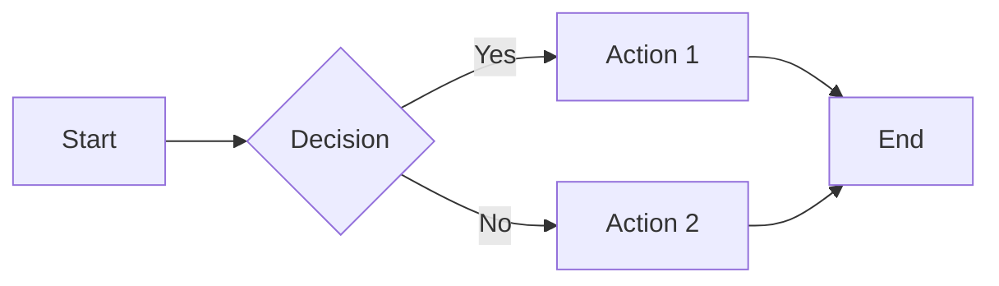

# MechCrate Documentation Compiler

## Overview

The `mx docs` command is a **portable** Markdown to PDF/HTML compiler with automatic Mermaid diagram rendering.

**Key Feature: Just works with Node.js** - no system dependencies required. PDF generation is enhanced if Pandoc/LaTeX are available, but you'll always get HTML output.

## Quick Start

```bash
# Compile a single file
mx docs README.md

# Compile all files in a folder
mx docs ./my-docs/

# Compile all unyform.ai documents
mx docs --all
```

---

## Installation

### Required

| Tool | Installation |
|------|--------------|
| **Node.js 18+** | `brew install node` |

That's it! Everything else is optional.

### Optional (for PDF output)

| Tool | Installation | Notes |
|------|--------------|-------|
| **Pandoc** | `brew install pandoc` | Enables PDF generation |
| **XeLaTeX** | `brew install --cask mactex-no-gui` | Best PDF quality |
| **WeasyPrint** | `pip install weasyprint` | Alternative PDF engine |

Without Pandoc/LaTeX, you'll get HTML output (which is still great for viewing and printing).

### First Run

On first use, npm dependencies are auto-installed:

```bash
mx docs --help
# Installing documentation dependencies (first run)...
# ✅ Dependencies installed
```

---

## Usage

### Command Syntax

```
mx docs <input> [options]
mx docs --all [options]
mx docs --doc=<name> [options]
mx docs --list
```

### Arguments

| Argument | Description |
|----------|-------------|
| `<input>` | Path to a markdown file (`.md`) or directory |

### Options

| Option | Description |
|--------|-------------|
| `-o, --output <path>` | Output directory |
| `--title <title>` | Document title |
| `--subtitle <subtitle>` | Document subtitle |
| `--author <author>` | Document author (default: unyform.ai) |
| `--prefix <string>` | Add prefix to output filenames |
| `--theme <theme>` | Mermaid theme: dark, light, forest, neutral |
| `--order <files>` | Comma-separated file order for directories |
| `--markdown-only` | Only generate processed markdown |
| `--html-only` | Only generate HTML (skip PDF attempt) |
| `--no-toc` | Disable table of contents |
| `--no-numbers` | Disable section numbering |
| `--no-recursive` | Don't scan subdirectories |
| `-v, --verbose` | Show detailed progress |
| `-h, --help` | Show help |

### unyform.ai Options

| Option | Description |
|--------|-------------|
| `--all` | Compile all predefined unyform.ai documents |
| `--doc=<name>` | Compile a specific unyform document |
| `--list` | List all available unyform documents |

---

## Examples

### Single File

```bash
# Basic usage
mx docs README.md

# Custom output directory
mx docs docs/spec.md -o artifacts/

# With title and author
mx docs guide.md --title "User Guide" --author "Engineering Team"

# HTML only (no PDF attempt)
mx docs spec.md --html-only
```

### Folder

```bash
# Compile all .md files in a folder
mx docs ./documentation/

# Custom output with prefix
mx docs ./specs/ -o ./pdfs/ --prefix=v2

# Control file order
mx docs ./api/ --order="intro.md,endpoints.md,errors.md"

# Skip subdirectories
mx docs ./docs/ --no-recursive
```

### unyform.ai Documents

```bash
# List available documents
mx docs --list

# Compile all unyform documents
mx docs --all

# Compile specific document
mx docs --doc=whitepaper
mx docs --doc=executive-summary
mx docs --doc=mvp-prd
mx docs --doc=roadmap
mx docs --doc=pitch-deck
mx docs --doc=gtm-playbook
mx docs --doc=tech-architecture
mx docs --doc=pricing-strategy
mx docs --doc=competitive-analysis
```

---

## Output Structure

The compiler generates multiple formats for maximum compatibility:

```
artifacts/<name>/
├── <name>.pdf       # PDF (if pandoc available)
├── <name>.html      # HTML version (always generated)
├── <name>.md        # Processed markdown
├── mermaid-config.json
└── diagrams/
    ├── diagram-1.png
    ├── diagram-1.mmd
    └── ...
```

### Output Priority

1. **HTML** - Always generated, works everywhere
2. **Markdown** - Processed with diagram references
3. **PDF** - Generated if pandoc is available

---

## Frontmatter

Documents can include YAML frontmatter for metadata:

```yaml
---
title: My Document Title
subtitle: Optional Subtitle
author: Author Name
toc: true
date: January 2025
---

# Content starts here...
```

### Supported Fields

| Field | Type | Description |
|-------|------|-------------|
| `title` | string | Document title |
| `subtitle` | string | Document subtitle |
| `author` | string | Author name(s) |
| `toc` | boolean | Include table of contents (default: true) |
| `date` | string | Document date (default: current date) |

### Auto-Detection

If frontmatter is not provided:
- **Title**: Extracted from first H1 heading, or generated from filename
- **Author**: Uses `--author` option or "unyform.ai"
- **Date**: Current date
- **TOC**: Included by default

---

## Mermaid Diagrams

The compiler automatically renders Mermaid diagrams to PNG images using the npm package `@mermaid-js/mermaid-cli`.

### Supported Diagram Types

- Flowcharts
- Sequence diagrams
- Class diagrams
- State diagrams
- Entity relationship diagrams
- Gantt charts
- Pie charts
- Git graphs
- Journey diagrams

### Example

````markdown

````

### Themes

| Theme | Description |
|-------|-------------|
| `dark` | Dark background with blue/green accents (default) |
| `light` | Light background with blue accents |
| `forest` | Green/forest theme |
| `neutral` | Grayscale theme |

```bash
mx docs spec.md --theme=light
```

### Rendering

- **Parallel**: Diagrams render in parallel using all CPU cores
- **Resolution**: 1400px width, 2x scale for crisp output
- **Background**: Transparent (blends with document)

---

## PDF Generation

PDF generation uses a fallback strategy for maximum compatibility:

### Priority Order

1. **XeLaTeX** (best quality)
   - Professional typography
   - Full Unicode support
   - Custom fonts
   
2. **WeasyPrint** (good quality)
   - CSS-based styling
   - No LaTeX required
   
3. **Basic Pandoc** (basic quality)
   - Works with just pandoc
   - Minimal styling

### Without Pandoc

If Pandoc is not installed, you'll see:

```
⚠️  Pandoc not found - skipping PDF generation
💡 Install with: brew install pandoc
📄 HTML version available at: document.html
```

The HTML output is fully styled and printable - you can always "Print to PDF" from a browser.

---

## Make Targets

```bash
# Compile all unyform documents
make docs

# Install dependencies only
make docs-deps

# List available documents
make docs-list

# Compile a folder
make docs-folder DOCS_FOLDER=./my-docs/

# Compile a single file
make docs-file DOCS_FILE=./README.md

# Clean artifacts
make docs-clean

# Show help
make docs-help
```

### Make Variables

| Variable | Description |
|----------|-------------|
| `DOCS_FOLDER` | Input folder path |
| `DOCS_FILE` | Input file path |
| `DOCS_OUTPUT` | Output directory |
| `DOCS_PREFIX` | Filename prefix |
| `DOCS_AUTHOR` | Default author |

---

## Styling

### Brand Colors

| Color | Hex | Usage |
|-------|-----|-------|
| Primary | `#2563eb` | Headings, links |
| Accent | `#10b981` | Highlights |
| Dark | `#0f172a` | Body text |
| Gray | `#64748b` | Secondary text |
| Light | `#f1f5f9` | Backgrounds |

### HTML Output

The HTML output includes embedded styles with:
- Responsive design
- Print-friendly layout
- Syntax highlighting
- Professional typography
- Styled tables and code blocks

---

## Troubleshooting

### "Installing dependencies" takes too long

First run installs `@mermaid-js/mermaid-cli` which is ~50MB. Subsequent runs are instant.

### Diagrams not rendering

Check that the Mermaid syntax is valid:

```bash
# Test with verbose mode
mx docs spec.md -v
```

### PDF not generated

This is normal if Pandoc isn't installed:

```bash
# Check for pandoc
which pandoc

# Install if missing
brew install pandoc

# For best quality, also install LaTeX
brew install --cask mactex-no-gui
```

### Fonts look wrong in PDF

Install LaTeX for better font support:

```bash
brew install --cask mactex-no-gui
```

---

## Comparison with System Dependencies

| Aspect | This Tool | Traditional |
|--------|-----------|-------------|
| **Required** | Node.js only | Pandoc, LaTeX |
| **Install size** | ~100MB (npm) | 2-4GB (LaTeX) |
| **First run** | ~30 seconds | Minutes |
| **PDF output** | Optional | Required |
| **HTML output** | Always | Varies |
| **Diagrams** | Auto-rendered | Manual |
| **Portability** | High | Low |

---

## Integration

### CI/CD Pipeline

```yaml
# GitHub Actions example
- name: Setup Node
  uses: actions/setup-node@v4
  with:
    node-version: '20'
    
- name: Generate Documentation
  run: |
    cd scripts/docs && npm install
    npx tsx compile.ts --all
    
- name: Upload HTML
  uses: actions/upload-artifact@v3
  with:
    name: documentation
    path: artifacts/unyform/*.html
```

### No Pandoc in CI

The tool works without Pandoc - you'll get HTML output which is often better for web hosting anyway.

---

## API Reference

### Direct Usage

```bash
cd scripts/docs
npx tsx compile.ts <input> [options]
```

### Available Scripts

```bash
npm run compile -- ./doc.md        # Compile file
npm run compile:all                # All unyform docs
npm run markdown -- ./doc.md       # Markdown only
npm run html -- ./doc.md           # HTML only
```

---

## Related Commands

| Command | Description |
|---------|-------------|
| `mx help` | Show all MechCrate commands |
| `mx doctor` | Check system health |
| `mx mcp` | MCP server for LLM integration |

---

## Changelog

### v2.0.0 (January 2025)

- **Portable**: Only requires Node.js
- **Graceful fallback**: Works without Pandoc/LaTeX
- **Always outputs HTML**: Guaranteed viewable output
- **Parallel rendering**: Uses all CPU cores for diagrams
- **Improved styling**: Better HTML and PDF output
- **Folder support**: Compile entire directories
- **Frontmatter**: YAML metadata support
