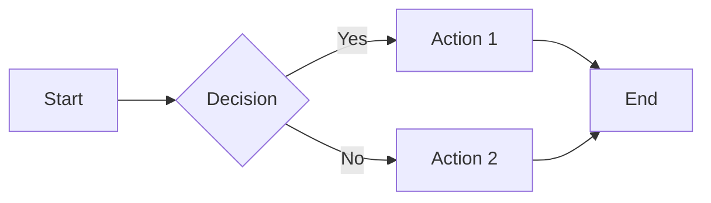

# MechCrate Documentation Compiler

## Overview

The `mx docs` command converts Markdown files to professional PDF documents with automatic Mermaid diagram rendering, YAML frontmatter support, and LaTeX-based typesetting.

## Quick Start

```bash
# Compile a single file
mx docs README.md

# Compile all files in a folder
mx docs ./my-docs/

# Compile all unyform.ai documents
mx docs --unyform
```

---

## Installation

### Dependencies

The docs command requires the following tools:

| Tool | Required | Installation |
|------|----------|--------------|
| **Node.js 18+** | Yes | `brew install node` |
| **npm** | Yes | Included with Node.js |
| **Pandoc** | Yes | `brew install pandoc` |
| **XeLaTeX** | Recommended | `brew install --cask mactex-no-gui` |

### Check Dependencies

```bash
# Verify all dependencies are installed
make docs-check

# Or manually check
pandoc --version
xelatex --version
node --version
```

### First Run

On first use, the command will automatically install its npm dependencies:

```bash
mx docs --help
# Installing documentation dependencies...
# ✅ Dependencies installed
```

---

## Usage

### Command Syntax

```
mx docs <input> [options]
mx docs --unyform [options]
mx docs --doc=<name> [options]
mx docs --list
```

### Arguments

| Argument | Description |
|----------|-------------|
| `<input>` | Path to a markdown file (`.md`) or directory containing markdown files |

### Options

| Option | Description |
|--------|-------------|
| `-o, --output <path>` | Output directory for generated PDFs |
| `--prefix <string>` | Add prefix to all output filenames |
| `--author <string>` | Default author for documents without frontmatter |
| `--markdown-only` | Output processed markdown instead of PDF |
| `--no-recursive` | Don't scan subdirectories (for folder input) |
| `-v, --verbose` | Show detailed progress information |
| `-h, --help` | Show help message |

### unyform.ai Options

| Option | Description |
|--------|-------------|
| `--unyform` | Compile all predefined unyform.ai documents |
| `--doc=<name>` | Compile a specific unyform document |
| `--list` | List all available unyform documents |

---

## Examples

### Single File Compilation

```bash
# Basic usage - outputs to ./output/readme.pdf
mx docs README.md

# Custom output directory
mx docs docs/spec.md -o artifacts/

# With verbose output
mx docs whitepaper.md -v
```

### Folder Compilation

```bash
# Compile all .md files in a folder
mx docs ./documentation/

# With custom output directory
mx docs ./specs/ -o ./pdfs/

# Add prefix to all output files
mx docs ./api-docs/ --prefix=api

# Skip subdirectories
mx docs ./docs/ --no-recursive

# Set default author for docs without frontmatter
mx docs ./guides/ --author="Engineering Team"
```

### unyform.ai Documents

```bash
# List available unyform documents
mx docs --list

# Compile all unyform documents
mx docs --unyform

# Compile specific document
mx docs --doc=whitepaper
mx docs --doc=executive-summary
mx docs --doc=mvp-prd
mx docs --doc=roadmap
mx docs --doc=pitch-deck
mx docs --doc=gtm-playbook
mx docs --doc=tech-architecture
mx docs --doc=pricing-strategy
mx docs --doc=competitive-analysis
```

### Combined Options

```bash
# Folder with all options
mx docs ./specs/ \
  -o ./artifacts/specs/ \
  --prefix=v2 \
  --author="Product Team" \
  -v

# unyform docs to custom location
mx docs --unyform -o ./investor-package/
```

---

## Frontmatter

Documents can include YAML frontmatter at the beginning for metadata. The compiler will extract this information and use it for PDF generation.

### Supported Fields

| Field | Type | Description |
|-------|------|-------------|
| `title` | string | Document title (displayed on title page) |
| `subtitle` | string | Document subtitle |
| `author` | string | Author name(s) |
| `toc` | boolean | Include table of contents (default: true) |
| `date` | string | Document date (default: current date) |
| `abstract` | string | Brief description/abstract |

### Example Frontmatter

```yaml
---
title: API Specification
subtitle: REST API Documentation v2.0
author: Engineering Team
toc: true
date: January 2025
abstract: Complete API reference for the Widget Service
---

# Introduction

This document describes...
```

### Auto-Generated Metadata

If frontmatter is not provided, the compiler will:

1. **Title**: Generate from filename (e.g., `my-spec.md` → "My Spec")
2. **Author**: Use `--author` option or "Document Author"
3. **Date**: Use current date
4. **TOC**: Include by default

---

## Mermaid Diagrams

The compiler automatically renders Mermaid diagrams to high-resolution PNG images.

### Supported Diagram Types

- Flowcharts
- Sequence diagrams
- Class diagrams
- State diagrams
- Entity relationship diagrams
- Gantt charts
- Pie charts
- Git graphs
- Journey diagrams

### Example

````markdown

````

### Diagram Output

Diagrams are rendered with:
- **Theme**: Dark (optimized for professional documents)
- **Background**: Transparent
- **Width**: 1200px
- **Format**: PNG

The rendered images are stored in a `diagrams/` subdirectory of the output folder.

---

## Output Structure

### Single File

```
input:  ./docs/spec.md
output: ./docs/output/
        ├── spec.pdf
        └── diagrams/
            └── spec/
                ├── diagram-0.png
                └── diagram-1.png
```

### Folder

```
input:  ./documentation/
output: ./documentation/output/
        ├── readme.pdf
        ├── api.pdf
        ├── deployment.pdf
        └── diagrams/
            ├── readme/
            ├── api/
            └── deployment/
```

### With Prefix

```bash
mx docs ./specs/ --prefix=v2

output: ./specs/output/
        ├── v2-spec-one.pdf
        ├── v2-spec-two.pdf
        └── diagrams/
```

---

## Make Targets

The docs command is also available through Make targets:

### Basic Targets

```bash
# Compile all unyform documents
make docs

# Install dependencies only
make docs-deps

# List available documents
make docs-list

# Clean all artifacts
make docs-clean

# Check dependencies
make docs-check

# Show help
make docs-help
```

### Folder Compilation

```bash
# Compile a folder (DOCS_FOLDER required)
make docs-folder DOCS_FOLDER=./my-docs/

# With options
make docs-folder \
  DOCS_FOLDER=./specs/ \
  DOCS_OUTPUT=./pdfs/ \
  DOCS_PREFIX=v2 \
  DOCS_AUTHOR="My Team"
```

### Single File Compilation

```bash
# Compile a single file (DOCS_FILE required)
make docs-file DOCS_FILE=./README.md

# With custom output
make docs-file DOCS_FILE=./spec.md DOCS_OUTPUT=./artifacts/
```

### Individual unyform Documents

```bash
make docs-whitepaper
make docs-executive
make docs-roadmap
make docs-prd
make docs-pitch
make docs-gtm
make docs-architecture
make docs-pricing
make docs-competitive
```

---

## PDF Styling

The compiler uses a custom LaTeX template with professional styling:

### Brand Colors

| Color | Hex | Usage |
|-------|-----|-------|
| Primary | `#2563EB` | Headings, links |
| Accent | `#10B981` | Code strings, highlights |
| Dark | `#0F172A` | Body text |
| Gray | `#64748B` | Secondary text |
| Light | `#F1F5F9` | Backgrounds |

### Typography

- **Main Font**: Helvetica Neue (or system default)
- **Code Font**: Menlo (monospace)
- **Heading Scale**: Chapter → Section → Subsection

### Features

- Professional title page with logo placeholder
- Running headers with document title
- Page numbers in footer
- Syntax-highlighted code blocks
- Styled tables with borders
- Automatic table of contents
- Cross-references and hyperlinks

---

## Configuration

### Template Location

The LaTeX template is located at:
```
mech-crate/scripts/docs/template.latex
```

### Customizing the Template

You can modify the template to:

1. Change brand colors
2. Add custom fonts
3. Modify header/footer layout
4. Add watermarks
5. Include custom packages

### Environment Variables

| Variable | Description |
|----------|-------------|
| `MARKDOWN_ONLY` | Set to `1` to skip PDF generation |

---

## Troubleshooting

### Common Issues

#### "Pandoc not found"

```bash
# Install Pandoc
brew install pandoc
```

#### "xelatex not found"

```bash
# Install MacTeX (minimal)
brew install --cask mactex-no-gui

# Or full MacTeX
brew install --cask mactex
```

#### "Mermaid diagram failed to render"

The compiler will keep the original code block if rendering fails. Check:
- Mermaid syntax is valid
- Node.js is installed correctly
- Run with `-v` for detailed errors

#### "PDF generation failed"

Run with verbose mode to see the Pandoc error:
```bash
mx docs ./doc.md -v
```

Common causes:
- Invalid LaTeX characters in content
- Missing fonts
- Corrupted template

### Debug Mode

```bash
# Generate processed markdown only (skip PDF)
mx docs ./doc.md --markdown-only

# Check the processed markdown for issues
cat ./output/doc.md
```

### Clean Build

```bash
# Remove all artifacts and rebuild
make docs-clean
make docs
```

---

## Integration

### CI/CD Pipeline

```yaml
# GitHub Actions example
- name: Generate Documentation
  run: |
    npm install -g @mermaid-js/mermaid-cli
    brew install pandoc
    make docs-folder DOCS_FOLDER=./docs/ DOCS_OUTPUT=./artifacts/
    
- name: Upload PDFs
  uses: actions/upload-artifact@v3
  with:
    name: documentation
    path: artifacts/*.pdf
```

### Pre-commit Hook

```bash
#!/bin/bash
# .git/hooks/pre-commit

# Regenerate docs if any .md files changed
if git diff --cached --name-only | grep -q '\.md$'; then
  make docs
  git add artifacts/*.pdf
fi
```

---

## File Discovery

When processing a folder, the compiler:

1. **Scans** the directory for `.md` files
2. **Recurses** into subdirectories (unless `--no-recursive`)
3. **Skips** common non-doc directories:
   - `node_modules`
   - `.git`
   - `dist`
   - `build`
   - `coverage`
4. **Sorts** files alphabetically

### Controlling Order

Files are processed in alphabetical order. To control the order in the combined output, prefix files with numbers:

```
docs/
├── 01-introduction.md
├── 02-getting-started.md
├── 03-api-reference.md
└── 04-deployment.md
```

---

## API Reference

### TypeScript Compiler

The underlying compiler is a TypeScript application:

```bash
# Direct usage
cd scripts/docs
npx tsx compile.ts --help

# Available arguments
npx tsx compile.ts --all              # All unyform docs
npx tsx compile.ts --doc=<name>       # Specific doc
npx tsx compile.ts --folder=<path>    # Folder
npx tsx compile.ts --file=<path>      # Single file
npx tsx compile.ts --output=<path>    # Output dir
npx tsx compile.ts --prefix=<string>  # Filename prefix
npx tsx compile.ts --author=<string>  # Default author
npx tsx compile.ts --no-recursive     # Skip subdirs
npx tsx compile.ts --markdown-only    # Skip PDF
npx tsx compile.ts --verbose          # Detailed output
npx tsx compile.ts --list             # List docs
```

### Programmatic Usage

```typescript
// Import the compiler (if needed for custom tooling)
import { compileFile, findMarkdownFiles } from './compile';

// Find all markdown files
const files = findMarkdownFiles('./docs', true);

// Compile a single file
await compileFile('./doc.md', './output', {
  markdownOnly: false,
  prefix: 'v2',
  defaultAuthor: 'My Team',
  verbose: true,
});
```

---

## Related Commands

| Command | Description |
|---------|-------------|
| `mx help` | Show all MechCrate commands |
| `mx doctor` | Check system health |
| `mx mcp` | MCP server for LLM integration |

---

## Changelog

### v1.0.0 (January 2025)

- Initial release
- Single file and folder compilation
- YAML frontmatter support
- Mermaid diagram rendering
- Professional LaTeX template
- unyform.ai document presets
- Make target integration
