# unyform.ai Analytics & Leadership Dashboard

## The Hub Model

**Version:** 1.0  
**Date:** January 2025  
**Status:** Draft

---

## Executive Summary

unyform.ai positions itself as the **central nervous system** for AI-assisted development—the single integration point through which all AI code generation flows. This creates a unique opportunity: **the only place in the enterprise that knows exactly how much code is AI-generated, by whom, and whether it conforms to standards.**

This document defines the analytics and metrics that matter to leadership, with a focus on minimizing friction for individual developers while maximizing visibility for engineering leaders.

---

## 1. The Hub Integration Model

### 1.1 Core Principle: Maximum Insight, Minimum Friction

**The Rippling Model for AI Development**

unyform.ai follows the same pattern that made Rippling successful for HR: **one integration point for admins, zero friction for end users**.

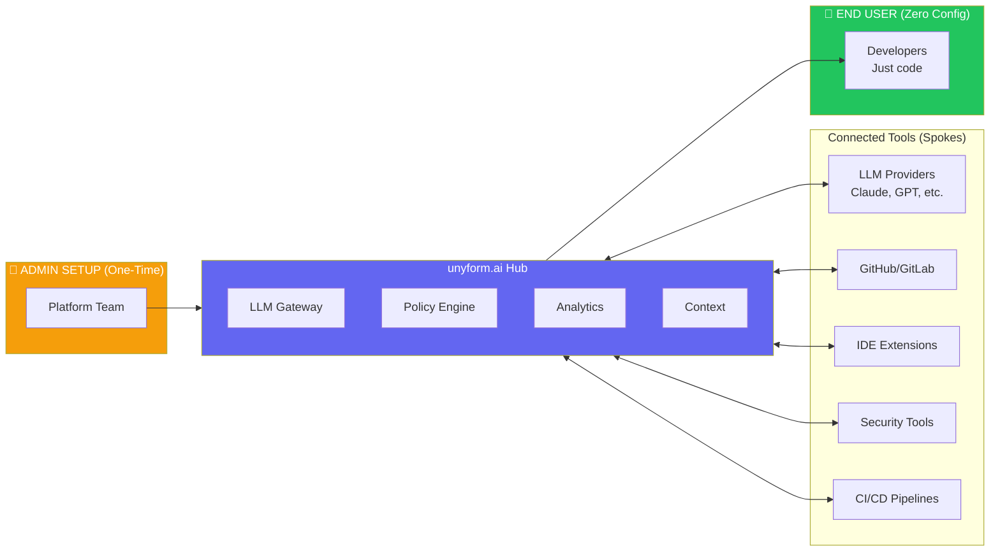
```mermaid
flowchart LR
    subgraph admin ["🔧 ADMIN SETUP (One-Time)"]
        PLAT[Platform Team]
    end
    
    subgraph hub ["unyform.ai Hub"]
        GW[LLM Gateway]
        PE[Policy Engine]
        AE[Analytics]
        CTX[Context]
    end
    
    subgraph spokes ["Connected Tools (Spokes)"]
        direction TB
        LLM[LLM Providers<br/>Claude, GPT, etc.]
        GH[GitHub/GitLab]
        IDE[IDE Extensions]
        SEC[Security Tools]
        CICD[CI/CD Pipelines]
    end
    
    subgraph users ["👤 END USER (Zero Config)"]
        DEV[Developers<br/>Just code]
    end
    
    PLAT --> hub
    hub <--> LLM
    hub <--> GH
    hub <--> IDE
    hub <--> SEC
    hub <--> CICD
    hub --> DEV
    
    style hub fill:#6366f1,color:#fff
    style admin fill:#f59e0b,color:#fff
    style users fill:#22c55e,color:#fff
```

| Who | What They Do | New Tools |
|-----|--------------|-----------|
| **Platform Team** | Configure hub once, connect to existing tools | Admin console |
| **Developers** | Nothing — same IDE, same workflow | **Zero** |

> **"One integration, branches out to every tool they already use."**

### 1.2 Integration Philosophy

| Stakeholder | What They See | What They Configure | New Tools |
|-------------|---------------|---------------------|-----------|
| **IC Developer** | Same IDE, faster suggestions | Nothing | **Zero** |
| **Team Lead** | Team metrics dashboard | Team-level policies | Dashboard (optional) |
| **Platform Engineer** | Full configuration | Gateway, policies, connectors | Admin console |
| **Security** | Compliance reports | Security policies | Dashboard |
| **Engineering VP** | Executive dashboard | Nothing (read-only) | Dashboard |
| **CTO/CFO** | ROI metrics | Nothing (read-only) | Dashboard |

**Key Insight:** Developers install a lightweight client (extension/CLI), sign in, and keep their existing workflow. No new tools to learn, no configuration required. Their AI requests route through unyform automatically. Leadership gets visibility without creating developer friction.

---

## 2. Core Metrics Framework

### 2.1 The Five Pillars of AI Engineering Metrics

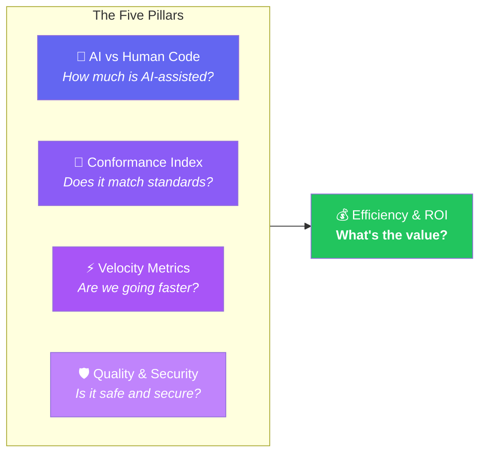
```mermaid
flowchart LR
    subgraph pillars ["The Five Pillars"]
        direction LR
        P1["🤖 AI vs Human Code<br/><i>How much is AI-assisted?</i>"]
        P2["📏 Conformance Index<br/><i>Does it match standards?</i>"]
        P3["⚡ Velocity Metrics<br/><i>Are we going faster?</i>"]
        P4["🛡️ Quality & Security<br/><i>Is it safe and secure?</i>"]
    end
    
    pillars --> ROI["💰 Efficiency & ROI<br/><b>What's the value?</b>"]
    
    style P1 fill:#6366f1,color:#fff
    style P2 fill:#8b5cf6,color:#fff
    style P3 fill:#a855f7,color:#fff
    style P4 fill:#c084fc,color:#fff
    style ROI fill:#22c55e,color:#fff
```

---

## 3. AI vs Human Code Analytics

### 3.1 Why This Is The Main Metric

This metric answers the question every engineering leader is asking:

> **"How much of our code is AI-generated, and is that a good thing?"**

Without unyform, organizations have **no visibility** into this. Code enters the codebase through PRs, but there's no attribution of whether it was human-written, AI-suggested, AI-modified, or AI-generated.

**unyform.ai is the only system that knows.**

### 3.2 Code Origin Classification

| Classification | Definition | Example |
|----------------|------------|---------|
| **Human-Only** | Written entirely by developer, no AI assistance | Manual coding |
| **AI-Assisted** | Human-initiated, AI provided suggestions that were modified | Copilot completion, edited |
| **AI-Generated** | Primarily generated by AI, human approved | Chat response, accepted |
| **AI-Modified** | Human code, AI rewrote for conformance | Style reformatting |

### 3.3 Metrics by Dimension

#### By Developer

**Example: Sarah Chen (Platform Engineering)**

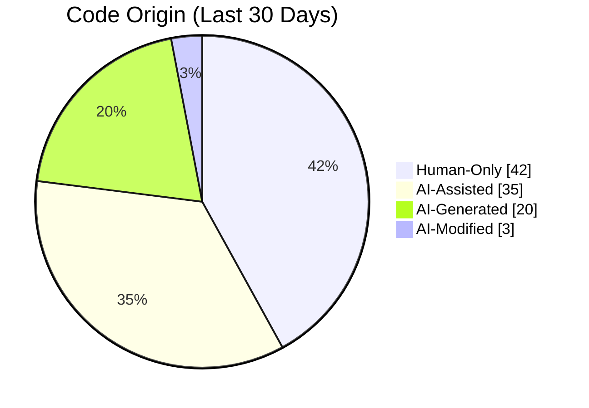
```mermaid
pie showData title Code Origin (Last 30 Days)
    "Human-Only" : 42
    "AI-Assisted" : 35
    "AI-Generated" : 20
    "AI-Modified" : 3
```

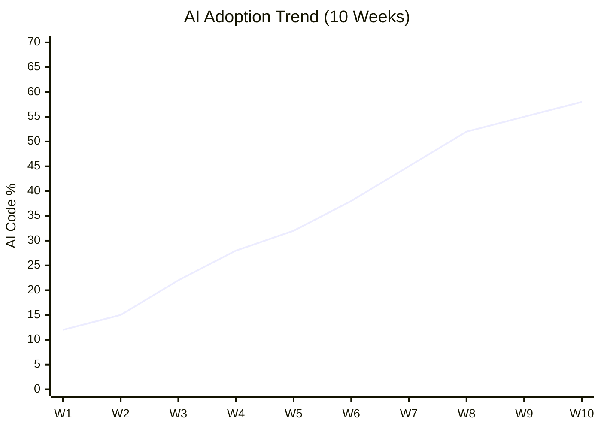
```mermaid
xychart-beta
    title "AI Adoption Trend (10 Weeks)"
    x-axis [W1, W2, W3, W4, W5, W6, W7, W8, W9, W10]
    y-axis "AI Code %" 0 --> 70
    line [12, 15, 22, 28, 32, 38, 45, 52, 55, 58]
```

**Developer Insights:**
| Metric | Value | Status |
|--------|-------|--------|
| AI Adoption | 55% | ↑ +15% from last month |
| Acceptance Rate | 78% | Above team average |
| Conformance Score | 94% | Excellent |

#### By Team

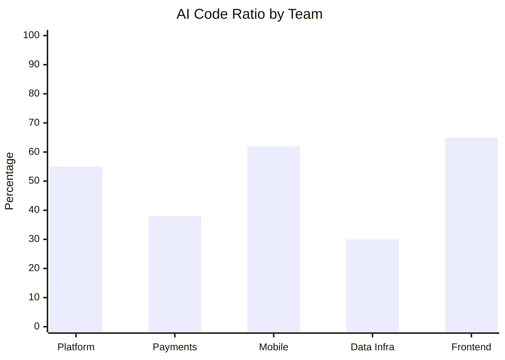
```mermaid
xychart-beta
    title "AI Code Ratio by Team"
    x-axis ["Platform", "Payments", "Mobile", "Data Infra", "Frontend"]
    y-axis "Percentage" 0 --> 100
    bar [55, 38, 62, 30, 65]
```

| Team | Human | AI-Assisted | AI-Generated | Trend |
|------|-------|-------------|--------------|-------|
| Platform Engineering | 45% | 35% | 20% | ↑ +8% |
| Payments | 62% | 28% | 10% | ↑ +3% |
| Mobile | 38% | 42% | 20% | ↑ +12% |
| Data Infrastructure | 70% | 22% | 8% | → +1% |
| Frontend | 35% | 40% | 25% | ↑ +15% |
| **ORG AVERAGE** | **50%** | **33%** | **17%** | **↑ +8%** |

#### By Repository

**Example: `acme/payments-api`**

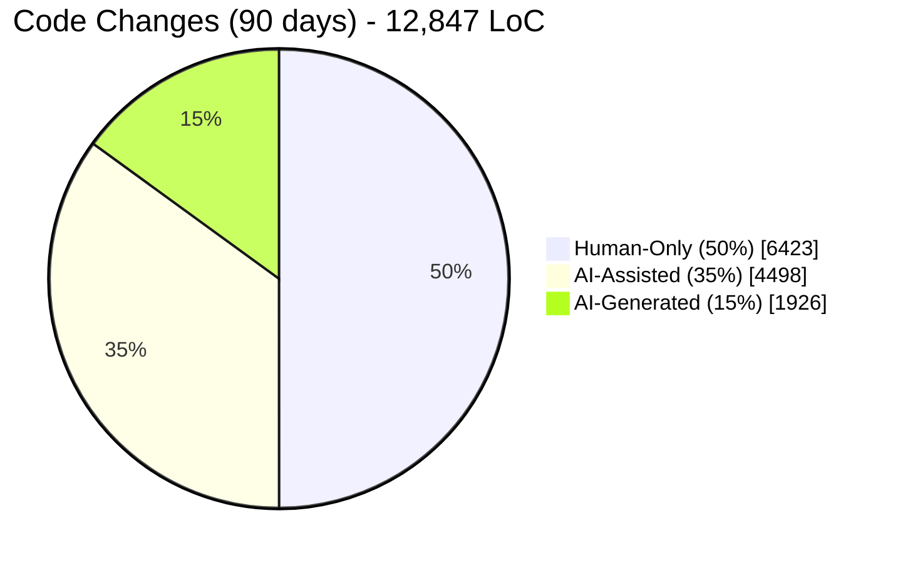
```mermaid
pie showData title Code Changes (90 days) - 12,847 LoC
    "Human-Only (50%)" : 6423
    "AI-Assisted (35%)" : 4498
    "AI-Generated (15%)" : 1926
```

**AI Code by File Type:**

| File Type | AI-Involved | Notes |
|-----------|-------------|-------|
| `.ts` files | 62% | Core application code |
| `.spec.ts` | 78% | Test generation |
| `.yml` configs | 25% | Configuration |
| `.md` docs | 85% | Documentation |

**Risk Assessment:**

| Metric | Coverage |
|--------|----------|
| AI code with security review | 98% |
| AI code with human approval | 100% |
| AI code policy-checked | **100%** |

### 3.4 Executive AI Code Summary

**Organization:** Acme Corp | **Period:** Q4 2025

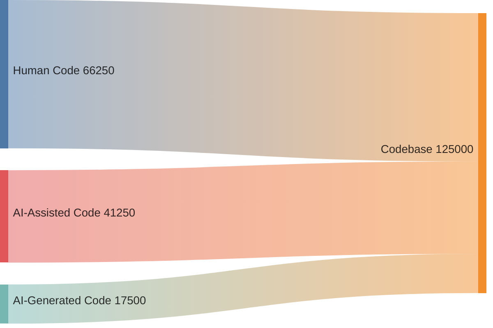
```mermaid
sankey-beta
    Human Code,Codebase,66250
    AI-Assisted Code,Codebase,41250
    AI-Generated Code,Codebase,17500
```

#### Key Metrics

| Metric | Value | Context |
|--------|-------|---------|
| **AI Code Contribution** | 47% | ↑ +12% vs Q3 (industry benchmark: 35%) |
| Total Lines of Code | 125,000 | - |
| AI-Touched Lines | 58,750 | 47% of total |
| Policy Checked | 100% | All AI code |

#### Key Insights

- ✅ **100%** of AI-generated code passed through policy enforcement
- ✅ **847** potential policy violations prevented this quarter
- ✅ **23** secret exposure attempts blocked
- ✅ **74%** AI acceptance rate (above industry benchmark of 60%)

#### Adoption by Seniority

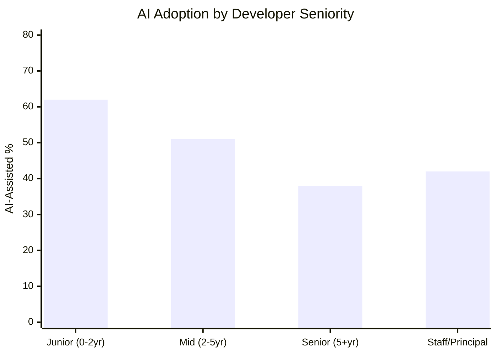
```mermaid
xychart-beta
    title "AI Adoption by Developer Seniority"
    x-axis ["Junior (0-2yr)", "Mid (2-5yr)", "Senior (5+yr)", "Staff/Principal"]
    y-axis "AI-Assisted %" 0 --> 80
    bar [62, 51, 38, 42]
```

> **💡 Recommendation:** Senior developers show opportunity for increased AI adoption. Consider targeted training on advanced AI prompting techniques.

---

## 4. Conformance Index

### 4.1 What Is Conformance?

**Conformance** measures how well code matches organizational standards—regardless of whether it was human or AI-generated.

unyform.ai provides a unique view: **AI code conformance vs Human code conformance**. This answers:

> "Is AI making our codebase more or less consistent?"

### 4.2 Conformance Score Calculation

```
Conformance Score = (1 - (Violations / Checkpoints)) × 100

Where:
- Violations = Rules that failed
- Checkpoints = Total rules evaluated
```

### 4.3 Conformance by Source


```mermaid
xychart-beta
    title "Conformance Score: AI vs Human Code"
    x-axis ["Naming", "Imports", "Error Handling", "Security", "Docs", "OVERALL"]
    y-axis "Score %" 50 --> 100
    bar "AI-Generated" [98, 99, 92, 97, 95, 96]
    bar "Human-Written" [84, 78, 91, 88, 65, 82]
```

| Category | AI-Generated | Human-Written | Δ |
|----------|--------------|---------------|---|
| **Overall Score** | **96%** | **82%** | **+14%** |
| Naming Conventions | 98% | 84% | +14% |
| Import Organization | 99% | 78% | +21% |
| Error Handling | 92% | 91% | +1% |
| Security Patterns | 97% | 88% | +9% |
| Documentation | 95% | 65% | +30% |

> **💡 Insight:** AI-generated code is **14% more conformant** on average. Human code needs improvement in documentation and imports.

### 4.4 Conformance Trend

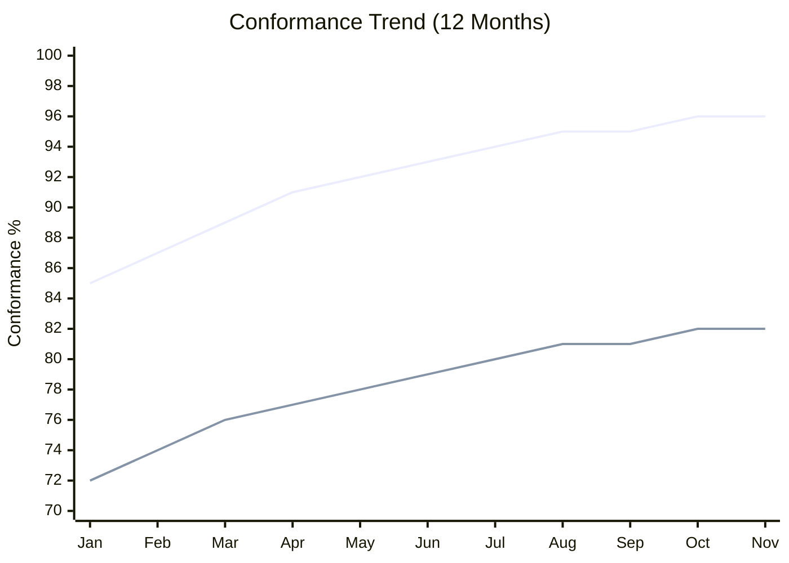
```mermaid
xychart-beta
    title "Conformance Trend (12 Months)"
    x-axis ["Jan", "Feb", "Mar", "Apr", "May", "Jun", "Jul", "Aug", "Sep", "Oct", "Nov"]
    y-axis "Conformance %" 70 --> 100
    line "AI Code" [85, 87, 89, 91, 92, 93, 94, 95, 95, 96, 96]
    line "Human Code" [72, 74, 76, 77, 78, 79, 80, 81, 81, 82, 82]
```

**Gap Analysis:**
- AI code consistently **10-15%** higher conformance
- Human code improving **+8%** over period (training effectiveness)

---

## 5. Velocity Metrics

### 5.1 AI Impact on Development Speed

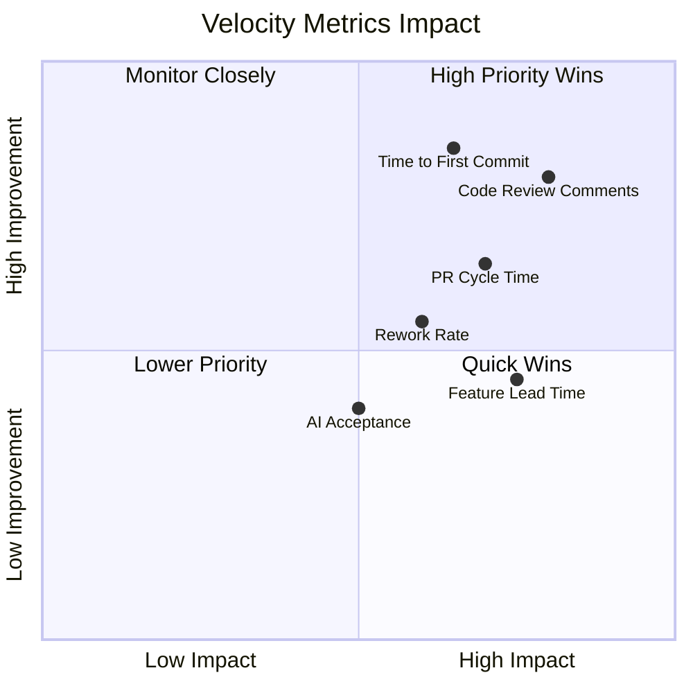
```mermaid
quadrantChart
    title Velocity Metrics Impact
    x-axis Low Impact --> High Impact
    y-axis Low Improvement --> High Improvement
    quadrant-1 High Priority Wins
    quadrant-2 Monitor Closely
    quadrant-3 Lower Priority
    quadrant-4 Quick Wins
    "PR Cycle Time": [0.7, 0.65]
    "Code Review Comments": [0.8, 0.8]
    "Time to First Commit": [0.65, 0.85]
    "Rework Rate": [0.6, 0.55]
    "Feature Lead Time": [0.75, 0.45]
    "AI Acceptance": [0.5, 0.4]
```

| Metric | Current | Change | Baseline |
|--------|---------|--------|----------|
| **PR Cycle Time** | 4.2 hrs | ↓ 35% | 6.5 hrs |
| **AI Acceptance Rate** | 74% | ↑ 8% | 66% |
| **Rework Rate** | 12% | ↓ 28% | 17% |
| **Code Review Comments/PR** | 3.1 | ↓ 42% | 5.3 |
| **Time to First Commit** | 2.4 days | ↓ 45% | 4.4 days |
| **Feature Lead Time** | 8.5 days | ↓ 22% | 10.9 days |

### 5.2 AI Acceptance Rate Deep Dive

**AI Acceptance Rate** = Accepted Suggestions / Total Suggestions

This is a key indicator of:
- How useful AI suggestions are
- How well unyform.ai has learned org patterns
- Developer trust in AI assistance

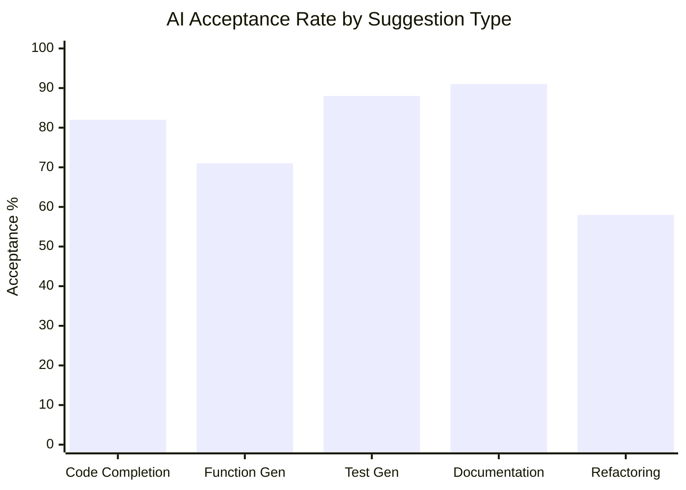
```mermaid
xychart-beta
    title "AI Acceptance Rate by Suggestion Type"
    x-axis ["Code Completion", "Function Gen", "Test Gen", "Documentation", "Refactoring"]
    y-axis "Acceptance %" 0 --> 100
    bar [82, 71, 88, 91, 58]
```

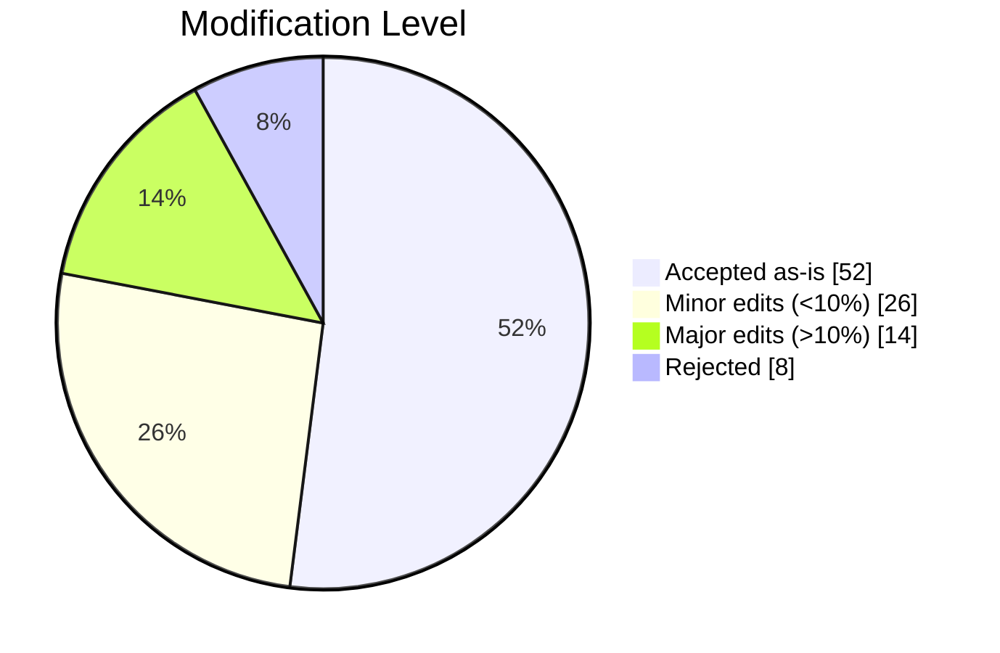
```mermaid
pie showData title Modification Level
    "Accepted as-is" : 52
    "Minor edits (<10%)" : 26
    "Major edits (>10%)" : 14
    "Rejected" : 8
```

**Rejection Reasons (sampled):**

| Reason | % | Action |
|--------|---|--------|
| "Doesn't match our auth pattern" | 34% | Update instruction pack |
| "Wrong library used" | 28% | Add to forbidden list |
| "Logic incorrect" | 22% | Model feedback |
| "Style preference" | 16% | Developer profile update |

> **💡 Action:** Top rejection reasons inform instruction pack updates

---

## 6. Quality & Security Metrics

### 6.1 Policy Enforcement Dashboard

**Policy Enforcement (This Month)**

| Metric | Count |
|--------|-------|
| 📊 Requests Processed | 127,842 |
| ⚠️ Warnings Issued | 4,231 |
| 🛑 Blocked Requests | 847 |
| 🔐 Secrets Prevented | 23 |

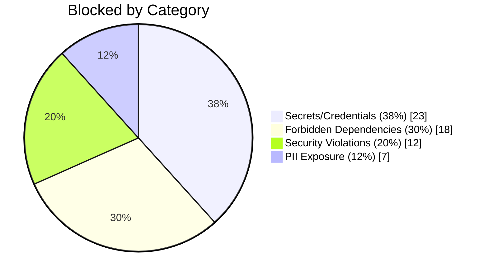
```mermaid
pie showData title Blocked by Category
    "Secrets/Credentials (38%)" : 23
    "Forbidden Dependencies (30%)" : 18
    "Security Violations (20%)" : 12
    "PII Exposure (12%)" : 7
```

**Recent High-Severity Blocks:**

| Timestamp | User | Type | Action | Details |
|-----------|------|------|--------|---------|
| 14:32:17 | dev-1234 | AWS Key | 🛑 BLOCKED | Hardcoded in code |
| 13:15:42 | dev-5678 | eval() usage | 🛑 BLOCKED | Security risk |
| 11:08:33 | dev-9012 | GPL dependency | 🛑 BLOCKED | License violation |
| 09:45:21 | dev-3456 | Unencrypted PII | ⚠️ REDACTED | SSN in logging |

### 6.2 Vulnerability Prevention

**Vulnerabilities Found (Post-Merge, Quarterly)**


```mermaid
xychart-beta
    title "Vulnerabilities: AI Code vs Human Code"
    x-axis ["Critical", "High", "Medium", "Low"]
    y-axis "Count" 0 --> 100
    bar "AI Code" [0, 3, 18, 42]
    bar "Human Code" [2, 12, 47, 89]
```

| Severity | AI Code | Human Code | Difference |
|----------|---------|------------|------------|
| Critical | 0 | 2 | **-100%** |
| High | 3 | 12 | -75% |
| Medium | 18 | 47 | -62% |
| Low | 42 | 89 | -53% |
| **Total** | **63** | **150** | **-58%** |
| Per 1000 LoC | 1.07 | 2.89 | **-63%** |

> **💡 Insight:** AI-generated code (with unyform policy enforcement) has **63% fewer vulnerabilities** per line of code.
> 
> **Key Factor:** Policies prevent vulnerable patterns at generation time, before they enter the codebase.

---

## 7. Efficiency & ROI Metrics

### 7.1 Cost/Benefit Analysis

**Organization:** Acme Corp | **150 Developers** | Q4 2025

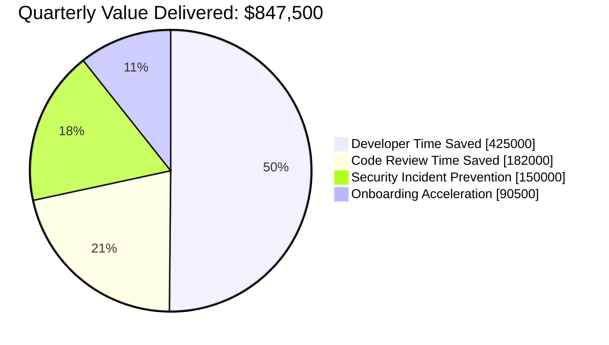
```mermaid
pie showData title Quarterly Value Delivered: $847,500
    "Developer Time Saved" : 425000
    "Code Review Time Saved" : 182000
    "Security Incident Prevention" : 150000
    "Onboarding Acceleration" : 90500
```

#### Key ROI Metrics

| Metric | Value |
|--------|-------|
| **Quarterly Value Delivered** | **$847,500** |
| unyform.ai Cost | $88,200/quarter |
| **ROI** | **9.6x** |

#### Value Breakdown

| Category | Value | Calculation |
|----------|-------|-------------|
| **Developer Time Saved** | $425,000 | 2.8 hrs/dev/week × 150 devs × 13 weeks × $78/hr |
| **Code Review Time Saved** | $182,000 | 42% reduction in review comments, 1.2 hrs/dev/week |
| **Security Incident Prevention** | $150,000 | 23 secrets prevented ($5K ea) + 2 critical vulns ($25K ea) |
| **Onboarding Acceleration** | $90,500 | 12 new devs × $7,500 saved (45% faster) |

#### Cost Detail

| Item | Amount |
|------|--------|
| unyform.ai Enterprise (150 × $49 × 3mo) | $22,050/month |
| Quarterly | $66,150 |
| Professional Services | $22,050 |
| **Total Quarterly Cost** | **$88,200** |

### 7.2 Efficiency Trends

**Before/After unyform.ai**

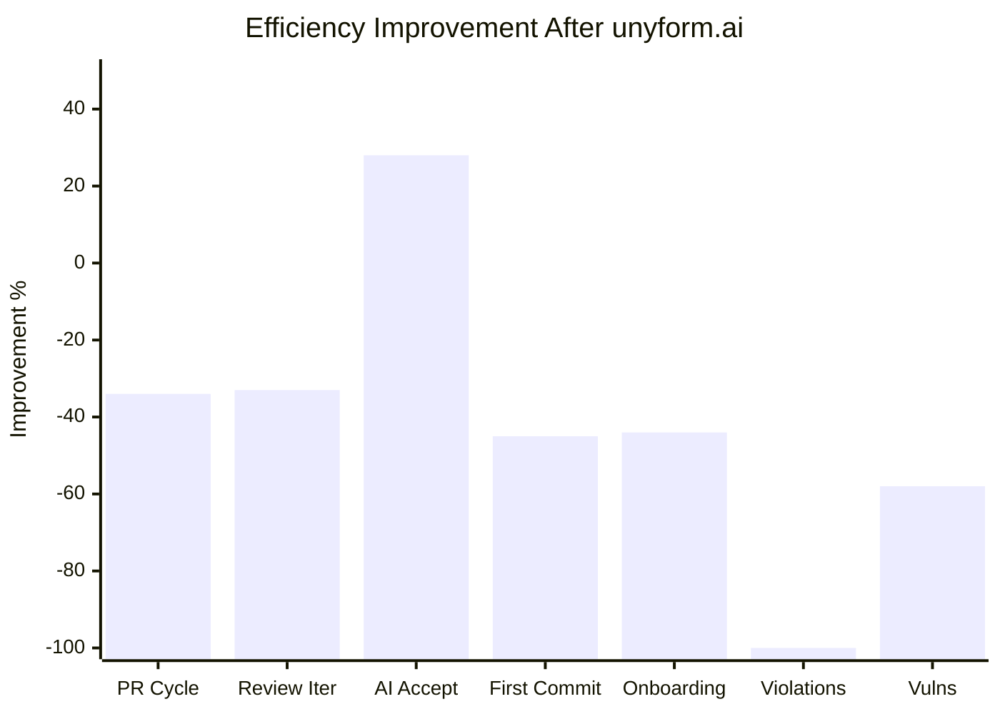
```mermaid
xychart-beta
    title "Efficiency Improvement After unyform.ai"
    x-axis ["PR Cycle", "Review Iter", "AI Accept", "First Commit", "Onboarding", "Violations", "Vulns"]
    y-axis "Improvement %" -100 --> 50
    bar [-34, -33, 28, -45, -44, -100, -58]
```

| Metric | Before | After | Improvement |
|--------|--------|-------|-------------|
| Avg PR cycle time | 6.4 hrs | 4.2 hrs | **-34%** |
| Code review iterations | 2.4 | 1.6 | -33% |
| AI suggestion acceptance | 58% | 74% | **+28%** |
| Time to first commit | 4.4 days | 2.4 days | **-45%** |
| Onboarding (to prod) | 3.2 weeks | 1.8 weeks | -44% |
| Policy violations/month | 47 | 0 | **-100%** |
| Security findings/qtr | 150 | 63 | -58% |

#### Implementation Timeline

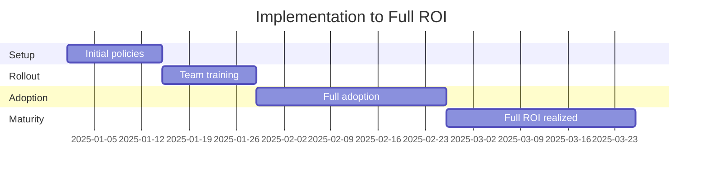
```mermaid
gantt
    title Implementation to Full ROI
    dateFormat YYYY-MM-DD
    section Setup
        Initial policies     :2025-01-01, 14d
    section Rollout
        Team training        :2025-01-15, 14d
    section Adoption
        Full adoption        :2025-01-29, 28d
    section Maturity
        Full ROI realized    :2025-02-26, 28d
```

---

## 8. Dashboard Views by Persona

### 8.1 Executive Dashboard (VP/CTO/CFO)

**Purpose:** High-level health, ROI, risk posture  
**Refresh:** Daily summary, weekly report, monthly deep-dive

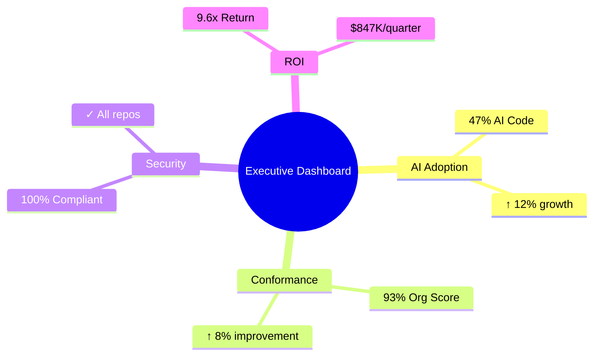
```mermaid
mindmap
  root((Executive Dashboard))
    AI Adoption
      47% AI Code
      ↑ 12% growth
    Conformance
      93% Org Score
      ↑ 8% improvement
    Security
      100% Compliant
      ✓ All repos
    ROI
      9.6x Return
      $847K/quarter
```

**Key Insights:**
- ✅ On track for 50% AI code target by Q1
- ✅ 23 secret exposures prevented (est. $115K saved)
- ⚠️ Mobile team adoption below target (28% vs 40% goal)
- ✅ Zero policy-violating code reached production

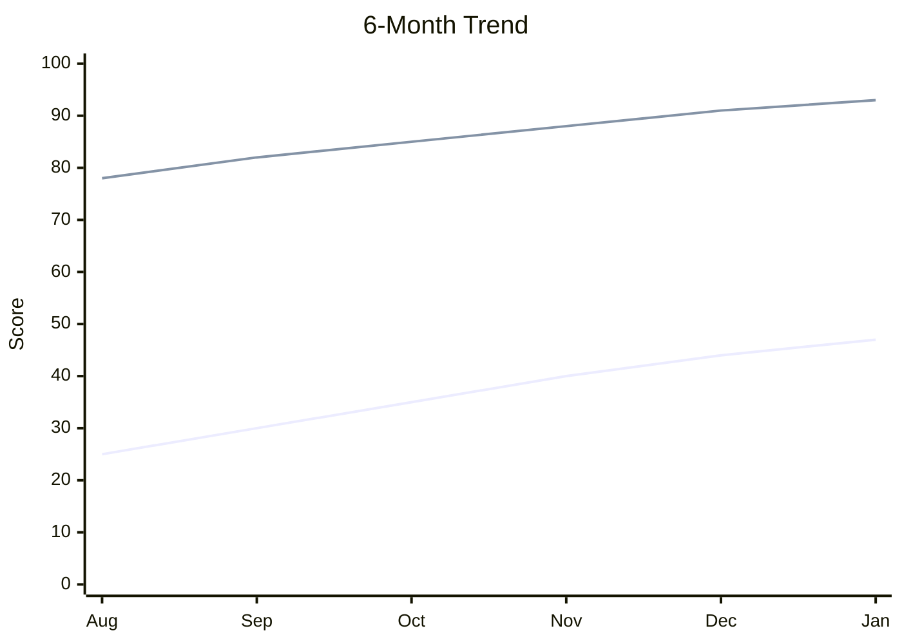
```mermaid
xychart-beta
    title "6-Month Trend"
    x-axis ["Aug", "Sep", "Oct", "Nov", "Dec", "Jan"]
    y-axis "Score" 0 --> 100
    line "AI Adoption" [25, 30, 35, 40, 44, 47]
    line "Conformance" [78, 82, 85, 88, 91, 93]
```

### 8.2 Security Dashboard (CISO/Security Lead)

**Purpose:** Policy enforcement, violations, compliance reporting  
**Refresh:** Real-time alerts, daily summary

| Metric | Value | Context |
|--------|-------|---------|
| 📊 **Requests Checked** | 127,842 | Today |
| 🛑 **Blocked This Week** | 147 | ↓ 12% |
| 🔐 **Secrets Prevented** | 23 | Total |
| ✅ **Compliance Coverage** | 100% | All repos |

```mermaid
flowchart LR
    subgraph events ["Recent Security Events - Today"]
        E1["14:32 - AWS Key blocked"]
        E2["13:15 - eval blocked"]
        E3["11:08 - GPL dep blocked"]
        E4["09:45 - PII redacted"]
    end
    
    E1 --> E2 --> E3 --> E4
    
    style events fill:#ef4444,color:#fff
    style E1 fill:#dc2626,color:#fff
    style E2 fill:#dc2626,color:#fff
    style E3 fill:#dc2626,color:#fff
    style E4 fill:#f59e0b,color:#fff
```

**Compliance Reports Available:**
- 📄 SOC2 Report (auto-generated)
- 📄 Audit Log Export (JSON/CSV)
- 📄 Policy Coverage Report

### 8.3 Team Lead Dashboard

**Purpose:** Team performance, adoption, patterns  
**Refresh:** Daily summary

**Team:** Platform Engineering (12 developers)

| Metric | Value | Context |
|--------|-------|---------|
| 🤖 **AI Adoption** | 55% | ↑ 8% MoM |
| 📏 **Conformance** | 94% | vs 93% org |
| ✅ **Acceptance** | 78% | vs 74% org |
| ⚡ **Velocity** | +35% | PR cycle time |

```mermaid
xychart-beta
    title "Team Member AI Adoption"
    x-axis ["Sarah", "Mike", "James", "Lisa", "Alex"]
    y-axis "AI %" 0 --> 100
    bar [62, 58, 55, 48, 28]
```

**Individual Breakdown:**

| Developer | AI % | Conform | Accept | Status |
|-----------|------|---------|--------|--------|
| Sarah Chen | 62% | 96% | 82% | 🌟 Top performer |
| Mike Johnson | 58% | 94% | 76% | 📈 Improving |
| James Liu | 55% | 93% | 75% | ✅ On track |
| Lisa Park | 48% | 91% | 71% | ✅ On track |
| Alex Wong | 28% | 89% | 54% | ⚠️ Low adoption |

> **💡 Action:** Schedule 1:1 with Alex to address AI tool friction

---

## 9. Integration Architecture for Analytics

### 9.1 Data Collection Points

```mermaid
flowchart LR
    subgraph sources ["Data Sources"]
        GW[LLM Gateway<br/>every request]
        PE[Policy Engine<br/>violations]
        GH[GitHub Webhook<br/>commits, PRs]
        CI[CI/CD<br/>deployments]
    end
    
    subgraph processing ["Processing"]
        AE[Analytics<br/>Engine]
    end
    
    subgraph storage ["Storage"]
        TS[(TimescaleDB<br/>metrics)]
        PG[(PostgreSQL<br/>audit)]
        RD[(Redis<br/>cache)]
    end
    
    GW --> AE
    PE --> AE
    GH --> AE
    CI --> AE
    
    AE --> TS
    AE --> PG
    AE --> RD
    
    style sources fill:#1e1b4b,color:#fff
    style processing fill:#6366f1,color:#fff
    style storage fill:#312e81,color:#fff
```

### 9.2 Event Schema

```json
{
  "event_type": "ai_request",
  "timestamp": "2025-01-15T14:32:17Z",
  "organization_id": "org_12345",
  "team_id": "team_789",
  "user_id": "user_456",
  
  "request": {
    "id": "req_abc123",
    "model": "claude-3.5-sonnet",
    "type": "code_completion",
    "tokens_in": 1250,
    "tokens_out": 890
  },
  
  "code_metrics": {
    "lines_generated": 42,
    "language": "typescript",
    "classification": "ai_assisted",
    "acceptance": "accepted_modified",
    "modification_ratio": 0.08
  },
  
  "policy_metrics": {
    "rules_checked": 15,
    "rules_passed": 15,
    "rules_failed": 0,
    "warnings": ["prefer-internal-logger"],
    "action": "allow"
  },
  
  "conformance_metrics": {
    "score": 0.94,
    "naming": 1.0,
    "imports": 0.9,
    "patterns": 0.92
  },
  
  "context_metrics": {
    "chunks_retrieved": 8,
    "context_relevance": 0.87,
    "instruction_pack": "acme-standards-v2"
  }
}
```

---

## 10. Implementation Roadmap

### 10.1 Phase 1: Core Metrics (Q1 2025)

| Metric | Status | Notes |
|--------|--------|-------|
| Request volume | 🚧 In Progress | Gateway telemetry |
| Policy violations | 🚧 In Progress | Policy engine events |
| Basic AI/Human tracking | Planned | Requires IDE telemetry |
| Conformance score | Planned | Post-generation analysis |

### 10.2 Phase 2: Advanced Analytics (Q2 2025)

| Metric | Status | Notes |
|--------|--------|-------|
| AI acceptance rate | Planned | IDE integration required |
| Modification tracking | Planned | Diff analysis |
| Velocity metrics | Planned | GitHub PR integration |
| Team dashboards | Planned | Web UI development |

### 10.3 Phase 3: Enterprise Analytics (Q3 2025)

| Metric | Status | Notes |
|--------|--------|-------|
| ROI calculator | Planned | Financial modeling |
| Custom reports | Planned | Report builder |
| Executive exports | Planned | PDF/PPT generation |
| Benchmarking | Planned | Cross-org aggregates |

---

## 11. Privacy & Data Governance

### 11.1 What We Collect

| Data Type | Purpose | Stored | Retention |
|-----------|---------|--------|-----------|
| Request metadata | Analytics | Yes | 2 years |
| Code content | Policy check | No* | N/A |
| Code hashes | Deduplication | Yes | 2 years |
| User identifiers | Attribution | Yes | Account lifetime |
| Conformance scores | Quality tracking | Yes | 2 years |

*Code content is processed in memory for policy evaluation but not persisted.

### 11.2 Privacy Controls

- **Aggregation level:** Configurable (individual, team, org)
- **Data export:** Full GDPR compliance, user data export
- **Retention controls:** Configurable per organization
- **Anonymization:** Optional anonymized reporting mode

---

## Appendix: Metric Definitions

| Metric | Definition | Calculation |
|--------|------------|-------------|
| **AI Code Ratio** | % of code with AI involvement | (AI-assisted + AI-generated lines) / Total lines |
| **Acceptance Rate** | % of AI suggestions accepted | Accepted suggestions / Total suggestions |
| **Conformance Score** | Adherence to standards | (1 - violations/checks) × 100 |
| **Policy Pass Rate** | % of requests allowed | Allowed requests / Total requests |
| **Velocity Impact** | Change in development speed | Current metric / Baseline metric |

---

**Document Version:** 1.0  
**Last Updated:** January 2025  
**Contact:** analytics@unyform.ai

---

*The only platform that knows how much of your code is AI—and whether that's a good thing.*
