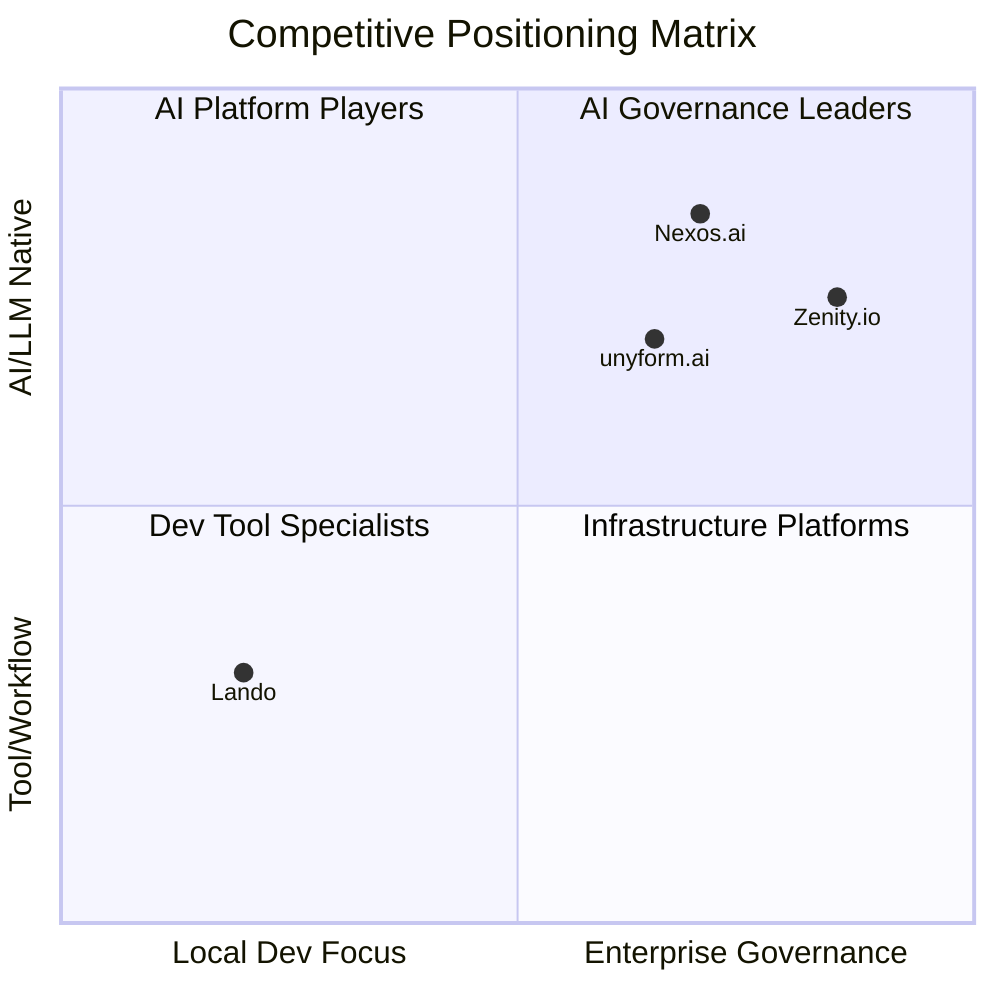

# unyform.ai Competitive Analysis

## Enterprise AI Trust and Consistency Layer

**Version 1.0 | January 2025**

---

## Executive Summary

The enterprise AI infrastructure and governance market is rapidly evolving, with multiple players addressing different aspects of the challenge. This analysis examines three key competitors—**Lando**, **Nexos.ai**, and **Zenity.io**—to identify how unyform.ai can match, surpass, and differentiate itself in the market.

**Key Finding:** No single competitor addresses the full spectrum of enterprise needs—from local development consistency to AI governance to production infrastructure. unyform.ai is uniquely positioned to unify these capabilities into a cohesive platform.

---

## Competitive Landscape Overview



### Market Segments

| Segment | Description | Key Players |
|---------|-------------|-------------|
| **Local Development** | Dev environment setup, workflow automation | Lando, DDEV, Docker Desktop |
| **AI Orchestration** | Multi-model access, centralized AI management | Nexos.ai, Portkey, Helicone |
| **AI Security/Governance** | AI agent security, compliance, risk management | Zenity.io, Robust Intelligence |
| **Developer Platforms** | Service catalogs, templates, scaffolding | Backstage, Port.io |
| **IaC/Infrastructure** | Cloud provisioning, infrastructure management | Terraform, Pulumi |

**unyform.ai sits at the intersection**—combining dev environment consistency, AI governance, and infrastructure scaffolding into a unified enterprise trust layer.

---

## Competitor Deep Dives

---

## 1. Lando

### Overview

**What it is:** An open-source, cross-platform local development environment and DevOps tool built on Docker.

**Website:** https://lando.dev  
**Funding:** Community/Open-source (sponsored by Tandem, Platform.sh partnership)  
**Target Market:** Individual developers, small teams, agencies

### Core Features

| Feature | Description |
|---------|-------------|
| **Local Dev Environments** | Push-button setup for development stacks |
| **Multi-Stack Support** | PHP, Node, Python, Go, Ruby, etc. |
| **Docker Abstraction** | Simplifies Docker Compose complexity |
| **Service Integration** | Database, cache, search services included |
| **SSL/TLS Routing** | Local HTTPS with automatic certs |
| **Recipes** | Pre-built configs for Drupal, WordPress, Laravel, etc. |
| **Tooling Integration** | Drush, WP-CLI, Composer, npm built-in |

### Strengths

1. **Developer Experience**: Extremely easy to get started—single config file spins up complete environment
2. **Open Source**: Free, community-driven, no vendor lock-in
3. **Ecosystem**: Large library of recipes for popular CMS/frameworks
4. **Flexibility**: Can customize underlying Docker configuration
5. **Partnership Network**: Platform.sh, Pantheon, Acquia integrations

### Weaknesses

| Weakness | Impact |
|----------|--------|
| **No Enterprise Governance** | No policy enforcement, audit trails, or compliance features |
| **No AI Integration** | Built before the AI coding era—no LLM context or governance |
| **Local-Only Focus** | Doesn't address production infrastructure or deployment |
| **No Standardization Engine** | Can't enforce org-wide patterns or conventions |
| **Limited Team Features** | No role-based access, team management, or shared configs |
| **No Security Scanning** | No built-in vulnerability detection or secrets management |

### Where Lando Stops

```
Local Development Environment
         ✅ Lando
         ↓
Organizational Standards & Patterns
         ❌ Not addressed
         ↓
AI-Assisted Development Context
         ❌ Not addressed
         ↓
Policy Enforcement & Governance
         ❌ Not addressed
         ↓
Production Infrastructure
         ❌ Not addressed
         ↓
Audit & Compliance
         ❌ Not addressed
```

### unyform.ai vs. Lando

| Capability | Lando | unyform.ai |
|------------|-------|------------|
| Local dev environments | ✅ | ✅ |
| Docker-based scaffolding | ✅ | ✅ |
| Multi-stack recipes | ✅ | ✅ |
| Organization standards | ❌ | ✅ |
| AI/LLM context integration | ❌ | ✅ |
| Policy enforcement | ❌ | ✅ |
| Production infrastructure | ❌ | ✅ |
| Audit trails | ❌ | ✅ |
| Enterprise governance | ❌ | ✅ |
| Team management | ❌ | ✅ |

### How We Beat Lando

1. **Superset of Features**: Everything Lando does + governance + AI context + production
2. **BYOS Adapter**: Allow teams to continue using Lando as a scaffolding adapter if preferred
3. **Migration Path**: Import Lando configs and enhance with unyform.ai governance
4. **Enterprise Value**: Offer what Lando can't—compliance, audit, policy enforcement

### How We Pick Up Where Lando Left Off

Lando solved local development consistency but never addressed:
- **AI-era challenges**: How do you ensure AI assistants understand your dev environment?
- **Organizational scale**: How do you enforce standards across 100+ developers?
- **Full lifecycle**: How do you take consistent environments to production?
- **Compliance requirements**: How do you prove your infrastructure meets standards?

**unyform.ai continues the journey** from local dev → organization standards → AI context → production → compliance.

---

## 2. Nexos.ai

### Overview

**What it is:** An all-in-one AI platform for enterprises providing centralized AI model management, security, observability, and governance.

**Website:** https://nexos.ai  
**Funding:** Seed funding led by Index Ventures (January 2025)  
**Target Market:** Large enterprises with diverse AI model needs

### Core Features

| Feature | Description |
|---------|-------------|
| **AI Gateway** | Single API for 200+ AI models |
| **AI Workspace** | Unified interface for teams to use AI |
| **Model Router** | Intelligent routing to optimal model |
| **Observability** | Full visibility into AI usage and costs |
| **Access Control** | Role-based permissions for AI access |
| **Cost Management** | Budget controls and usage tracking |
| **Security** | Data leak prevention, input/output filtering |
| **No Vendor Lock-in** | Multi-model, multi-provider support |

### Strengths

1. **Comprehensive AI Management**: One platform for all AI model interactions
2. **Security Focus**: Enterprise-grade security with DLP and filtering
3. **Observability**: Complete visibility into who uses what, when, and how much
4. **Model Flexibility**: 200+ models, no single-vendor dependency
5. **Fresh Funding**: Well-capitalized with strong investor backing (Index Ventures)

### Weaknesses

| Weakness | Impact |
|----------|--------|
| **No Dev Workflow Integration** | Doesn't integrate into existing development pipelines |
| **No Infrastructure Scaffolding** | No project templates, Docker configs, or deployment |
| **No Code Consistency** | Doesn't ensure generated code matches org standards |
| **Gateway-Only Model** | Proxy layer—doesn't understand your codebase or patterns |
| **No Recipe/Template System** | Can't codify and reproduce infrastructure patterns |
| **Complexity** | Breadth of features may overwhelm simpler use cases |
| **No Conformance Layer** | Doesn't auto-rewrite output to match standards |

### Where Nexos.ai Stops

```
AI Model Access & Routing
         ✅ Nexos.ai
         ↓
Input/Output Security Filtering
         ✅ Nexos.ai
         ↓
Usage Observability & Cost Control
         ✅ Nexos.ai
         ↓
Understanding Your Codebase/Patterns
         ❌ Not addressed
         ↓
Code Conformance to Standards
         ❌ Not addressed
         ↓
Infrastructure Scaffolding
         ❌ Not addressed
         ↓
Development Workflow Integration
         ❌ Not addressed
```

### unyform.ai vs. Nexos.ai

| Capability | Nexos.ai | unyform.ai |
|------------|----------|------------|
| Multi-model access | ✅ | ✅ |
| AI gateway/proxy | ✅ | ✅ |
| Security filtering | ✅ | ✅ |
| Usage observability | ✅ | ✅ |
| Cost management | ✅ | ✅ |
| **Codebase understanding** | ❌ | ✅ |
| **Code conformance** | ❌ | ✅ |
| **Org pattern learning** | ❌ | ✅ |
| **Infrastructure scaffolding** | ❌ | ✅ |
| **Recipe system** | ❌ | ✅ |
| **Dev workflow integration** | ❌ | ✅ |
| **Conformance rewriting** | ❌ | ✅ |

### How We Beat Nexos.ai

1. **Deeper Context**: We don't just proxy AI—we understand your codebase, patterns, and standards
2. **Output Conformance**: We don't just filter—we rewrite to match your conventions
3. **Full Lifecycle**: We cover dev environments → AI context → production infrastructure
4. **Developer-Centric**: We integrate into where developers work, not add another dashboard
5. **Actionable Output**: We generate ready-to-use code, not just safe code

### How We Pick Up Where Nexos.ai Left Off

Nexos.ai solved AI model access and security filtering but never addressed:
- **Organizational context**: How do you make AI understand YOUR architecture?
- **Pattern conformance**: How do you ensure output matches YOUR coding standards?
- **Infrastructure generation**: How do you go from AI output to production deployment?
- **Developer workflow**: How do you integrate without changing how teams work?

**unyform.ai extends beyond the gateway** to provide canonical context, pattern learning, conformance enforcement, and infrastructure scaffolding.

---

## 3. Zenity.io

### Overview

**What it is:** A security and governance platform specifically focused on AI agents, ensuring safe AI adoption across organizations with particular strength in the public sector.

**Website:** https://zenity.io  
**Funding:** Series A (expanded into public sector January 2025)  
**Target Market:** Government agencies, regulated industries, enterprises with high security requirements

### Core Features

| Feature | Description |
|---------|-------------|
| **AI Agent Security** | End-to-end protection for AI agents |
| **Governance Platform** | Policy enforcement for AI deployments |
| **Risk Management** | Identify and mitigate AI-related risks |
| **Compliance Tools** | Meet regulatory requirements |
| **Public Sector Focus** | Tailored for government agency needs |
| **Threat Detection** | Monitor AI agents for security issues |

### Strengths

1. **Security Specialization**: Deep focus on AI agent security (narrow but deep)
2. **Public Sector Expertise**: Strong positioning in government/regulated industries
3. **Compliance Focus**: Built for organizations with strict regulatory requirements
4. **Risk-First Approach**: Security and governance from the ground up
5. **Partnership Network**: Government reseller partnerships

### Weaknesses

| Weakness | Impact |
|----------|--------|
| **AI Agent Narrow Focus** | Doesn't address broader AI coding assistant use cases |
| **No Development Integration** | Doesn't integrate into developer workflows or IDEs |
| **No Code Generation** | Security-only—doesn't help teams build faster |
| **No Infrastructure Tools** | No scaffolding, templates, or deployment |
| **Niche Market** | Public sector focus may limit broader enterprise appeal |
| **Reactive Model** | Primarily monitors and secures vs. generating compliant output |
| **No Developer Experience** | Built for security teams, not developers |

### Where Zenity.io Stops

```
AI Agent Security Monitoring
         ✅ Zenity.io
         ↓
Governance & Compliance for Agents
         ✅ Zenity.io
         ↓
Risk Management & Threat Detection
         ✅ Zenity.io
         ↓
AI Coding Assistant Governance
         ❌ Not addressed
         ↓
Developer Workflow Integration
         ❌ Not addressed
         ↓
Code Generation & Conformance
         ❌ Not addressed
         ↓
Infrastructure & Production
         ❌ Not addressed
```

### unyform.ai vs. Zenity.io

| Capability | Zenity.io | unyform.ai |
|------------|-----------|------------|
| AI agent security | ✅ | ✅ |
| Governance platform | ✅ | ✅ |
| Compliance tools | ✅ | ✅ |
| Risk management | ✅ | ✅ |
| Audit trails | ✅ | ✅ |
| **AI coding assistant governance** | ❌ | ✅ |
| **Developer workflow integration** | ❌ | ✅ |
| **Code generation** | ❌ | ✅ |
| **Conformance enforcement** | ❌ | ✅ |
| **Infrastructure scaffolding** | ❌ | ✅ |
| **Pattern learning** | ❌ | ✅ |
| **Recipe system** | ❌ | ✅ |

### How We Beat Zenity.io

1. **Broader Scope**: We address AI coding assistants, not just AI agents
2. **Developer-First**: We integrate into developer workflows, not just security dashboards
3. **Proactive, Not Reactive**: We enforce at generation time, not just monitor after
4. **Value Creation**: We help teams build faster AND securely
5. **Full Lifecycle**: Dev → AI → Production, not just security layer

### How We Pick Up Where Zenity.io Left Off

Zenity.io solved AI agent security and governance but never addressed:
- **AI coding assistants**: The dominant use case in enterprise AI adoption
- **Developer experience**: How do you secure without slowing teams down?
- **Generation-time enforcement**: How do you prevent issues rather than detect them?
- **Infrastructure lifecycle**: How do you secure the entire development pipeline?

**unyform.ai expands the aperture** from AI agent security to full AI development governance—covering coding assistants, infrastructure, and the entire software lifecycle.

---

## Comprehensive Feature Comparison

### Feature Matrix

| Feature Category | Feature | Lando | Nexos.ai | Zenity.io | unyform.ai |
|-----------------|---------|-------|----------|-----------|------------|
| **Dev Environment** | Local dev setup | ✅ | ❌ | ❌ | ✅ |
| | Docker-based | ✅ | ❌ | ❌ | ✅ |
| | Multi-stack support | ✅ | ❌ | ❌ | ✅ |
| | Recipe/template system | ✅ | ❌ | ❌ | ✅ |
| **AI Integration** | Multi-model access | ❌ | ✅ | ❌ | ✅ |
| | AI gateway/proxy | ❌ | ✅ | ❌ | ✅ |
| | Codebase context | ❌ | ❌ | ❌ | ✅ |
| | Pattern learning | ❌ | ❌ | ❌ | ✅ |
| | MCP protocol support | ❌ | ❌ | ❌ | ✅ |
| **Governance** | Policy engine | ❌ | Partial | ✅ | ✅ |
| | Generation-time enforcement | ❌ | Partial | ❌ | ✅ |
| | Conformance rewriting | ❌ | ❌ | ❌ | ✅ |
| | Approval workflows | ❌ | ❌ | ✅ | ✅ |
| **Security** | Input/output filtering | ❌ | ✅ | ✅ | ✅ |
| | Secrets detection | ❌ | ✅ | ✅ | ✅ |
| | DLP | ❌ | ✅ | ✅ | ✅ |
| | Vulnerability scanning | ❌ | ❌ | ✅ | ✅ |
| **Compliance** | Audit trails | ❌ | ✅ | ✅ | ✅ |
| | Compliance reports | ❌ | ❌ | ✅ | ✅ |
| | SOC2/HIPAA/PCI templates | ❌ | ❌ | ✅ | ✅ |
| **Infrastructure** | Cloud scaffolding | ❌ | ❌ | ❌ | ✅ |
| | Multi-cloud support | ❌ | ❌ | ❌ | ✅ |
| | Production deployment | ❌ | ❌ | ❌ | ✅ |
| **Developer Experience** | IDE integration | ❌ | ❌ | ❌ | ✅ |
| | CLI tooling | ✅ | ❌ | ❌ | ✅ |
| | Workflow integration | ✅ | ❌ | ❌ | ✅ |
| **Enterprise** | Team management | ❌ | ✅ | ✅ | ✅ |
| | SSO/SAML | ❌ | ✅ | ✅ | ✅ |
| | Self-hosted option | ✅ | ❌ | ✅ | ✅ |
| | API access | ❌ | ✅ | ✅ | ✅ |

### Scoring Summary

| Competitor | Dev Environment | AI Integration | Governance | Security | Infrastructure | Enterprise |
|------------|-----------------|----------------|------------|----------|----------------|------------|
| **Lando** | 5/5 | 0/5 | 0/5 | 1/5 | 0/5 | 1/5 |
| **Nexos.ai** | 0/5 | 4/5 | 2/5 | 4/5 | 0/5 | 4/5 |
| **Zenity.io** | 0/5 | 1/5 | 4/5 | 5/5 | 0/5 | 4/5 |
| **unyform.ai** | 5/5 | 5/5 | 5/5 | 4/5 | 5/5 | 5/5 |

---

## Strategic Positioning

### The Gap We Fill

```
┌─────────────────────────────────────────────────────────────────────────────┐
│                              THE MARKET GAP                                  │
├─────────────────────────────────────────────────────────────────────────────┤
│                                                                              │
│   LANDO                   NEXOS.AI                  ZENITY.IO               │
│   ┌─────────┐            ┌─────────┐               ┌─────────┐              │
│   │ Local   │            │ AI      │               │ AI      │              │
│   │ Dev     │            │ Gateway │               │ Agent   │              │
│   │ Env     │            │ + Obs   │               │Security │              │
│   └────┬────┘            └────┬────┘               └────┬────┘              │
│        │                      │                         │                    │
│        │                      │                         │                    │
│        ▼                      ▼                         ▼                    │
│   ┌─────────────────────────────────────────────────────────────────────┐   │
│   │                                                                      │   │
│   │                         THE GAP                                      │   │
│   │                                                                      │   │
│   │   • Organizational pattern learning                                  │   │
│   │   • Code conformance enforcement                                     │   │
│   │   • Generation-time policy enforcement                               │   │
│   │   • Developer workflow integration                                   │   │
│   │   • Infrastructure scaffolding                                       │   │
│   │   • Full lifecycle governance                                        │   │
│   │                                                                      │   │
│   └─────────────────────────────────────────────────────────────────────┘   │
│                                      │                                       │
│                                      │                                       │
│                                      ▼                                       │
│                              ┌─────────────┐                                │
│                              │ unyform.ai  │                                │
│                              │ FILLS THE   │                                │
│                              │ GAP         │                                │
│                              └─────────────┘                                │
│                                                                              │
└─────────────────────────────────────────────────────────────────────────────┘
```

### Positioning Statement

> **unyform.ai is the Enterprise AI Trust and Consistency Layer that combines the developer experience of Lando, the AI governance of Nexos.ai, and the security rigor of Zenity.io—while adding what none of them have: organizational pattern learning, generation-time conformance enforcement, and full-lifecycle infrastructure scaffolding.**

### Differentiation Pillars

| Pillar | What It Means | Why It Matters |
|--------|---------------|----------------|
| **Pattern Learning** | We learn YOUR patterns, not generic best practices | AI output matches your team's actual way of building |
| **Generation-Time Enforcement** | Policy checks BEFORE code is produced | Prevention beats detection |
| **Conformance Rewriting** | Auto-transform output to match standards | Developers don't have to manually fix AI output |
| **Full Lifecycle** | Dev → AI → Production in one platform | No gaps between tools |
| **Developer-First** | Built into workflows, not on top of them | Adoption without friction |

---

## Go-to-Market Strategy

### Competitive Positioning by Segment

| Segment | Primary Competitor | Our Message |
|---------|-------------------|-------------|
| **Agencies/Small Teams** | Lando | "Lando for local dev + AI governance + production" |
| **Enterprise AI Teams** | Nexos.ai | "AI gateway that actually understands your code" |
| **Regulated Industries** | Zenity.io | "Security + developer velocity, not security OR velocity" |
| **Platform Engineering** | Backstage/Port.io | "Service catalog that generates, not just catalogs" |

### Battle Cards

#### vs. Lando

| Objection | Response |
|-----------|----------|
| "We already use Lando" | "Great! Use our BYOS adapter—keep Lando for local dev, add unyform.ai for governance and production" |
| "Lando is free" | "Our Community tier is free too—and includes AI governance Lando can't offer" |
| "Lando is simpler" | "For local dev, yes. But you need more than local dev—you need consistency to production" |

#### vs. Nexos.ai

| Objection | Response |
|-----------|----------|
| "Nexos.ai has 200+ models" | "We support the same models—plus we understand your codebase context" |
| "They have strong observability" | "We have observability AND conformance—we don't just track, we enforce" |
| "They're well-funded" | "We're built on production-ready technology, not just funding" |

#### vs. Zenity.io

| Objection | Response |
|-----------|----------|
| "Zenity specializes in security" | "We have security AND developer productivity—you don't have to choose" |
| "They're strong in public sector" | "We serve all regulated industries with self-hosted options" |
| "They focus on AI agents" | "We cover AI agents AND AI coding assistants—the bigger use case" |

---

## Roadmap Implications

### Features to Prioritize Based on Competitive Analysis

| Priority | Feature | Competitive Gap Addressed |
|----------|---------|---------------------------|
| **P0** | LLM Gateway with policy enforcement | Match Nexos.ai security + add conformance |
| **P0** | Pattern learning from repos | Unique differentiator |
| **P1** | Conformance rewriting | Unique differentiator |
| **P1** | BYOS adapter (Lando support) | Capture Lando users |
| **P2** | Security scanning integration | Match Zenity.io |
| **P2** | Compliance reporting | Match Zenity.io |
| **P3** | Public sector certifications | Compete with Zenity.io |

### Competitive Moats to Build

1. **Pattern Library Depth**: More organizational patterns learned = harder to switch
2. **Recipe Ecosystem**: More recipes = more value = network effects
3. **Integration Breadth**: More IDE/tool integrations = higher switching cost
4. **Compliance Templates**: Pre-built compliance = faster enterprise sales

---

## Summary: How We Win

### Against Lando

| Strategy | Tactic |
|----------|--------|
| **Superset** | Do everything Lando does + AI + governance + production |
| **Coexistence** | BYOS adapter lets teams keep Lando if they want |
| **Enterprise Upsell** | Offer what Lando can't for enterprise buyers |

### Against Nexos.ai

| Strategy | Tactic |
|----------|--------|
| **Deeper Context** | Understand codebase, not just proxy requests |
| **Conformance** | Don't just filter—rewrite to match standards |
| **Developer-Centric** | Integrate into workflows, not another dashboard |

### Against Zenity.io

| Strategy | Tactic |
|----------|--------|
| **Broader Scope** | AI coding assistants, not just AI agents |
| **Proactive** | Generation-time enforcement, not just monitoring |
| **Developer Velocity** | Security that helps teams build faster |

### Our Unique Position

**unyform.ai is the only platform that:**

1. Learns your organization's patterns and conventions
2. Enforces policies at AI generation time (not after)
3. Auto-rewrites output to match your standards
4. Covers the full lifecycle from local dev to production
5. Integrates into developer workflows, not on top of them

---

## Appendix: Competitor Quick Reference

### Lando

- **Website**: https://lando.dev
- **GitHub**: https://github.com/lando/lando
- **Pricing**: Free (open-source)
- **Key Partnerships**: Platform.sh, Pantheon, Acquia

### Nexos.ai

- **Website**: https://nexos.ai
- **Funding**: Seed (Index Ventures, Jan 2025)
- **Pricing**: Enterprise (custom)
- **Key Features**: 200+ models, AI gateway, observability

### Zenity.io

- **Website**: https://zenity.io
- **Funding**: Series A
- **Pricing**: Enterprise (custom)
- **Key Markets**: Public sector, regulated industries

---

**Document Version:** 1.0  
**Last Updated:** January 2025  
**Next Review:** Q2 2025

---

*Know your competition. Own your differentiation. Win the market.*
