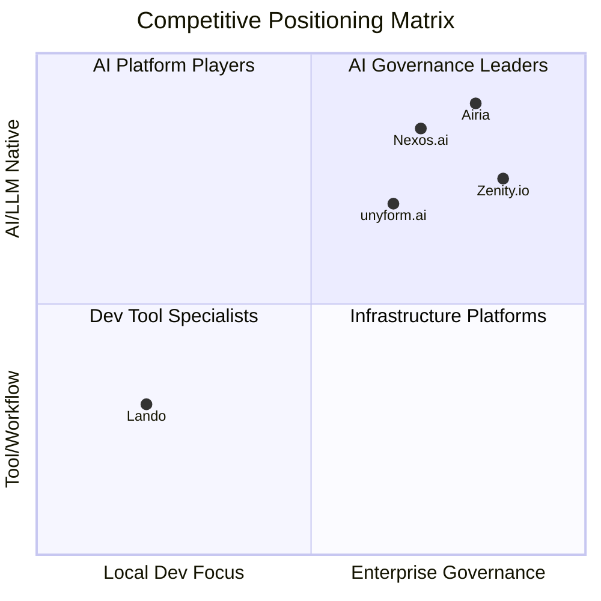
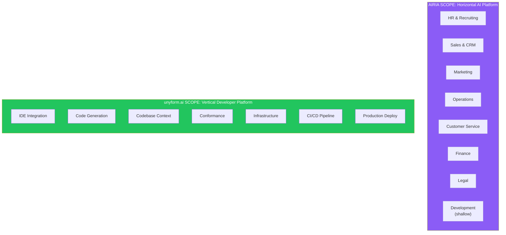
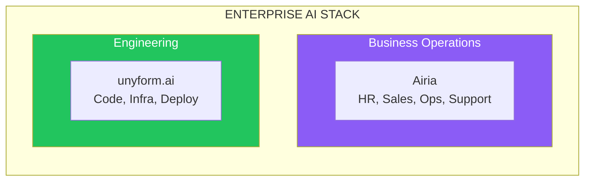
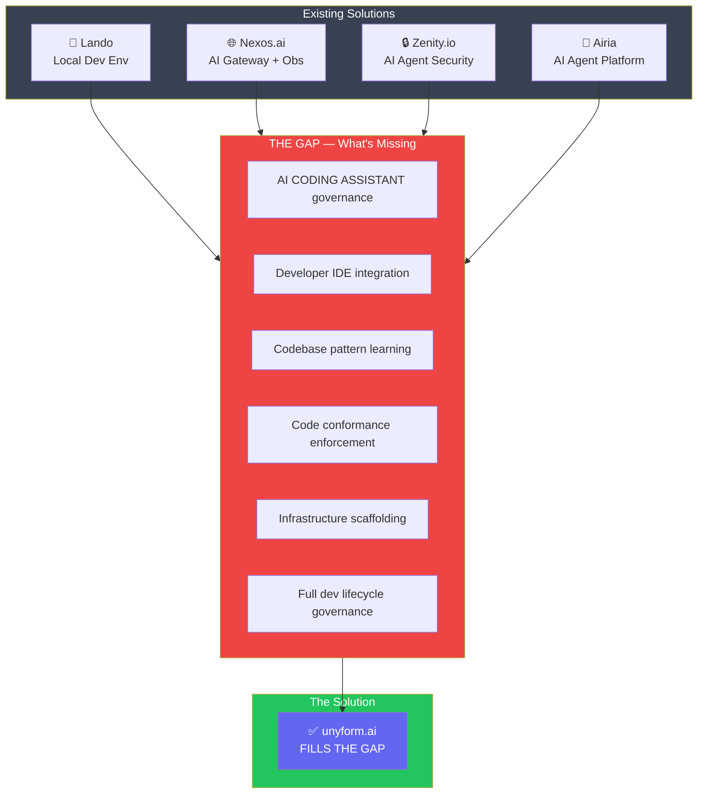
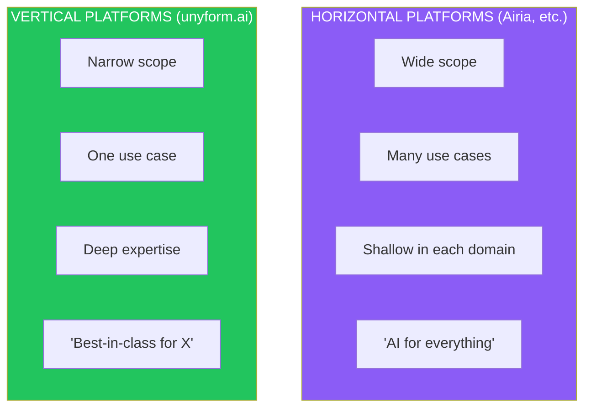

# unyform.ai Competitive Analysis

## Enterprise AI Trust and Consistency Layer

**Version 1.0 | January 2025**

---

## Executive Summary

The enterprise AI infrastructure and governance market is rapidly evolving, with players taking two distinct approaches: **horizontal platforms** (serve all AI use cases across the business) and **vertical platforms** (serve one domain exceptionally well). This analysis examines direct competitors (**Lando**, **Nexos.ai**, **Zenity.io**) and adjacent horizontal platforms (**Airia**) to clarify unyform.ai's market position.

**Key Finding:** unyform.ai is a **vertical platform** focused exclusively on AI-assisted software development. We don't compete with horizontal AI platforms like Airia—they power AI for HR, sales, ops, and support. We do one thing: help engineering teams ship secure, compliant software faster with AI. This specialization is our strength.

**Our Position:** While horizontal platforms go wide and shallow across many use cases, we go deep on the specific pain points of AI development in enterprises: codebase pattern learning, code conformance, IDE integration, and infrastructure lifecycle. For engineering teams, depth beats breadth.

---

## Competitive Landscape Overview



### Market Segments

| Segment | Description | Key Players |
|---------|-------------|-------------|
| **Local Development** | Dev environment setup, workflow automation | Lando, DDEV, Docker Desktop |
| **AI Orchestration** | Multi-model access, centralized AI management | Nexos.ai, Portkey, Helicone |
| **AI Agent Platforms** | Agent building, orchestration, enterprise AI deployment | Airia, UiPath, Kore.ai |
| **AI Security/Governance** | AI agent security, compliance, risk management | Zenity.io, Airia, Robust Intelligence |
| **Developer Platforms** | Service catalogs, templates, scaffolding | Backstage, Port.io |
| **IaC/Infrastructure** | Cloud provisioning, infrastructure management | Terraform, Pulumi |

**unyform.ai sits at the intersection**—combining dev environment consistency, AI coding assistant governance, and infrastructure scaffolding into a unified enterprise trust layer. Unlike agent-focused platforms (Airia), we target the **developer workflow** specifically.

---

## Competitor Deep Dives

---

## 1. Lando

### Overview

**What it is:** An open-source, cross-platform local development environment and DevOps tool built on Docker.

**Website:** https://lando.dev  
**Funding:** Community/Open-source (sponsored by Tandem, Platform.sh partnership)  
**Target Market:** Individual developers, small teams, agencies

### Core Features

| Feature | Description |
|---------|-------------|
| **Local Dev Environments** | Push-button setup for development stacks |
| **Multi-Stack Support** | PHP, Node, Python, Go, Ruby, etc. |
| **Docker Abstraction** | Simplifies Docker Compose complexity |
| **Service Integration** | Database, cache, search services included |
| **SSL/TLS Routing** | Local HTTPS with automatic certs |
| **Recipes** | Pre-built configs for Drupal, WordPress, Laravel, etc. |
| **Tooling Integration** | Drush, WP-CLI, Composer, npm built-in |

### Strengths

1. **Developer Experience**: Extremely easy to get started—single config file spins up complete environment
2. **Open Source**: Free, community-driven, no vendor lock-in
3. **Ecosystem**: Large library of recipes for popular CMS/frameworks
4. **Flexibility**: Can customize underlying Docker configuration
5. **Partnership Network**: Platform.sh, Pantheon, Acquia integrations

### Weaknesses

| Weakness | Impact |
|----------|--------|
| **No Enterprise Governance** | No policy enforcement, audit trails, or compliance features |
| **No AI Integration** | Built before the AI coding era—no LLM context or governance |
| **Local-Only Focus** | Doesn't address production infrastructure or deployment |
| **No Standardization Engine** | Can't enforce org-wide patterns or conventions |
| **Limited Team Features** | No role-based access, team management, or shared configs |
| **No Security Scanning** | No built-in vulnerability detection or secrets management |

### Where Lando Stops

```
Local Development Environment
         ✅ Lando
         ↓
Organizational Standards & Patterns
         ❌ Not addressed
         ↓
AI-Assisted Development Context
         ❌ Not addressed
         ↓
Policy Enforcement & Governance
         ❌ Not addressed
         ↓
Production Infrastructure
         ❌ Not addressed
         ↓
Audit & Compliance
         ❌ Not addressed
```

### unyform.ai vs. Lando

| Capability | Lando | unyform.ai |
|------------|-------|------------|
| Local dev environments | ✅ | ✅ |
| Docker-based scaffolding | ✅ | ✅ |
| Multi-stack recipes | ✅ | ✅ |
| Organization standards | ❌ | ✅ |
| AI/LLM context integration | ❌ | ✅ |
| Policy enforcement | ❌ | ✅ |
| Production infrastructure | ❌ | ✅ |
| Audit trails | ❌ | ✅ |
| Enterprise governance | ❌ | ✅ |
| Team management | ❌ | ✅ |

### How We Beat Lando

1. **Superset of Features**: Everything Lando does + governance + AI context + production
2. **BYOS Adapter**: Allow teams to continue using Lando as a scaffolding adapter if preferred
3. **Migration Path**: Import Lando configs and enhance with unyform.ai governance
4. **Enterprise Value**: Offer what Lando can't—compliance, audit, policy enforcement

### How We Pick Up Where Lando Left Off

Lando solved local development consistency but never addressed:
- **AI-era challenges**: How do you ensure AI assistants understand your dev environment?
- **Organizational scale**: How do you enforce standards across 100+ developers?
- **Full lifecycle**: How do you take consistent environments to production?
- **Compliance requirements**: How do you prove your infrastructure meets standards?

**unyform.ai continues the journey** from local dev → organization standards → AI context → production → compliance.

---

## 2. Nexos.ai

### Overview

**What it is:** An all-in-one AI platform for enterprises providing centralized AI model management, security, observability, and governance.

**Website:** https://nexos.ai  
**Funding:** Seed funding led by Index Ventures (January 2025)  
**Target Market:** Large enterprises with diverse AI model needs

### Core Features

| Feature | Description |
|---------|-------------|
| **AI Gateway** | Single API for 200+ AI models |
| **AI Workspace** | Unified interface for teams to use AI |
| **Model Router** | Intelligent routing to optimal model |
| **Observability** | Full visibility into AI usage and costs |
| **Access Control** | Role-based permissions for AI access |
| **Cost Management** | Budget controls and usage tracking |
| **Security** | Data leak prevention, input/output filtering |
| **No Vendor Lock-in** | Multi-model, multi-provider support |

### Strengths

1. **Comprehensive AI Management**: One platform for all AI model interactions
2. **Security Focus**: Enterprise-grade security with DLP and filtering
3. **Observability**: Complete visibility into who uses what, when, and how much
4. **Model Flexibility**: 200+ models, no single-vendor dependency
5. **Fresh Funding**: Well-capitalized with strong investor backing (Index Ventures)

### Weaknesses

| Weakness | Impact |
|----------|--------|
| **No Dev Workflow Integration** | Doesn't integrate into existing development pipelines |
| **No Infrastructure Scaffolding** | No project templates, Docker configs, or deployment |
| **No Code Consistency** | Doesn't ensure generated code matches org standards |
| **Gateway-Only Model** | Proxy layer—doesn't understand your codebase or patterns |
| **No Recipe/Template System** | Can't codify and reproduce infrastructure patterns |
| **Complexity** | Breadth of features may overwhelm simpler use cases |
| **No Conformance Layer** | Doesn't auto-rewrite output to match standards |

### Where Nexos.ai Stops

```
AI Model Access & Routing
         ✅ Nexos.ai
         ↓
Input/Output Security Filtering
         ✅ Nexos.ai
         ↓
Usage Observability & Cost Control
         ✅ Nexos.ai
         ↓
Understanding Your Codebase/Patterns
         ❌ Not addressed
         ↓
Code Conformance to Standards
         ❌ Not addressed
         ↓
Infrastructure Scaffolding
         ❌ Not addressed
         ↓
Development Workflow Integration
         ❌ Not addressed
```

### unyform.ai vs. Nexos.ai

| Capability | Nexos.ai | unyform.ai |
|------------|----------|------------|
| Multi-model access | ✅ | ✅ |
| AI gateway/proxy | ✅ | ✅ |
| Security filtering | ✅ | ✅ |
| Usage observability | ✅ | ✅ |
| Cost management | ✅ | ✅ |
| **Codebase understanding** | ❌ | ✅ |
| **Code conformance** | ❌ | ✅ |
| **Org pattern learning** | ❌ | ✅ |
| **Infrastructure scaffolding** | ❌ | ✅ |
| **Recipe system** | ❌ | ✅ |
| **Dev workflow integration** | ❌ | ✅ |
| **Conformance rewriting** | ❌ | ✅ |

### How We Beat Nexos.ai

1. **Deeper Context**: We don't just proxy AI—we understand your codebase, patterns, and standards
2. **Output Conformance**: We don't just filter—we rewrite to match your conventions
3. **Full Lifecycle**: We cover dev environments → AI context → production infrastructure
4. **Developer-Centric**: We integrate into where developers work, not add another dashboard
5. **Actionable Output**: We generate ready-to-use code, not just safe code

### How We Pick Up Where Nexos.ai Left Off

Nexos.ai solved AI model access and security filtering but never addressed:
- **Organizational context**: How do you make AI understand YOUR architecture?
- **Pattern conformance**: How do you ensure output matches YOUR coding standards?
- **Infrastructure generation**: How do you go from AI output to production deployment?
- **Developer workflow**: How do you integrate without changing how teams work?

**unyform.ai extends beyond the gateway** to provide canonical context, pattern learning, conformance enforcement, and infrastructure scaffolding.

---

## 3. Zenity.io

### Overview

**What it is:** A security and governance platform specifically focused on AI agents, ensuring safe AI adoption across organizations with particular strength in the public sector.

**Website:** https://zenity.io  
**Funding:** Series A (expanded into public sector January 2025)  
**Target Market:** Government agencies, regulated industries, enterprises with high security requirements

### Core Features

| Feature | Description |
|---------|-------------|
| **AI Agent Security** | End-to-end protection for AI agents |
| **Governance Platform** | Policy enforcement for AI deployments |
| **Risk Management** | Identify and mitigate AI-related risks |
| **Compliance Tools** | Meet regulatory requirements |
| **Public Sector Focus** | Tailored for government agency needs |
| **Threat Detection** | Monitor AI agents for security issues |

### Strengths

1. **Security Specialization**: Deep focus on AI agent security (narrow but deep)
2. **Public Sector Expertise**: Strong positioning in government/regulated industries
3. **Compliance Focus**: Built for organizations with strict regulatory requirements
4. **Risk-First Approach**: Security and governance from the ground up
5. **Partnership Network**: Government reseller partnerships

### Weaknesses

| Weakness | Impact |
|----------|--------|
| **AI Agent Narrow Focus** | Doesn't address broader AI coding assistant use cases |
| **No Development Integration** | Doesn't integrate into developer workflows or IDEs |
| **No Code Generation** | Security-only—doesn't help teams build faster |
| **No Infrastructure Tools** | No scaffolding, templates, or deployment |
| **Niche Market** | Public sector focus may limit broader enterprise appeal |
| **Reactive Model** | Primarily monitors and secures vs. generating compliant output |
| **No Developer Experience** | Built for security teams, not developers |

### Where Zenity.io Stops

```
AI Agent Security Monitoring
         ✅ Zenity.io
         ↓
Governance & Compliance for Agents
         ✅ Zenity.io
         ↓
Risk Management & Threat Detection
         ✅ Zenity.io
         ↓
AI Coding Assistant Governance
         ❌ Not addressed
         ↓
Developer Workflow Integration
         ❌ Not addressed
         ↓
Code Generation & Conformance
         ❌ Not addressed
         ↓
Infrastructure & Production
         ❌ Not addressed
```

### unyform.ai vs. Zenity.io

| Capability | Zenity.io | unyform.ai |
|------------|-----------|------------|
| AI agent security | ✅ | ✅ |
| Governance platform | ✅ | ✅ |
| Compliance tools | ✅ | ✅ |
| Risk management | ✅ | ✅ |
| Audit trails | ✅ | ✅ |
| **AI coding assistant governance** | ❌ | ✅ |
| **Developer workflow integration** | ❌ | ✅ |
| **Code generation** | ❌ | ✅ |
| **Conformance enforcement** | ❌ | ✅ |
| **Infrastructure scaffolding** | ❌ | ✅ |
| **Pattern learning** | ❌ | ✅ |
| **Recipe system** | ❌ | ✅ |

### How We Beat Zenity.io

1. **Broader Scope**: We address AI coding assistants, not just AI agents
2. **Developer-First**: We integrate into developer workflows, not just security dashboards
3. **Proactive, Not Reactive**: We enforce at generation time, not just monitor after
4. **Value Creation**: We help teams build faster AND securely
5. **Full Lifecycle**: Dev → AI → Production, not just security layer

### How We Pick Up Where Zenity.io Left Off

Zenity.io solved AI agent security and governance but never addressed:
- **AI coding assistants**: The dominant use case in enterprise AI adoption
- **Developer experience**: How do you secure without slowing teams down?
- **Generation-time enforcement**: How do you prevent issues rather than detect them?
- **Infrastructure lifecycle**: How do you secure the entire development pipeline?

**unyform.ai expands the aperture** from AI agent security to full AI development governance—covering coding assistants, infrastructure, and the entire software lifecycle.

---

## 4. Airia

### Overview

**What it is:** A **horizontal** enterprise AI platform—an "AI operating system" for the entire business. Airia powers AI agents across HR, sales, marketing, operations, customer service, finance, and more. It's designed to be the single AI layer for **all business functions**.

**Website:** https://airia.com  
**Funding:** $100M (Series B, September 2025)  
**Target Market:** Entire enterprise—every department, every function, every use case

### Why Airia Is NOT a Direct Competitor

**Critical Distinction:** Airia is **horizontal** (all AI use cases across the business). unyform.ai is **vertical** (deep focus on software development). These are fundamentally different market positions.



| Dimension | Airia | unyform.ai |
|-----------|-------|------------|
| **Scope** | All business functions | Software development only |
| **Depth** | Wide and shallow across many domains | Deep and specialized in one domain |
| **Use Cases** | Thousands (any AI task) | Focused (secure, compliant code shipping) |
| **Target Buyer** | CIO/CDO (enterprise-wide AI) | CTO/VP Eng (engineering teams) |
| **Value Prop** | "AI for everything" | "Ship secure software faster" |

### What Airia Does (And Does Well)

| Feature | Description |
|---------|-------------|
| **Agent Builder** | No-code + pro-code agent creation for any business process |
| **Model Agnostic** | Support for multiple LLM providers |
| **AI Governance** | Enterprise-wide agent & model registries |
| **Security Stack** | DLP, encryption, audit trails |
| **2,500+ Pre-built Agents** | HR bots, sales assistants, support agents, etc. |
| **Browser Extension** | AI embedded into any web workflow |
| **Deployment Options** | Cloud, on-prem, hybrid |

### The Opportunity: Where Airia Goes Wide, We Go Deep

Airia's use cases are **exponentially broader**—they're trying to be the AI layer for your entire company. That's both their strength and their limitation for engineering teams.

**What "horizontal" means for development:**
- Development is just one of many use cases they serve
- No deep IDE integration (browser extension, not VS Code)
- No codebase pattern learning (generic agents, not code-aware)
- No code conformance (they filter, not rewrite)
- No infrastructure scaffolding (agents, not deployments)

**What "vertical" means for unyform.ai:**
- Development is our **only** use case—we own it completely
- Deep IDE integration (VS Code, JetBrains, CLI)
- Codebase pattern learning (your patterns, your standards)
- Code conformance rewriting (output matches your style)
- Full infrastructure lifecycle (dev → staging → production)

### Why Vertical Wins for Engineering Teams

| Pain Point | Airia's Answer | unyform.ai's Answer |
|------------|----------------|---------------------|
| "AI doesn't know our codebase" | Generic agents, bring your own context | Learns your repo patterns automatically |
| "AI output doesn't match our style" | Filter/block bad output | Rewrite to conform to your standards |
| "Security can't see what AI generates" | General audit logs | Code-specific audit with conformance scores |
| "AI slows down code review" | Not addressed | Pre-checked conformance, less review burden |
| "We need consistency to production" | Not their focus | Full lifecycle: dev → AI → deploy |

### Complementary, Not Competitive

**The Enterprise Reality:** Large companies may use BOTH:
- **Airia** for business-wide AI (HR bots, sales assistants, support agents)
- **unyform.ai** for engineering-specific AI (coding assistants, infrastructure)



### What We Learn From Airia

| Airia Strength | Lesson for unyform.ai |
|----------------|----------------------|
| "Single integration" messaging | Double down on "one integration for engineering" |
| 2,500+ pre-built agents | Build deep recipe library for infra patterns |
| Governance as a pillar | Position governance prominently, but CODE-specific |
| $100M funding credibility | Emphasize production-ready foundation (MechCrate) |
| Browser extension UX | Ensure IDE extension is equally seamless |

### Our Advantage: Specialization

**Airia's challenge:** Serving everyone means optimizing for no one. A sales bot and a code generator have fundamentally different governance needs.

**unyform.ai's advantage:** We solve ONE problem exceptionally well—shipping secure, compliant software faster with AI. Every feature, every integration, every policy is designed for this specific outcome.

| Metric | Airia (Horizontal) | unyform.ai (Vertical) |
|--------|-------------------|----------------------|
| Use cases served | 100+ | 1 (done deeply) |
| IDE integration depth | Browser only | Native IDE + CLI + CI |
| Code pattern learning | ❌ | ✅ |
| Conformance rewriting | ❌ | ✅ |
| Infrastructure lifecycle | ❌ | ✅ |
| Time to value for devs | Moderate | Fast (dev-native) |

---

## Comprehensive Feature Comparison

### Feature Matrix

| Feature Category | Feature | Lando | Nexos.ai | Zenity.io | Airia | unyform.ai |
|-----------------|---------|-------|----------|-----------|-------|------------|
| **Dev Environment** | Local dev setup | ✅ | ❌ | ❌ | ❌ | ✅ |
| | Docker-based | ✅ | ❌ | ❌ | ❌ | ✅ |
| | Multi-stack support | ✅ | ❌ | ❌ | ❌ | ✅ |
| | Recipe/template system | ✅ | ❌ | ❌ | ❌ | ✅ |
| **AI Integration** | Multi-model access | ❌ | ✅ | ❌ | ✅ | ✅ |
| | AI gateway/proxy | ❌ | ✅ | ❌ | ✅ | ✅ |
| | Codebase context | ❌ | ❌ | ❌ | ❌ | ✅ |
| | Pattern learning | ❌ | ❌ | ❌ | ❌ | ✅ |
| | MCP protocol support | ❌ | ❌ | ❌ | ❌ | ✅ |
| | Agent orchestration | ❌ | ❌ | ❌ | ✅ | ❌ |
| | Pre-built agent library | ❌ | ❌ | ❌ | ✅ | ❌ |
| **Governance** | Policy engine | ❌ | Partial | ✅ | ✅ | ✅ |
| | Generation-time enforcement | ❌ | Partial | ❌ | Partial | ✅ |
| | Conformance rewriting | ❌ | ❌ | ❌ | ❌ | ✅ |
| | Approval workflows | ❌ | ❌ | ✅ | ✅ | ✅ |
| | Agent/Model registry | ❌ | ❌ | ❌ | ✅ | ✅ |
| | Risk classification | ❌ | ❌ | ✅ | ✅ | ✅ |
| **Security** | Input/output filtering | ❌ | ✅ | ✅ | ✅ | ✅ |
| | Secrets detection | ❌ | ✅ | ✅ | ✅ | ✅ |
| | DLP | ❌ | ✅ | ✅ | ✅ | ✅ |
| | Vulnerability scanning | ❌ | ❌ | ✅ | Partial | ✅ |
| **Compliance** | Audit trails | ❌ | ✅ | ✅ | ✅ | ✅ |
| | Compliance reports | ❌ | ❌ | ✅ | ✅ | ✅ |
| | SOC2/HIPAA/PCI templates | ❌ | ❌ | ✅ | ✅ | ✅ |
| **Infrastructure** | Cloud scaffolding | ❌ | ❌ | ❌ | ❌ | ✅ |
| | Multi-cloud support | ❌ | ❌ | ❌ | ✅ | ✅ |
| | Production deployment | ❌ | ❌ | ❌ | ❌ | ✅ |
| **Developer Experience** | IDE integration | ❌ | ❌ | ❌ | ❌ | ✅ |
| | CLI tooling | ✅ | ❌ | ❌ | ❌ | ✅ |
| | Browser extension | ❌ | ❌ | ❌ | ✅ | ❌ |
| | Workflow integration | ✅ | ❌ | ❌ | ✅ | ✅ |
| **Enterprise** | Team management | ❌ | ✅ | ✅ | ✅ | ✅ |
| | SSO/SAML | ❌ | ✅ | ✅ | ✅ | ✅ |
| | Self-hosted option | ✅ | ❌ | ✅ | ✅ | ✅ |
| | API access | ❌ | ✅ | ✅ | ✅ | ✅ |

### Scoring Summary (Direct Competitors Only)

| Competitor | Dev Environment | AI Integration | Governance | Security | Infrastructure | Enterprise | **Total** |
|------------|-----------------|----------------|------------|----------|----------------|------------|-----------|
| **Lando** | 5/5 | 0/5 | 0/5 | 1/5 | 0/5 | 1/5 | **7/30** |
| **Nexos.ai** | 0/5 | 4/5 | 2/5 | 4/5 | 0/5 | 4/5 | **14/30** |
| **Zenity.io** | 0/5 | 1/5 | 4/5 | 5/5 | 0/5 | 4/5 | **14/30** |
| **unyform.ai** | 5/5 | 5/5 | 5/5 | 4/5 | 5/5 | 5/5 | **29/30** |

**Airia (Horizontal Platform—Not Direct Competitor):**
| Dev Environment | AI Integration | Governance | Security | Infrastructure | Enterprise |
|-----------------|----------------|------------|----------|----------------|------------|
| 0/5 (not their focus) | 4/5 | 4/5 | 4/5 | 1/5 | 5/5 |

**Key Insight:** Direct competitors (Lando, Nexos.ai, Zenity.io) each solve a piece of the puzzle. Horizontal platforms like Airia solve different problems (business-wide AI). unyform.ai is the only vertical platform that solves the complete software development AI governance challenge.

---

## Strategic Positioning

### The Gap We Fill



### The Critical Distinction: Horizontal vs. Vertical



**This is the key insight:** Horizontal platforms (Airia) serve everyone—HR, sales, ops, support, and development. Vertical platforms (unyform.ai) serve one audience exceptionally well. For engineering teams building software, depth beats breadth.

### Positioning Statement

> **unyform.ai is the purpose-built AI governance platform for software development. We don't try to power your entire business—we focus exclusively on helping engineering teams ship secure, compliant software faster. One problem, solved completely.**

### Why Specialization Wins

| Horizontal (Airia, etc.) | Vertical (unyform.ai) |
|-------------------------|----------------------|
| Serves 100+ use cases | Serves 1 use case deeply |
| Generic governance patterns | Code-specific governance |
| Browser-based integration | Native IDE integration |
| Agent-centric (tasks) | Developer-centric (code) |
| Optimizes for breadth | Optimizes for depth |
| "Good enough" for dev teams | Purpose-built for dev teams |

### Differentiation Pillars

| Pillar | What It Means | Why It Matters |
|--------|---------------|----------------|
| **Pattern Learning** | We learn YOUR patterns, not generic best practices | AI output matches your team's actual way of building |
| **Generation-Time Enforcement** | Policy checks BEFORE code is produced | Prevention beats detection |
| **Conformance Rewriting** | Auto-transform output to match standards | Developers don't have to manually fix AI output |
| **Full Lifecycle** | Dev → AI → Production in one platform | No gaps between tools |
| **Developer-First** | Built into workflows, not on top of them | Adoption without friction |

---

## Go-to-Market Strategy

### Competitive Positioning by Segment

| Segment | Primary Competitor | Our Message |
|---------|-------------------|-------------|
| **Agencies/Small Teams** | Lando | "Lando for local dev + AI governance + production" |
| **Enterprise AI Teams** | Nexos.ai | "AI gateway that actually understands your code" |
| **Regulated Industries** | Zenity.io | "Security + developer velocity, not security OR velocity" |
| **Enterprise AI Governance** | Airia | "Airia for agents, unyform.ai for developers—the coding assistant governance layer" |
| **Platform Engineering** | Backstage/Port.io | "Service catalog that generates, not just catalogs" |

### Battle Cards

#### vs. Lando

| Objection | Response |
|-----------|----------|
| "We already use Lando" | "Great! Use our BYOS adapter—keep Lando for local dev, add unyform.ai for governance and production" |
| "Lando is free" | "Our Community tier is free too—and includes AI governance Lando can't offer" |
| "Lando is simpler" | "For local dev, yes. But you need more than local dev—you need consistency to production" |

#### vs. Nexos.ai

| Objection | Response |
|-----------|----------|
| "Nexos.ai has 200+ models" | "We support the same models—plus we understand your codebase context" |
| "They have strong observability" | "We have observability AND conformance—we don't just track, we enforce" |
| "They're well-funded" | "We're built on production-ready technology, not just funding" |

#### vs. Zenity.io

| Objection | Response |
|-----------|----------|
| "Zenity specializes in security" | "We have security AND developer productivity—you don't have to choose" |
| "They're strong in public sector" | "We serve all regulated industries with self-hosted options" |
| "They focus on AI agents" | "We cover AI agents AND AI coding assistants—the bigger use case" |

#### vs. Airia (Note: Not a direct competitor—different market)

| Objection | Response |
|-----------|----------|
| "We're evaluating Airia" | "Great—use Airia for HR, sales, and ops AI. Use unyform.ai for engineering. They're complementary, not competing." |
| "Airia has $100M in funding" | "They're building an AI platform for the entire company. We're building the best AI platform for software development. Different goals." |
| "They have 2,500+ agents" | "Sales bots, HR agents, support chatbots—awesome. We have recipes for infrastructure patterns and code generation. Different outputs." |
| "Why not just use Airia for dev too?" | "Would you use a general-purpose tool or a specialized one? We go deep: IDE integration, codebase learning, conformance rewriting. Airia goes wide." |
| "Single point of integration" | "For the whole business, yes. For engineering specifically? We're the single integration that understands code, repos, and developer workflows." |

---

## Roadmap Implications

### Features to Prioritize Based on Competitive Analysis

| Priority | Feature | Competitive Gap Addressed |
|----------|---------|---------------------------|
| **P0** | LLM Gateway with policy enforcement | Match Nexos.ai/Airia security + add conformance |
| **P0** | Pattern learning from repos | Unique differentiator vs ALL competitors |
| **P0** | IDE integration (VS Code) | Key differentiator vs Airia (they only have browser) |
| **P1** | Conformance rewriting | Unique differentiator vs ALL |
| **P1** | BYOS adapter (Lando support) | Capture Lando users |
| **P1** | Agent/Model registry | Match Airia governance maturity |
| **P2** | Security scanning integration | Match Zenity.io/Airia |
| **P2** | Compliance reporting | Match Zenity.io/Airia |
| **P3** | Public sector certifications | Compete with Zenity.io |

### Lessons From Horizontal Platforms (Airia, etc.)

| What They Do Well | How We Apply It (Vertically) |
|-------------------|------------------------------|
| Pre-built agent library (2,500+) | Build deep recipe library for **infrastructure patterns** (not generic agents) |
| Browser extension for embedded workflows | Ensure **IDE extension** is equally seamless (where devs actually work) |
| "Single integration" messaging | Position as single integration **for engineering** (not for everything) |
| Governance as a dedicated pillar | Position governance for **code generation** specifically |
| Enterprise-wide deployment story | Engineering-specific deployment story (dev → prod lifecycle) |

### Why Vertical Focus Is Our Moat

Horizontal platforms like Airia must optimize for breadth—serving 100+ use cases means no single domain gets deep attention. Our vertical focus means:

1. **Every feature is dev-specific**: IDE integration, codebase learning, conformance rewriting
2. **Every policy is code-aware**: Not generic filtering, but code pattern enforcement
3. **Every integration is dev-native**: VS Code, JetBrains, CLI, CI/CD—not browser-based
4. **Faster iteration**: We only solve development pain points, so we solve them faster

### Competitive Moats to Build

1. **Pattern Library Depth**: More organizational patterns learned = harder to switch
2. **Recipe Ecosystem**: More recipes = more value = network effects
3. **Integration Breadth**: More IDE/tool integrations = higher switching cost
4. **Compliance Templates**: Pre-built compliance = faster enterprise sales

---

## Summary: How We Win

### Against Lando

| Strategy | Tactic |
|----------|--------|
| **Superset** | Do everything Lando does + AI + governance + production |
| **Coexistence** | BYOS adapter lets teams keep Lando if they want |
| **Enterprise Upsell** | Offer what Lando can't for enterprise buyers |

### Against Nexos.ai

| Strategy | Tactic |
|----------|--------|
| **Deeper Context** | Understand codebase, not just proxy requests |
| **Conformance** | Don't just filter—rewrite to match standards |
| **Developer-Centric** | Integrate into workflows, not another dashboard |

### Against Zenity.io

| Strategy | Tactic |
|----------|--------|
| **Broader Scope** | AI coding assistants, not just AI agents |
| **Proactive** | Generation-time enforcement, not just monitoring |
| **Developer Velocity** | Security that helps teams build faster |

### Positioning vs. Horizontal Platforms (Airia, etc.)

| Strategy | Tactic |
|----------|--------|
| **Complementary, Not Competitive** | "Use Airia for business AI, use unyform.ai for engineering AI" |
| **Specialization Wins** | "Generalists serve everyone adequately; we serve developers exceptionally" |
| **Depth Over Breadth** | IDE integration, codebase learning, conformance rewriting—features horizontal platforms can't prioritize |
| **Developer Credibility** | Built by developers, for developers—not a business tool adapted for engineering |
| **Faster Time to Value** | Purpose-built means no configuration overhead for dev use cases |

### Our Unique Position

**unyform.ai is the purpose-built platform for AI-assisted software development:**

1. **Singular focus**: Ship secure, compliant software faster—that's our only job
2. **Codebase intelligence**: Learn your patterns, inject your context, match your standards
3. **Generation-time governance**: Enforce policies BEFORE code is written, not after
4. **Conformance rewriting**: Auto-transform AI output to match YOUR conventions
5. **Full developer lifecycle**: Local dev → AI context → infrastructure → production
6. **Native developer experience**: IDE, CLI, CI/CD—not browser-based generics
7. **Infrastructure included**: Recipes, Docker, cloud deployment—code to production

### The "Rippling for AI-Assisted Development" Position

| What Rippling Did | What unyform.ai Does |
|-------------------|---------------------|
| Unified HR tools (payroll, benefits, IT) | Unifies AI dev tools (assistants, context, governance) |
| One integration, all HR data flows | One integration, all AI code governed |
| Admin sets up, employees just work | Admin sets up, developers just code |
| Compliance built into workflow | Security + conformance built into coding workflow |

### Why Vertical Beats Horizontal for Engineering

**Horizontal platforms (Airia, etc.):** "AI for everything in your business"
- Pros: Wide applicability, one vendor for many use cases
- Cons: Jack of all trades, master of none for specific domains

**Vertical platform (unyform.ai):** "AI for software development, done right"
- Pros: Deep expertise, purpose-built features, faster time to value
- Cons: Only solves one problem (but solves it completely)

**For engineering leaders:** Would you rather have a platform that's "good enough" for development alongside 99 other use cases, or one that's purpose-built to help your team ship secure software faster?

---

## Appendix: Competitor Quick Reference

### Lando

- **Website**: https://lando.dev
- **GitHub**: https://github.com/lando/lando
- **Pricing**: Free (open-source)
- **Key Partnerships**: Platform.sh, Pantheon, Acquia

### Nexos.ai

- **Website**: https://nexos.ai
- **Funding**: Seed (Index Ventures, Jan 2025)
- **Pricing**: Enterprise (custom)
- **Key Features**: 200+ models, AI gateway, observability

### Zenity.io

- **Website**: https://zenity.io
- **Funding**: Series A
- **Pricing**: Enterprise (custom)
- **Key Markets**: Public sector, regulated industries

### Airia (Not a Direct Competitor)

- **Website**: https://airia.com
- **Funding**: $100M Series B (September 2025)
- **Pricing**: Enterprise (custom)
- **Positioning**: Horizontal AI platform for the entire business
- **Key Features**: Agent orchestration, governance, 2,500+ pre-built agents for HR/sales/ops/support
- **Key Markets**: Enterprise-wide AI deployment across all functions
- **Key Strength**: Comprehensive platform for any AI use case
- **Relationship to unyform.ai**: Complementary—they go wide (all business functions), we go deep (engineering only)
- **Co-existence**: Enterprises may use Airia for business AI + unyform.ai for development

---

**Document Version:** 2.0  
**Last Updated:** January 2026  
**Next Review:** Q2 2026  
**Competitors Analyzed:** Lando, Nexos.ai, Zenity.io, Airia

---

*Know your competition. Own your differentiation. Win the market.*
