# unyform.ai Enterprise Integration Contract

## One Install. Govern Everywhere.

**Version:** 1.0  
**Date:** January 2025  
**Status:** Canonical Reference

---

## The Single Integration Promise

unyform.ai is the **Rippling for AI-assisted development**. Like Rippling unified HR/IT/Finance into one platform, unyform.ai unifies AI governance into **one enterprise install**.

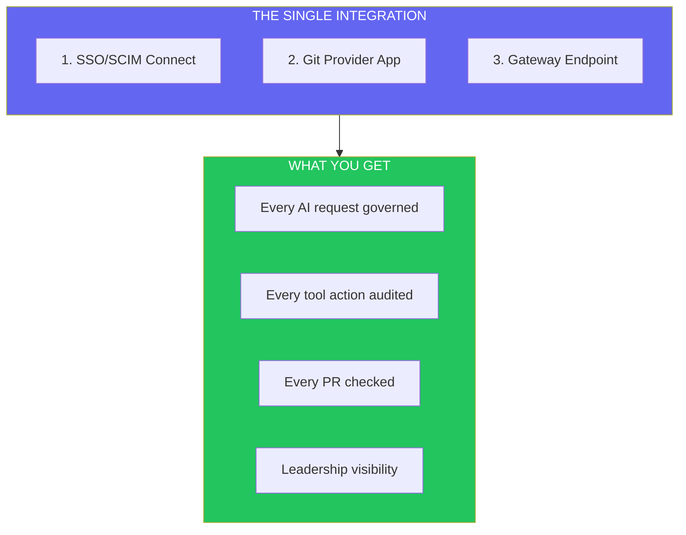

---

## 1. What the Enterprise Does (Once)

Platform/Security team completes these **6 steps**. Total time: < 1 day.

### Step 1: SSO/SCIM Connect (15 minutes)

Connect your identity provider to unyform.ai.

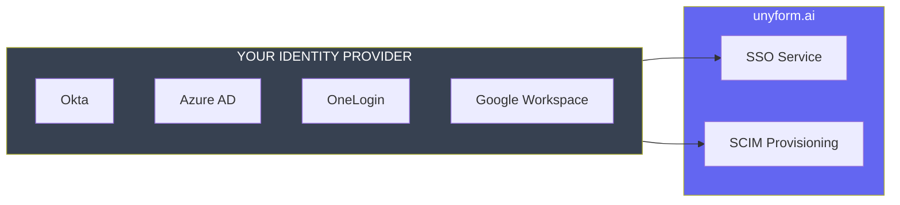

**What's configured:**
- OIDC/SAML connection
- User provisioning (auto-create/deactivate)
- Team/group mapping
- Role assignments (Admin, Developer, Viewer)

**Result:** Users authenticate with existing credentials. No new passwords.

---

### Step 2: Install GitHub App (5 minutes)

One-click installation of the unyform.ai GitHub App.

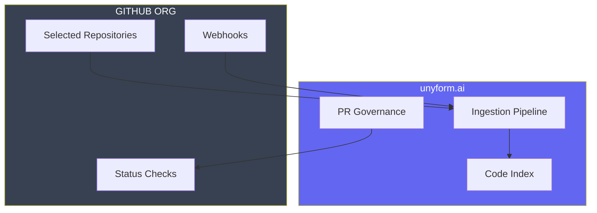

**Permissions granted (read-only MVP):**
| Permission | Access | Purpose |
|------------|--------|---------|
| Contents | Read | Index code for context |
| Metadata | Read | Repository structure |
| Pull Requests | Read | PR governance checks |
| Webhooks | Receive | Real-time sync |

**Phase 2 permissions (optional, for PR automation):**
| Permission | Access | Purpose |
|------------|--------|---------|
| Checks | Write | Pass/fail status checks |
| Pull Requests | Write | Review comments |
| Statuses | Write | Commit status updates |

**Result:** Code is indexed for context. PRs can be governed.

---

### Step 3: Configure Gateway Endpoint (10 minutes)

Route AI traffic through the unyform.ai Gateway.

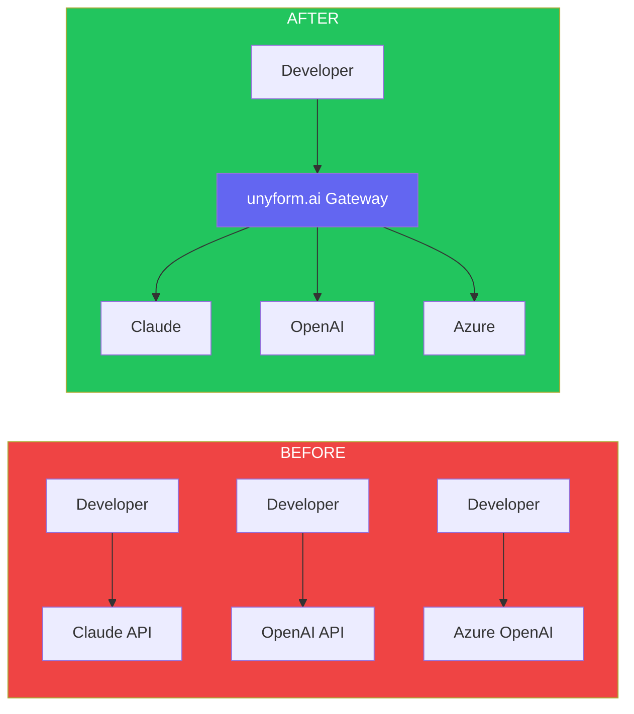

**Gateway endpoint:**
```
https://api.unyform.ai/v1/chat/completions
```

**API Compatibility:**
- OpenAI-compatible Chat Completions API (baseline)
- Claude API translation (automatic)
- Plus unyform extensions:
  - `X-Unyform-Policy-Verdict` header
  - `X-Unyform-Audit-ID` header
  - `X-Unyform-Context-Sources` header

**Configuration options:**
```yaml
# Organization gateway config
gateway:
  default_model: claude-3-sonnet
  allowed_models:
    - claude-3-sonnet
    - claude-3-opus
    - gpt-4-turbo
  routing:
    code_generation: claude-3-sonnet
    code_review: gpt-4-turbo
  rate_limits:
    per_user: 1000/hour
    per_org: 50000/hour
```

**Result:** All AI requests flow through governed endpoint.

---

### Step 4: Define Policy Packs (30 minutes)

Set organization-wide governance rules.

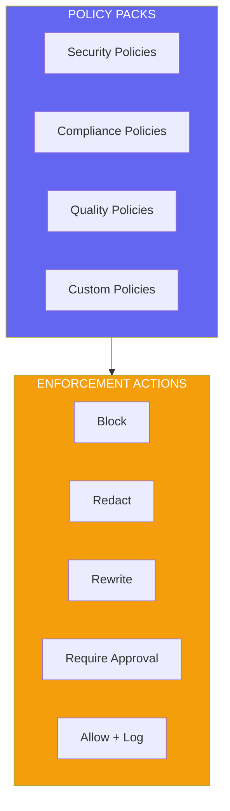

**Default policy pack (recommended starting point):**

```yaml
apiVersion: unyform.ai/v1
kind: PolicySet
metadata:
  name: enterprise-defaults
  version: "1.0"

policies:
  # Security: Block secrets in prompts and outputs
  - name: no-secrets
    type: secrets
    severity: critical
    scope: [input, output]
    action: block
    
  # Security: Redact PII
  - name: redact-pii
    type: pii
    severity: high
    scope: [input, output]
    action: redact
    
  # Quality: Block forbidden dependencies
  - name: allowed-deps
    type: dependencies
    severity: error
    scope: [output]
    action: block
    rules:
      forbidden:
        - moment  # Use date-fns
        - request # Use fetch/axios
        
  # Quality: Block unsafe patterns
  - name: no-unsafe
    type: patterns
    severity: error
    scope: [output]
    action: block
    patterns:
      - eval(
      - innerHTML =
      - dangerouslySetInnerHTML
```

**Result:** Governance rules enforced on every AI interaction.

---

### Step 5: Create Instruction Packs (20 minutes)

Define "how we build here" for AI context injection.

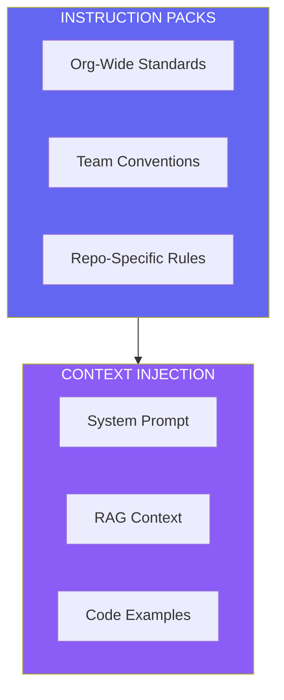

**Example instruction pack:**

```yaml
apiVersion: unyform.ai/v1
kind: InstructionPack
metadata:
  name: acme-engineering
  version: "2.1"

instructions:
  general: |
    You are an AI assistant for ACME Corp engineering.
    Follow our coding standards and conventions.
    
  architecture: |
    - Use hexagonal architecture for backend services
    - All APIs must be REST with OpenAPI specs
    - Database access through repository pattern only
    
  security: |
    - Never hardcode credentials
    - Use environment variables for configuration
    - All user input must be validated and sanitized
    
  dependencies:
    preferred:
      - date-fns for date handling
      - zod for validation
      - axios for HTTP clients
    forbidden:
      - moment (deprecated)
      - request (deprecated)
      
  naming:
    files: kebab-case
    classes: PascalCase
    functions: camelCase
    constants: SCREAMING_SNAKE_CASE
```

**Result:** AI suggestions match your org's patterns automatically.

---

### Step 6: Choose Deployment Mode (5 minutes)

Select how the data plane runs.

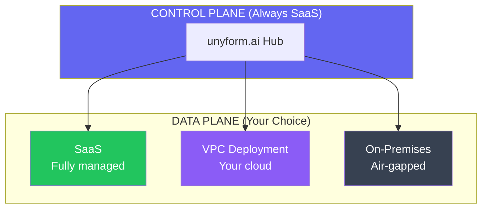

| Mode | Data Residency | Best For |
|------|----------------|----------|
| **SaaS** | unyform.ai cloud | Most teams, fastest setup |
| **VPC** | Your AWS/GCP/Azure | Data sovereignty, compliance |
| **On-Prem** | Your data center | Air-gapped, regulated industries |

**Result:** Enterprise controls where data lives.

---

## 2. What Developers Do (Minimal)

Developers keep their existing workflow. One lightweight touchpoint.

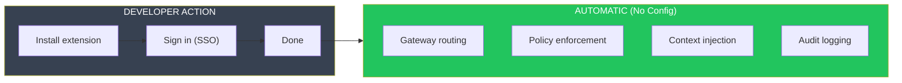

### What Developers Experience

**Before unyform.ai:**
1. Download IDE extension
2. Configure API keys
3. Set up custom prompts
4. Manage multiple model accounts
5. Hope output matches team standards

**After unyform.ai:**
1. Install unyform extension
2. Sign in with SSO
3. **Done.** AI just works.

### The Lightweight Client

Choose **one** P0 touchpoint per org:

| Option | Best For | Setup Time |
|--------|----------|------------|
| **VS Code Extension** | Most teams | 2 minutes |
| **Cursor (native MCP)** | AI-native teams | 2 minutes |
| **CLI + MCP Server** | Terminal workflows | 5 minutes |

**What the client does:**
- Routes AI requests to Gateway
- Displays policy feedback inline
- Shows context sources used
- **Does NOT require configuration**

**What the client does NOT do:**
- Store credentials locally
- Make policy decisions
- Bypass the Gateway

---

## 3. What unyform.ai Governs

Every AI interaction is governed at **three enforcement points**.

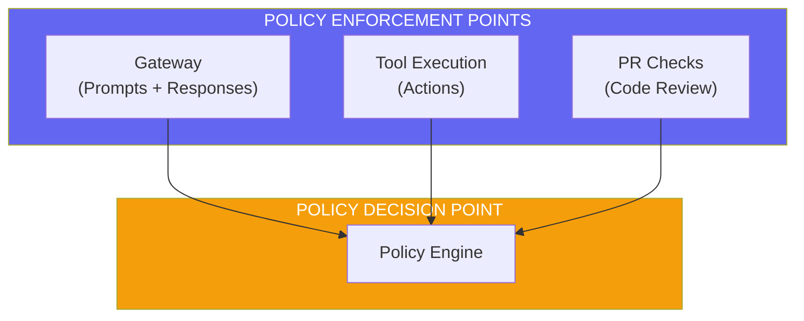

### Enforcement Point 1: Gateway (Prompts & Responses)

Every AI request passes through the Gateway.

**Governed:**
- Input scanning (secrets, PII, sensitive data)
- Output scanning (credentials, unsafe patterns)
- Context injection (instruction packs, RAG)
- Model routing (approved providers only)

### Enforcement Point 2: Tool Execution (Actions)

When AI executes tools via MCP, each action is governed.

**Governed:**
- Tool allowlisting (which tools can run)
- Parameter validation (redact secrets in args)
- Approval workflows (high-risk actions require human)
- Rate limiting (prevent runaway agents)

```yaml
# Tool policy example
tool_policies:
  file_write:
    action: allow
    require_approval: false
    
  git_commit:
    action: allow
    require_approval: true
    approvers: [tech-lead]
    
  network_request:
    action: block
    exceptions:
      - internal-api.acme.com
      
  deploy:
    action: require_approval
    approvers: [platform-team]
```

### Enforcement Point 3: PR Checks (Code Review)

Every PR with AI-generated code gets a governance check.

**Governed:**
- Policy compliance (did AI output pass all rules?)
- Conformance score (does it match org patterns?)
- Attribution (what % is AI-generated?)
- Audit trail (link to original AI sessions)

```
✅ unyform.ai Governance Check

Policy Compliance: PASS (12/12 policies)
Conformance Score: 94%
AI Attribution: 67% of changed lines
Audit Trail: 3 AI sessions linked

View details →
```

---

## 4. What Leadership Sees

The Analytics Dashboard provides visibility no other tool can offer.

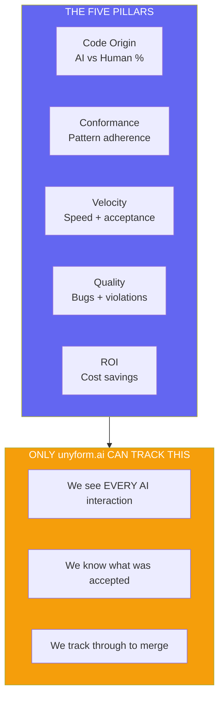

### The Killer Insight

> **We're the ONLY system that knows the difference between AI-generated and human-written code.**

Because every AI request flows through our Gateway, we can answer questions no one else can:

| Question | Others | unyform.ai |
|----------|--------|------------|
| What % of code is AI-generated? | ❌ | ✅ |
| Is AI code more or less buggy? | ❌ | ✅ |
| Which teams use AI most effectively? | ❌ | ✅ |
| What's our actual ROI on AI tools? | ❌ | ✅ |
| Are we faster with AI? Prove it. | ❌ | ✅ |

---

## 5. Security & Compliance

### Data Handling Model

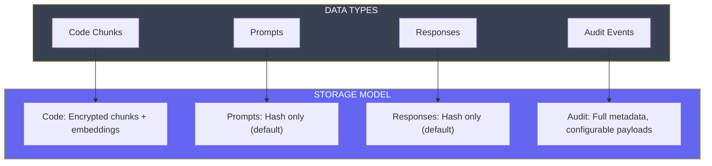

### Retention & Evidence Modes

Enterprises choose their audit retention model:

```yaml
# Audit configuration
audit:
  mode: hashes_only | encrypted_payloads | full_payloads
  
  # Hash-only (default): Store content hashes, not plaintext
  # Encrypted: Store encrypted payloads with BYOK
  # Full: Store plaintext for investigation (customer-controlled)
  
  key_management: unyform_managed | customer_kms
  
  retention:
    events: 365 days
    payloads: 90 days  # If stored
    legal_hold: supported
```

| Mode | Prompts/Responses | Use Case |
|------|-------------------|----------|
| **Hashes Only** | SHA-256 hash stored | Default, privacy-first |
| **Encrypted Payloads** | AES-256 + BYOK | Compliance, investigation |
| **Full Payloads** | Plaintext (customer VPC) | Legal hold, forensics |

### Compliance Certifications

| Certification | Status | Timeline |
|---------------|--------|----------|
| SOC 2 Type I | In progress | Q2 2025 |
| SOC 2 Type II | Planned | Q4 2025 |
| HIPAA | Roadmap | 2026 |
| FedRAMP | Roadmap | 2026 |

---

## 6. The Punchline

### What You're Buying

| Traditional Approach | unyform.ai |
|---------------------|------------|
| 5-10 separate tools | 1 integration |
| Months of setup | 1 day |
| Per-tool policies | Unified governance |
| No visibility | Complete analytics |
| Constant maintenance | Managed platform |

### The Single Integration Contract

**Enterprise installs once:**
1. ✅ SSO/SCIM
2. ✅ GitHub App
3. ✅ Gateway endpoint

**Developers do almost nothing:**
1. ✅ Install extension
2. ✅ Sign in
3. ✅ Keep working

**unyform.ai governs everything:**
1. ✅ Every AI request
2. ✅ Every tool action
3. ✅ Every PR check

**Leadership finally sees:**
1. ✅ AI vs Human code
2. ✅ Conformance scores
3. ✅ Velocity metrics
4. ✅ Actual ROI

---

## Quick Reference

### Endpoints

| Endpoint | Purpose |
|----------|---------|
| `https://api.unyform.ai/v1/chat/completions` | Gateway (OpenAI-compatible) |
| `https://hub.unyform.ai` | Admin dashboard |
| `https://api.unyform.ai/v1/audit` | Audit API |

### Support

| Channel | Response Time |
|---------|---------------|
| Email | 48h (Team) / 4h (Enterprise) |
| Slack | 4h (Enterprise) |
| Phone | Enterprise only |

### Documentation

- [Technical Architecture](./TECHNICAL_ARCHITECTURE.md)
- [API Reference](./API_REFERENCE.md)
- [Policy Configuration](./POLICY_CONFIGURATION.md)
- [Analytics Dashboard](./ANALYTICS_DASHBOARD.md)

---

*One install. Govern everywhere. unyform.ai.*
