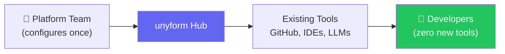
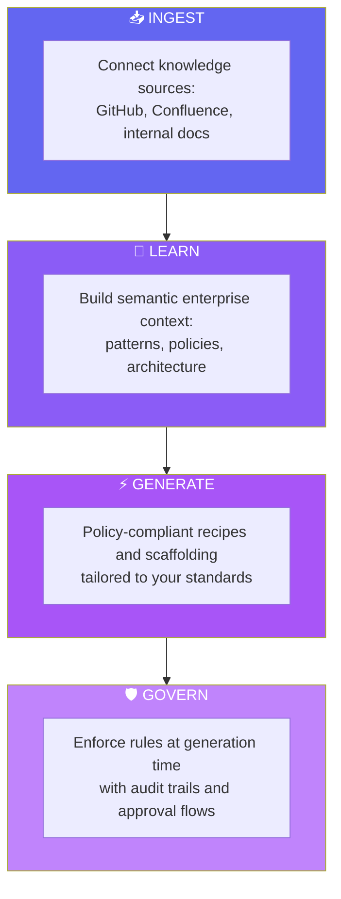

# unyform.ai

## Enterprise AI Trust and Consistency Layer

**Build systems that conform to your standards. Every time. At scale.**

---

## Executive Summary

unyform.ai is an enterprise platform that makes AI-generated code safe, consistent, and organization-aware. It sits between developers and AI models to provide canonical enterprise context, policy enforcement at generation time, code style and architecture conformity, and complete audit trails. By ingesting your organization's existing documentation, code repositories, and best practices, unyform.ai creates an intelligent layer that ensures AI-assisted development produces code and infrastructure that looks and feels like your team built it—while enforcing security, compliance, privacy, and network rules before code is even written.

---

## The Problem

Enterprise teams adopting AI coding tools hit predictable friction:

### 1. Context Fragmentation
LLMs do not reliably understand multi-repo systems, internal libraries, and historical architectural decisions. Each AI session starts from zero.

### 2. Trust Gap
Security, privacy, and compliance requirements create a high bar. A small mistake can be catastrophic. Most AI tools detect problems *after* generation—not before.

### 3. Consistency Drift
Different engineers and different AI sessions produce inconsistent patterns, styles, and library choices. This increases maintenance costs and technical debt.

### 4. Cold Start Tax
Teams spend significant time writing instructions, building templates, and creating ad-hoc guardrails before AI becomes truly useful.

### The Cost of Inconsistency

| Impact Area | Annual Cost (100-person eng team) |
|-------------|-----------------------------------|
| Security remediation | $500K - $2M |
| Technical debt | $1M - $5M |
| Developer onboarding | $300K - $800K |
| Infrastructure incidents | $200K - $1M |
| **Total** | **$2M - $8.8M** |

---

## What Exists Today

Most enterprise offerings solve parts of this problem but not the unified experience:

| Layer | What It Does | What's Missing |
|-------|--------------|----------------|
| **Code Assistants** | IDE suggestions and chat | No org context |
| **Context Tools** | Code search and embeddings | No enforcement |
| **Security/Governance** | SAST, DLP, policy-as-code | Post-generation only |
| **Workflow Tools** | PR reviews, CI checks | Reactive, not proactive |

**The missing piece:** A single platform that connects all four into a coherent enterprise context—with strong enforcement at generation time, not just detection after the fact.

---

## The Solution: unyform.ai

**"The Rippling for AI-assisted development."**

A platform that sits between developers and AI models—following the same model that made Rippling successful: **admin sets up once, employees just work**.

**What it provides:**

1. **Canonical enterprise context** - One source of truth for architecture, libraries, and rules
2. **Policy enforcement at generation time** - Block, redact, or rewrite before code is produced
3. **Code style and architecture conformity** - Output matches your patterns automatically
4. **Approval workflows and audit logs** - Evidence for security and compliance
5. **Optional per-engineer personalization** - Individual style without breaking enterprise rules

### How It Works: The Four Pillars

---

## Key Differentiators

| Differentiator | Why It Matters |
|----------------|----------------|
| **Guardrails before code is written** | Not just detection after generation |
| **Policy and architecture as first-class context** | Not just embeddings over code |
| **Developer voice profiles** | Optional personalization that doesn't break rules |
| **Platform agnostic** | Works with multiple IDEs and model providers |
| **Evidence centric** | Audit trails designed for compliance from day one |

---

## Target Customers

### Primary Buyers

| Segment | Pain Point |
|---------|------------|
| **Regulated Industries** (Finance, Healthcare, Insurance, Defense) | Compliance requirements limit AI adoption |
| **Large SaaS Companies** | Complex multi-service systems need consistency |
| **Enterprises with Legacy Codebases** | Strict internal standards must be maintained |

### Primary Personas

1. **IC Engineers** - Want faster output without manual standard enforcement
2. **Staff Engineers & Architects** - Need patterns adopted consistently
3. **Security & Compliance Teams** - Require auditable AI usage
4. **Platform Engineering Teams** - Building internal developer platforms
5. **Engineering Leadership** - Need to scale AI adoption confidently

---

## Market Opportunity

### The Platform Engineering Explosion

The platform engineering market is projected to reach **$51B by 2027**, driven by:

- DevOps complexity requiring standardization
- AI coding assistant adoption (GitHub Copilot: 1.8M+ paid users)
- Enterprise need for governance over AI-generated code
- Regulated industries demanding auditable AI usage

### Why Now

1. Enterprise AI adoption is high, but regulated industries remain cautious
2. AI coding volume is rising, which amplifies inconsistency and risk
3. Developers want faster output, while leadership wants provable governance
4. Security and compliance teams are demanding auditable AI usage

### The Unserved Need

No dominant vendor fully owns the **trust + consistency + personalization triangle**:

| Solution | Limitation |
|----------|------------|
| GitHub Copilot | No organizational context, no enforcement |
| Backstage (Spotify) | Catalog-only, no generation |
| Port.io | Service catalog, limited AI |
| Terraform/Pulumi | IaC only, no dev patterns |
| Security Scanners | Post-generation detection only |

**unyform.ai is the missing layer**: AI that understands and enforces your team's way of building.

---

## Business Model

### Tiered Pricing

| Tier | Price | Features |
|------|-------|----------|
| **Community** | Free | Open-source MechCrate core, standard recipes, CLI |
| **Team** | $49/user/mo | Custom recipe generation, multi-cloud scaffolding, source connectors |
| **Enterprise** | Custom | Governance engine, SSO/SAML, audit trails, self-hosted/VPC option |

### Additional Revenue Streams

- Per-request pricing for high-volume organizations
- Premium for on-prem or VPC deployment
- Professional services for custom integrations

### Revenue Projections

| Year | ARR Target | Customers |
|------|------------|-----------|
| Year 1 | $500K | 50 teams |
| Year 2 | $2.5M | 200 teams |
| Year 3 | $10M | 500 teams |

---

## Go-to-Market Strategy

### Wedge Strategy

1. **Start narrow**: Security-conscious team that feels the pain
2. **Ship fast**: Single repo with high-value policies
3. **Prove trust**: Measurable ROI on pilot
4. **Expand**: More repos, more policies, more teams

### Sales Motion

1. Land with **Developer Experience champion + Security champion**
2. Pilot with clear measurement
3. Expand with executive support once trust is proven

### Proof of Value Metrics

| Metric | How We Measure |
|--------|----------------|
| Developer time saved | Accepted suggestions, PR cycle time |
| Policy violations prevented | Blocked/fixed outputs |
| Standardization improvement | Reduction in code review comments |
| Security posture | Reduction in SAST findings |

---

## Current Traction

### Built, Not Planned

unyform.ai is built on the **MechCrate** foundation—a production-ready system already in use:

| Metric | Status |
|--------|--------|
| **Core CLI** | Production-ready |
| **Recipes** | 7 tech stacks (Laravel, Nuxt, Rust, Astro, Zola, etc.) |
| **MCP Server** | 44 tools for LLM integration |
| **RAG Pipeline** | Weaviate-powered semantic search |
| **Documentation** | 53 technical guides |
| **Infrastructure** | Cloudflare Workers + Containers |

### What We're Building Next

- LLM Gateway with policy enforcement (Q1 2025)
- GitHub repository analyzer (Q1 2025)
- Confluence connector (Q1 2025)
- AI Recipe Generator (Q2 2025)
- Governance Engine with audit logs (Q3 2025)

---

## Risks & Mitigation

| Risk | Mitigation |
|------|------------|
| Entrenched vendors expand into this area | Focus on depth of customization, open-source core |
| Onboarding complexity slows adoption | Start with single-repo MVP, expand from there |
| Policy tuning creates friction | Smart defaults, easy adjustment, gradual rollout |
| Privacy/data handling expectations are high | Self-hosted option, SOC2 certification |

---

## The Ask

We are seeking **$2M seed funding** to:

1. **Expand the engineering team** (4 senior engineers)
2. **Build enterprise connectors** (GitHub, Confluence, Jira)
3. **Develop the Governance Engine** (Policy enforcement, audit trails)
4. **Establish go-to-market** (Developer relations, content, pilots)

### Use of Funds

| Category | Allocation |
|----------|------------|
| Engineering | 60% |
| Go-to-Market | 25% |
| Operations | 15% |

---

## Leadership

**Michael Price** — Founder & CEO
- Deep expertise in developer tooling and infrastructure
- [Additional background]

**Matt Vitebsky** — Co-Founder & CPO
- Chief Product Officer
- Deep expertise in driving value and revenue for products

---

## Contact

**unyform.ai**

Email: hello@unyform.ai  
Website: https://unyform.ai

---

*AI that builds like your team builds—safely, consistently, and on your terms.*
