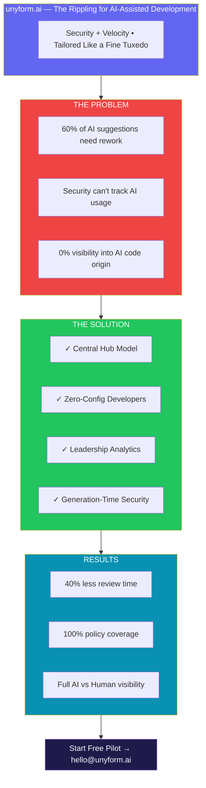
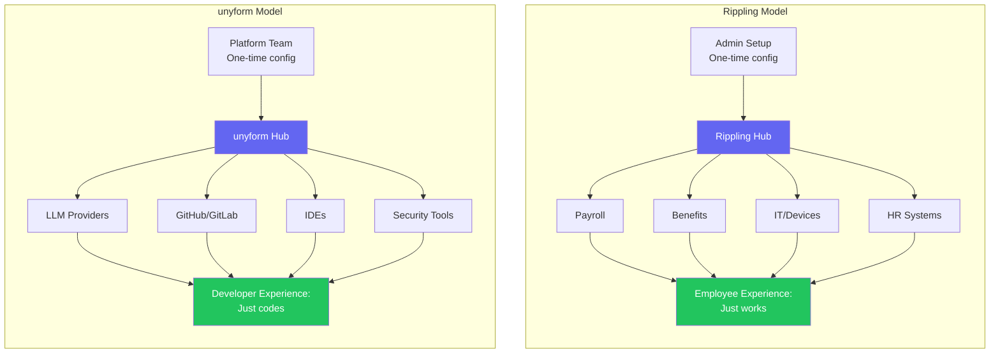
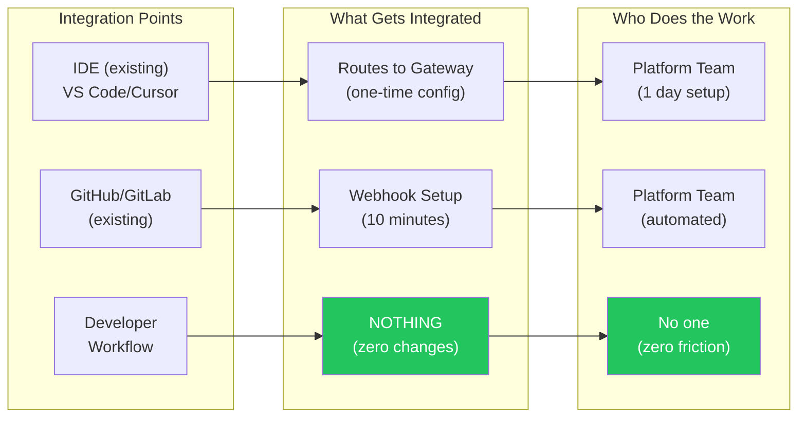
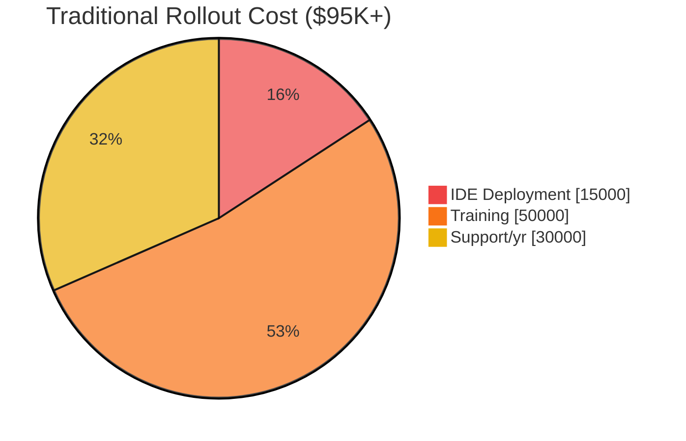
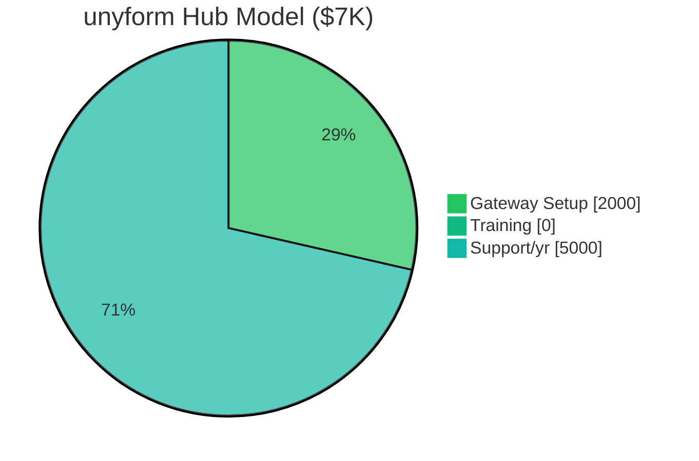

# unyform.ai Go-to-Market Playbook

## Sales and Marketing Strategy

**Version:** 1.0  
**Date:** January 2025  
**Owner:** Business Team  
**Status:** Draft

---

## 1. Market Segmentation

### 1.1 Segment Overview

| Segment | Size | Pain Level | Willingness to Pay | Priority |
|---------|------|------------|-------------------|----------|
| **Regulated Industries** | Medium | Very High | Very High | Primary |
| **Large SaaS** | Large | High | High | Primary |
| **Enterprise Legacy** | Large | High | Medium-High | Secondary |
| **Mid-Market Tech** | Very Large | Medium | Medium | Tertiary |
| **Agencies** | Large | Medium | Low-Medium | Future |
| **Startups** | Very Large | Low-Medium | Low | Community |

### 1.2 Primary: Regulated Industries

**Industries:**
- Financial services (banking, insurance, fintech)
- Healthcare and life sciences
- Government contractors
- Defense and aerospace

**Characteristics:**
- 100-10,000+ developers
- Strict compliance requirements (SOC2, HIPAA, FedRAMP)
- Long sales cycles (6-12 months)
- High contract values ($50K-500K+ ARR)
- Risk-averse, need proven solutions
- Strong security and legal review

**Key Pain Points:**
1. AI compliance and auditability requirements
2. Secret exposure prevention
3. Regulatory reporting on AI usage
4. Standardized patterns across large teams

**Buying Process:**
```
Security Review → Legal Review → Pilot → POC Expansion → Enterprise Deal
```

---

### 1.3 Primary: Large SaaS Companies

**Characteristics:**
- 50-500+ developers
- Complex multi-service architectures
- High velocity development
- Already using AI tools (Copilot, Claude)
- Platform engineering investment

**Key Pain Points:**
1. Inconsistent AI-generated code quality
2. Time wasted on code review
3. Onboarding new developers to patterns
4. Scaling AI adoption safely

**Buying Process:**
```
Developer Champion → Platform Lead Buy-in → Pilot → Team Rollout → Org-wide
```

---

### 1.4 Secondary: Enterprise with Legacy

**Characteristics:**
- 500+ developers
- Large legacy codebases
- Internal frameworks and libraries
- Modernization initiatives

**Key Pain Points:**
1. AI doesn't understand internal code
2. Generated code conflicts with legacy patterns
3. Migration and modernization challenges

---

## 2. Ideal Customer Profile (ICP)

### 2.1 Company Characteristics

| Attribute | Ideal | Acceptable | Disqualified |
|-----------|-------|------------|--------------|
| **Developer count** | 50-500 | 20-50 or 500+ | <10 |
| **GitHub usage** | Primary VCS | Used alongside others | Not used |
| **AI tool adoption** | Active (Copilot, etc.) | Evaluating | Blocked |
| **Platform team** | Exists | Forming | None planned |
| **Security focus** | High | Medium | Low |
| **Budget authority** | Central IT/Platform | Team-level | No budget |
| **Tech stack** | Modern (Node, Python, Go, Rust) | Mixed | Mainframe-only |

### 2.2 Firmographics

| Attribute | Target Range |
|-----------|--------------|
| Revenue | $20M - $2B |
| Employee count | 200 - 10,000 |
| Developer/employee ratio | >10% |
| Engineering budget | >$5M/year |
| Location | US, UK, EU (English-speaking) |

### 2.3 Technographics

**Required:**
- GitHub (or GitLab with GitHub mirror)
- Modern CI/CD pipeline
- Docker/containers in use

**Preferred:**
- Kubernetes
- Microservices architecture
- Developer platform initiatives
- Existing AI coding tools

---

## 3. Buyer Personas

### 3.1 Champion: Platform Engineering Lead

**Title Examples:**
- Director of Platform Engineering
- Head of Developer Experience
- Principal Engineer, Developer Productivity

**Responsibilities:**
- Define and maintain development standards
- Select and roll out developer tools
- Improve developer productivity metrics

**Goals:**
- Increase developer velocity
- Standardize patterns across teams
- Reduce onboarding time
- Show ROI on platform investments

**What They Care About:**
- Developer adoption and satisfaction
- Integration with existing tools
- Implementation complexity
- Measurable outcomes

**How to Reach:**
- DevOps/Platform conferences
- Engineering blogs and podcasts
- Twitter/LinkedIn thought leadership
- Open source community engagement

**Key Message:**
> "unyform.ai makes AI work the way your team works—enforcing your standards automatically so developers get consistent, compliant suggestions without thinking about it."

---

### 3.2 Economic Buyer: VP Engineering / CTO

**Title Examples:**
- VP of Engineering
- CTO
- Chief Architect
- SVP Technology

**Responsibilities:**
- Engineering strategy and budget
- Team productivity and quality
- Technology risk management

**Goals:**
- Ship faster without increasing risk
- Scale AI adoption across org
- Demonstrate engineering efficiency

**What They Care About:**
- ROI and business impact
- Risk mitigation
- Competitive advantage
- Team morale and retention

**How to Reach:**
- Executive dinners/events
- Industry conferences (CTO summits)
- Referrals from peers
- Board/investor network

**Key Message:**
> "Turn AI from a wild card into a strategic advantage—with governance that matches your standards and proof that shows the board."

---

### 3.3 Influencer: Security/Compliance Lead

**Title Examples:**
- CISO
- Director of Security Engineering
- Compliance Manager
- Security Architect

**Responsibilities:**
- Prevent security incidents
- Ensure regulatory compliance
- Audit and reporting

**Goals:**
- Reduce AI-related risk
- Audit trail for AI usage
- Enforce security policies automatically

**What They Care About:**
- Compliance certifications (SOC2, HIPAA)
- Audit trail completeness
- Integration with security stack
- Incident prevention metrics

**How to Reach:**
- Security conferences (RSA, BSides)
- Security vendor partnerships
- CISO networks and communities
- Compliance/GRC vendor relationships

**Key Message:**
> "Stop AI security issues before they happen—with policy enforcement at generation time and complete audit trails for compliance reporting."

---

### 3.4 User: IC Developer

**Title Examples:**
- Software Engineer
- Senior Engineer
- Staff Engineer

**Responsibilities:**
- Write code
- Review code
- Ship features

**Goals:**
- Code faster with AI
- Not get blocked by compliance
- Not rewrite AI output constantly

**What They Care About:**
- Speed (low latency)
- Quality of suggestions
- IDE integration
- Not being micromanaged

**How to Reach:**
- Dev.to, Hacker News, Reddit
- Open source projects
- Developer conferences
- YouTube tutorials

**Key Message:**
> "AI that actually knows your codebase—so suggestions work the first time, every time."

---

## 4. Sales Motion

### 4.1 Sales Model by Segment

| Segment | Sales Motion | Typical Deal Size | Sales Cycle |
|---------|--------------|-------------------|-------------|
| **Team (5-50)** | Product-Led + Inside Sales | $15K-50K ARR | 30-60 days |
| **Mid-Market** | Inside Sales + SE | $50K-150K ARR | 60-90 days |
| **Enterprise** | Field Sales + SE + CSM | $150K-500K+ ARR | 90-180 days |

### 4.2 Land Motion

**Step 1: Identify Champion**
```
Signals:
- Hiring for platform engineering
- Blog posts about AI adoption challenges
- Conference talks on developer experience
- LinkedIn posts about standardization
```

**Step 2: Initial Outreach**
```
Channel: LinkedIn InMail or warm intro
Message: Focus on specific pain point
CTA: 15-minute discovery call
```

**Step 3: Discovery Call (30 min)**
```
Questions:
1. How is your team using AI coding tools today?
2. What challenges have you seen with AI-generated code?
3. How do you enforce coding standards currently?
4. What would "success" look like in 6 months?
```

**Step 4: Technical Demo (45 min)**
```
Agenda:
1. Recap pain points (5 min)
2. Product overview (10 min)
3. Live demo with their context (20 min)
4. Q&A (10 min)
5. Next steps (5 min)
```

**Step 5: Pilot Proposal**
```
Deliverables:
- 6-week pilot scope
- Success criteria agreement
- Implementation timeline
- Resource requirements
```

### 4.3 Expand Motion

**Week 1-2: Setup**
- Connect GitHub organization
- Configure initial policies
- Set up instruction packs
- Deploy VS Code extension

**Week 3-4: Active Usage**
- Monitor adoption metrics
- Weekly check-in calls
- Iterate on policies
- Address friction points

**Week 5-6: Review**
- Compile success metrics
- Present ROI analysis
- Identify expansion opportunities
- Prepare proposal

**Post-Pilot:**
- Convert to paid (Team tier)
- Expand to additional teams
- Upgrade to Enterprise (if applicable)

---

## 5. Pilot Program Structure

### 5.1 Pilot Qualification Criteria

| Criterion | Requirement |
|-----------|-------------|
| Team size | 10-50 developers |
| GitHub usage | Primary version control |
| Executive sponsor | VP/Director level |
| Security champion | Identified stakeholder |
| Success criteria | Agreed upfront |
| Timeline commitment | 6 weeks dedicated |

### 5.2 Pilot Timeline

```
Week 1: Setup
├── Day 1-2: Kickoff call, GitHub App install
├── Day 3-4: Policy configuration workshop
└── Day 5: VS Code extension deployment

Week 2: Onboarding
├── Developer training (2 sessions)
├── First policies activated
└── Initial usage monitoring

Week 3-4: Active Usage
├── Weekly check-ins (30 min)
├── Policy refinement based on feedback
├── Address adoption blockers
└── Collect developer feedback

Week 5: Analysis
├── Compile usage metrics
├── Calculate ROI metrics
└── Prepare success report

Week 6: Review
├── Executive presentation
├── Success criteria evaluation
├── Conversion discussion
└── Expansion planning
```

### 5.3 Pilot Deliverables

**From Customer:**
- GitHub App installation
- 10+ developers using daily
- 10+ policies configured
- Weekly check-in attendance
- End-of-pilot feedback

**From unyform.ai:**
- White-glove setup
- 2 training sessions
- Weekly check-in calls
- Success metrics dashboard
- Executive summary report
- ROI analysis

### 5.4 Pilot Success Criteria

| Metric | Target | Measurement |
|--------|--------|-------------|
| Developer adoption | >80% | Active users / pilot team |
| Daily active users | >50% | DAU / enrolled |
| Requests per user | >100/week | Gateway metrics |
| Policy violations caught | >20/month | Audit logs |
| Developer satisfaction | >7/10 | Survey |
| Security lead approval | Yes | Sign-off |

---

## 6. Sales Collateral

### 6.1 Required Materials

| Material | Purpose | Owner | Status |
|----------|---------|-------|--------|
| **One-Pager** | Initial outreach, leave-behind | Marketing | Needed |
| **Pitch Deck** | Discovery/demo meetings | Sales | Draft |
| **ROI Calculator** | Value justification | Sales | Needed |
| **Case Study Template** | Social proof | Marketing | Needed |
| **Security FAQ** | Security review support | Product | Needed |
| **Technical Whitepaper** | Deep dive for architects | Product | Draft |
| **Demo Script** | Consistent demos | SE | Needed |
| **Competitive Battlecards** | Handle objections | Product | Draft |
| **Pricing Sheet** | Quote generation | Sales | Draft |
| **Pilot Agreement** | Legal framework | Legal | Needed |

### 6.2 One-Pager Structure

**Layout:**



### 6.3 ROI Calculator Inputs

**Cost Savings:**
- Developer time saved (reduced rework)
- Code review time saved
- Security incident prevention
- Onboarding time reduction

**Productivity Gains:**
- AI adoption increase
- Faster feature delivery
- Reduced context switching

**Sample Calculation:**
```
For a 50-developer team:

Developer time saved:
  2 hours/dev/week × 50 devs × $80/hour = $416,000/year

Code review time saved:
  1 hour/dev/week × 50 devs × $80/hour = $208,000/year

Security incident prevention:
  1 incident × $500,000 × 10% risk reduction = $50,000/year

Total Annual Value: $674,000

unyform.ai Cost: $49 × 50 × 12 = $29,400/year

ROI: 23x
```

---

## 7. Channel Strategy

### 7.1 Direct Sales (Primary)

**Team Tier:**
- Self-serve signup with credit card
- Inside sales for >10 seats
- 30-day free trial conversion

**Enterprise:**
- Field sales team
- Solution engineering support
- Custom demos and POCs

### 7.2 Self-Serve (Community → Team)

**Funnel:**
```
MechCrate Download → Community Sign-up → Team Trial → Paid Conversion
```

**Tactics:**
- Freemium with clear upgrade triggers
- In-product upgrade prompts
- Email nurture sequences
- Usage-based recommendations

### 7.3 Partner Channel (Future)

| Partner Type | Examples | Value |
|--------------|----------|-------|
| **Consulting** | Accenture, Deloitte | Implementation services |
| **Technology** | GitHub, Anthropic | Co-marketing, integration |
| **Reseller** | SHI, CDW | Enterprise distribution |
| **Platform** | Platform.sh, Vercel | Ecosystem integration |

---

## 8. Marketing Activities

### 8.1 Content Marketing

| Content Type | Frequency | Goal |
|--------------|-----------|------|
| Blog posts | 2/week | SEO, thought leadership |
| Case studies | 1/quarter | Social proof |
| Whitepapers | 1/quarter | Lead generation |
| Webinars | 1/month | Engagement, leads |
| Podcast appearances | 2/month | Awareness |
| YouTube tutorials | 1/week | Product education |

**Content Themes:**
1. AI coding best practices
2. Developer productivity
3. Security and compliance
4. Platform engineering
5. Code consistency patterns

### 8.2 Events

| Event Type | Examples | Investment |
|------------|----------|------------|
| **Sponsor** | KubeCon, DevOpsDays | $10-50K |
| **Speak** | QCon, Platform Engineering | Time |
| **Host** | User meetups, webinars | $1-5K |
| **VIP** | CISO dinners, CTO roundtables | $5-15K |

**Event Calendar:**
- Q1: DevOpsDays (regional), Platform Engineering Day
- Q2: KubeCon EU, GitHub Universe
- Q3: DevOpsDays (regional), QCon
- Q4: AWS re:Invent, KubeCon NA

### 8.3 Community

**Developer Community:**
- Discord server for MechCrate users
- GitHub discussions
- Stack Overflow presence
- Dev.to publication

**Engagement Tactics:**
- Answer questions in relevant communities
- Contribute to open source projects
- Share useful tools and templates
- Highlight community success stories

### 8.4 Demand Generation

| Channel | Tactic | CAC Target |
|---------|--------|------------|
| **Organic Search** | SEO content | $0 |
| **LinkedIn Ads** | Targeted campaigns | $500/lead |
| **Google Ads** | High-intent keywords | $300/lead |
| **Retargeting** | Website visitors | $100/lead |
| **Content Syndication** | Gated content | $200/lead |

**Target Keywords:**
- "AI code governance"
- "AI coding policy"
- "enterprise AI security"
- "code consistency tools"
- "platform engineering tools"
- "developer productivity"

---

## 9. Metrics & KPIs

### 9.1 Pipeline Metrics

| Metric | Definition | Target |
|--------|------------|--------|
| MQLs | Marketing qualified leads | 100/month |
| SQLs | Sales qualified leads | 30/month |
| Opportunities | Active deals | 20/month |
| Pilots | Started pilots | 8/month |
| Pilot conversion | Pilots → Paid | 50% |

### 9.2 Revenue Metrics

| Metric | Definition | Target |
|--------|------------|--------|
| MRR | Monthly recurring revenue | Growth |
| ARR | Annual recurring revenue | $1M Y1 |
| ACV | Average contract value | $30K |
| CAC | Customer acquisition cost | <$10K |
| LTV | Lifetime value | >$90K |
| LTV/CAC | Ratio | >3x |
| CAC Payback | Months | <12 |

### 9.3 Efficiency Metrics

| Metric | Definition | Target |
|--------|------------|--------|
| Sales cycle | Days from SQL to close | <60 (Team), <120 (Enterprise) |
| Win rate | Won / total opportunities | >30% |
| Pipeline coverage | Pipeline / quota | >3x |
| Time to value | Days to first policy | <7 |

### 9.4 Customer Metrics

| Metric | Definition | Target |
|--------|------------|--------|
| Gross churn | Lost revenue / starting | <5% annual |
| Net retention | (Start + expansion - churn) / start | >110% |
| NPS | Net promoter score | >50 |
| CSAT | Customer satisfaction | >4.5/5 |

---

## 10. Competitive Positioning

### 10.1 Positioning Statement

> For engineering teams using AI coding tools who need consistent, compliant code, unyform.ai is the AI infrastructure governance platform that enforces your standards at generation time—unlike generic AI assistants that produce inconsistent output, unyform.ai learns your patterns and policies to make AI work the way your team works.

### 10.2 Key Differentiators

| Differentiator | unyform.ai | Competitors |
|----------------|------------|-------------|
| **Generation-time enforcement** | ✓ Block/redact before delivery | Post-generation scanning |
| **Infrastructure scaffolding** | ✓ MechCrate recipes built-in | None |
| **Pattern learning** | ✓ Learns from your codebase | Generic suggestions |
| **Developer style** | ✓ Optional personalization | One-size-fits-all |
| **Open core** | ✓ MechCrate is open source | Proprietary |

### 10.3 Competitive Battlecards

**vs. GitHub Copilot Enterprise:**
- Copilot is just suggestions; we add governance
- Copilot doesn't enforce policies at generation
- Copilot doesn't integrate custom patterns
- We work WITH Copilot as the LLM layer

**vs. Nexos.ai:**
- We're 30-50% lower cost
- We include infrastructure scaffolding
- We're more developer-focused, less enterprise-heavy
- Faster time to value

**vs. DIY (Prompt Engineering):**
- Pre-built policy library
- Audit trails out of the box
- Team collaboration features
- Ongoing maintenance included

---

## 11. The Hub Model: Enterprise Integration Pitch

### 11.1 The Core Value Proposition

**unyform.ai is the only system that knows how much of your code is AI-generated.**

Without unyform, organizations have **zero visibility** into AI code volume. With unyform, every request is instrumented at the gateway—automatically, with no additional tooling for developers.

### 11.1.1 The Rippling Analogy

**"unyform is the Rippling for AI-assisted development."**



| Rippling | unyform |
|----------|---------|
| Admin sets up HR, payroll, benefits integrations | Platform team sets up gateway, policies, connectors |
| Employee gets seamless onboarding/offboarding | Developer gets AI suggestions that conform to standards |
| One dashboard for all HR operations | One dashboard for all AI governance |
| Zero friction for employees | Zero friction for developers |

**Why this matters:** Enterprise buyers understand Rippling. It's a proven model. "We're doing for AI development what Rippling did for HR" immediately communicates:
- Central control for admins
- Seamless experience for end users
- One integration point, many connections

### 11.2 Maximum Insight, Minimum Friction

The key enterprise pitch: **Platform team integrates once. Developers install a lightweight client, sign in, and keep their workflow—no new tools to learn.**



**Result:** Full visibility into AI code, conformance, velocity, and security with **ZERO new tools** for 99% of the organization.

### 11.3 The Stakeholder Matrix (Sales Pitch)

| Stakeholder | What They Configure | New Tools | What They Get |
|-------------|---------------------|-----------|---------------|
| **IC Developer** | Nothing | **Zero** | Same IDE, faster/better suggestions |
| **Team Lead** | Team policies (optional) | Dashboard (read-only) | Team metrics, coaching insights |
| **Platform Engineer** | Gateway, policies, connectors | Admin console | Full visibility, central control |
| **Security/Compliance** | Security policies | Dashboard + exports | Audit logs, compliance reports |
| **VP Engineering** | Nothing | Dashboard (read-only) | Executive metrics, adoption tracking |
| **CFO** | Nothing | Dashboard (read-only) | ROI metrics, cost justification |

**Key Objection Handler:** "We don't want to roll out another tool to developers."

> **Response:** "That's exactly why we built unyform as a hub. Your platform team integrates once at the infrastructure level. Developers keep using VS Code, Cursor, or JetBrains exactly as they do today. Their AI requests route through unyform automatically. They don't install anything new, don't learn anything new, don't change any workflow. But leadership gets complete visibility into AI adoption, code quality, and security—automatically."

### 11.4 The Killer Metrics Pitch

**For the VP/CTO:**

> "Right now, you have no idea what percentage of your codebase is AI-generated. You can't answer: Is AI making our code better or worse? Which teams are effectively using AI? Are we getting ROI from our AI tool investments?
> 
> unyform.ai is the only platform that can answer these questions, because we're the only one sitting between developers and AI models. Every request is instrumented. You get a dashboard showing:
> - 47% of code is AI-assisted (up 12% this quarter)
> - AI code has 96% conformance vs 82% for human code
> - 23 secret exposures were prevented this month
> - ROI: $847K value delivered vs $88K cost = 9.6x return"

**For the Security Lead:**

> "Today, you have no visibility into what AI is generating. You can't audit AI usage. You can't prove compliance.
>
> With unyform, 100% of AI requests flow through our gateway. Every request is policy-checked. Every potential violation is blocked before it reaches the codebase. Every interaction is logged. You get one-click compliance reports for SOC2, HIPAA, whatever you need."

**For the Platform Lead:**

> "You want to scale AI adoption, but you're worried about consistency and governance. With unyform, you configure once at the platform level—instruction packs, policies, context sources. Every developer gets the same standards automatically. You track adoption, identify friction, coach teams—all from a single dashboard."

### 11.5 The Integration Minimization Calculator

Use this in enterprise sales conversations:

| Traditional Approach | With unyform Hub |
|---------------------|------------------|
| Roll out new IDE extension to 500 devs | Platform team configures gateway (1 person, 1 day) |
| Training sessions for each team | Zero training (existing workflows) |
| IT support tickets for installation | Zero support tickets |
| Developer resistance/friction | Zero resistance (invisible integration) |
| Months to full adoption | Days to full visibility |
| Ongoing maintenance per developer | Central maintenance by platform team |

**TCO Comparison:**





| Metric | Traditional | unyform Hub |
|--------|-------------|-------------|
| Setup cost | $15,000 | $2,000 |
| Training cost | $50,000 | $0 |
| Annual support | $30,000 | $5,000 |
| Time to adoption | 6-12 months | 1-2 weeks |
| Coverage at 12mo | 60-70% | **100%** |

### 11.6 Proof Points to Develop

| Proof Point | Target | For Use In |
|-------------|--------|------------|
| "Zero developer tools required" | Q2 2025 | All sales conversations |
| "100% coverage in <1 week" | Q2 2025 | Enterprise pilots |
| "X% less security incidents" | Q3 2025 | Security buyer conversations |
| "Y hours saved per developer per week" | Q3 2025 | ROI discussions |
| "AI code is Z% more conformant" | Q4 2025 | Engineering leadership |

---

## 12. Launch Plan

### 12.1 Pre-Launch (Q1 2025)

**Month 1:**
- [ ] Finalize MVP features
- [ ] Complete pilot with 3-5 design partners
- [ ] Develop sales collateral
- [ ] Set up CRM and sales infrastructure

**Month 2:**
- [ ] Launch private beta
- [ ] Refine based on feedback
- [ ] Develop case studies
- [ ] Train sales team

**Month 3:**
- [ ] Public launch announcement
- [ ] Press release
- [ ] Product Hunt launch
- [ ] Community announcement

### 12.2 Launch (Q2 2025)

**Week of Launch:**
- Product Hunt launch (Tuesday)
- Hacker News post
- Twitter/LinkedIn announcement
- Email to waiting list
- Webinar: "Introducing unyform.ai"

**Month 1 Post-Launch:**
- Rapid iteration on feedback
- Customer success onboarding
- Content marketing ramp-up
- First customer case study

### 12.3 Growth (Q3-Q4 2025)

- Scale sales team
- Launch partner program
- Expand to Enterprise tier
- First enterprise logos
- Conference presence

---

## 13. Team & Resources

### 13.1 Current Team

| Role | Name | Focus |
|------|------|-------|
| CEO/Founder | Michael Price | Product, Vision |
| CTO/Co-founder | Matt Vitebsky | Engineering |

### 13.2 Hiring Plan

| Role | Timing | Priority |
|------|--------|----------|
| **Head of Sales** | Q1 2025 | High |
| **Account Executive** | Q2 2025 | High |
| **Developer Advocate** | Q2 2025 | High |
| **Customer Success** | Q2 2025 | Medium |
| **Solutions Engineer** | Q3 2025 | Medium |
| **Marketing Manager** | Q3 2025 | Medium |

### 13.3 Budget Allocation

| Category | % of Revenue | Use |
|----------|--------------|-----|
| Sales | 30% | Salaries, commissions, tools |
| Marketing | 20% | Content, events, ads |
| Customer Success | 15% | Support, onboarding |
| R&D | 35% | Engineering, product |

---

**Document History:**

| Version | Date | Author | Changes |
|---------|------|--------|---------|
| 1.0 | Jan 2025 | Business Team | Initial draft |

---

*Land. Expand. Win.*
