# unyform.ai Pitch Deck

## Investor Presentation

**Version:** 1.0  
**Date:** January 2025  
**Presenters:** Michael Price, Matt Vitebsky

---

## Slide 1: Title

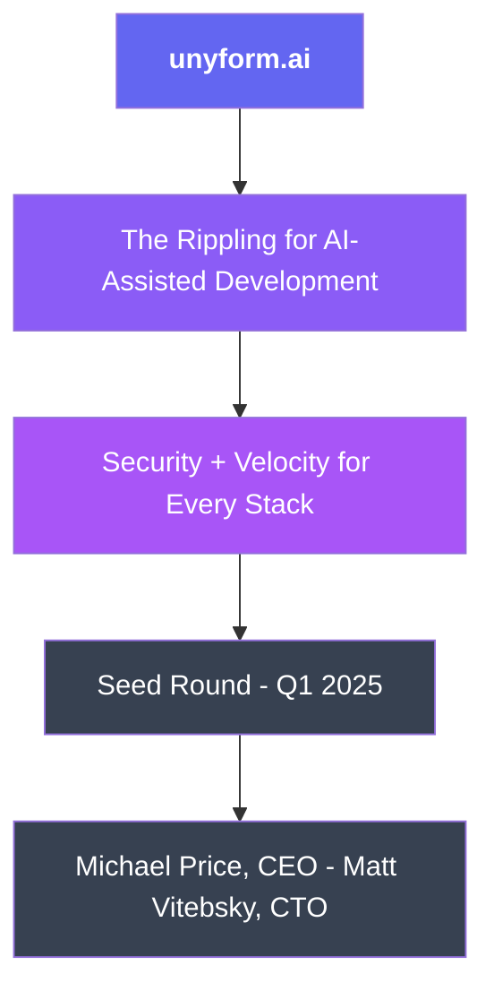

**Speaker Notes:**
> "unyform.ai is the Rippling for AI-assisted development. One central hub that connects to your entire stack—tailored to fit each organization like a fine tuxedo. Security AND velocity, not security OR velocity."

---

## Slide 2: The Problem

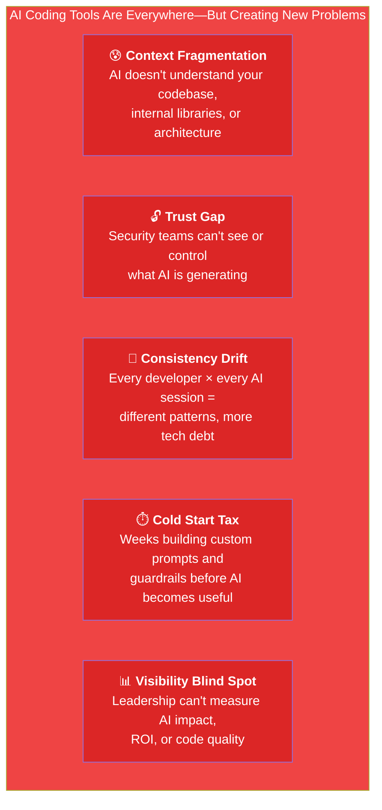

**Speaker Notes:**
> "92% of developers now use AI coding tools. But enterprises face a painful choice: block AI entirely and lose productivity, or allow it with zero visibility. CTOs are asking: 'How much of our code is AI-generated? Is it secure? Is it making us faster or creating tech debt?'"

---

## Slide 3: The Cost of Inconsistency

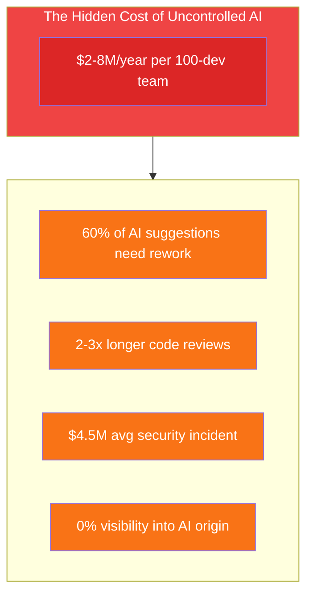

**Speaker Notes:**
> "Uncontrolled AI actually increases costs. 60% of AI output needs rework. Code reviews take 2-3x longer due to inconsistency. And here's the killer: leadership has ZERO visibility into how much code is AI-generated, whether it's secure, or what the ROI actually is."

---

## Slide 4: What Exists Today

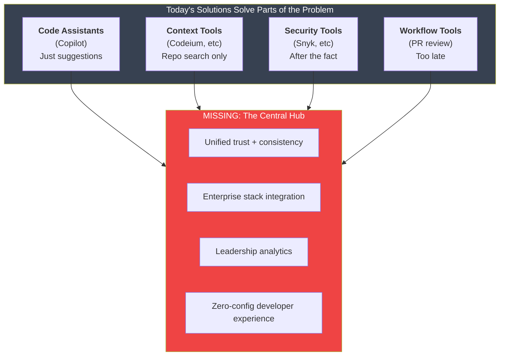

**Speaker Notes:**
> "The market is fragmented. Copilot gives suggestions but no governance. Snyk scans after code is written—too late. And critically: no one provides a central hub that connects ALL the tools, tailored to each enterprise's stack. Everyone has to integrate 5-10 tools separately."

---

## Slide 5: The Gap

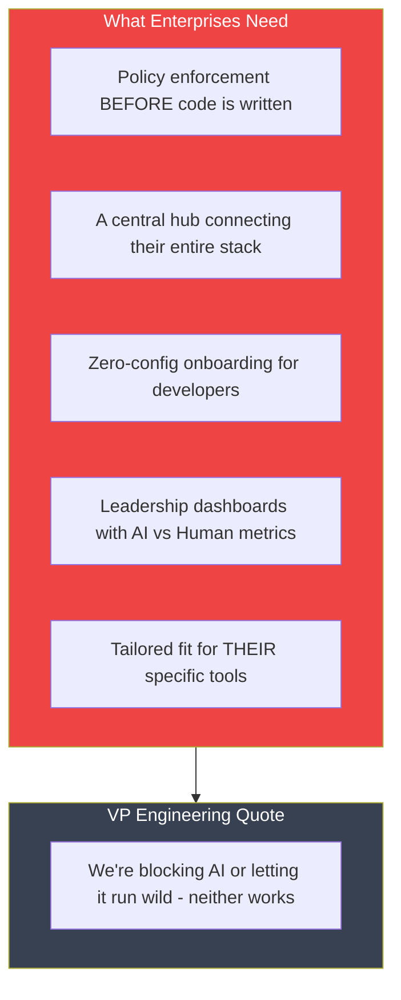

**Speaker Notes:**
> "Security teams tell us they're blocking AI or allowing it blind. But here's the real gap: leadership can't answer basic questions. How much code is AI-generated? Is it more or less buggy? Are we actually faster? No one can tell them—until now."

---

## Slide 6: The Solution

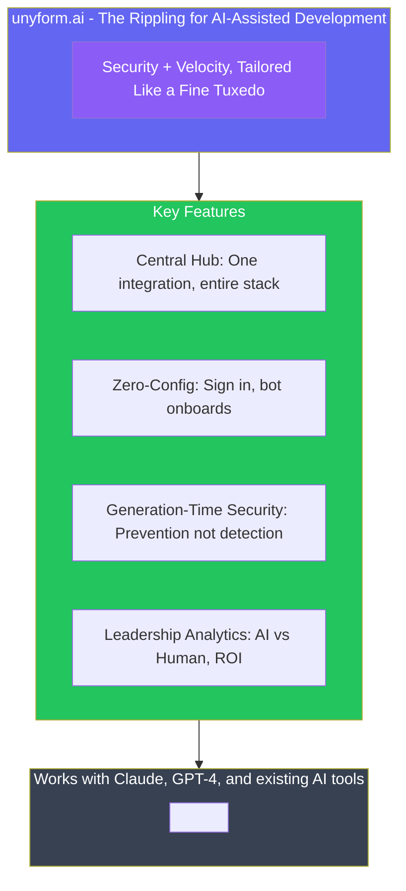

**Speaker Notes:**
> "unyform.ai is the central hub that connects AI to your entire stack. Platform team sets it up once—connects GitHub, Confluence, Jira. Developers just sign in. An onboarding bot walks them through. And leadership finally gets the dashboards they've been begging for: AI vs Human code, conformance, velocity, actual ROI."

---

## Slide 7: How It Works — The Hub Model

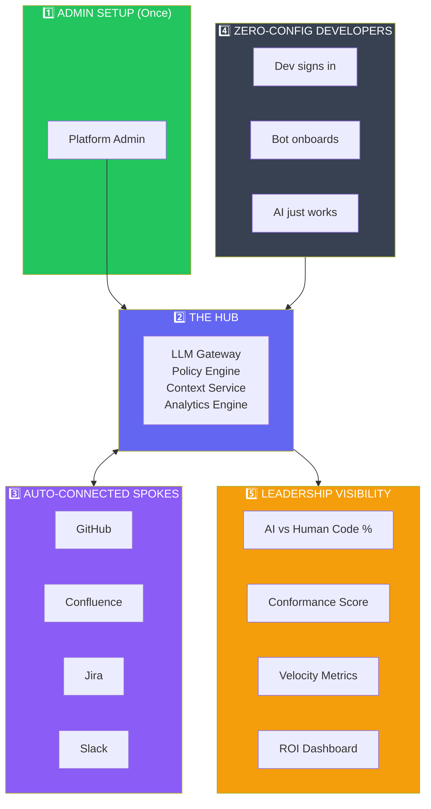

**Speaker Notes:**
> "Think of it like Rippling for HR. Admin sets it up once—connects GitHub, Confluence, Jira. The hub handles everything. Developers just sign in, our bot onboards them, and AI works with their existing tools. Leadership finally gets the dashboards: AI vs Human code, conformance, velocity, ROI."

---

## Slide 8: Developer Experience

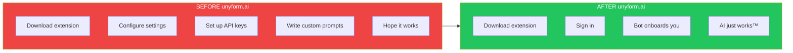

**Developer sees:**
- ✅ Policy Check Passed
- Context: `auth.ts`, `middleware.ts`, `jwt-utils.ts`
- Instruction Pack: `acme-standards-v2`
- Code Origin: This will be tracked as **AI-Generated**

```typescript
// Generated code uses YOUR internal libraries
export async function authMiddleware(req, res, next) {
  const token = req.headers.authorization?.split(' ')[1];
  if (!token) {
    return res.status(401).json({ error: 'Unauthorized' });
  }
  const user = await verifyJWT(token); // Uses YOUR internal lib
  req.user = user;
  next();
}
```

**Speaker Notes:**
> "Compare the experience. Before: download, configure, set up API keys, write custom prompts, hope it works. After: download, sign in, our bot connects everything, AI just works. And every line of code is tracked—leadership knows this is AI-generated and whether it conforms to standards."

---

## Slide 9: Key Differentiators

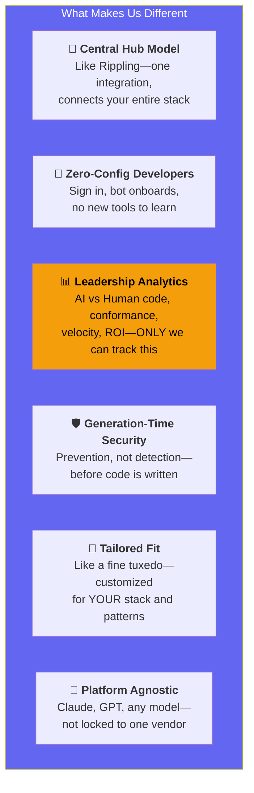

**The Killer Insight:**

> We're the ONLY system that knows the difference between AI-generated and human-written code. That means we're the ONLY ones who can tell leadership:
> - What % of code is AI-generated
> - Whether AI code is more or less buggy
> - True velocity impact of AI adoption
> - Actual ROI on AI investment

**Speaker Notes:**
> "Six differentiators, but one killer insight: we're the only system that can track AI vs Human code. No one else can answer these questions for leadership. That's our moat."

---

## Slide 10: Technology

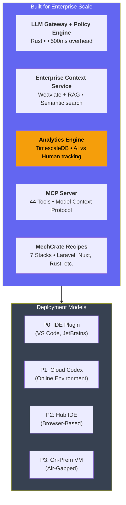

> "MechCrate is the foundation—it already works. unyform.ai is the enterprise hub on top. Multiple deployment paths, same governance."

**Speaker Notes:**
> "Rust for performance, Weaviate for semantic search, TimescaleDB for time-series analytics. We support multiple deployment models because every enterprise is different—IDE plugins, cloud environments, browser-based, or on-prem. Same hub, tailored delivery."

---

## Slide 11: Market Opportunity

```
┌─────────────────────────────────────────────────────────────────────────────┐
│                                                                             │
│                       Massive Market Opportunity                            │
│                                                                             │
├─────────────────────────────────────────────────────────────────────────────┤
│                                                                             │
│                                                                             │
│          ┌─────────────────────────────────────────────────────────┐       │
│          │                                                         │       │
│          │                    $51B                                 │       │
│          │                                                         │       │
│          │           Platform Engineering Market                   │       │
│          │                  by 2027                                │       │
│          │                                                         │       │
│          │              (Gartner)                                  │       │
│          │                                                         │       │
│          └─────────────────────────────────────────────────────────┘       │
│                                                                             │
│                                                                             │
│    ┌─────────────────┐   ┌─────────────────┐   ┌─────────────────┐        │
│    │                 │   │                 │   │                 │        │
│    │     $15B        │   │      92%        │   │      60%        │        │
│    │                 │   │                 │   │                 │        │
│    │   AI coding     │   │  Developer      │   │  Enterprises    │        │
│    │   tools by      │   │  AI adoption    │   │  cite security  │        │
│    │   2028          │   │  rate           │   │  as #1 barrier  │        │
│    │                 │   │                 │   │                 │        │
│    └─────────────────┘   └─────────────────┘   └─────────────────┘        │
│                                                                             │
│                                                                             │
│         Our target: $500M segment (AI governance for dev tools)             │
│                                                                             │
│                                                                             │
└─────────────────────────────────────────────────────────────────────────────┘
```

**Speaker Notes:**
> "The platform engineering market is projected to hit $51 billion by 2027. AI coding tools are a $15 billion market growing rapidly. 92% of developers use AI tools, but 60% of enterprises cite security as their top barrier to adoption. We're targeting a $500 million segment at the intersection: AI governance for development tools."

---

## Slide 12: Competitive Landscape

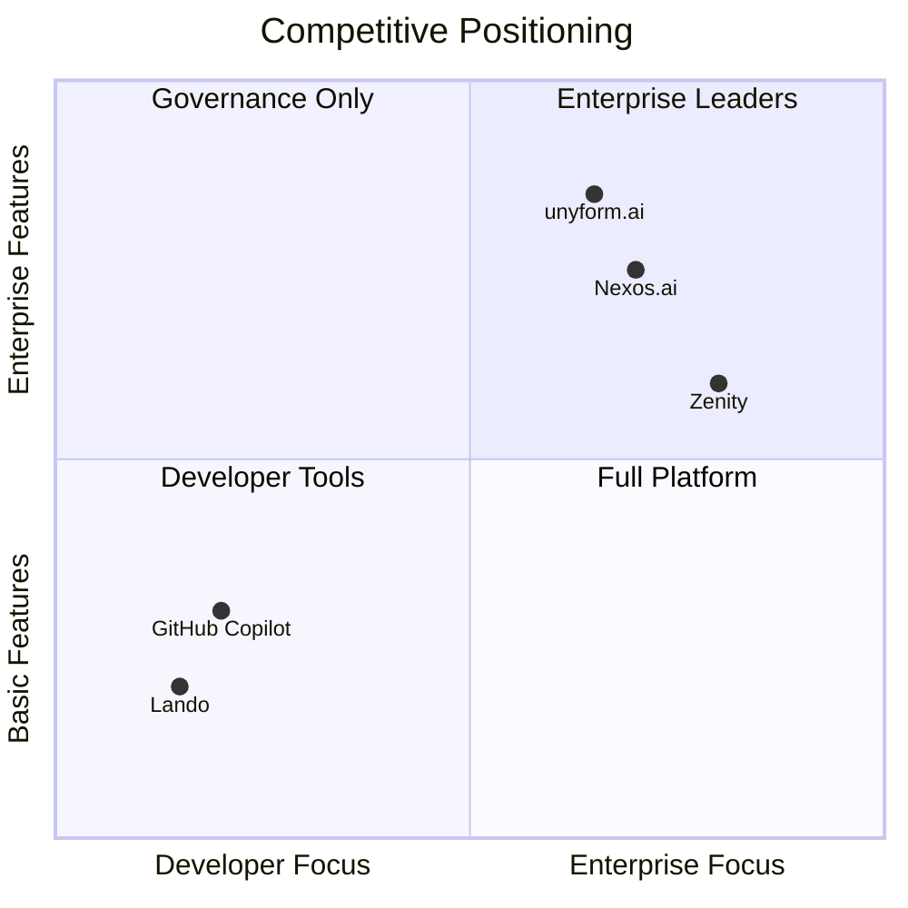

**unyform.ai differentiators:**
| Competitor | What They Do | What We Add |
|------------|--------------|-------------|
| Copilot | Suggestions | Governance + Analytics |
| Nexos.ai | DLP focus | Central hub + Scaffolding |
| Zenity | Risk mgmt | Developer experience |
| Lando | Local dev | Enterprise scale |

**Our Unique Position:**
- ✅ Central hub model (like Rippling)
- ✅ AI vs Human code tracking (ONLY us)
- ✅ Generation-time enforcement
- ✅ Zero-config developer experience
- ✅ 30-50% lower cost than pure enterprise

**Speaker Notes:**
> "We're the only ones combining enterprise governance with great developer experience. And we're the only ones who can track AI vs Human code—that's data no competitor can provide."

---

## Slide 13: Business Model

```mermaid
flowchart TB
    subgraph tiers ["SaaS Tiers"]
        subgraph community ["COMMUNITY"]
            C1["<b>FREE</b>"]
            C2["MechCrate CLI"]
            C3["7 Recipes"]
            C4["Community Support"]
        end
        
        subgraph team ["TEAM"]
            T1["<b>$49/seat/mo</b>"]
            T2["LLM Gateway + Policies"]
            T3["GitHub + Analytics"]
            T4["VS Code Extension"]
            T5["Onboarding Bot"]
        end
        
        subgraph enterprise ["ENTERPRISE"]
            E1["<b>Custom</b>"]
            E2["Unlimited Everything"]
            E3["SSO/SAML"]
            E4["Leadership Dashboard"]
            E5["Deployment Choice"]
        end
    end
    
    community --> team --> enterprise
    
    style community fill:#374151,color:#fff
    style team fill:#6366f1,color:#fff
    style enterprise fill:#8b5cf6,color:#fff
```

**Target Unit Economics:**
| Metric | Target |
|--------|--------|
| Gross Margin | >70% |
| CAC Payback | <12 months |
| LTV/CAC | >3x |
| Net Retention | >110% |

**Speaker Notes:**
> "Land with Team tier—$49/seat gets the hub, gateway, GitHub integration, and the onboarding bot. Expand to Enterprise for leadership dashboards, deployment flexibility, and unlimited analytics. Analytics drives the upsell: once leadership sees the AI vs Human data, they want the full dashboard."

---

## Slide 14: Traction

```
┌─────────────────────────────────────────────────────────────────────────────┐
│                                                                             │
│                        Current Traction                                     │
│                                                                             │
├─────────────────────────────────────────────────────────────────────────────┤
│                                                                             │
│                                                                             │
│   ┌───────────────────────────────────────────────────────────────────┐    │
│   │                                                                   │    │
│   │                     What We've Built                              │    │
│   │                                                                   │    │
│   │   ✅ MechCrate open source (foundation complete)                  │    │
│   │   ✅ 7 production-ready recipes                                   │    │
│   │   ✅ MCP Server with 44 tools                                     │    │
│   │   ✅ RAG documentation search (Weaviate)                          │    │
│   │   ✅ Cloudflare infrastructure templates                          │    │
│   │   ✅ Docker + Traefik scaffolding                                 │    │
│   │                                                                   │    │
│   └───────────────────────────────────────────────────────────────────┘    │
│                                                                             │
│                                                                             │
│   ┌───────────────────────────────────────────────────────────────────┐    │
│   │                                                                   │    │
│   │                     What's Next (MVP)                             │    │
│   │                                                                   │    │
│   │   🔄 LLM Gateway with policy enforcement                          │    │
│   │   🔄 GitHub connector for repo ingestion                          │    │
│   │   🔄 Organization instruction packs                               │    │
│   │   🔄 Audit log with compliance export                             │    │
│   │   🔄 VS Code extension                                            │    │
│   │                                                                   │    │
│   └───────────────────────────────────────────────────────────────────┘    │
│                                                                             │
│                                                                             │
│              MVP target: June 2025 | First pilots: Q1 2025                  │
│                                                                             │
│                                                                             │
└─────────────────────────────────────────────────────────────────────────────┘
```

**Speaker Notes:**
> "We're not starting from scratch. MechCrate—our open-source foundation—is already working. We have 7 recipes, 44 MCP tools, RAG search, and Cloudflare templates. The MVP adds the LLM Gateway, policy engine, GitHub connector, and VS Code extension. We're targeting first pilots in Q1 and full MVP by June 2025."

---

## Slide 15: Roadmap

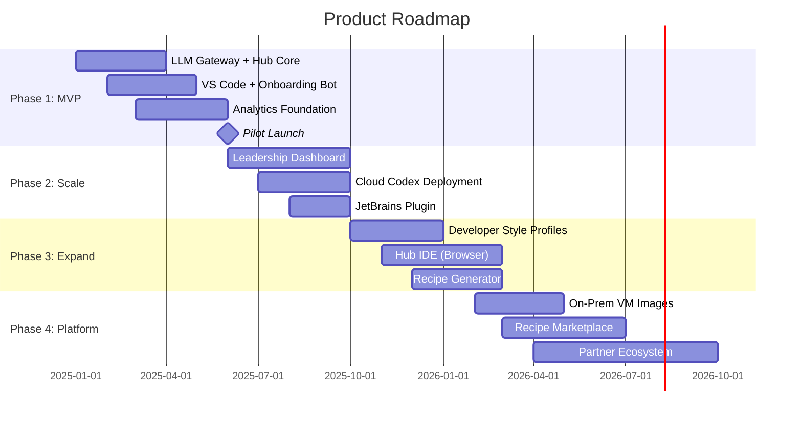

**Key Milestones:**

| Phase | Deliverable | Target |
|-------|-------------|--------|
| **Phase 1** | Hub MVP + IDE Plugin + Analytics | Q2 2025 |
| **Phase 2** | Leadership Dashboard + Cloud Codex | Q3-Q4 2025 |
| **Phase 3** | Hub IDE + Personalization | Q1 2026 |
| **Phase 4** | On-Prem + Marketplace | Q2 2026 |

**Speaker Notes:**
> "Phase 1 delivers the hub, IDE plugin with onboarding bot, and analytics foundation. Phase 2 adds the leadership dashboard they'll pay for and Cloud Codex as an alternative deployment. Phase 3 expands to browser-based IDE. Phase 4 adds on-prem for regulated industries and the marketplace ecosystem."

---

## Slide 16: Team

```
┌─────────────────────────────────────────────────────────────────────────────┐
│                                                                             │
│                           The Team                                          │
│                                                                             │
├─────────────────────────────────────────────────────────────────────────────┤
│                                                                             │
│                                                                             │
│        ┌─────────────────────────────────────────────────────────┐         │
│        │                                                         │         │
│        │   ┌─────────┐                    ┌─────────┐            │         │
│        │   │         │                    │         │            │         │
│        │   │  [pic]  │                    │  [pic]  │            │         │
│        │   │         │                    │         │            │         │
│        │   └─────────┘                    └─────────┘            │         │
│        │                                                         │         │
│        │   Michael Price                  Matt Vitebsky          │         │
│        │   CEO & Co-founder               CTO & Co-founder       │         │
│        │                                                         │         │
│        │   • 15+ years engineering        • 15+ years systems    │         │
│        │   • Founded 2 companies          • Ex-Amazon, Ex-Google │         │
│        │   • Enterprise SaaS focus        • Platform engineering │         │
│        │   • M&A experience               • Open source leader   │         │
│        │                                                         │         │
│        └─────────────────────────────────────────────────────────┘         │
│                                                                             │
│                                                                             │
│        ┌─────────────────────────────────────────────────────────┐         │
│        │                                                         │         │
│        │   "We've built infrastructure platforms before.         │         │
│        │    We know what enterprise teams need."                 │         │
│        │                                                         │         │
│        └─────────────────────────────────────────────────────────┘         │
│                                                                             │
│                                                                             │
└─────────────────────────────────────────────────────────────────────────────┘
```

**Speaker Notes:**
> "Michael brings 15 years of enterprise SaaS experience, having founded two companies and led M&A transactions. Matt is a systems engineer with experience at Amazon and Google, specializing in platform engineering and open-source projects. We've built infrastructure platforms before—we know what enterprise teams need."

---

## Slide 17: The Ask

```
┌─────────────────────────────────────────────────────────────────────────────┐
│                                                                             │
│                            The Ask                                          │
│                                                                             │
├─────────────────────────────────────────────────────────────────────────────┤
│                                                                             │
│                                                                             │
│           ┌───────────────────────────────────────────────┐                │
│           │                                               │                │
│           │              $2M Seed Round                   │                │
│           │                                               │                │
│           └───────────────────────────────────────────────┘                │
│                                                                             │
│                                                                             │
│           Use of Funds                                                      │
│           ─────────────                                                     │
│                                                                             │
│           ┌────────────────────────────────────────────────────────────┐   │
│           │                                                            │   │
│           │   Engineering (50%)          $1,000,000                    │   │
│           │   ├── 3 engineers (Gateway, Policy, Frontend)              │   │
│           │   └── Infrastructure and tooling                           │   │
│           │                                                            │   │
│           │   Go-to-Market (30%)         $600,000                      │   │
│           │   ├── Head of Sales                                        │   │
│           │   ├── Developer Advocate                                   │   │
│           │   └── Marketing programs                                   │   │
│           │                                                            │   │
│           │   Operations (20%)           $400,000                      │   │
│           │   ├── Legal and compliance                                 │   │
│           │   ├── Security audit (SOC2)                                │   │
│           │   └── Runway buffer                                        │   │
│           │                                                            │   │
│           └────────────────────────────────────────────────────────────┘   │
│                                                                             │
│                                                                             │
│           18-month runway to $1M ARR and Series A                           │
│                                                                             │
│                                                                             │
└─────────────────────────────────────────────────────────────────────────────┘
```

**Speaker Notes:**
> "We're raising a $2M seed round. 50% goes to engineering—hiring 3 engineers to build out the gateway, policy engine, and IDE integrations. 30% goes to go-to-market—head of sales, developer advocate, and marketing programs. 20% covers operations including SOC2 compliance. This gives us 18 months of runway to hit $1M ARR and position for Series A."

---

## Slide 18: Vision

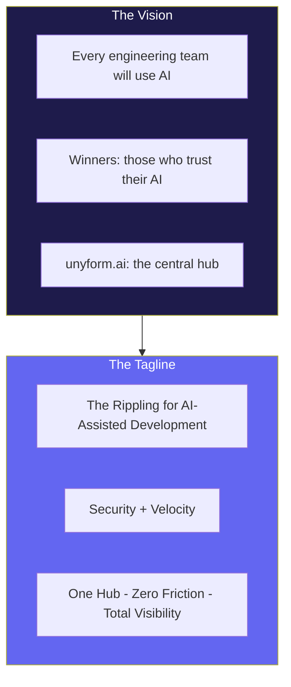

**From every angle:**
- **Developers:** Zero new tools, just sign in and AI works better
- **Platform Teams:** One integration, connects entire stack
- **Security:** Generation-time enforcement, not after-the-fact scanning  
- **Leadership:** Finally see AI vs Human code, conformance, velocity, ROI

**Speaker Notes:**
> "Every engineering team will use AI. The winners will be those who can trust their AI. unyform.ai is the central hub that makes that possible—like Rippling made HR tools work together. Security plus velocity, tailored like a fine tuxedo for each enterprise's unique stack."

---

## Slide 19: Contact

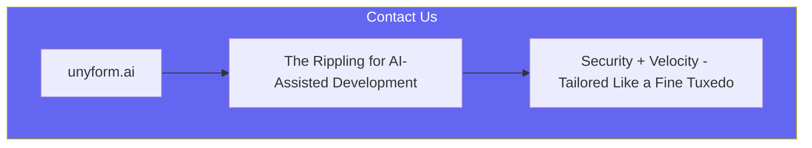

**hello@unyform.ai**

**unyform.ai** | **github.com/unyform**

---

| Michael Price | Matt Vitebsky |
|---------------|---------------|
| CEO & Co-founder | CTO & Co-founder |
| michael@unyform.ai | matt@unyform.ai |

---

**Speaker Notes:**
> "Thank you for your time. We're building the central hub for AI-assisted development—like Rippling did for HR. Security plus velocity, tailored for each enterprise. Let's talk about how we can make AI work the way your portfolio companies build."

---

## Appendix Slides

### A1: Detailed Financial Projections

```
Year 1:
  Q1: $0 (pilots)
  Q2: $117K ARR (10 teams)
  Q3: $367K ARR (25 teams)
  Q4: $882K ARR (50 teams)

Year 2:
  Q1: $1.56M ARR
  Q2: $2.4M ARR
  Q3: $3.5M ARR
  Q4: $4.8M ARR (+ enterprise)
```

### A2: Customer Testimonials

*(To be added after pilot completion)*

### A3: Detailed Competitive Analysis

*(See COMPETITIVE_ANALYSIS.md)*

### A4: Technical Architecture Deep Dive

*(See TECHNICAL_ARCHITECTURE.md)*

---

**Presentation Notes:**

| Slide | Time | Key Point |
|-------|------|-----------|
| 1 | 30s | Hook with tagline |
| 2-5 | 3 min | Problem + gap |
| 6-8 | 4 min | Solution + demo |
| 9-10 | 2 min | Differentiation |
| 11-12 | 2 min | Market + competition |
| 13-14 | 2 min | Business model + traction |
| 15-16 | 2 min | Roadmap + team |
| 17-18 | 2 min | Ask + vision |
| 19 | 30s | Close |

**Total: ~18 minutes** (leaves room for Q&A in 30-minute meeting)

---

**Document History:**

| Version | Date | Author | Changes |
|---------|------|--------|---------|
| 1.0 | Jan 2025 | Michael Price | Initial draft |

---

*AI that builds like your team builds.*
