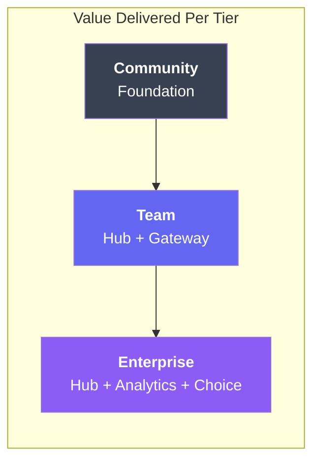
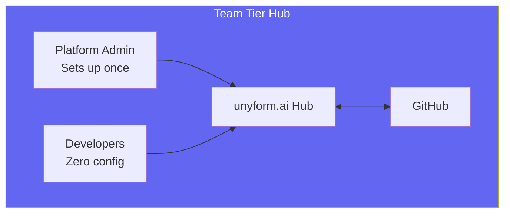
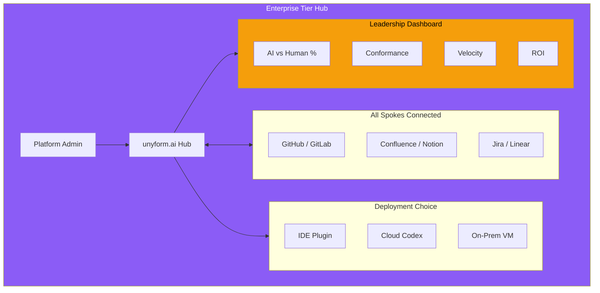
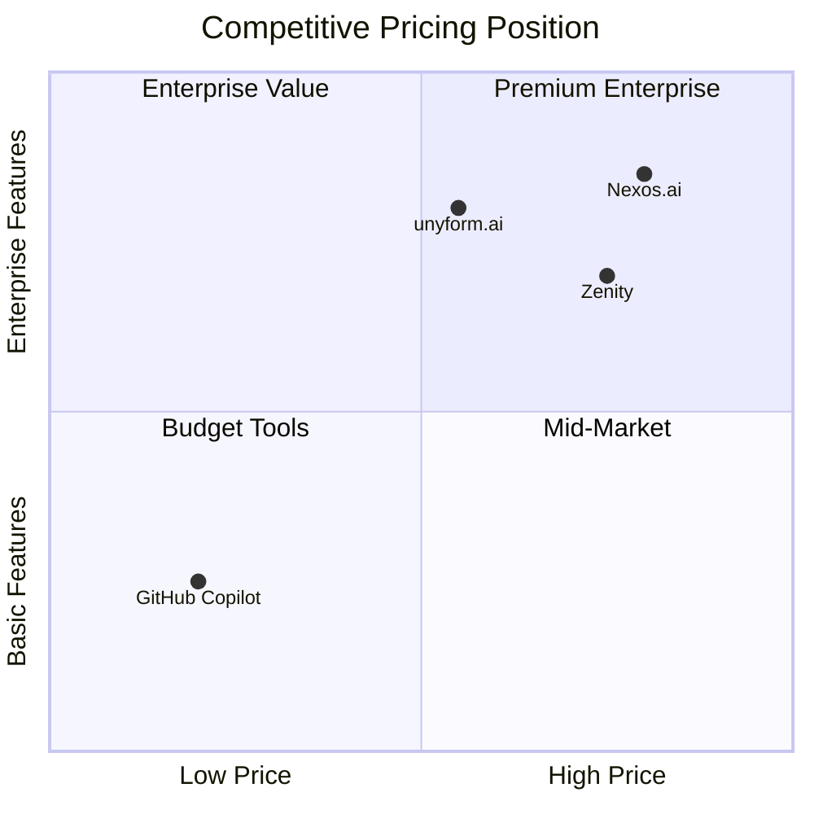
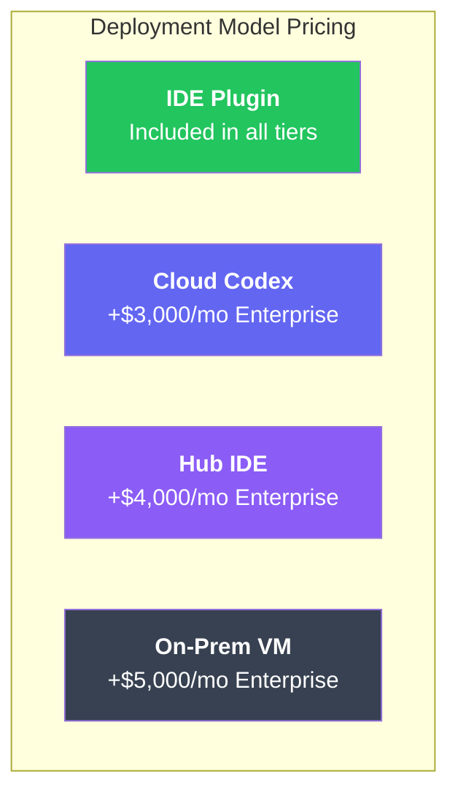
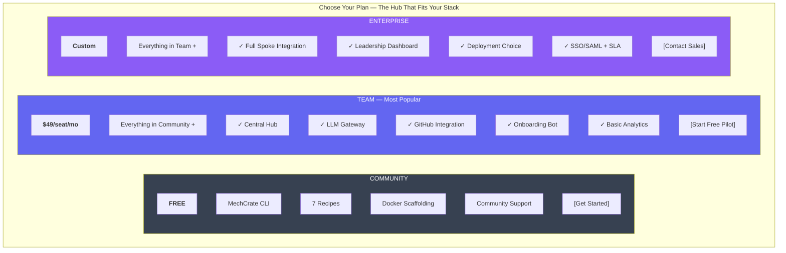
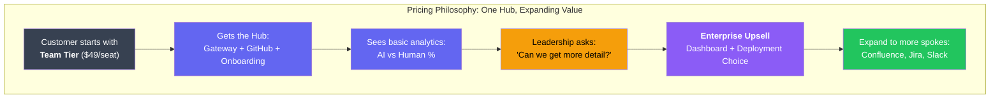

# unyform.ai Pricing Strategy

## Packaging and Unit Economics

**Version:** 2.0  
**Date:** January 2025  
**Owner:** Business Team  
**Status:** Draft

---

## 1. Pricing Philosophy

### 1.1 The Hub Model Value Proposition

**The Rippling for AI-Assisted Development**



### 1.2 Core Principles

| Principle | Implementation |
|-----------|----------------|
| **Value-Based** | Price reflects ROI (security incidents prevented, velocity gained, leadership visibility) |
| **Land & Expand** | Start with Team hub, expand to Enterprise for analytics + deployment choice |
| **Transparent** | No hidden fees, clear feature boundaries |
| **Hub-Centric** | One integration, unlimited value expansion |
| **Predictable** | Monthly/annual plans with clear limits |

### 1.2 Pricing Model

**Primary Model:** Per-seat subscription with usage-based components

```
Total Cost = (Seats × Seat Price) + (Usage Overage) + (Add-ons)
```

**Why Per-Seat:**
- Aligns with developer tool market expectations
- Predictable budgeting for customers
- Natural growth with team size
- Simple to understand and sell

**Why Not Pure Usage:**
- Hard to predict monthly costs
- Creates friction on usage (bad for adoption)
- Complex billing conversations

---

## 2. Tier Structure

### 2.1 Overview

| Tier | Price | Target | Primary Value |
|------|-------|--------|---------------|
| **Community** | Free | Individual devs, OSS | MechCrate scaffolding |
| **Team** | $49/seat/mo | Growth teams (5-50) | AI governance + context |
| **Enterprise** | Custom | Large orgs (50+) | SSO, self-hosted, SLA |

### 2.2 Community Tier (Free)

**Target Customer:**
- Individual developers
- Open source projects
- Startups evaluating tools
- Students and educators

**Included:**
| Feature | Limit |
|---------|-------|
| MechCrate CLI (`mx`) | Unlimited |
| Standard recipes | All 7 recipes |
| Docker scaffolding | Unlimited projects |
| Community support | Discord only |
| Documentation | Full access |

**Not Included:**
- LLM Gateway
- Policy enforcement
- GitHub connector
- Audit logs
- Instruction packs

**Goal:** Build community, establish MechCrate as standard, create upgrade path.

---

### 2.3 Team Tier ($49/seat/month)

**Target Customer:**
- Growth-stage startups
- Teams of 5-50 developers
- Companies with security requirements
- Platform engineering teams

**The Hub Experience:**


**Included:**
| Feature | Limit |
|---------|-------|
| Everything in Community | ✓ |
| **LLM Gateway (Hub)** | 10,000 requests/seat/month |
| **Policy Engine** | Up to 50 policies |
| **GitHub Connector** | Up to 20 repositories |
| **Organization Instruction Packs** | Up to 5 packs |
| **Audit Log** | 90-day retention |
| **VS Code Extension + Onboarding Bot** | ✓ |
| **Basic Analytics** | AI vs Human code % |
| Model support | Claude, GPT-4, GPT-3.5 |
| Support | Email (48h response) |

**Billing:**
- Monthly or annual (2 months free on annual)
- Minimum 5 seats
- Annual: $49 × 10 months = $490/seat/year

**Overages:**
| Resource | Overage Price |
|----------|---------------|
| Requests | $0.002/request over limit |
| Repositories | $20/repo/month over limit |
| Policies | $5/policy/month over limit |

---

### 2.4 Enterprise Tier (Custom)

**Target Customer:**
- Large organizations (50+ developers)
- Regulated industries (finance, healthcare)
- Companies requiring compliance
- Leadership demanding AI visibility

**The Enterprise Hub Experience:**


**Included:**
| Feature | Limit |
|---------|-------|
| Everything in Team | ✓ |
| **Unlimited requests** | Fair use policy |
| **Unlimited repositories** | All org repos |
| **Unlimited policies** | Custom policy library |
| **Full Spoke Integration** | Confluence, Jira, Slack, etc. |
| **SSO/SAML** | Okta, Azure AD, etc. |
| **Deployment Choice** | IDE Plugin, Cloud Codex, Hub IDE, On-Prem |
| **SLA** | 99.9% uptime guarantee |
| **Leadership Analytics Dashboard** | Full Five Pillars metrics |
| **Dedicated support** | Slack channel, 4h response |
| **Custom integrations** | JetBrains, CI/CD, etc. |
| **Audit export** | SIEM integration |
| Model support | All + bring your own |
| Advanced security | SOC2, HIPAA, etc. |

**Pricing Structure:**
```
Base Platform Fee: $10,000/month (up to 100 seats)
Additional Seats: $39/seat/month

Add-ons:
  Leadership Analytics Dashboard: +$2,500/month
  Cloud Codex Deployment: +$3,000/month
  On-Prem VM Deployment: +$5,000/month
  HIPAA Compliance: +$2,500/month
  Dedicated Instance: +$3,000/month
```

**Typical Enterprise Deal:**
- 100 developers + Analytics: $12,500/month
- 200 developers + Analytics + On-Prem: $10,000 + ($39 × 100) + $2,500 + $5,000 = $21,400/month
- The leadership dashboard often drives the upsell from Team to Enterprise

---

## 3. Feature Packaging Matrix

| Feature | Community | Team | Enterprise |
|---------|-----------|------|------------|
| **MechCrate CLI** | ✓ | ✓ | ✓ |
| **Standard Recipes** | ✓ | ✓ | ✓ |
| **Docker Scaffolding** | ✓ | ✓ | ✓ |
| **LLM Gateway (Hub)** | ✗ | ✓ | ✓ |
| **Policy Engine** | ✗ | Up to 50 | Unlimited |
| **GitHub Connector** | ✗ | Up to 20 repos | Unlimited |
| **Full Spoke Integration** | ✗ | GitHub only | All (Confluence, Jira, etc.) |
| **Instruction Packs** | ✗ | Up to 5 | Unlimited |
| **Audit Log** | ✗ | 90 days | Unlimited + export |
| **VS Code Extension + Onboarding Bot** | ✗ | ✓ | ✓ |
| **JetBrains Plugin** | ✗ | ✗ | ✓ |
| **CI/CD Integration** | ✗ | ✓ | ✓ |
| **Basic Analytics** (AI vs Human %) | ✗ | ✓ | ✓ |
| **Leadership Analytics Dashboard** | ✗ | ✗ | ✓ (add-on or included) |
| **SSO/SAML** | ✗ | ✗ | ✓ |
| **Deployment Choice** | N/A | IDE Plugin only | IDE, Cloud, Hub IDE, On-Prem |
| **SLA** | ✗ | ✗ | 99.9% |
| **Support** | Discord | Email (48h) | Dedicated (4h) |
| **Model Support** | N/A | Claude, GPT-4 | All + BYOM |
| **Request Limit** | N/A | 10K/seat/mo | Unlimited |

---

## 4. Unit Economics

### 4.1 Cost Structure (Team Tier)

**Per-Seat Costs:**

| Cost Component | Monthly Cost | % of Revenue |
|----------------|--------------|--------------|
| LLM API costs | $5.00 | 10.2% |
| Infrastructure (compute, storage) | $3.00 | 6.1% |
| Vector DB (Weaviate) | $2.00 | 4.1% |
| GitHub API | $0.50 | 1.0% |
| Support allocation | $2.00 | 4.1% |
| **Total COGS** | **$12.50** | **25.5%** |
| **Gross Margin** | **$36.50** | **74.5%** |

**LLM API Cost Breakdown:**
```
Avg requests/seat/month: 5,000
Avg tokens/request: 2,000 (input + output)
Total tokens/seat/month: 10M

Claude Sonnet pricing: $3/$15 per 1M tokens
Blended cost: ~$5/seat/month
```

### 4.2 Cost Structure (Enterprise Tier)

**Per 100-Seat Block:**

| Cost Component | Monthly Cost | % of Revenue |
|----------------|--------------|--------------|
| LLM API costs | $300 | 3.0% |
| Infrastructure | $500 | 5.0% |
| Vector DB | $300 | 3.0% |
| Dedicated support | $1,000 | 10.0% |
| Account management | $500 | 5.0% |
| **Total COGS** | **$2,600** | **26.0%** |
| **Gross Margin** | **$7,400** | **74.0%** |

### 4.3 Target Metrics

| Metric | Target | Rationale |
|--------|--------|-----------|
| Gross Margin | >70% | SaaS standard |
| CAC Payback | <12 months | B2B SaaS benchmark |
| LTV/CAC | >3x | Healthy unit economics |
| Net Revenue Retention | >110% | Expansion revenue |
| Churn | <5% annual | Enterprise stickiness |

---

## 5. Competitive Pricing Analysis

### 5.1 Comparable Products

| Product | Pricing Model | Price Range | Notes |
|---------|---------------|-------------|-------|
| **GitHub Copilot Business** | Per seat | $19/seat/mo | Code completion only |
| **Copilot Enterprise** | Per seat | $39/seat/mo | + knowledge base |
| **Snyk** | Per seat/usage | $50-100/dev/mo | Security scanning |
| **SonarQube Enterprise** | Per LOC | $5K-50K/year | Code quality |
| **LaunchDarkly** | Per seat | $16-30/seat/mo | Feature flags |
| **Nexos.ai** | Custom | Unknown | AI governance |
| **Backstage** | Self-hosted | Free + ops cost | Developer portal |

### 5.2 Positioning



**Value Proposition:**
- 50-80% of Nexos.ai capabilities at 30-50% of price
- More than Copilot alone (governance + hub + analytics)
- Central hub model (unique—like Rippling for AI)
- AI vs Human code tracking (unique—no competitor has this)
- Built-in infrastructure scaffolding (unique)

---

## 6. Pilot Pricing

### 6.1 Pilot Program Structure

**Qualified Prospects:**
- 10+ developers
- Security or compliance requirements
- GitHub-based workflow
- Executive sponsor identified

**Pilot Offer:**
| Element | Details |
|---------|---------|
| Duration | 6 weeks |
| Price | **Free** (Team tier value) |
| Setup | Included white-glove onboarding |
| Success criteria | Defined upfront |
| Conversion incentive | 20% off first year if converting within 2 weeks |

### 6.2 Pilot Success Criteria

| Metric | Target |
|--------|--------|
| Active users | >80% of pilot team |
| Requests per user | >100/week |
| Policies enforced | >10 active |
| Violations caught | >20/month |
| Developer satisfaction | >7/10 |
| Security lead approval | Yes |

### 6.3 Post-Pilot Conversion

```
Pilot Week 6 → Review Meeting → Quote Delivery → Negotiation → Close

Conversion Timeline:
- Week 6: Pilot review, present results
- Week 7: Deliver formal quote
- Week 8-9: Negotiation
- Week 10: Close or churn analysis
```

---

## 7. Enterprise Negotiation Guide

### 7.1 Standard Discounts

| Discount Type | Max Discount | Approval Required |
|---------------|--------------|-------------------|
| Annual prepay | 17% (2 mo free) | Automatic |
| Multi-year (2 yr) | 25% | Sales Director |
| Multi-year (3 yr) | 35% | VP Sales |
| Volume (100+ seats) | 10% | Sales Manager |
| Volume (500+ seats) | 20% | Sales Director |
| Strategic account | Up to 40% | CEO |

### 7.2 Floor Pricing

| Tier | Floor Price | Notes |
|------|-------------|-------|
| Team | $35/seat/mo | Minimum for any deal |
| Enterprise Base | $7,500/mo | Below impacts support |
| Enterprise Seat | $29/seat/mo | Volume minimum |

### 7.3 Deal Sweeteners (Non-Discount)

Instead of price reductions, offer:
- Extended pilot (8 weeks vs 6)
- Additional repositories included
- Custom policy development
- Training sessions (up to 3)
- Priority support upgrade
- Early access to new features
- Dedicated Slack channel

---

## 8. Future Pricing Evolution

### 8.1 Deployment Model Pricing (Phase 2+)

**Multiple Paths to the Hub:**


### 8.2 Analytics Upsell Path

**The Leadership Dashboard drives Enterprise upsell:**
```
Team Tier → Customer sees basic AI vs Human %
         → Leadership asks "can we get more detail?"
         → Upsell to Enterprise + Analytics Dashboard
         → Five Pillars: Origin, Conformance, Velocity, Quality, ROI
```

### 8.3 Usage-Based Options (Phase 2)

**Potential Model:**
```
Team Flex: $25/seat/mo base + $0.005/request
- Lower base price for cost-conscious teams
- Scales with actual usage
- Cap at Team price (so never more expensive)
```

### 8.4 Marketplace Revenue (Phase 4)

**Recipe Marketplace:**
- 70/30 revenue share (creator/unyform)
- Suggested price: $5-50/recipe/org
- Premium recipes: $100-500/org

**Connector Marketplace (Spokes):**
- 80/20 revenue share
- Enterprise connectors: $500-2000/mo
- Third-party spoke integrations

### 8.5 Partner Pricing

| Partner Type | Model | Revenue Share |
|--------------|-------|---------------|
| Reseller | Wholesale discount | 20-30% margin |
| Implementation | Referral fee | 10% year 1 |
| Technology | Integration | Case by case |
| Consulting | Co-sell | 15% revenue share |

---

## 9. Pricing Communication

### 9.1 Website Pricing Page



### 9.2 FAQ

**Q: What happens if I exceed my request limit?**
> Requests over the limit are charged at $0.002/request. You'll receive alerts at 80% and 100% of your limit.

**Q: Can I change plans mid-cycle?**
> Yes! Upgrades are prorated and take effect immediately. Downgrades take effect at the next billing cycle.

**Q: Do you offer discounts for startups?**
> Yes! Startups with <$5M in funding get 50% off Team tier for the first year. Apply at unyform.ai/startups.

**Q: Is there a free trial?**
> We offer a 6-week free pilot for qualified teams. This includes white-glove hub setup and success criteria definition.

**Q: What's the onboarding experience like?**
> For Team tier: Platform admin sets up the hub once, connects GitHub. Developers download the VS Code extension, sign in, and our onboarding bot walks them through—zero manual configuration.

**Q: What's included in the Leadership Analytics Dashboard?**
> The Five Pillars: AI vs Human code %, Conformance scores, Velocity metrics, Quality/security tracking, and ROI calculations. This is an Enterprise feature (or add-on).

**Q: Can we choose how to deploy unyform.ai?**
> Enterprise tier offers deployment choice: IDE Plugin (default), Cloud Codex (online environment), Hub IDE (browser-based), or On-Prem VM (air-gapped). Team tier is IDE Plugin only.

**Q: What payment methods do you accept?**
> Credit card for Team tier. Invoicing available for Enterprise tier (Net 30).

---

## 10. Revenue Projections

### 10.1 Year 1 Targets

| Quarter | Teams | Avg Seats | MRR | ARR |
|---------|-------|-----------|-----|-----|
| Q1 | 5 pilots | 15 | $0 | $0 |
| Q2 | 10 | 20 | $9,800 | $117,600 |
| Q3 | 25 | 25 | $30,625 | $367,500 |
| Q4 | 50 | 30 | $73,500 | $882,000 |

**Assumptions:**
- 50% pilot conversion rate
- 10% monthly seat growth per customer
- 95% retention
- No enterprise deals in Year 1

### 10.2 Year 2 Targets

| Quarter | Team Customers | Enterprise | MRR | ARR |
|---------|---------------|------------|-----|-----|
| Q1 | 75 | 2 | $130K | $1.56M |
| Q2 | 100 | 5 | $200K | $2.4M |
| Q3 | 130 | 8 | $290K | $3.5M |
| Q4 | 160 | 12 | $400K | $4.8M |

**Assumptions:**
- Landing first enterprise customers
- $15K avg enterprise MRR
- Continued team tier growth
- 110% net revenue retention

---

## 11. Implementation Checklist

### 11.1 Pre-Launch

- [ ] Finalize pricing with team input
- [ ] Set up Stripe billing
- [ ] Implement usage tracking
- [ ] Create pricing page
- [ ] Prepare sales materials
- [ ] Train sales team
- [ ] Set up pilot process

### 11.2 Launch

- [ ] Announce pricing publicly
- [ ] Enable self-serve signup (Team)
- [ ] Begin pilot outreach
- [ ] Monitor conversion metrics
- [ ] Gather pricing feedback

### 11.3 Post-Launch (90 days)

- [ ] Analyze conversion rates
- [ ] Review churn reasons
- [ ] Adjust overage pricing if needed
- [ ] Evaluate enterprise pricing
- [ ] Plan Year 2 pricing changes

---

**Document History:**

| Version | Date | Author | Changes |
|---------|------|--------|---------|
| 1.0 | Jan 2025 | Business Team | Initial draft |

---

## 12. The Hub Model Pricing Summary



**Key Insight:** The leadership analytics dashboard is the natural upsell driver. Once leadership sees basic AI vs Human metrics, they want the full Five Pillars. That's when Team becomes Enterprise.

---

*Fair pricing for unfair advantages. Security + Velocity, tailored like a fine tuxedo.*
