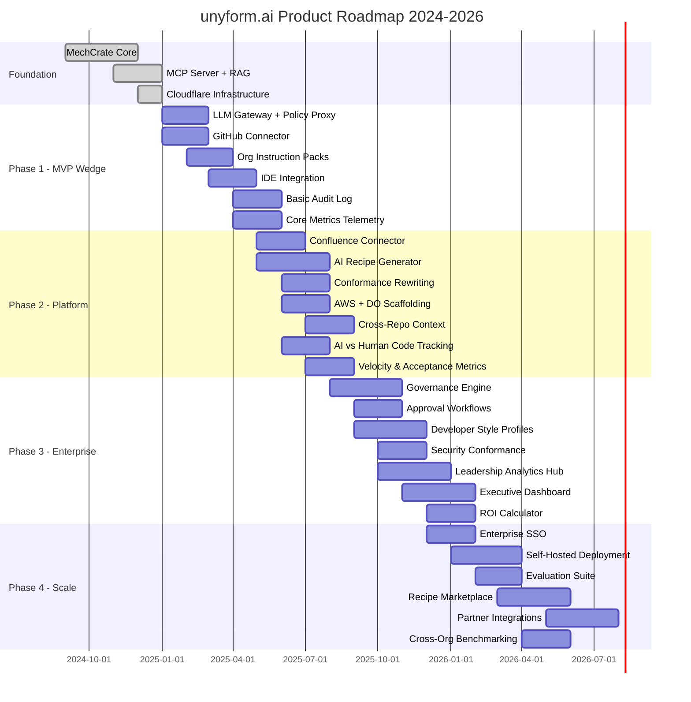
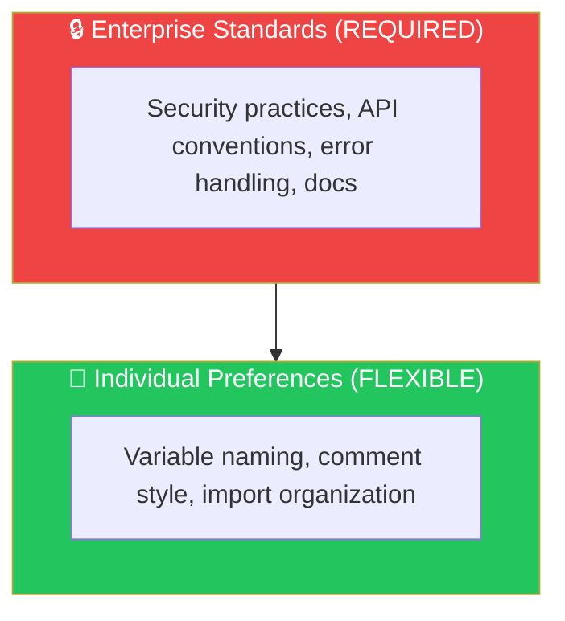
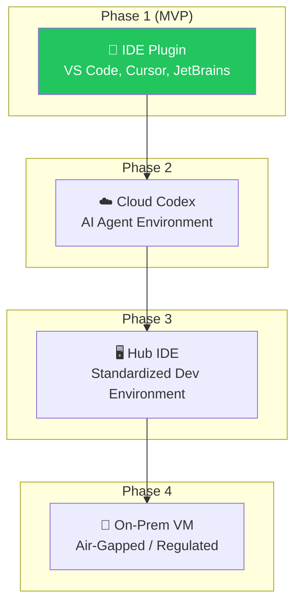

# unyform.ai Product Roadmap

## Vision

Transform how engineering teams build and maintain infrastructure by creating AI systems that understand and enforce organizational standards—making AI-generated code safe, consistent, and organization-aware from local development to production deployment.

---

## Core Product Thesis

Enterprises will pay for a layer that makes AI safe, consistent, and reliable across the organization, because:

1. It **lowers security and compliance risk** with enforcement at generation time
2. It **lowers maintenance burden** by standardizing patterns automatically
3. It **increases developer throughput** by removing prompt and context setup work
4. It **enables leadership** to scale AI adoption confidently with audit trails

---

## Roadmap Overview



---

## Phase 0: Foundation (COMPLETE)

**Status:** ✅ Complete  
**Timeline:** Q4 2024 - Q1 2025

The foundation phase established the core technology that powers unyform.ai.

### Deliverables

#### MechCrate CLI (`mx`)

The command-line interface for project scaffolding and service management.

| Feature | Status |
|---------|--------|
| Project creation (`mx new`) | ✅ Complete |
| Service addition (`mx add`) | ✅ Complete |
| Router management (`mx router`) | ✅ Complete |
| Infrastructure setup (`mx infra`) | ✅ Complete |
| Health checks (`mx doctor`) | ✅ Complete |

#### Recipe System

Pre-built, production-ready templates for common tech stacks.

| Recipe | Tech Stack | Status |
|--------|------------|--------|
| `laravel` | PHP 8.3, Laravel 11, Nginx, PHP-FPM | ✅ Complete |
| `nuxt` | Nuxt 3, Node 24, Tailwind, DaisyUI | ✅ Complete |
| `astro` | Astro 4, Vue, Tailwind | ✅ Complete |
| `rust-api` | Rust, Axum, PostgreSQL | ✅ Complete |
| `rust-leptos` | Rust, Leptos SSR | ✅ Complete |
| `rust-worker` | Rust, Cloudflare Workers | ✅ Complete |
| `zola` | Zola Static Site Generator | ✅ Complete |

#### MCP Server

Model Context Protocol server enabling LLM integration.

| Feature | Status |
|---------|--------|
| 44 tools for project operations | ✅ Complete |
| RAG documentation search | ✅ Complete |
| Weaviate vector store integration | ✅ Complete |
| Auto-start capability | ✅ Complete |
| Multi-instance support | ✅ Complete |

#### Infrastructure Templates

| Provider | Features | Status |
|----------|----------|--------|
| Cloudflare | Workers, Containers, Cron | ✅ Complete |

#### Documentation Library

- 53 technical documents
- Covers: Docker, Traefik, recipes, category theory, shell scripting, compliance
- Semantic search enabled via RAG

---

## Phase 1: MVP Wedge (Q1-Q2 2025)

**Status:** 🚧 In Progress  
**Timeline:** January 2025 - June 2025  
**Theme:** *Enterprise Rule Enforcement + Standard Context*

### MVP Strategy

Focus on a narrow, high-value wedge that proves ROI:

> **Enterprise policy enforcement + standard context for one repo or domain, with IDE integration.**

### 1.1 LLM Gateway with Policy Enforcement (Q1 2025)

The single route for all model requests with built-in policy checks.

| Feature | Description | Target |
|---------|-------------|--------|
| Request proxy | Route all LLM calls through gateway | February 2025 |
| Input scanning | Check prompts against policy rules | February 2025 |
| Output scanning | Validate generated code before return | March 2025 |
| Enforcement actions | Block, redact, rewrite, require approval | March 2025 |

**Data Flow:**

```
Developer → IDE → LLM Gateway → Policy Check → Context Injection → Model → Output Check → Conformance → Audit Log → Response
```

### 1.2 GitHub Connector (Q1 2025)

| Feature | Description | Target |
|---------|-------------|--------|
| Repository ingestion | Connect and index repositories | February 2025 |
| Code pattern extraction | Identify coding styles, architecture | March 2025 |
| Dependency analysis | Understand tech stack from package files | March 2025 |
| Incremental sync | Webhook-based updates | April 2025 |

### 1.3 Organization Instruction Packs (Q2 2025)

Codified enterprise standards that apply to all AI interactions.

| Component | Description | Target |
|-----------|-------------|--------|
| Lint rules | Formatting, naming conventions | April 2025 |
| Internal library rules | Approved packages, usage patterns | April 2025 |
| Allowed dependencies | Whitelist with version constraints | May 2025 |
| Forbidden patterns | Blocked APIs, unsafe code | May 2025 |

### 1.4 IDE Integration (Q2 2025)

**Primary deployment model: IDE Plugin with onboarding bot.**


| IDE | Features | Target |
|-----|----------|--------|
| VS Code | Extension with gateway + onboarding bot | May 2025 |
| Cursor | Native MCP integration (existing) | ✅ Complete |
| JetBrains | Plugin (IntelliJ, WebStorm) | June 2025 |

**Plugin Capabilities:**
- Routes AI requests through unyform gateway
- Brings in CLI + MCP tooling
- Onboarding AI bot guides GitHub/Confluence connection
- Zero workflow change for developers

### 1.5 Basic Audit Log (Q2 2025)

| Feature | Description | Target |
|---------|-------------|--------|
| Event capture | Log all AI interactions | May 2025 |
| Policy decisions | Record what rules applied | May 2025 |
| Context sources | Track what context was used | June 2025 |
| Export capability | JSON, CSV for compliance | June 2025 |

### MVP Success Criteria

| Metric | Target |
|--------|--------|
| Pilot customers | 5-10 teams |
| Policy violations prevented | 100+ per team/month |
| Developer adoption | >80% of pilot team |
| Time to first value | <1 week |

---

## Phase 2: Platform (Q2-Q3 2025)

**Status:** 📋 Planned  
**Timeline:** May 2025 - September 2025  
**Theme:** *Cross-Repo Context and AI Generation*

### 2.1 Confluence Connector (Q2 2025)

| Feature | Description | Target |
|---------|-------------|--------|
| Space ingestion | Import spaces, pages, attachments | June 2025 |
| ADR extraction | Parse Architecture Decision Records | June 2025 |
| Runbook parsing | Extract operational procedures | July 2025 |
| Incremental sync | Webhook-based updates | July 2025 |

### 2.2 AI Recipe Generator (Q2-Q3 2025)

Generate custom recipes based on ingested organizational knowledge.

| Feature | Description | Target |
|---------|-------------|--------|
| Stack synthesis | Generate recipes from detected patterns | July 2025 |
| Convention injection | Apply org coding standards to templates | July 2025 |
| Security integration | Embed security practices in generated code | August 2025 |
| Validation suite | Automated testing of generated recipes | August 2025 |

### 2.3 Conformance Rewriting (Q3 2025)

Automatically transform AI output to match enterprise standards.

| Feature | Description | Target |
|---------|-------------|--------|
| Auto-formatting | Apply org formatters to output | July 2025 |
| Codemods | Transform patterns to approved versions | August 2025 |
| Import rewriting | Use internal library aliases | August 2025 |
| PR generation | Open fixes as pull requests | August 2025 |

### 2.4 Multi-Cloud Scaffolding (Q3 2025)

#### AWS Scaffolding

| Service | Features | Target |
|---------|----------|--------|
| ECS/Fargate | Container deployment, auto-scaling | July 2025 |
| Lambda | Serverless functions, API Gateway | July 2025 |
| RDS | PostgreSQL, MySQL provisioning | August 2025 |
| S3/CloudFront | Static hosting, CDN | August 2025 |

#### DigitalOcean Scaffolding

| Service | Features | Target |
|---------|----------|--------|
| App Platform | Container deployment | July 2025 |
| Droplets | VM provisioning with Docker | July 2025 |
| Managed Databases | PostgreSQL, Redis | August 2025 |

### 2.5 Cross-Repo Semantic Context (Q3 2025)

| Feature | Description | Target |
|---------|-------------|--------|
| Service graph | Map inter-service dependencies | August 2025 |
| Internal library catalog | Track shared packages | August 2025 |
| Architecture patterns | Identify common approaches | September 2025 |
| Permission-aware retrieval | Respect repo access rights | September 2025 |

### 2.6 Analytics Foundation (Q2-Q3 2025)

Foundation for the metrics that matter to leadership—setting up the instrumentation before building dashboards.

| Feature | Description | Target |
|---------|-------------|--------|
| AI Code Origin Tracking | Classify each completion as human/AI-assisted/AI-generated | June 2025 |
| IDE Telemetry Integration | Capture acceptance/rejection/modification of suggestions | July 2025 |
| Conformance Scoring | Real-time scoring against org standards | July 2025 |
| Velocity Metrics Capture | PR cycle time, review comments, acceptance rate | August 2025 |
| TimescaleDB Integration | Time-series storage for metrics | August 2025 |
| Basic Metrics API | Query endpoints for aggregated metrics | September 2025 |

**Core Metric Categories:**

| Category | Metrics Captured |
|----------|------------------|
| **Code Origin** | Human-only, AI-assisted, AI-generated, AI-modified |
| **Acceptance** | Accepted as-is, minor edits, major edits, rejected |
| **Conformance** | Naming, imports, patterns, documentation scores |
| **Velocity** | Suggestions/day, acceptance rate, time saved |
| **Security** | Violations blocked, secrets prevented, policies passed |

---

## Phase 3: Enterprise (Q3 2025 - Q1 2026)

**Status:** 📋 Planned  
**Timeline:** August 2025 - February 2026  
**Theme:** *Governance at Scale*

### 3.1 Governance Engine (Q3-Q4 2025)

Full policy-as-code engine for infrastructure and code standards.

| Feature | Description | Target |
|---------|-------------|--------|
| Policy DSL | Declarative rule definition language | October 2025 |
| Rule types | Dependency, secrets, data handling, network, secure coding | October 2025 |
| Enforcement actions | Allow, block, redact, rewrite, require approval | November 2025 |
| Policy library | Pre-built rules for common frameworks | November 2025 |

**Policy Rule Types:**

| Category | What It Checks |
|----------|----------------|
| **Dependencies** | Allowed packages, versions, licenses |
| **Secrets** | Prevent generation/leakage of credentials |
| **Data handling** | PII redaction, logging restrictions |
| **Network boundaries** | Cross-service calls, internal gateways |
| **Secure coding** | Auth, encryption, input validation |
| **Infrastructure** | Allowed services, required tags, IAM |

### 3.2 Approval Workflows (Q4 2025)

| Feature | Description | Target |
|---------|-------------|--------|
| Approval routing | Direct violations to appropriate reviewers | October 2025 |
| Slack/Teams integration | Notification and approval via chat | November 2025 |
| Escalation paths | Time-based escalation | November 2025 |
| Audit trail | Full history of approvals | November 2025 |

### 3.3 Developer Style Profiles (Q4 2025)

Per-engineer AI tuning that respects enterprise constraints.

| Feature | Description | Target |
|---------|-------------|--------|
| Personal instruction profile | Naming, comments, file organization | November 2025 |
| Style extraction | Learn patterns from engineer's history | November 2025 |
| Suggestion shaping | Choose between approved patterns by preference | December 2025 |
| Team aggregation | Team-level profiles for consistency | December 2025 |

**Personalization Boundaries:**



**Priority:** Enterprise Standards > Team Standards > Individual Preferences

### 3.4 Security Conformance (Q4 2025)

| Feature | Description | Target |
|---------|-------------|--------|
| Security pattern library | Common secure coding patterns | November 2025 |
| Vulnerability integration | Snyk, Semgrep, SonarQube | December 2025 |
| Secrets management | Vault, cloud secrets integration | December 2025 |
| Compliance mapping | SOC2, HIPAA, PCI-DSS templates | January 2026 |

### 3.5 Analytics & Leadership Hub (Q4 2025 - Q1 2026)

The Analytics Hub is the **primary differentiator** for enterprise customers—the only system that provides complete visibility into AI-assisted development.

**The Hub Model:** unyform.ai becomes the central integration point. Platform teams configure once; developers install a lightweight client (extension/CLI), sign in, and keep their workflow—no new tools to learn, no configuration required. All AI traffic flows through the gateway = all metrics are automatically captured.

| Stakeholder | New Tools Required | What They Get |
|-------------|-------------------|---------------|
| IC Developer | **Zero** | Same IDE, faster suggestions |
| Team Lead | Dashboard (optional) | Team metrics, coaching insights |
| Platform Engineer | Admin console | Full configuration, policies |
| VP/CTO | Dashboard (read-only) | Executive metrics, ROI |
| Security/Compliance | Dashboard + exports | Audit logs, compliance reports |

#### Core Metrics (The Five Pillars)

| Pillar | What It Measures | Why Leadership Cares |
|--------|------------------|----------------------|
| **AI vs Human Code** | % of code with AI involvement | Adoption, risk, effectiveness |
| **Conformance Index** | Adherence to org standards | Quality, tech debt |
| **Velocity** | Speed impact of AI | Productivity ROI |
| **Quality & Security** | Vulnerabilities prevented | Risk reduction |
| **ROI** | Dollar value delivered | Investment justification |

#### Deliverables

| Feature | Description | Target |
|---------|-------------|--------|
| AI Code Origin Tracking | Classify code as human/AI-assisted/AI-generated | October 2025 |
| Conformance Scoring | Score code against org standards (AI vs human comparison) | November 2025 |
| Per-Developer Metrics | Individual AI adoption, acceptance rate, conformance | November 2025 |
| Team Aggregation | Team-level rollups with drill-down | December 2025 |
| Executive Dashboard | 4-number summary: AI %, conformance, security, ROI | January 2026 |
| Security Dashboard | Real-time blocks, violations, compliance exports | January 2026 |
| ROI Calculator | Automated value calculation from usage metrics | February 2026 |
| Custom Reports | Exportable reports for compliance (SOC2, HIPAA) | February 2026 |

#### AI vs Human Code Metric (Primary)

This is the **killer metric** that no other system provides:

```
Without unyform: Organizations have ZERO visibility into AI code volume
With unyform: Every request is instrumented at the gateway

Metrics captured:
- Lines of code by origin (human-only, AI-assisted, AI-generated)
- Per-developer AI adoption rate
- Team and org-level AI code percentage
- AI code vs human code conformance comparison
- AI code vs human code vulnerability rates
```

**Why this matters to leadership:**
- "What % of our codebase is AI-generated?" → Risk assessment
- "Which teams are effectively adopting AI?" → Training priorities
- "Is AI code better or worse than human code?" → Investment validation
- "Are we getting ROI from AI tools?" → Budget justification

---

## Phase 4: Scale (Q1-Q3 2026)

**Status:** 📋 Planned  
**Timeline:** January 2026 - August 2026  
**Theme:** *Enterprise Ready*

### 4.1 Enterprise SSO (Q4 2025 - Q1 2026)

| Feature | Description | Target |
|---------|-------------|--------|
| SAML 2.0 | Enterprise SSO support | February 2026 |
| OIDC | OpenID Connect support | February 2026 |
| SCIM | User provisioning | March 2026 |
| Directory sync | AD/LDAP integration | March 2026 |

### 4.2 Self-Hosted Deployment (Q1-Q2 2026)

| Feature | Description | Target |
|---------|-------------|--------|
| Helm charts | Kubernetes deployment | March 2026 |
| Docker Compose | Simple deployment option | March 2026 |
| Air-gapped support | No external dependencies | April 2026 |
| VPC deployment | AWS, Azure, GCP options | April 2026 |

### 4.3 Evaluation Suite (Q1-Q2 2026)

Repeatable test harness for measuring quality and compliance.

| Component | Description | Target |
|-----------|-------------|--------|
| Golden tasks | Standard prompts representing real work | March 2026 |
| Policy tests | Prompts designed to trigger violations | March 2026 |
| Style tests | Verify formatting, naming, patterns | April 2026 |
| Regression tracking | Compare across model/policy versions | April 2026 |

**Scorecard Dimensions:**

1. Correctness
2. Security compliance
3. Style compliance
4. Latency
5. Developer satisfaction

### 4.4 Recipe Marketplace (Q2-Q3 2026)

| Feature | Description | Target |
|---------|-------------|--------|
| Public marketplace | Community-contributed recipes | May 2026 |
| Private exchanges | Enterprise recipe sharing | May 2026 |
| Revenue sharing | Creator monetization | June 2026 |
| Verification system | Quality/security badges | June 2026 |

### 4.5 Partner Integrations (Q2-Q3 2026)

| Integration | Type | Target |
|-------------|------|--------|
| Backstage | Service catalog sync | June 2026 |
| Port.io | Service catalog sync | June 2026 |
| Terraform Cloud | IaC integration | July 2026 |
| ArgoCD | GitOps deployment | July 2026 |
| Datadog/NewRelic | Observability | August 2026 |

### 4.6 Advanced Deployment Models (Q2-Q4 2026)

Beyond the IDE Plugin (primary), unyform expands to additional deployment models for different enterprise situations:



| Model | Description | Target | Best For |
|-------|-------------|--------|----------|
| **Cloud Codex** | AI agent works on repos (like Codex/Devin) | Q3 2026 | Autonomous tasks, migrations |
| **Hub IDE** | Browser-based IDE (code-server) | Q4 2026 | Standardized environments |
| **On-Prem VM** | Pre-built VM images, VNC | Q4 2026 | Regulated, air-gapped |

**All models share the same unyform hub** — just different ways to access it.

---

## Go-to-Market Strategy

### Wedge Strategy

1. **Start with pain**: Regulated or security-conscious team
2. **Ship fast**: Single repo, small set of high-value policies
3. **Prove trust**: Measurable ROI on pilot
4. **Expand**: More repos, more policies, executive support

### Sales Motion

| Stage | Activity | Success Criteria |
|-------|----------|------------------|
| **Land** | DevEx champion + Security champion | Pilot agreement |
| **Pilot** | 1 repo, 5-10 developers, 4-6 weeks | Measurable ROI |
| **Expand** | Add repos, teams, policies | Department adoption |
| **Enterprise** | Full org rollout | Enterprise contract |

### Target Integrations

| Category | Tools |
|----------|-------|
| **IDE** | VS Code, JetBrains, Cursor |
| **Git** | GitHub, GitLab, Bitbucket |
| **CI** | GitHub Actions, GitLab CI, Jenkins |
| **Security** | Semgrep, Snyk, Checkmarx, SonarQube |
| **DLP** | Existing vendor integrations, custom detectors |
| **Ticketing** | Jira, Linear |
| **Secrets** | Vault, cloud secrets managers |

---

## Success Metrics by Phase

### Phase 1 (MVP)

| Metric | Target |
|--------|--------|
| Pilot teams | 5-10 |
| Policy violations prevented | 500+ total |
| Developer adoption | >80% of pilot |
| Time to first value | <1 week |

### Phase 2 (Platform)

| Metric | Target |
|--------|--------|
| GitHub repos connected | 500+ |
| Custom recipes generated | 100+ |
| Cloud deployments | 1,000+ |
| Active teams | 50+ |

### Phase 3 (Enterprise)

| Metric | Target |
|--------|--------|
| Enterprise customers | 20+ |
| Policies enforced | 10,000+/month |
| Compliance reports | 500+ |
| Developer profiles | 1,000+ |
| AI code tracking coverage | 100% of gateway traffic |
| Executive dashboards deployed | 15+ orgs |
| ROI reports generated | 100+/quarter |

### Phase 4 (Scale)

| Metric | Target |
|--------|--------|
| Self-hosted deployments | 50+ |
| Marketplace recipes | 500+ |
| Partner integrations | 10+ |
| ARR | $10M |

---

## Risk Mitigation

| Risk | Probability | Impact | Mitigation |
|------|-------------|--------|------------|
| Entrenched vendors expand | Medium | High | Focus on customization depth, open-source core |
| Onboarding complexity | High | Medium | Single-repo MVP, guided setup |
| Policy friction | Medium | High | Smart defaults, gradual rollout |
| Privacy concerns | Medium | High | Self-hosted option, SOC2 cert |
| LLM cost at scale | Medium | Medium | Efficient prompting, caching |

---

## Appendix: Milestone Checklist

### Q1 2025
- [ ] LLM Gateway MVP
- [ ] GitHub Connector MVP
- [ ] Input/Output policy scanning
- [ ] Basic enforcement actions

### Q2 2025
- [ ] Organization Instruction Packs
- [ ] VS Code extension
- [ ] Basic Audit Log
- [ ] CI integration for verification
- [ ] AI Code Origin Tracking (foundation)
- [ ] IDE Telemetry Integration

### Q3 2025
- [ ] Confluence Connector
- [ ] AI Recipe Generator v1
- [ ] AWS & DO Scaffolding
- [ ] Conformance rewriting
- [ ] Conformance Scoring
- [ ] Velocity Metrics Capture
- [ ] TimescaleDB Metrics Store

### Q4 2025
- [ ] Governance Engine MVP
- [ ] Developer Style Profiles
- [ ] Approval workflows
- [ ] Security tool integrations
- [ ] Per-Developer Analytics
- [ ] Team Aggregation Dashboard
- [ ] Executive Dashboard MVP

### Q1 2026
- [ ] Enterprise SSO
- [ ] Self-Hosted Beta
- [ ] Evaluation Suite v1
- [ ] ROI Calculator
- [ ] Compliance Report Exports (SOC2, HIPAA)
- [ ] Security Dashboard

### Q2-Q3 2026
- [ ] Recipe Marketplace
- [ ] Cross-Org Benchmarking
- [ ] Partner Integrations
- [ ] Self-Hosted GA

---

*Building the future of AI-governed infrastructure—safely, consistently, and on enterprise terms.*
