# unyform.ai Technical Architecture

## System Design Specification

**Version:** 1.0  
**Date:** January 2025  
**Owner:** Engineering Team  
**Status:** Draft

---

## 1. System Overview

### 1.1 High-Level Architecture

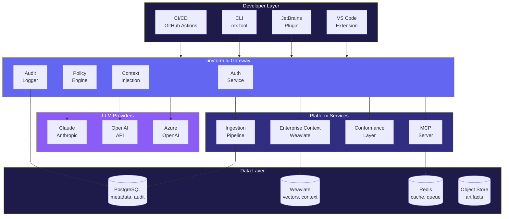

### 1.2 Control Plane vs Data Plane

The architecture cleanly separates **control plane** (configuration, policies, dashboards) from **data plane** (request handling, enforcement, execution). This enables flexible deployment while maintaining centralized governance.

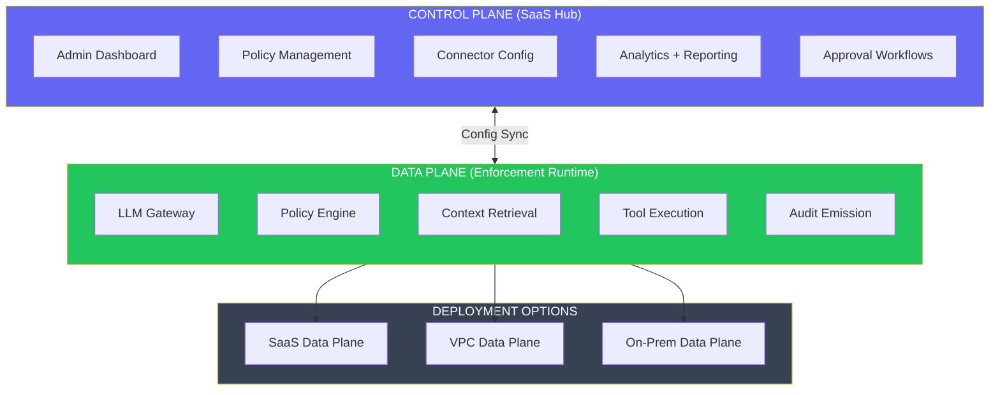

**Control Plane (always SaaS):**
- Organization, team, user management
- Policy sets and instruction packs
- Connector configurations (GitHub, Confluence, etc.)
- Analytics dashboards and reporting
- Audit log viewing and export

**Data Plane (customer choice):**
- LLM Gateway (request interception)
- Policy evaluation (real-time decisions)
- Context retrieval (RAG queries)
- Tool execution (MCP actions)
- Audit event emission

This separation means: **governance lives centrally, enforcement lives where you need it.**

### 1.3 Component Summary

| Component | Plane | Responsibility | Technology |
|-----------|-------|----------------|------------|
| **Admin Dashboard** | Control | Configuration UI, reporting | TypeScript (React) |
| **Policy Management** | Control | Rule authoring, versioning | TypeScript + Rust API |
| **LLM Gateway** | Data | Request proxy, policy enforcement, context injection | Rust (Axum) |
| **Policy Engine** | Data | Rule evaluation, enforcement decisions | Rust |
| **Enterprise Context Service** | Data | Pattern storage, semantic search, RAG | Rust + Weaviate |
| **Ingestion Pipeline** | Data | Code indexing, embedding generation | Rust + Tree-sitter |
| **Conformance Layer** | Data | Code rewriting, style enforcement | Rust |
| **Audit Service** | Data | Immutable event logging, compliance | Rust + PostgreSQL |
| **MCP Server** | Data | LLM tool interface (existing) | Rust |
| **Management API** | Control | Admin operations, configuration | Rust (Axum) |

---

## 2. Core Components

### 2.1 LLM Gateway

The Gateway is the central proxy that all AI requests flow through. It's responsible for authentication, policy enforcement, context injection, and audit logging.

```rust
// Gateway request flow
pub async fn handle_chat_completion(
    State(state): State<AppState>,
    auth: AuthToken,
    Json(request): Json<ChatCompletionRequest>,
) -> Result<Response, GatewayError> {
    // 1. Authenticate and authorize
    let user = state.auth.validate_token(&auth)?;
    let org = state.orgs.get(user.org_id)?;
    
    // 2. Evaluate input policies
    let input_result = state.policy_engine
        .evaluate_input(&request.messages, &org.policies)
        .await?;
    
    if input_result.action == PolicyAction::Block {
        return Err(GatewayError::PolicyViolation(input_result.violations));
    }
    
    // 3. Apply input redactions if any
    let sanitized_request = input_result.apply_redactions(request);
    
    // 4. Retrieve relevant context
    let context = state.context_service
        .retrieve(&sanitized_request, &user)
        .await?;
    
    // 5. Inject instruction pack and context
    let enriched_request = state.enricher
        .enrich(sanitized_request, context, &org.instruction_pack)?;
    
    // 6. Forward to LLM provider
    let response = state.llm_client
        .chat_completion(&enriched_request, &org.provider_config)
        .await?;
    
    // 7. Evaluate output policies
    let output_result = state.policy_engine
        .evaluate_output(&response, &org.policies)
        .await?;
    
    if output_result.action == PolicyAction::Block {
        // Log but don't return the response
        state.audit.log_blocked(&user, &request, &response, &output_result).await?;
        return Err(GatewayError::OutputPolicyViolation(output_result.violations));
    }
    
    // 8. Apply output redactions
    let sanitized_response = output_result.apply_redactions(response);
    
    // 9. Log audit event
    state.audit.log_success(&user, &request, &sanitized_response, &output_result).await?;
    
    Ok(Json(sanitized_response))
}
```

#### 2.1.1 Gateway Configuration

```yaml
# gateway.yml
server:
  host: 0.0.0.0
  port: 8080
  workers: 4
  max_connections: 1000

tls:
  enabled: true
  cert_path: /etc/unyform/certs/server.crt
  key_path: /etc/unyform/certs/server.key

providers:
  claude:
    enabled: true
    base_url: https://api.anthropic.com
    default_model: claude-3-sonnet-20240229
    timeout_secs: 120
    
  openai:
    enabled: true
    base_url: https://api.openai.com
    default_model: gpt-4-turbo-preview
    timeout_secs: 120
    
  azure_openai:
    enabled: false
    base_url: ${AZURE_OPENAI_ENDPOINT}
    api_version: 2024-02-15-preview

rate_limiting:
  requests_per_minute: 60
  requests_per_hour: 1000
  tokens_per_day: 1000000

streaming:
  enabled: true
  chunk_size: 1024
  flush_interval_ms: 50
```

---

### 2.2 Policy Engine

The Policy Engine evaluates rules against inputs and outputs, returning enforcement decisions.

```rust
// Policy engine types
#[derive(Debug, Clone)]
pub struct PolicySet {
    pub id: Uuid,
    pub name: String,
    pub version: String,
    pub policies: Vec<Policy>,
}

#[derive(Debug, Clone)]
pub struct Policy {
    pub id: Uuid,
    pub name: String,
    pub policy_type: PolicyType,
    pub severity: Severity,
    pub scope: Vec<Scope>,
    pub action: PolicyAction,
    pub rules: PolicyRules,
}

#[derive(Debug, Clone)]
pub enum PolicyType {
    Secrets,
    PII,
    Dependencies,
    Patterns,
    CustomRegex,
}

#[derive(Debug, Clone)]
pub enum PolicyAction {
    Allow,
    Block,
    Redact,
    Rewrite { template: String },
    RequireApproval,
}

#[derive(Debug, Clone)]
pub struct EvaluationResult {
    pub action: PolicyAction,
    pub violations: Vec<Violation>,
    pub redactions: Vec<Redaction>,
}

// Policy engine implementation
impl PolicyEngine {
    pub async fn evaluate_input(
        &self,
        messages: &[Message],
        policies: &PolicySet,
    ) -> Result<EvaluationResult, PolicyError> {
        let mut violations = Vec::new();
        let mut redactions = Vec::new();
        
        for policy in &policies.policies {
            if !policy.scope.contains(&Scope::Input) {
                continue;
            }
            
            let matches = self.evaluate_policy(messages, policy)?;
            
            for m in matches {
                match policy.action {
                    PolicyAction::Block => {
                        violations.push(Violation::from_match(policy, &m));
                    }
                    PolicyAction::Redact => {
                        redactions.push(Redaction::from_match(&m));
                    }
                    _ => {}
                }
            }
        }
        
        let action = if violations.iter().any(|v| v.severity == Severity::Critical) {
            PolicyAction::Block
        } else if !redactions.is_empty() {
            PolicyAction::Redact
        } else {
            PolicyAction::Allow
        };
        
        Ok(EvaluationResult { action, violations, redactions })
    }
    
    fn evaluate_policy(
        &self,
        messages: &[Message],
        policy: &Policy,
    ) -> Result<Vec<PolicyMatch>, PolicyError> {
        match &policy.policy_type {
            PolicyType::Secrets => self.check_secrets(messages, &policy.rules),
            PolicyType::PII => self.check_pii(messages, &policy.rules),
            PolicyType::Dependencies => self.check_dependencies(messages, &policy.rules),
            PolicyType::Patterns => self.check_patterns(messages, &policy.rules),
            PolicyType::CustomRegex => self.check_custom_regex(messages, &policy.rules),
        }
    }
}
```

#### 2.2.1 Built-in Secret Patterns

```rust
lazy_static! {
    pub static ref SECRET_PATTERNS: Vec<SecretPattern> = vec![
        // API Keys
        SecretPattern::new(
            "aws_access_key",
            r"(?i)(aws_access_key_id|aws_secret_access_key)\s*[:=]\s*['\"]?[A-Za-z0-9+/]{20,}['\"]?"
        ),
        SecretPattern::new(
            "generic_api_key",
            r"(?i)(api[_-]?key|apikey|api_secret)\s*[:=]\s*['\"][^'\"]{20,}['\"]"
        ),
        SecretPattern::new(
            "bearer_token",
            r"(?i)bearer\s+[a-zA-Z0-9_\-\.]{20,}"
        ),
        SecretPattern::new(
            "jwt",
            r"eyJ[A-Za-z0-9-_]+\.eyJ[A-Za-z0-9-_]+\.[A-Za-z0-9-_]+"
        ),
        SecretPattern::new(
            "private_key",
            r"-----BEGIN\s+(RSA|DSA|EC|OPENSSH)?\s*PRIVATE KEY-----"
        ),
        
        // Cloud Provider Keys
        SecretPattern::new(
            "github_token",
            r"(?i)(gh[pousr]_[A-Za-z0-9]{36}|github_token\s*[:=]\s*['\"][^'\"]+['\"])"
        ),
        SecretPattern::new(
            "slack_token",
            r"xox[baprs]-[0-9]{10,12}-[0-9]{10,12}-[a-zA-Z0-9]{24}"
        ),
        SecretPattern::new(
            "stripe_key",
            r"(?i)sk_live_[0-9a-zA-Z]{24}"
        ),
        
        // Database Connection Strings
        SecretPattern::new(
            "db_connection",
            r"(?i)(postgres|mysql|mongodb)://[^:]+:[^@]+@[^\s]+"
        ),
        SecretPattern::new(
            "password_in_string",
            r"(?i)(password|passwd|pwd)\s*[:=]\s*['\"][^'\"]{8,}['\"]"
        ),
    ];
}
```

---

### 2.2.2 Tool Policy Engine

Beyond prompts and responses, the Policy Engine governs **tool actions**. Every MCP tool invocation passes through the same PDP (Policy Decision Point) pattern.

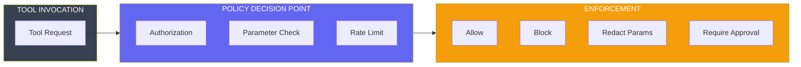

```rust
// Tool policy types
#[derive(Debug, Clone)]
pub struct ToolPolicy {
    pub tool_name: String,
    pub action: ToolPolicyAction,
    pub conditions: Vec<ToolCondition>,
    pub rate_limit: Option<RateLimit>,
    pub approvers: Vec<String>,
}

#[derive(Debug, Clone)]
pub enum ToolPolicyAction {
    Allow,
    Block,
    RequireApproval,
    RedactParameters { fields: Vec<String> },
    RateLimit { max_calls: u32, window_secs: u64 },
}

#[derive(Debug, Clone)]
pub enum ToolCondition {
    TeamMembership(Vec<String>),
    RepoScope(Vec<String>),
    TimeWindow { start: String, end: String },
    ParameterMatch { field: String, pattern: String },
}

// Tool policy evaluation
impl ToolPolicyEngine {
    pub async fn evaluate_tool_call(
        &self,
        tool_name: &str,
        params: &serde_json::Value,
        context: &RequestContext,
    ) -> Result<ToolPolicyResult, PolicyError> {
        let policy = self.get_tool_policy(tool_name)?;
        
        // Check authorization
        if !self.check_tool_authorization(&policy, context)? {
            return Ok(ToolPolicyResult::Block {
                reason: "Not authorized for this tool".to_string(),
            });
        }
        
        // Check rate limits
        if let Some(limit) = &policy.rate_limit {
            if self.is_rate_limited(context.user_id, tool_name, limit)? {
                return Ok(ToolPolicyResult::Block {
                    reason: "Rate limit exceeded".to_string(),
                });
            }
        }
        
        // Check parameter policies
        let redacted_params = self.check_parameters(params, &policy)?;
        
        // Determine final action
        match policy.action {
            ToolPolicyAction::Allow => {
                Ok(ToolPolicyResult::Allow { params: redacted_params })
            }
            ToolPolicyAction::RequireApproval => {
                Ok(ToolPolicyResult::RequireApproval {
                    approvers: policy.approvers.clone(),
                    params: redacted_params,
                })
            }
            ToolPolicyAction::Block => {
                Ok(ToolPolicyResult::Block {
                    reason: "Tool blocked by policy".to_string(),
                })
            }
            _ => Ok(ToolPolicyResult::Allow { params: redacted_params }),
        }
    }
}
```

**Example tool policies:**

```yaml
tool_policies:
  # File operations - allow with logging
  file_read:
    action: allow
    
  file_write:
    action: allow
    rate_limit:
      max_calls: 100
      window_secs: 3600
      
  # Git operations - require approval for commits
  git_commit:
    action: require_approval
    approvers: [tech-lead, senior-dev]
    
  git_push:
    action: require_approval
    approvers: [tech-lead]
    
  # Network - block external, allow internal
  network_request:
    action: block
    conditions:
      - parameter_match:
          field: url
          pattern: "^https://internal\\.acme\\.com"
        override_action: allow
        
  # Deployment - strict approval
  deploy:
    action: require_approval
    approvers: [platform-team]
    conditions:
      - time_window:
          start: "09:00"
          end: "17:00"
```

This makes unyform.ai defensible: **it's not just "prompt DLP," it's enterprise action governance.**

---

### 2.3 Enterprise Context Service

Provides semantic search over indexed code, docs, and patterns using Weaviate.

```rust
// Context retrieval
pub struct ContextService {
    weaviate: WeaviateClient,
    embedding_model: EmbeddingModel,
}

impl ContextService {
    pub async fn retrieve(
        &self,
        request: &ChatCompletionRequest,
        user: &User,
    ) -> Result<Vec<ContextChunk>, ContextError> {
        // Extract query from user message
        let query = request.messages
            .iter()
            .filter(|m| m.role == Role::User)
            .last()
            .map(|m| &m.content)
            .ok_or(ContextError::NoQuery)?;
        
        // Generate embedding
        let embedding = self.embedding_model.embed(query).await?;
        
        // Query Weaviate with permission filter
        let results = self.weaviate.query(
            "CodeContext",
            embedding,
            QueryOptions {
                limit: 10,
                certainty: 0.7,
                filters: vec![
                    Filter::In("org_id", user.org_id.to_string()),
                    Filter::In("repos", user.accessible_repos.clone()),
                ],
            }
        ).await?;
        
        // Convert to context chunks
        let chunks: Vec<ContextChunk> = results
            .into_iter()
            .map(ContextChunk::from_weaviate_result)
            .collect();
        
        Ok(chunks)
    }
}

#[derive(Debug, Clone)]
pub struct ContextChunk {
    pub id: Uuid,
    pub content: String,
    pub source: ContextSource,
    pub certainty: f32,
    pub metadata: ChunkMetadata,
}

#[derive(Debug, Clone)]
pub enum ContextSource {
    Repository { repo: String, path: String, branch: String },
    InstructionPack { name: String, version: String },
    Documentation { source: String, section: String },
    Pattern { name: String, category: String },
}
```

#### 2.3.1 Weaviate Schema

```graphql
# CodeContext class
class CodeContext {
  id: ID!
  content: String!
  orgId: String!
  repoId: String!
  filePath: String!
  language: String!
  chunkType: String!  # function, class, module, comment
  symbols: [String!]!
  imports: [String!]!
  createdAt: DateTime!
  updatedAt: DateTime!
}

# Pattern class
class Pattern {
  id: ID!
  name: String!
  description: String!
  content: String!
  category: String!  # authentication, database, api, etc.
  language: String!
  orgId: String!
  usageCount: Int!
  createdAt: DateTime!
}

# InstructionPack class
class InstructionPack {
  id: ID!
  name: String!
  version: String!
  content: String!
  orgId: String!
  isDefault: Boolean!
  createdAt: DateTime!
}
```

---

### 2.4 Ingestion Pipeline

Indexes code from GitHub repositories, generating embeddings and extracting patterns.

```rust
// Ingestion pipeline
pub struct IngestionPipeline {
    github: GitHubClient,
    parser: CodeParser,
    embedder: EmbeddingModel,
    weaviate: WeaviateClient,
    queue: RedisQueue,
}

impl IngestionPipeline {
    pub async fn process_push_event(
        &self,
        event: GitHubPushEvent,
    ) -> Result<(), IngestionError> {
        // Get changed files
        let changes = self.github.get_commit_diff(&event).await?;
        
        for change in changes {
            match change.status {
                FileStatus::Added | FileStatus::Modified => {
                    self.index_file(&event.repo, &change.path).await?;
                }
                FileStatus::Deleted => {
                    self.delete_file(&event.repo, &change.path).await?;
                }
                FileStatus::Renamed => {
                    self.delete_file(&event.repo, &change.previous_path).await?;
                    self.index_file(&event.repo, &change.path).await?;
                }
            }
        }
        
        Ok(())
    }
    
    async fn index_file(
        &self,
        repo: &Repository,
        path: &str,
    ) -> Result<(), IngestionError> {
        // Fetch file content
        let content = self.github.get_file_content(repo, path).await?;
        
        // Skip if too large
        if content.len() > MAX_FILE_SIZE {
            tracing::warn!("Skipping large file: {}/{}", repo.full_name, path);
            return Ok(());
        }
        
        // Detect language
        let language = detect_language(path);
        
        // Parse into chunks
        let chunks = self.parser.parse(&content, language)?;
        
        // Generate embeddings and store
        for chunk in chunks {
            let embedding = self.embedder.embed(&chunk.content).await?;
            
            self.weaviate.upsert(
                "CodeContext",
                WeaviateObject {
                    id: chunk.id,
                    properties: json!({
                        "content": chunk.content,
                        "orgId": repo.org_id,
                        "repoId": repo.id,
                        "filePath": path,
                        "language": language.to_string(),
                        "chunkType": chunk.chunk_type,
                        "symbols": chunk.symbols,
                        "imports": chunk.imports,
                        "updatedAt": Utc::now(),
                    }),
                    vector: embedding,
                }
            ).await?;
        }
        
        Ok(())
    }
}
```

#### 2.4.1 Code Parser (Tree-sitter)

```rust
// Tree-sitter based code parser
pub struct CodeParser {
    parsers: HashMap<Language, tree_sitter::Parser>,
}

impl CodeParser {
    pub fn parse(
        &self,
        content: &str,
        language: Language,
    ) -> Result<Vec<CodeChunk>, ParseError> {
        let parser = self.parsers.get(&language)
            .ok_or(ParseError::UnsupportedLanguage(language))?;
        
        let tree = parser.parse(content, None)
            .ok_or(ParseError::ParseFailed)?;
        
        let mut chunks = Vec::new();
        let mut cursor = tree.walk();
        
        self.extract_chunks(&mut cursor, content, &mut chunks)?;
        
        Ok(chunks)
    }
    
    fn extract_chunks(
        &self,
        cursor: &mut tree_sitter::TreeCursor,
        content: &str,
        chunks: &mut Vec<CodeChunk>,
    ) -> Result<(), ParseError> {
        loop {
            let node = cursor.node();
            
            // Extract function/method definitions
            if matches!(node.kind(), "function_definition" | "function_declaration" | 
                       "method_definition" | "impl_item" | "class_definition") {
                let chunk_content = &content[node.byte_range()];
                let symbols = self.extract_symbols(&node, content);
                let imports = self.extract_imports(&node, content);
                
                chunks.push(CodeChunk {
                    id: Uuid::new_v4(),
                    content: chunk_content.to_string(),
                    chunk_type: ChunkType::from_node_kind(node.kind()),
                    symbols,
                    imports,
                    start_line: node.start_position().row,
                    end_line: node.end_position().row,
                });
            }
            
            // Recurse into children
            if cursor.goto_first_child() {
                self.extract_chunks(cursor, content, chunks)?;
                cursor.goto_parent();
            }
            
            if !cursor.goto_next_sibling() {
                break;
            }
        }
        
        Ok(())
    }
}
```

---

### 2.5 Audit Service

Provides immutable event logging for compliance and analytics.

```rust
// Audit service
pub struct AuditService {
    db: PgPool,
    queue: RedisQueue,
}

impl AuditService {
    pub async fn log(
        &self,
        event: AuditEvent,
    ) -> Result<Uuid, AuditError> {
        // Generate event ID
        let event_id = Uuid::new_v4();
        
        // Hash sensitive content
        let prompt_hash = sha256_hash(&event.request.prompt);
        let response_hash = event.response.as_ref()
            .map(|r| sha256_hash(&r.content));
        
        // Insert into database
        sqlx::query!(
            r#"
            INSERT INTO audit_events (
                id, organization_id, user_id, event_type,
                request_id, model, provider,
                prompt_hash, prompt_length,
                response_hash, response_length,
                tokens_input, tokens_output,
                policies_checked, policies_passed, policies_failed,
                action_taken, violations,
                context_sources, duration_ms,
                created_at
            ) VALUES (
                $1, $2, $3, $4, $5, $6, $7, $8, $9, $10,
                $11, $12, $13, $14, $15, $16, $17, $18, $19, $20, $21
            )
            "#,
            event_id,
            event.org_id,
            event.user_id,
            event.event_type.to_string(),
            event.request_id,
            event.model,
            event.provider,
            prompt_hash,
            event.request.prompt.len() as i32,
            response_hash,
            event.response.as_ref().map(|r| r.content.len() as i32),
            event.tokens_input,
            event.tokens_output,
            event.policy_result.policies_checked as i32,
            event.policy_result.policies_passed as i32,
            event.policy_result.policies_failed as i32,
            event.policy_result.action.to_string(),
            serde_json::to_value(&event.policy_result.violations)?,
            serde_json::to_value(&event.context_sources)?,
            event.duration_ms as i32,
            Utc::now(),
        )
        .execute(&self.db)
        .await?;
        
        // Queue for async processing (analytics, alerts)
        self.queue.push("audit_events", &event).await?;
        
        Ok(event_id)
    }
    
    pub async fn query(
        &self,
        filter: AuditFilter,
    ) -> Result<Vec<AuditEvent>, AuditError> {
        let mut query = sqlx::QueryBuilder::new(
            "SELECT * FROM audit_events WHERE organization_id = "
        );
        query.push_bind(&filter.org_id);
        
        if let Some(user_id) = &filter.user_id {
            query.push(" AND user_id = ");
            query.push_bind(user_id);
        }
        
        if let Some(start) = &filter.start_time {
            query.push(" AND created_at >= ");
            query.push_bind(start);
        }
        
        if let Some(end) = &filter.end_time {
            query.push(" AND created_at <= ");
            query.push_bind(end);
        }
        
        if let Some(action) = &filter.action {
            query.push(" AND action_taken = ");
            query.push_bind(action.to_string());
        }
        
        query.push(" ORDER BY created_at DESC LIMIT ");
        query.push_bind(filter.limit.unwrap_or(100) as i32);
        
        let events = query.build_query_as::<AuditEvent>()
            .fetch_all(&self.db)
            .await?;
        
        Ok(events)
    }
}
```

---

## 3. Data Model

### 3.1 Entity Relationship Diagram

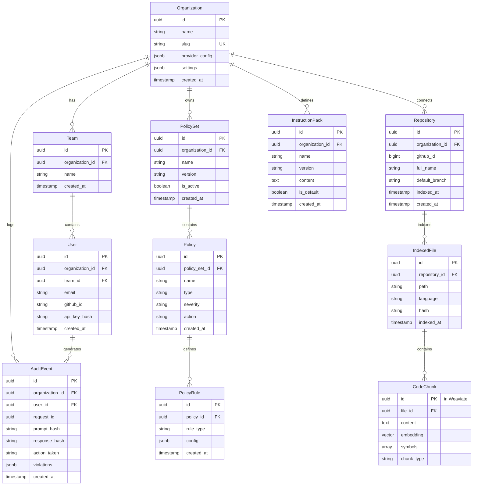

### 3.2 PostgreSQL Schema

```sql
-- Organizations
CREATE TABLE organizations (
    id UUID PRIMARY KEY DEFAULT gen_random_uuid(),
    name VARCHAR(255) NOT NULL,
    slug VARCHAR(255) NOT NULL UNIQUE,
    provider_config JSONB NOT NULL DEFAULT '{}',
    settings JSONB NOT NULL DEFAULT '{}',
    created_at TIMESTAMPTZ NOT NULL DEFAULT NOW(),
    updated_at TIMESTAMPTZ NOT NULL DEFAULT NOW()
);

-- Teams
CREATE TABLE teams (
    id UUID PRIMARY KEY DEFAULT gen_random_uuid(),
    organization_id UUID NOT NULL REFERENCES organizations(id) ON DELETE CASCADE,
    name VARCHAR(255) NOT NULL,
    created_at TIMESTAMPTZ NOT NULL DEFAULT NOW(),
    UNIQUE(organization_id, name)
);

-- Users
CREATE TABLE users (
    id UUID PRIMARY KEY DEFAULT gen_random_uuid(),
    organization_id UUID NOT NULL REFERENCES organizations(id) ON DELETE CASCADE,
    team_id UUID REFERENCES teams(id) ON DELETE SET NULL,
    email VARCHAR(255) NOT NULL,
    name VARCHAR(255),
    github_id VARCHAR(255),
    api_key_hash VARCHAR(255),
    settings JSONB NOT NULL DEFAULT '{}',
    created_at TIMESTAMPTZ NOT NULL DEFAULT NOW(),
    last_active_at TIMESTAMPTZ,
    UNIQUE(organization_id, email)
);

-- Policy Sets
CREATE TABLE policy_sets (
    id UUID PRIMARY KEY DEFAULT gen_random_uuid(),
    organization_id UUID NOT NULL REFERENCES organizations(id) ON DELETE CASCADE,
    name VARCHAR(255) NOT NULL,
    version VARCHAR(50) NOT NULL,
    description TEXT,
    is_active BOOLEAN NOT NULL DEFAULT true,
    created_at TIMESTAMPTZ NOT NULL DEFAULT NOW(),
    updated_at TIMESTAMPTZ NOT NULL DEFAULT NOW(),
    UNIQUE(organization_id, name, version)
);

-- Policies
CREATE TABLE policies (
    id UUID PRIMARY KEY DEFAULT gen_random_uuid(),
    policy_set_id UUID NOT NULL REFERENCES policy_sets(id) ON DELETE CASCADE,
    name VARCHAR(255) NOT NULL,
    policy_type VARCHAR(50) NOT NULL,
    severity VARCHAR(20) NOT NULL DEFAULT 'error',
    scope VARCHAR(20)[] NOT NULL DEFAULT ARRAY['output'],
    action VARCHAR(20) NOT NULL DEFAULT 'block',
    config JSONB NOT NULL DEFAULT '{}',
    created_at TIMESTAMPTZ NOT NULL DEFAULT NOW(),
    CONSTRAINT valid_policy_type CHECK (policy_type IN ('secrets', 'pii', 'dependencies', 'patterns', 'custom_regex')),
    CONSTRAINT valid_severity CHECK (severity IN ('critical', 'error', 'warning', 'info')),
    CONSTRAINT valid_action CHECK (action IN ('allow', 'block', 'redact', 'rewrite', 'require_approval'))
);

-- Repositories
CREATE TABLE repositories (
    id UUID PRIMARY KEY DEFAULT gen_random_uuid(),
    organization_id UUID NOT NULL REFERENCES organizations(id) ON DELETE CASCADE,
    github_id BIGINT NOT NULL,
    full_name VARCHAR(255) NOT NULL,
    default_branch VARCHAR(255) NOT NULL DEFAULT 'main',
    is_indexed BOOLEAN NOT NULL DEFAULT false,
    indexed_at TIMESTAMPTZ,
    index_status VARCHAR(50) DEFAULT 'pending',
    created_at TIMESTAMPTZ NOT NULL DEFAULT NOW(),
    UNIQUE(organization_id, github_id)
);

-- Instruction Packs
CREATE TABLE instruction_packs (
    id UUID PRIMARY KEY DEFAULT gen_random_uuid(),
    organization_id UUID NOT NULL REFERENCES organizations(id) ON DELETE CASCADE,
    name VARCHAR(255) NOT NULL,
    version VARCHAR(50) NOT NULL,
    content TEXT NOT NULL,
    is_default BOOLEAN NOT NULL DEFAULT false,
    created_at TIMESTAMPTZ NOT NULL DEFAULT NOW(),
    UNIQUE(organization_id, name, version)
);

-- Audit Events (partitioned by time)
CREATE TABLE audit_events (
    id UUID NOT NULL DEFAULT gen_random_uuid(),
    organization_id UUID NOT NULL,
    user_id UUID NOT NULL,
    event_type VARCHAR(50) NOT NULL,
    request_id UUID NOT NULL,
    model VARCHAR(100),
    provider VARCHAR(50),
    prompt_hash VARCHAR(64),
    prompt_length INT,
    response_hash VARCHAR(64),
    response_length INT,
    tokens_input INT,
    tokens_output INT,
    policies_checked INT NOT NULL DEFAULT 0,
    policies_passed INT NOT NULL DEFAULT 0,
    policies_failed INT NOT NULL DEFAULT 0,
    action_taken VARCHAR(20) NOT NULL,
    violations JSONB NOT NULL DEFAULT '[]',
    context_sources JSONB NOT NULL DEFAULT '[]',
    duration_ms INT,
    created_at TIMESTAMPTZ NOT NULL DEFAULT NOW(),
    PRIMARY KEY (id, created_at)
) PARTITION BY RANGE (created_at);

-- Create monthly partitions
CREATE TABLE audit_events_2025_01 PARTITION OF audit_events
    FOR VALUES FROM ('2025-01-01') TO ('2025-02-01');
CREATE TABLE audit_events_2025_02 PARTITION OF audit_events
    FOR VALUES FROM ('2025-02-01') TO ('2025-03-01');
-- etc.

-- Indexes
CREATE INDEX idx_audit_events_org ON audit_events(organization_id, created_at);
CREATE INDEX idx_audit_events_user ON audit_events(user_id, created_at);
CREATE INDEX idx_audit_events_action ON audit_events(action_taken, created_at);
CREATE INDEX idx_repositories_org ON repositories(organization_id);
CREATE INDEX idx_users_org ON users(organization_id);
```

---

## 4. API Specification

### 4.1 Gateway API

#### Chat Completion Proxy

```yaml
openapi: 3.0.0
paths:
  /v1/chat/completions:
    post:
      summary: Proxy chat completion with policy enforcement
      security:
        - BearerAuth: []
        - ApiKey: []
      requestBody:
        required: true
        content:
          application/json:
            schema:
              type: object
              required:
                - messages
              properties:
                model:
                  type: string
                  description: Model to use (optional, uses org default)
                  example: claude-3-sonnet-20240229
                messages:
                  type: array
                  items:
                    type: object
                    properties:
                      role:
                        type: string
                        enum: [system, user, assistant]
                      content:
                        type: string
                max_tokens:
                  type: integer
                temperature:
                  type: number
                stream:
                  type: boolean
                  default: false
                skip_context:
                  type: boolean
                  description: Skip RAG context injection
                  default: false
      responses:
        200:
          description: Successful completion
          content:
            application/json:
              schema:
                $ref: '#/components/schemas/ChatCompletion'
        400:
          description: Invalid request
        403:
          description: Policy violation
          content:
            application/json:
              schema:
                $ref: '#/components/schemas/PolicyViolationError'
        429:
          description: Rate limited
```

### 4.2 Management API

```yaml
paths:
  # Organizations
  /v1/org:
    get:
      summary: Get current organization
      security: [BearerAuth: []]
      responses:
        200:
          content:
            application/json:
              schema:
                $ref: '#/components/schemas/Organization'
    
  # Policies
  /v1/policies:
    get:
      summary: List policy sets
      security: [BearerAuth: []]
      parameters:
        - name: active_only
          in: query
          schema:
            type: boolean
            default: true
      responses:
        200:
          content:
            application/json:
              schema:
                type: array
                items:
                  $ref: '#/components/schemas/PolicySet'
    post:
      summary: Create policy set
      security: [BearerAuth: [admin]]
      requestBody:
        content:
          application/json:
            schema:
              $ref: '#/components/schemas/PolicySetCreate'
      responses:
        201:
          content:
            application/json:
              schema:
                $ref: '#/components/schemas/PolicySet'
  
  /v1/policies/{id}:
    get:
      summary: Get policy set
    put:
      summary: Update policy set
    delete:
      summary: Delete policy set
  
  # Repositories
  /v1/repos:
    get:
      summary: List connected repositories
    post:
      summary: Connect GitHub organization
      requestBody:
        content:
          application/json:
            schema:
              type: object
              properties:
                installation_id:
                  type: integer
                  description: GitHub App installation ID
  
  /v1/repos/{id}/index:
    post:
      summary: Trigger repository re-index
  
  # Instruction Packs
  /v1/instruction-packs:
    get:
      summary: List instruction packs
    post:
      summary: Create instruction pack
  
  /v1/instruction-packs/{id}:
    get:
      summary: Get instruction pack
    put:
      summary: Update instruction pack
    delete:
      summary: Delete instruction pack
  
  # Audit
  /v1/audit:
    get:
      summary: Query audit events
      parameters:
        - name: start_time
          in: query
          schema:
            type: string
            format: date-time
        - name: end_time
          in: query
          schema:
            type: string
            format: date-time
        - name: user_id
          in: query
          schema:
            type: string
            format: uuid
        - name: action
          in: query
          schema:
            type: string
            enum: [allow, block, redact]
        - name: limit
          in: query
          schema:
            type: integer
            default: 100
            maximum: 1000
  
  /v1/audit/export:
    get:
      summary: Export audit events
      parameters:
        - name: format
          in: query
          schema:
            type: string
            enum: [json, csv]
            default: json
```

---

## 5. Integration Architecture

### 5.1 GitHub App

```yaml
# GitHub App Manifest
name: unyform.ai
description: AI Governance for Engineering Teams
url: https://unyform.ai

# Permissions
permissions:
  contents: read        # Read repository contents
  metadata: read        # Read repository metadata
  pull_requests: read   # Read PR information
  
# Events
events:
  - push               # Code changes
  - repository         # Repo created/deleted
  - installation       # App installed/uninstalled

# OAuth
callback_url: https://app.unyform.ai/auth/github/callback
setup_url: https://app.unyform.ai/setup/github
```

### 5.2 VS Code Extension Architecture

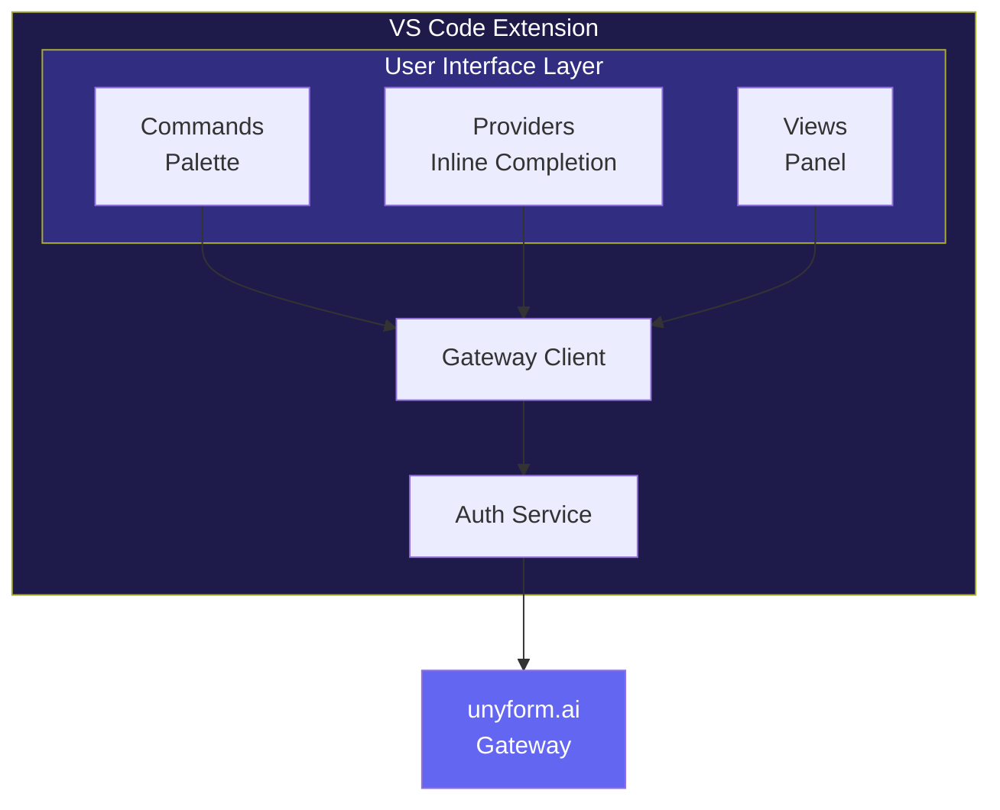

```typescript
// Extension activation
export function activate(context: vscode.ExtensionContext) {
    const auth = new AuthService(context);
    const gateway = new GatewayClient(auth);
    
    // Register commands
    context.subscriptions.push(
        vscode.commands.registerCommand('unyform.generate', () => {
            generateWithPolicy(gateway);
        }),
        vscode.commands.registerCommand('unyform.explain', () => {
            explainCode(gateway);
        }),
        vscode.commands.registerCommand('unyform.login', () => {
            auth.login();
        })
    );
    
    // Register inline completion provider
    context.subscriptions.push(
        vscode.languages.registerInlineCompletionItemProvider(
            { pattern: '**' },
            new UnyformCompletionProvider(gateway)
        )
    );
    
    // Register diagnostics
    const diagnostics = vscode.languages.createDiagnosticCollection('unyform');
    context.subscriptions.push(diagnostics);
    
    // Register status bar
    const statusBar = vscode.window.createStatusBarItem(
        vscode.StatusBarAlignment.Right
    );
    statusBar.text = '$(shield) unyform';
    statusBar.show();
}
```

---

## 6. Data Flows

### 6.1 Request Flow

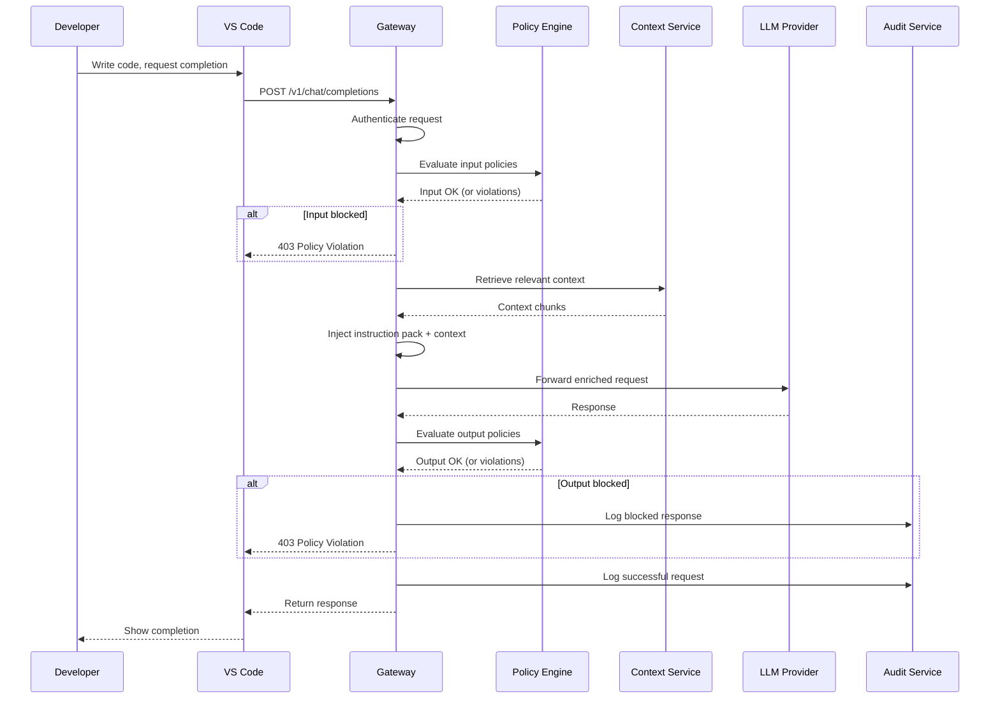

### 6.2 Ingestion Flow

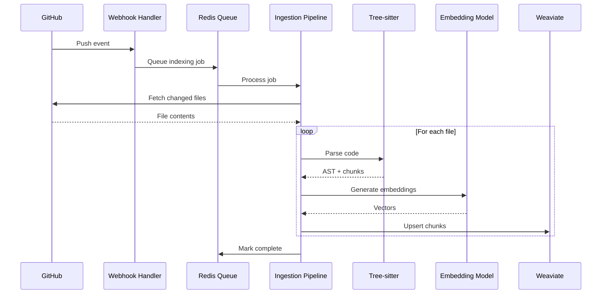

---

## 7. Security Architecture

### 7.1 Authentication

| Method | Use Case | Implementation |
|--------|----------|----------------|
| **API Key** | CLI, CI/CD, scripts | SHA-256 hashed, org-scoped |
| **OAuth 2.0** | Web UI, IDE | GitHub OAuth provider |
| **SAML** | Enterprise SSO | Planned for Phase 2 |

### 7.2 Authorization (RBAC)

```rust
#[derive(Debug, Clone)]
pub enum Role {
    Owner,      // Full org access
    Admin,      // Manage policies, repos, users
    Member,     // Use gateway, view audit (own)
    Viewer,     // Read-only access
}

#[derive(Debug, Clone)]
pub struct Permission {
    resource: Resource,
    action: Action,
}

pub enum Resource {
    Organization,
    PolicySet,
    Repository,
    InstructionPack,
    AuditLog,
    User,
    Team,
}

pub enum Action {
    Create,
    Read,
    Update,
    Delete,
    Execute,  // For gateway requests
}

// Permission matrix
impl Role {
    pub fn permissions(&self) -> Vec<Permission> {
        match self {
            Role::Owner => vec![/* all permissions */],
            Role::Admin => vec![
                Permission::new(Resource::PolicySet, Action::Create),
                Permission::new(Resource::PolicySet, Action::Update),
                Permission::new(Resource::Repository, Action::Create),
                // ...
            ],
            Role::Member => vec![
                Permission::new(Resource::PolicySet, Action::Read),
                Permission::new(Resource::AuditLog, Action::Read), // own only
                // ...
            ],
            Role::Viewer => vec![
                Permission::new(Resource::PolicySet, Action::Read),
            ],
        }
    }
}
```

### 7.3 Data Encryption

| Data | At Rest | In Transit |
|------|---------|------------|
| Prompts/Responses | Never stored in plaintext | TLS 1.3 |
| Prompt hashes | SHA-256 | TLS 1.3 |
| API Keys | Argon2 hashed | TLS 1.3 |
| Audit logs | AES-256-GCM | TLS 1.3 |
| Code embeddings | AES-256-GCM | TLS 1.3 |
| Instruction packs | AES-256-GCM | TLS 1.3 |

### 7.4 Secrets Handling

```rust
// Secrets are never logged or stored
pub struct SensitiveString(String);

impl std::fmt::Debug for SensitiveString {
    fn fmt(&self, f: &mut std::fmt::Formatter<'_>) -> std::fmt::Result {
        write!(f, "[REDACTED]")
    }
}

impl std::fmt::Display for SensitiveString {
    fn fmt(&self, f: &mut std::fmt::Formatter<'_>) -> std::fmt::Result {
        write!(f, "[REDACTED]")
    }
}

impl Serialize for SensitiveString {
    fn serialize<S>(&self, serializer: S) -> Result<S::Ok, S::Error>
    where
        S: Serializer,
    {
        serializer.serialize_str("[REDACTED]")
    }
}
```

---

## 8. Analytics & Metrics Engine

The Analytics Engine provides comprehensive visibility into AI-assisted development across the organization—the only system that knows how much code is AI-generated and whether it conforms to standards.

### 8.1 The Hub Integration Model

unyform.ai positions as the **central nervous system** for AI-assisted development. All AI requests flow through the gateway, enabling complete instrumentation with zero friction for individual developers.

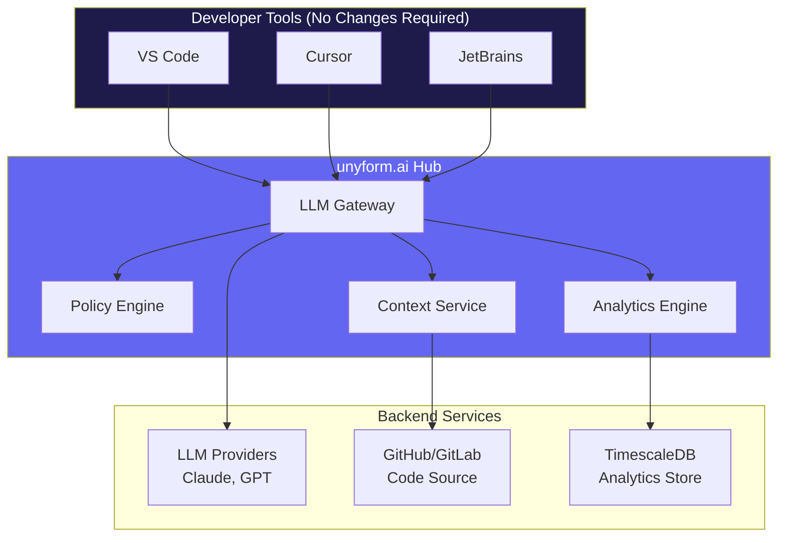

**Key insight:** Platform team configures the hub once. Developers install a lightweight client (extension/CLI), sign in, and keep their existing workflow—no new tools to learn, no configuration required.

**Integration Philosophy:**

| Stakeholder | What They Configure | New Tools |
|-------------|---------------------|-----------|
| **IC Developer** | Nothing | **Zero** - same IDE |
| **Team Lead** | Team policies (optional) | Dashboard (read-only) |
| **Platform Engineer** | Gateway, policies, connectors | Admin console |
| **Security** | Security policies | Dashboard + exports |
| **VP/CTO** | Nothing (read-only) | Executive dashboard |

### 8.2 Core Metrics Framework

```rust
// Analytics event types
#[derive(Debug, Clone, Serialize)]
pub struct AnalyticsEvent {
    pub event_id: Uuid,
    pub timestamp: DateTime<Utc>,
    pub organization_id: Uuid,
    pub team_id: Option<Uuid>,
    pub user_id: Uuid,
    
    pub request_metrics: RequestMetrics,
    pub code_metrics: CodeMetrics,
    pub policy_metrics: PolicyMetrics,
    pub conformance_metrics: ConformanceMetrics,
}

#[derive(Debug, Clone, Serialize)]
pub struct CodeMetrics {
    pub lines_generated: u32,
    pub language: String,
    pub classification: CodeClassification,
    pub acceptance_status: AcceptanceStatus,
    pub modification_ratio: f32,
}

#[derive(Debug, Clone, Serialize)]
pub enum CodeClassification {
    HumanOnly,      // Written entirely by developer
    AiAssisted,     // Human-initiated, AI suggestions modified
    AiGenerated,    // Primarily AI-generated, human approved
    AiModified,     // Human code, AI rewrote for conformance
}

#[derive(Debug, Clone, Serialize)]
pub struct ConformanceMetrics {
    pub overall_score: f32,
    pub naming_score: f32,
    pub imports_score: f32,
    pub patterns_score: f32,
    pub documentation_score: f32,
}
```

### 8.3 The Five Pillars of AI Engineering Metrics

| Pillar | What It Measures | Why Leadership Cares |
|--------|------------------|----------------------|
| **AI vs Human Code** | % of code with AI involvement | Adoption, risk exposure, effectiveness |
| **Conformance Index** | Adherence to org standards | Quality, maintainability, tech debt |
| **Velocity Metrics** | Speed impact of AI assistance | ROI, productivity gains |
| **Quality & Security** | Vulnerabilities, violations prevented | Risk reduction, compliance |
| **Efficiency & ROI** | Dollar value delivered | Investment justification |

### 8.4 AI vs Human Code Tracking

This is the **primary metric**—the one no other system can provide:

```rust
// AI code attribution service
impl AnalyticsService {
    pub async fn track_code_origin(
        &self,
        request: &CompletionRequest,
        response: &CompletionResponse,
        user_action: &UserAction,
    ) -> Result<CodeOriginEvent, AnalyticsError> {
        let classification = match user_action {
            UserAction::AcceptedUnmodified => CodeClassification::AiGenerated,
            UserAction::AcceptedWithMinorEdits(ratio) if *ratio < 0.1 => {
                CodeClassification::AiAssisted
            }
            UserAction::AcceptedWithMajorEdits(_) => CodeClassification::AiAssisted,
            UserAction::Rejected => return Ok(CodeOriginEvent::rejected()),
        };
        
        let event = CodeOriginEvent {
            id: Uuid::new_v4(),
            user_id: request.user_id,
            team_id: request.team_id,
            org_id: request.org_id,
            classification,
            lines_of_code: count_lines(&response.content),
            language: detect_language(&response.content),
            repository: request.context.repository.clone(),
            timestamp: Utc::now(),
        };
        
        self.store.insert(&event).await?;
        Ok(event)
    }
    
    pub async fn get_ai_code_ratio(
        &self,
        org_id: Uuid,
        period: TimePeriod,
    ) -> Result<AiCodeRatio, AnalyticsError> {
        let stats = sqlx::query_as!(
            CodeStats,
            r#"
            SELECT 
                SUM(CASE WHEN classification IN ('ai_generated', 'ai_assisted') 
                    THEN lines_of_code ELSE 0 END) as ai_lines,
                SUM(lines_of_code) as total_lines,
                COUNT(DISTINCT user_id) as developers
            FROM code_origin_events
            WHERE org_id = $1 AND timestamp >= $2
            "#,
            org_id,
            period.start()
        )
        .fetch_one(&self.db)
        .await?;
        
        Ok(AiCodeRatio {
            ai_percentage: stats.ai_lines as f32 / stats.total_lines as f32 * 100.0,
            total_lines: stats.total_lines,
            ai_lines: stats.ai_lines,
            developer_count: stats.developers,
        })
    }
}
```

### 8.5 Metrics Aggregation Levels

```sql
-- Real-time metrics view by organization
CREATE MATERIALIZED VIEW org_metrics_daily AS
SELECT 
    org_id,
    date_trunc('day', timestamp) as date,
    
    -- AI vs Human
    SUM(CASE WHEN classification IN ('ai_generated', 'ai_assisted') 
        THEN lines_of_code ELSE 0 END)::float / 
        NULLIF(SUM(lines_of_code), 0) * 100 as ai_code_percentage,
    
    -- Conformance
    AVG(conformance_score) * 100 as avg_conformance,
    
    -- Velocity
    COUNT(*) as total_requests,
    AVG(CASE WHEN acceptance_status = 'accepted' THEN 1 ELSE 0 END) * 100 
        as acceptance_rate,
    
    -- Security
    SUM(CASE WHEN policy_action = 'blocked' THEN 1 ELSE 0 END) as violations_blocked,
    SUM(CASE WHEN policy_action = 'blocked' AND violation_type = 'secret' 
        THEN 1 ELSE 0 END) as secrets_prevented
        
FROM analytics_events
GROUP BY org_id, date_trunc('day', timestamp);

-- Team-level rollup
CREATE MATERIALIZED VIEW team_metrics_weekly AS
SELECT 
    org_id,
    team_id,
    date_trunc('week', timestamp) as week,
    
    -- Per-developer breakdown available via drill-down
    COUNT(DISTINCT user_id) as active_developers,
    SUM(lines_of_code) as total_lines,
    AVG(ai_code_percentage) as avg_ai_percentage,
    AVG(conformance_score) as avg_conformance
    
FROM analytics_events
GROUP BY org_id, team_id, date_trunc('week', timestamp);
```

### 8.6 Dashboard API

```rust
// Dashboard data endpoints
#[derive(Debug, Serialize)]
pub struct ExecutiveDashboard {
    pub ai_adoption: AiAdoptionMetrics,
    pub conformance: ConformanceSummary,
    pub security: SecuritySummary,
    pub roi: RoiSummary,
}

#[derive(Debug, Serialize)]
pub struct AiAdoptionMetrics {
    pub overall_percentage: f32,
    pub trend: TrendDirection,
    pub by_team: Vec<TeamAiMetrics>,
    pub by_seniority: SeniorityBreakdown,
}

// API handlers
pub async fn get_executive_dashboard(
    State(state): State<AppState>,
    auth: AuthToken,
    Query(params): Query<DashboardParams>,
) -> Result<Json<ExecutiveDashboard>, ApiError> {
    let org_id = state.auth.get_org_id(&auth)?;
    let period = params.period.unwrap_or(TimePeriod::LastMonth);
    
    let dashboard = ExecutiveDashboard {
        ai_adoption: state.analytics.get_ai_adoption(org_id, period).await?,
        conformance: state.analytics.get_conformance_summary(org_id, period).await?,
        security: state.analytics.get_security_summary(org_id, period).await?,
        roi: state.analytics.calculate_roi(org_id, period).await?,
    };
    
    Ok(Json(dashboard))
}

pub async fn get_team_dashboard(
    State(state): State<AppState>,
    auth: AuthToken,
    Path(team_id): Path<Uuid>,
) -> Result<Json<TeamDashboard>, ApiError> {
    // Team-level metrics with per-developer breakdown
    // ...
}

pub async fn export_compliance_report(
    State(state): State<AppState>,
    auth: AuthToken,
    Query(params): Query<ReportParams>,
) -> Result<Response, ApiError> {
    // Generate SOC2, audit log exports, etc.
    // ...
}
```

### 8.7 ROI Calculation Engine

```rust
#[derive(Debug, Serialize)]
pub struct RoiCalculation {
    pub period: TimePeriod,
    pub total_value: Decimal,
    pub breakdown: RoiBreakdown,
    pub unyform_cost: Decimal,
    pub roi_multiple: f32,
}

#[derive(Debug, Serialize)]
pub struct RoiBreakdown {
    pub developer_time_saved: ValueItem,
    pub code_review_time_saved: ValueItem,
    pub security_incidents_prevented: ValueItem,
    pub onboarding_acceleration: ValueItem,
}

impl AnalyticsService {
    pub async fn calculate_roi(
        &self,
        org_id: Uuid,
        period: TimePeriod,
        config: &RoiConfig,
    ) -> Result<RoiCalculation, AnalyticsError> {
        let metrics = self.get_period_metrics(org_id, period).await?;
        
        // Developer time saved: acceptance rate improvement × time saved per accepted suggestion
        let dev_time_saved = metrics.accepted_suggestions as f32 
            * config.avg_time_saved_per_suggestion_hours 
            * config.hourly_rate;
        
        // Code review savings: reduction in review comments × time per comment
        let review_savings = (metrics.baseline_review_comments - metrics.current_review_comments)
            as f32 * config.time_per_review_comment_hours * config.hourly_rate;
        
        // Security: blocked secrets × estimated incident cost × probability
        let security_savings = metrics.secrets_blocked as f32 
            * config.estimated_secret_exposure_cost 
            * config.exposure_probability;
        
        let total_value = dev_time_saved + review_savings + security_savings;
        let unyform_cost = config.seat_price * metrics.active_users as f32 * period.months() as f32;
        
        Ok(RoiCalculation {
            period,
            total_value: Decimal::from_f32(total_value).unwrap(),
            breakdown: RoiBreakdown {
                developer_time_saved: ValueItem::new("Developer Time", dev_time_saved),
                code_review_time_saved: ValueItem::new("Code Review", review_savings),
                security_incidents_prevented: ValueItem::new("Security", security_savings),
                onboarding_acceleration: ValueItem::new("Onboarding", 0.0), // Calculated separately
            },
            unyform_cost: Decimal::from_f32(unyform_cost).unwrap(),
            roi_multiple: total_value / unyform_cost,
        })
    }
}
```

### 8.8 Analytics Data Store

```yaml
# TimescaleDB for time-series metrics
analytics:
  database: timescaledb
  retention:
    raw_events: 90 days
    hourly_aggregates: 1 year
    daily_aggregates: 3 years
    
  hypertables:
    - name: analytics_events
      time_column: timestamp
      chunk_interval: 1 day
      
    - name: conformance_scores
      time_column: timestamp
      chunk_interval: 1 week
      
  continuous_aggregates:
    - name: hourly_metrics
      refresh: 1 hour
      
    - name: daily_metrics
      refresh: 1 day
```

---

## 9. Infrastructure

### 8.1 Cloud Deployment (Cloudflare)

```yaml
# docker-compose.prod.yml
services:
  gateway:
    image: unyform/gateway:latest
    deploy:
      replicas: 3
      resources:
        limits:
          cpus: '2'
          memory: 4G
    environment:
      - DATABASE_URL=${DATABASE_URL}
      - WEAVIATE_URL=${WEAVIATE_URL}
      - REDIS_URL=${REDIS_URL}
    labels:
      - traefik.enable=true
      - traefik.http.routers.gateway.rule=Host(`api.unyform.ai`)
      - traefik.http.services.gateway.loadbalancer.server.port=8080

  policy-engine:
    image: unyform/policy-engine:latest
    deploy:
      replicas: 2
    
  ingestion:
    image: unyform/ingestion:latest
    deploy:
      replicas: 2

  postgres:
    image: postgres:16
    volumes:
      - postgres_data:/var/lib/postgresql/data
    environment:
      - POSTGRES_DB=unyform
      - POSTGRES_USER=${POSTGRES_USER}
      - POSTGRES_PASSWORD=${POSTGRES_PASSWORD}

  weaviate:
    image: semitechnologies/weaviate:1.24.0
    volumes:
      - weaviate_data:/var/lib/weaviate
    environment:
      - PERSISTENCE_DATA_PATH=/var/lib/weaviate
      - QUERY_DEFAULTS_LIMIT=25
      - AUTHENTICATION_ANONYMOUS_ACCESS_ENABLED=false

  redis:
    image: redis:7-alpine
    volumes:
      - redis_data:/data
```

### 9.2 Self-Hosted Architecture

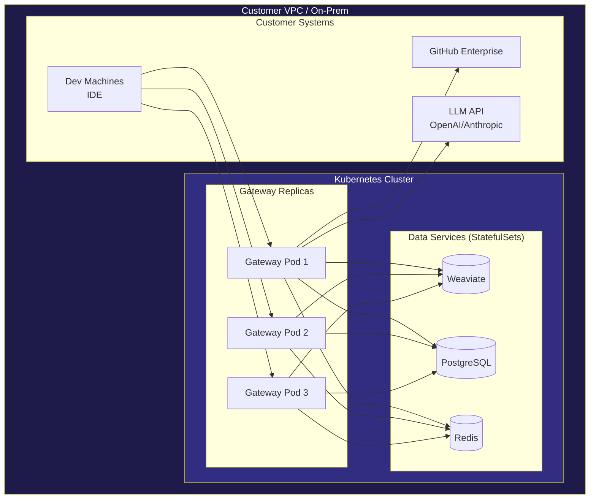

---

## 10. Deployment Models

unyform.ai supports multiple deployment models to fit different enterprise situations. All paths lead to the same goal: **governed AI-assisted development with full visibility**.

### 10.1 Deployment Model Overview

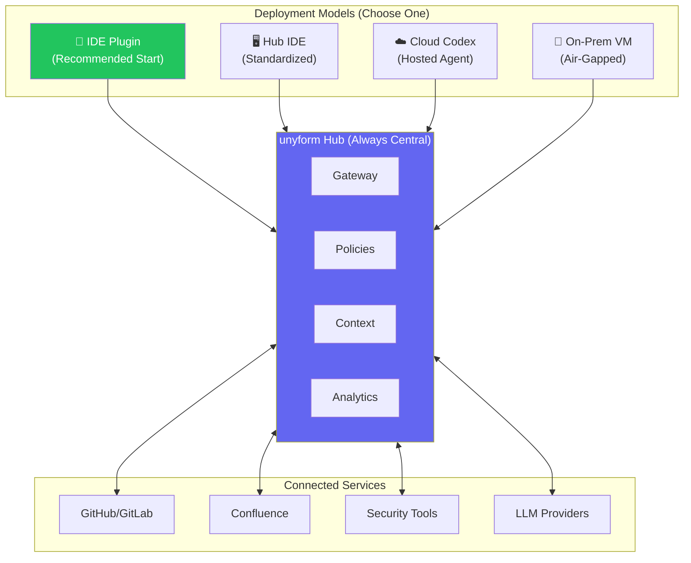

### 10.2 Model 1: IDE Plugin (Primary Target)

**The lightest-touch deployment. Start here.**

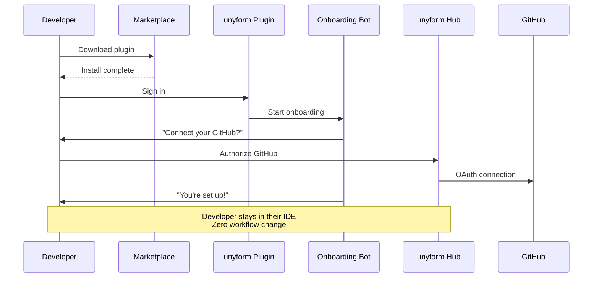

| Aspect | Detail |
|--------|--------|
| **Developer Experience** | Download from marketplace → Sign in → Done |
| **What Plugin Does** | Routes AI requests through hub, brings in CLI + MCP |
| **Onboarding** | AI bot guides through GitHub/Confluence connection |
| **Admin Setup** | Configure policies in hub, approve GitHub org |
| **Best For** | Teams already using VS Code, Cursor, JetBrains |

**Implementation:**

| IDE | Approach | Priority |
|-----|----------|----------|
| **VS Code** | Extension (TypeScript) | P0 - Primary |
| **Cursor** | Already has MCP support | P0 - Native |
| **JetBrains** | Plugin (Kotlin) | P1 |
| **Neovim** | Plugin (Lua) | P2 |

### 10.3 Model 2: Hub IDE (Standardized Environment)

**For enterprises that want to standardize developer tooling.**

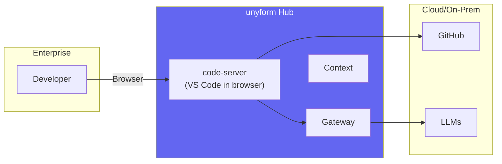

| Aspect | Detail |
|--------|--------|
| **Developer Experience** | Log into web IDE, everything pre-configured |
| **Admin Control** | Full control over extensions, settings, policies |
| **Best For** | Enterprises wanting standardized dev environments |
| **Technology** | code-server, Gitpod, or custom VS Code fork |

### 10.4 Model 3: Cloud Codex (AI Agent Environment)

**Like OpenAI Codex / Devin — an AI agent that works on your repos.**

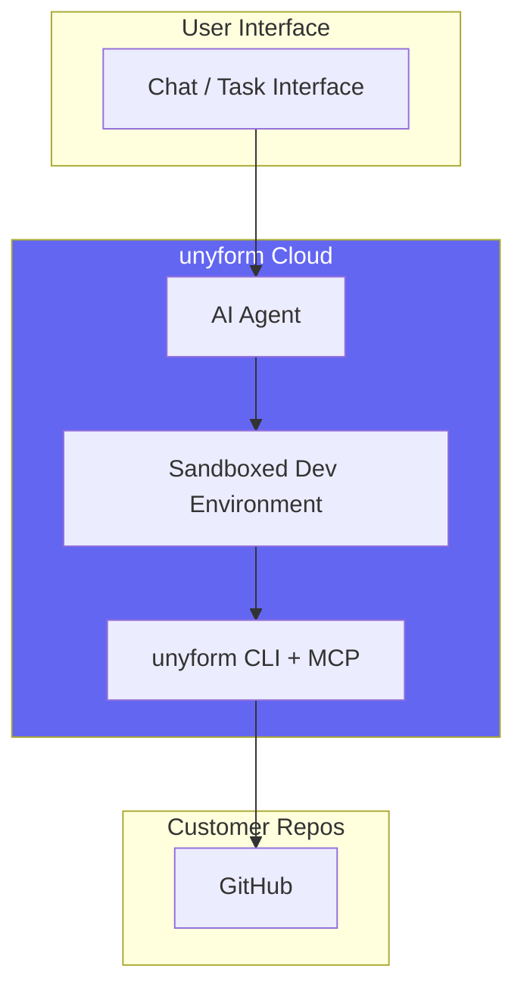

| Aspect | Detail |
|--------|--------|
| **Developer Experience** | Give task, AI works on repo, submits PR |
| **How It Works** | Cloud environment with unyform tooling, connected to GitHub |
| **Best For** | Autonomous coding tasks, bulk migrations, boilerplate |
| **Security** | Sandboxed, policies enforced, audit logged |

### 10.5 Model 4: On-Premise VM (Air-Gapped)

**For regulated industries and high-security environments.**

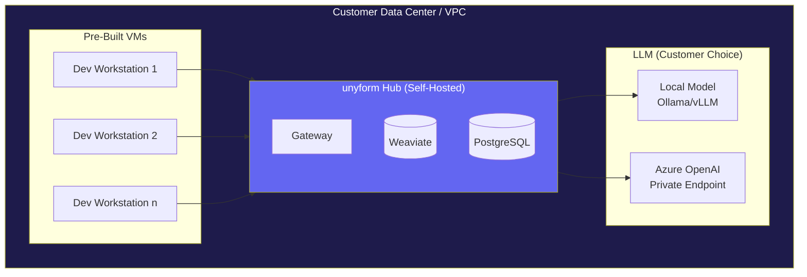

| Aspect | Detail |
|--------|--------|
| **Deployment** | Pre-built VM images (OVA, AMI, etc.) or VNC |
| **LLM Options** | Local (Ollama), Azure Private, AWS Bedrock |
| **Network** | Fully air-gapped if needed |
| **Best For** | Finance, healthcare, defense, government |

### 10.6 Deployment Model Priority

| Phase | Model | Why |
|-------|-------|-----|
| **Phase 1 (MVP)** | IDE Plugin | Lowest friction, largest market |
| **Phase 2** | Cloud Codex | Differentiated, high value |
| **Phase 3** | Hub IDE | Enterprise standardization |
| **Phase 4** | On-Prem VM | Regulated industries, high ACV |

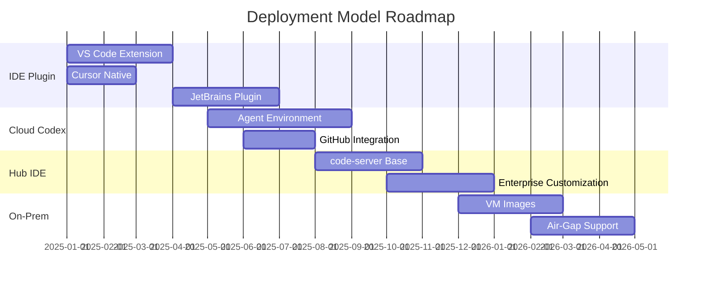

### 10.7 Why Start with IDE Plugin

| Factor | IDE Plugin Wins |
|--------|----------------|
| **Time to Market** | 2-3 months vs 6+ months |
| **Developer Adoption** | Zero behavior change |
| **Enterprise Buy-in** | "Works with existing tools" |
| **Investment** | Lowest engineering cost |
| **Expansion Path** | Plugin users → Cloud users → Enterprise standardization |

**The funnel:**

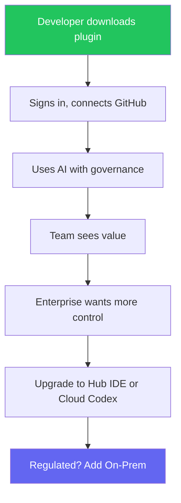

---

## 11. Technology Stack

| Layer | Technology | Rationale |
|-------|------------|-----------|
| **Gateway** | Rust (Axum) | Performance, safety, async |
| **Policy Engine** | Rust | Regex performance, memory safety |
| **Context Service** | Rust + Weaviate | Existing MCP integration |
| **Ingestion** | Rust + Tree-sitter | Fast parsing, language support |
| **Audit Service** | Rust + PostgreSQL | Reliability, SQL queries |
| **Queue** | Redis | Simple, fast, pub/sub |
| **IDE Extension** | TypeScript | VS Code standard |
| **CLI** | Bash + Rust | Existing mx CLI |
| **Infrastructure** | Docker, Kubernetes | Standard, portable |
| **CI/CD** | GitHub Actions | GitHub integration |

---

## 12. Development Practices

### 12.1 Repository Structure

```
unyform/
├── gateway/                 # Rust - LLM proxy + policy enforcement
│   ├── src/
│   │   ├── main.rs
│   │   ├── api/            # HTTP handlers
│   │   ├── auth/           # Authentication
│   │   ├── policy/         # Policy engine
│   │   ├── context/        # RAG integration
│   │   └── audit/          # Logging
│   └── Cargo.toml
│
├── ingestion/              # Rust - Code indexing
│   ├── src/
│   │   ├── main.rs
│   │   ├── github/         # GitHub connector
│   │   ├── parser/         # Tree-sitter parsing
│   │   └── embeddings/     # Embedding generation
│   └── Cargo.toml
│
├── vscode-extension/       # TypeScript - VS Code plugin
│   ├── src/
│   │   ├── extension.ts
│   │   ├── auth/
│   │   ├── gateway/
│   │   └── providers/
│   └── package.json
│
├── web/                    # TypeScript - Dashboard (future)
├── docs/                   # Documentation
├── deploy/                 # Infrastructure as code
│   ├── kubernetes/
│   ├── terraform/
│   └── docker/
└── scripts/                # Development scripts
```

### 12.2 CI/CD Pipeline

```yaml
# .github/workflows/ci.yml
name: CI

on:
  push:
    branches: [main]
  pull_request:

jobs:
  test:
    runs-on: ubuntu-latest
    steps:
      - uses: actions/checkout@v4
      
      - name: Setup Rust
        uses: dtolnay/rust-toolchain@stable
      
      - name: Cache
        uses: Swatinem/rust-cache@v2
      
      - name: Test Gateway
        run: cargo test -p gateway
      
      - name: Test Ingestion
        run: cargo test -p ingestion
      
      - name: Lint
        run: cargo clippy -- -D warnings
      
      - name: Format
        run: cargo fmt --check

  build:
    needs: test
    runs-on: ubuntu-latest
    steps:
      - uses: actions/checkout@v4
      
      - name: Build Gateway
        run: cargo build --release -p gateway
      
      - name: Build Docker Image
        run: docker build -t unyform/gateway:${{ github.sha }} -f gateway/Dockerfile .
      
      - name: Push to Registry
        if: github.ref == 'refs/heads/main'
        run: |
          docker push unyform/gateway:${{ github.sha }}
          docker tag unyform/gateway:${{ github.sha }} unyform/gateway:latest
          docker push unyform/gateway:latest
```

### 12.3 Testing Strategy

| Level | Tool | Coverage Target |
|-------|------|-----------------|
| Unit | `cargo test` | >80% |
| Integration | `cargo test --features integration` | Key flows |
| E2E | Custom test harness | Happy paths |
| Policy | Policy test suite | All rule types |
| Load | k6 | Performance targets |
| Security | cargo-audit, semgrep | All dependencies |

---

**Document History:**

| Version | Date | Author | Changes |
|---------|------|--------|---------|
| 1.0 | Jan 2025 | Engineering | Initial draft |

---

*Built with Rust. Secured by design.*
