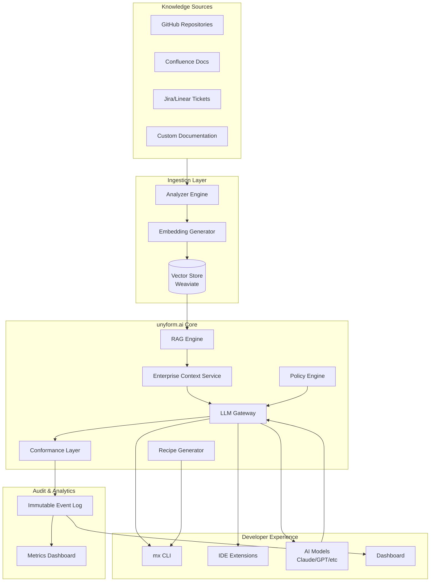
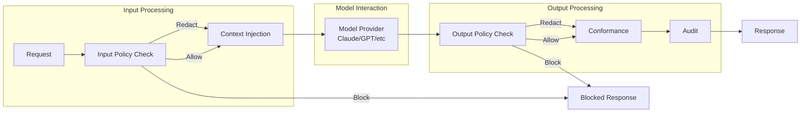
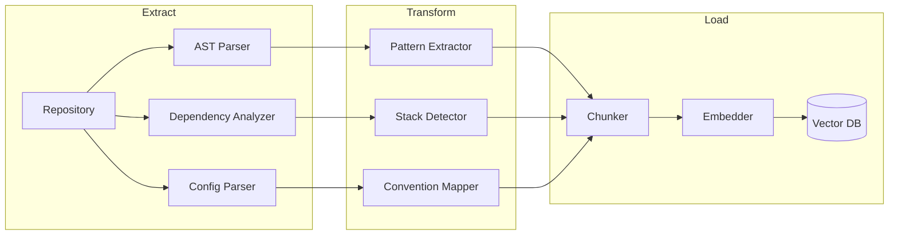
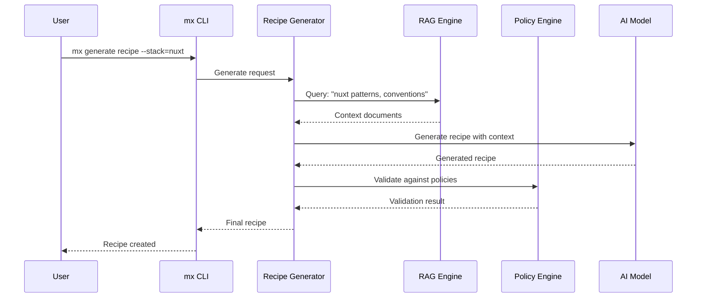
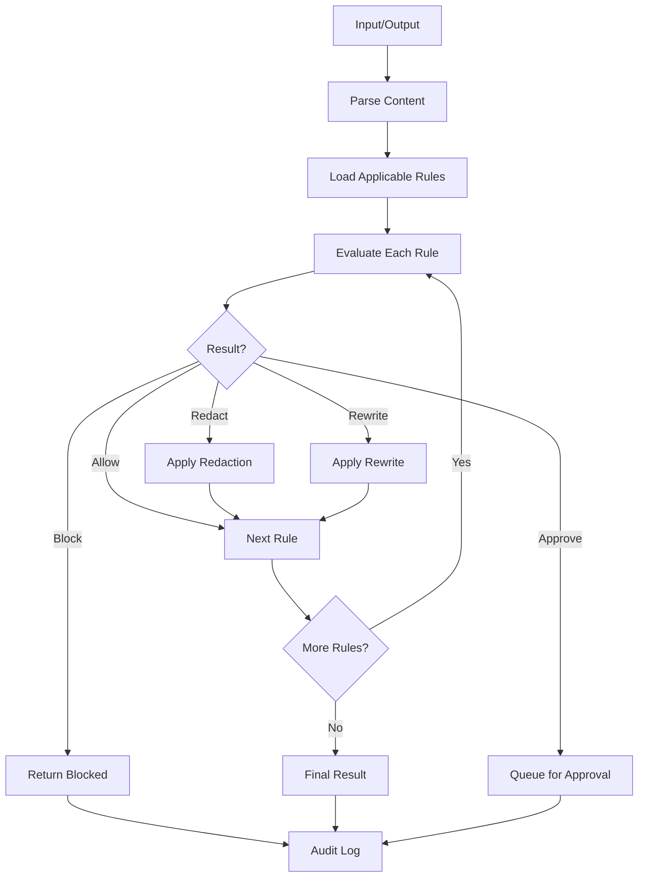
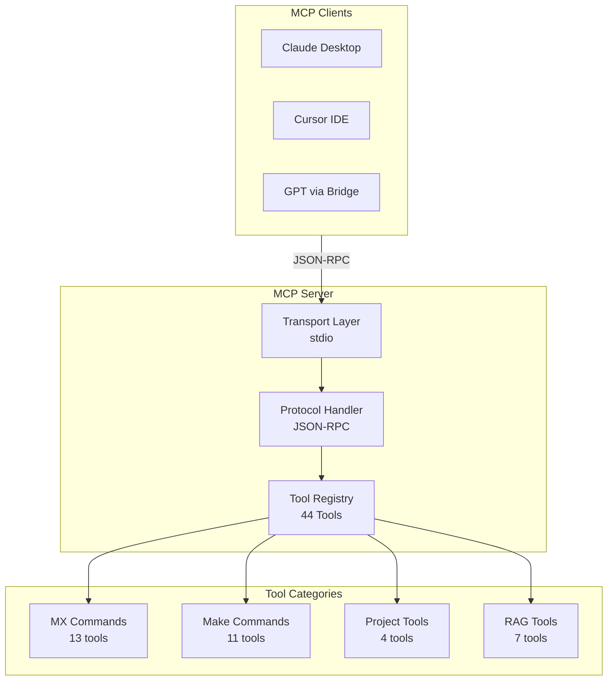
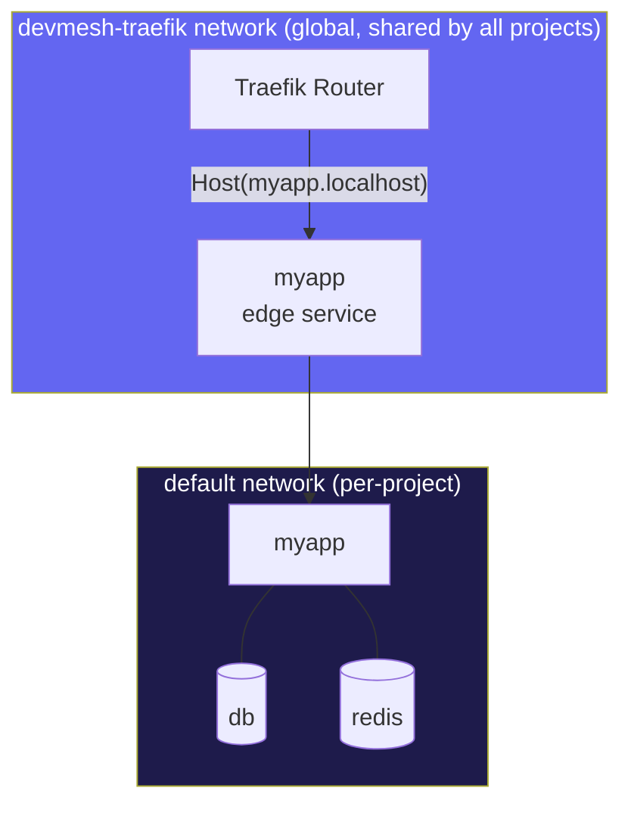
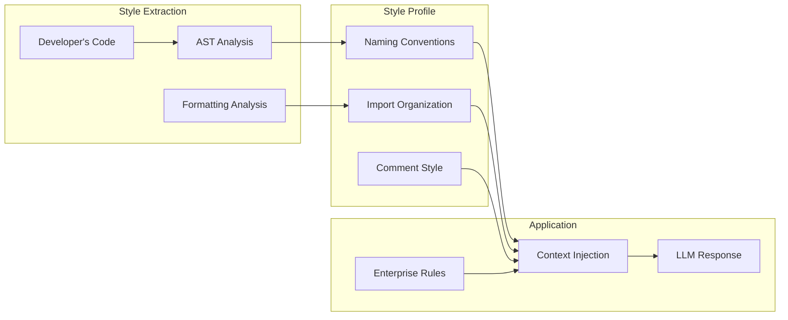
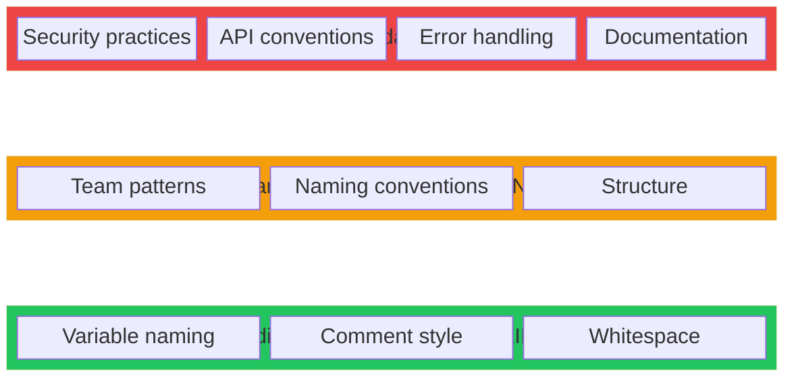

# unyform.ai Technical Whitepaper

## Enterprise AI Trust and Consistency Layer

**Version 1.1 | January 2025**

---

## Abstract

unyform.ai is an enterprise platform that makes AI-generated code safe, consistent, and organization-aware. It sits between developers and AI models to provide canonical enterprise context, policy enforcement at generation time, code style and architecture conformity, and complete audit trails. By ingesting organizational knowledge from sources like GitHub repositories and Confluence documentation, unyform.ai builds an intelligent understanding of an organization's tech stack, coding patterns, and security practices. This knowledge is then used to enforce policies before code is written, generate custom infrastructure recipes, and ensure that AI-assisted development produces output that conforms to established organizational standards—with optional per-engineer personalization that never breaks enterprise rules. This whitepaper details the technical architecture, capabilities, and implementation approach of the unyform.ai platform.

---

## Table of Contents

1. [Introduction](#1-introduction)
2. [Architecture Overview](#2-architecture-overview)
3. [LLM Gateway](#3-llm-gateway)
4. [The Four Pillars](#4-the-four-pillars)
5. [Policy Engine Deep Dive](#5-policy-engine-deep-dive)
6. [Recipe System](#6-recipe-system)
7. [MCP Integration](#7-mcp-integration)
8. [Infrastructure Scaffolding](#8-infrastructure-scaffolding)
9. [Developer Style Conformance](#9-developer-style-conformance)
10. [Governance Add-on](#10-governance-add-on)
11. [Security Model](#11-security-model)
12. [Integrations](#12-integrations)
13. [Evaluation Suite](#13-evaluation-suite)
14. [Comparison with Alternatives](#14-comparison-with-alternatives)
15. [Customer Journey](#15-customer-journey)
16. [Future Vision](#16-future-vision)
17. [Conclusion](#17-conclusion)

---

## 1. Introduction

### 1.1 The Enterprise AI Adoption Challenge

Enterprise teams adopting AI coding tools hit predictable friction across four dimensions:

#### Context Fragmentation
LLMs do not reliably understand multi-repo systems, internal libraries, and historical architectural decisions. Each AI session starts from zero, forcing developers to repeatedly explain context that should be institutional knowledge.

#### Trust Gap
Security, privacy, and compliance requirements create a high bar. A small mistake can be catastrophic—leaked credentials, compliance violations, or security vulnerabilities. Most AI tools detect problems *after* generation, not before.

#### Consistency Drift
Different engineers and different AI sessions produce inconsistent patterns, styles, and library choices. This increases maintenance costs, slows code reviews, and accumulates technical debt.

#### Cold Start Tax
Teams spend significant time writing instructions, building templates, and creating ad-hoc guardrails before AI becomes truly useful. This overhead is repeated across projects and sessions.

### 1.2 What Exists Today

Most enterprise offerings solve fragments of the problem but not the unified experience:

| Layer | What It Does | Limitation |
|-------|--------------|------------|
| **Code Assistants** | IDE suggestions, chat | No org context, no enforcement |
| **Context Tools** | Code search, embeddings | No policy enforcement |
| **Security/Governance** | SAST, DLP, policy-as-code | Post-generation detection only |
| **Workflow Tools** | PR reviews, CI checks | Reactive, not proactive |

**The missing piece:** A single platform that connects all four into a coherent enterprise context with strong enforcement at generation time and auditability—plus optional per-engineer personalization.

### 1.3 The unyform.ai Solution

unyform.ai is an **Enterprise AI Trust and Consistency Layer** that sits between developers and AI models to provide:

1. **Canonical enterprise context** - One source of truth for architecture, libraries, and rules
2. **Policy enforcement at generation time** - Not just detection after the fact
3. **Code style and architecture conformity** - Output matches your patterns automatically
4. **Approval workflows and audit logs** - Evidence for security and compliance
5. **Optional per-engineer personalization** - Individual style without breaking enterprise rules

---

## 2. Architecture Overview

unyform.ai is built as a modular system with clear separation of concerns, enabling flexible deployment from single-repo pilots to enterprise-wide rollouts.

### 2.1 High-Level Architecture



### 2.2 Component Overview

| Component | Purpose | Technology |
|-----------|---------|------------|
| **LLM Gateway** | Single route for all model requests with policy checks | Rust |
| **Policy Engine** | Rule evaluation and enforcement | Rust |
| **Enterprise Context Service** | Canonical patterns, ADRs, architecture map | Rust, Weaviate |
| **Analyzer Engine** | Extract patterns from source code and docs | Rust, Tree-sitter |
| **Embedding Generator** | Create vector representations of knowledge | sentence-transformers |
| **Vector Store** | Semantic search over organizational knowledge | Weaviate |
| **RAG Engine** | Retrieval-Augmented Generation for queries | Rust, Weaviate |
| **Recipe Generator** | Create custom recipes from patterns | Rust, AI models |
| **Conformance Layer** | Auto-rewrite to match standards | Rust |
| **CLI (mx)** | Command-line interface | Bash, Make |
| **Dashboard** | Web-based management | Nuxt 3 |

### 2.3 Primary Data Flow

```
1. Developer makes request in IDE
          ↓
2. IDE sends request to LLM Gateway
          ↓
3. Gateway queries Enterprise Context Service (with user permissions)
          ↓
4. Gateway applies Policy Engine to prompt + retrieved context
          ↓
5. Gateway calls model provider (if allowed)
          ↓
6. Gateway applies output policy checks
          ↓
7. Conformance Layer rewrites output (or blocks it)
          ↓
8. Audit Log records full trace with hashes and references
          ↓
9. Output returns to IDE (optionally as patch or PR)
```

---

## 3. LLM Gateway

The LLM Gateway is the central nervous system of unyform.ai—the single route through which all AI model requests flow.

### 3.1 Gateway Architecture



### 3.2 Gateway Responsibilities

| Function | Description |
|----------|-------------|
| **Request Routing** | Route to appropriate model provider based on config |
| **Input Policy** | Scan prompts against policy rules before model call |
| **Context Injection** | Add relevant enterprise context and instruction packs |
| **Output Policy** | Validate generated code before returning |
| **Conformance** | Apply formatters, codemods, rewrites |
| **Audit Logging** | Record full trace for compliance |

### 3.3 Multi-Model Support

The gateway is model-agnostic to avoid vendor lock-in:

| Provider | Models | Status |
|----------|--------|--------|
| Anthropic | Claude 3.5, Claude 3 | Supported |
| OpenAI | GPT-4, GPT-4 Turbo | Supported |
| Azure OpenAI | GPT-4 (enterprise) | Supported |
| Local | Ollama, vLLM | Planned |

---

## 4. The Four Pillars

unyform.ai is built around four core capabilities that work together to deliver organizational conformance.

### 4.1 Ingest

The Ingest pillar connects to organizational knowledge sources and extracts structured information.

#### Supported Sources

| Source | Data Extracted | Update Strategy |
|--------|----------------|-----------------|
| **GitHub** | Code patterns, dependencies, configs, PR discussions | Webhook + incremental |
| **Confluence** | ADRs, runbooks, standards docs | Webhook + incremental |
| **Jira/Linear** | Requirements, decisions, constraints | Scheduled sync |
| **Custom Docs** | Markdown, text files, internal wikis | Manual or scheduled |
| **Infra Code** | Terraform, K8s manifests, Docker configs | With repo sync |

#### Analysis Pipeline



#### Pattern Extraction

| Pattern Type | Detection Method | Example |
|--------------|------------------|---------|
| **Architectural** | File structure, dependency graph | Microservices, monolith |
| **Coding Style** | AST analysis, formatting | Naming conventions |
| **Security** | Dependency scan, code patterns | Auth handling |
| **Infrastructure** | Config file analysis | Docker patterns |
| **Testing** | Test file structure | Unit test approach |

### 4.2 Learn

The Learn pillar transforms raw ingested data into actionable knowledge.

#### Embedding Strategy

- **Code chunks**: Function/class boundaries
- **Documentation**: Heading-based sections
- **Configs**: Logical blocks

#### Metadata Enrichment

Each chunk is enriched with:
- Source type (code, doc, config)
- Category (recipe, command, docker, traefik, infra)
- Language/framework
- Date, author, version
- Permission requirements

#### Knowledge Graph

Beyond embeddings, unyform.ai builds relationship graphs:

- **Depends-on**: Service A depends on Service B
- **Implements**: Code pattern implements architectural decision
- **Contradicts**: New standard supersedes old practice
- **Related-to**: Concepts that frequently appear together

### 4.3 Generate

The Generate pillar uses learned knowledge to create compliant output.

#### Organization Instruction Packs

Codified enterprise standards that apply to all AI interactions:

```yaml
# Example: org-instruction-pack.yml
name: acme-corp-standards
version: "1.0"

formatting:
  indent: 2
  quotes: single
  semicolons: false

naming:
  variables: camelCase
  functions: camelCase
  classes: PascalCase
  files: kebab-case

imports:
  order:
    - external
    - internal
    - relative
  alias_prefix: "@/"

internal_libraries:
  - name: "@acme/auth"
    usage: "Use for all authentication"
  - name: "@acme/logger"
    usage: "Use instead of console.log"

forbidden:
  - pattern: "console.log"
    reason: "Use @acme/logger instead"
  - pattern: "any"
    reason: "Avoid any type, use specific types"
```

#### Recipe Generation



### 4.4 Govern

The Govern pillar enforces organizational policies at generation time—not after.

#### Enforcement Points

| Point | Timing | Action |
|-------|--------|--------|
| **Input** | Before model call | Block or redact prompt |
| **Output** | After model response | Block, redact, or rewrite |
| **Conformance** | Before return | Apply formatters, codemods |
| **CI/CD** | Pipeline stage | Fail build on violations |
| **Runtime** | Continuous | Drift detection |

---

## 5. Policy Engine Deep Dive

The Policy Engine is the enforcement mechanism that makes unyform.ai enterprise-ready.

### 5.1 Policy Rule Types

#### Dependency Policies

Control what packages, versions, and licenses are allowed.

```yaml
- name: allowed-dependencies
  type: dependency
  rules:
    allowed:
      - package: "lodash"
        versions: ">=4.17.21"
      - package: "@acme/*"
        versions: "*"
    forbidden:
      - package: "moment"
        reason: "Use date-fns instead"
        alternative: "date-fns"
    licenses:
      allowed: [MIT, Apache-2.0, BSD-3-Clause]
      forbidden: [GPL-3.0, AGPL-3.0]
```

#### Secrets and Credentials

Prevent generation or leakage of sensitive data.

```yaml
- name: no-secrets
  type: secrets
  rules:
    patterns:
      - regex: "(api[_-]?key|apikey)\\s*[:=]\\s*['\"][^$][^'\"]{10,}['\"]"
        message: "API key detected in code"
      - regex: "(password|passwd|pwd)\\s*[:=]\\s*['\"][^$][^'\"]+['\"]"
        message: "Hardcoded password detected"
    actions:
      input: redact
      output: block
```

#### Data Handling and Privacy

Enforce PII protection and logging restrictions.

```yaml
- name: data-privacy
  type: data-handling
  rules:
    pii_fields:
      - email
      - phone
      - ssn
      - credit_card
    restrictions:
      - context: logging
        action: redact
      - context: external_api
        action: require_encryption
```

#### Network and Service Boundaries

Prevent unauthorized cross-service calls.

```yaml
- name: service-boundaries
  type: network
  rules:
    services:
      - name: payments
        allowed_callers: [api-gateway, order-service]
        forbidden_callers: [frontend, public-api]
      - name: user-data
        requires: internal_gateway
```

#### Secure Coding Patterns

Enforce security best practices.

```yaml
- name: secure-coding
  type: patterns
  rules:
    required:
      - pattern: input_validation
        context: api_endpoints
      - pattern: parameterized_queries
        context: database
      - pattern: csrf_protection
        context: forms
    forbidden:
      - pattern: eval
        message: "eval() is forbidden"
      - pattern: innerHTML
        message: "Use textContent or sanitization"
```

#### Infrastructure and Cloud Rules

Control cloud resource provisioning.

```yaml
- name: infrastructure
  type: cloud
  rules:
    aws:
      required_tags: [environment, team, cost-center]
      encryption_at_rest: required
      public_access: forbidden
    containers:
      run_as_root: forbidden
      latest_tag: forbidden
```

### 5.2 Enforcement Actions

| Action | Description | Use Case |
|--------|-------------|----------|
| **Allow** | Permit the operation | Clean input/output |
| **Block** | Reject entirely | Security violations |
| **Redact** | Remove sensitive portions | PII, credentials |
| **Rewrite** | Transform to safe alternative | Pattern replacement |
| **Require Approval** | Route to reviewer | High-risk operations |

### 5.3 Policy Evaluation Flow



---

## 6. Recipe System

The recipe system is the core mechanism for codifying and reproducing infrastructure patterns.

### 6.1 Recipe Structure

```
templates/recipes/[recipe-name]/
├── recipe.json              # Recipe manifest
├── README.md                # Documentation
├── app/                     # Application source code
│   ├── src/
│   ├── package.json
│   └── ...
├── config/
│   └── env.service          # Environment template
└── docker/
    ├── compose/
    │   ├── service.yml      # Production compose
    │   └── service.dev.yml  # Development overrides
    ├── dockerfiles/
    │   ├── app.Dockerfile   # Multi-stage Dockerfile
    │   └── app.prod.Dockerfile
    └── system/
        └── app/             # Filesystem mirror
            ├── etc/
            │   ├── supervisor/
            │   └── nginx/
            └── usr/
                └── local/
                    └── bin/
                        └── entrypoint
```

### 6.2 Recipe.json Specification

```json
{
  "name": "nuxt",
  "title": "Nuxt 3",
  "description": "Nuxt 3 SSR/SSG application with Nitro server",
  "version": "3.15",
  
  "features": [
    "Nuxt 3 with SSR/SSG",
    "Nitro server",
    "Tailwind CSS + DaisyUI",
    "TypeScript",
    "Traefik reverse proxy routing"
  ],
  
  "services": [
    { "name": "<name>", "description": "Nuxt application" }
  ],
  
  "options": {
    "domain": {
      "flag": "--domain",
      "default": "{{SERVICE_NAME}}.localhost",
      "description": "Custom domain for routing"
    }
  },
  
  "placeholders": {
    "SERVICE_NAME": { "source": "name" },
    "SERVICE_SLUG": { "source": "name", "transform": "slug" },
    "DOMAIN": { "source": "option:domain" }
  },
  
  "templates": [
    { "from": "docker/compose/service.yml", "to": "docker/compose/{{SERVICE_NAME}}.yml" }
  ],
  
  "init_app": {
    "cwd": "apps",
    "target_dir": "apps/{{SERVICE_NAME}}",
    "command": "{{INIT_CMD}}"
  }
}
```

### 6.3 Current Recipe Catalog

| Recipe | Stack | Use Case |
|--------|-------|----------|
| `laravel` | PHP 8.3, Laravel 11, Nginx | Full-stack PHP applications |
| `nuxt` | Nuxt 3, Node 24, Tailwind | Vue SSR/SSG applications |
| `astro` | Astro 4, Vue, Tailwind | Content-focused sites |
| `rust-api` | Rust, Axum, PostgreSQL | High-performance APIs |
| `rust-leptos` | Rust, Leptos | Rust full-stack SSR |
| `rust-worker` | Rust, Cloudflare Workers | Edge computing |
| `zola` | Zola | Static documentation sites |

---

## 7. MCP Integration

unyform.ai integrates with AI assistants through the Model Context Protocol (MCP).

### 7.1 MCP Server Architecture



### 7.2 Tool Categories (44 Total)

#### Global MX Commands (13 tools)

| Tool | Description |
|------|-------------|
| `mx_new` | Create new project |
| `mx_add_service` | Add service to project |
| `mx_recipes_list` | List available recipes |
| `mx_router_*` | Router lifecycle management |
| `mx_infra_*` | Infrastructure configuration |

#### Make Commands (11 tools)

| Tool | Description |
|------|-------------|
| `make_dev` | Start development mode |
| `make_up` | Start production mode |
| `make_down` | Stop services |
| `make_logs` | View service logs |

#### RAG Tools (7 tools)

| Tool | Description |
|------|-------------|
| `rag_search` | Semantic search across docs |
| `rag_search_category` | Search within category |
| `rag_find_implementation` | Find code examples |
| `rag_get_guidance` | Architecture guidance |

---

## 8. Infrastructure Scaffolding

### 8.1 Docker Orchestration

#### Network Architecture



### 8.2 Cloud Provider Support

| Provider | Services | Status |
|----------|----------|--------|
| **Cloudflare** | Workers, Containers, Cron | ✅ Available |
| **AWS** | ECS, Lambda, RDS, S3 | 🔜 Q2 2025 |
| **DigitalOcean** | App Platform, Droplets | 🔜 Q2 2025 |
| **Kubernetes** | Helm charts | 🔜 Q1 2026 |

---

## 9. Developer Style Conformance

### 9.1 Personalization Architecture

unyform.ai can learn and apply individual developer coding styles—while always respecting enterprise constraints.



### 9.2 Personalization Hierarchy



**Priority:** Enterprise > Team > Individual

Enterprise rules cannot be overridden. Team standards can be adjusted within enterprise bounds. Individual preferences only apply where they don't conflict with above.

### 9.3 Profile Components

| Component | What's Captured | Configurable |
|-----------|-----------------|--------------|
| **Naming** | Variable, function, class naming | Yes |
| **Imports** | Organization and grouping | Yes |
| **Comments** | Documentation style, verbosity | Yes |
| **Structure** | Code organization preferences | Limited |
| **Error Handling** | Exception patterns | No (enterprise) |
| **Security** | Auth, validation patterns | No (enterprise) |

---

## 10. Governance Add-on

The Governance add-on (Enterprise tier) provides comprehensive policy enforcement, audit trails, and compliance reporting.

### 10.1 Policy Definition Language

```yaml
apiVersion: unyform.ai/v1
kind: PolicySet
metadata:
  name: acme-corp-security
  version: "1.0"

spec:
  policies:
    - name: tls-required
      description: All external endpoints must use TLS
      severity: critical
      scope: [infrastructure]
      rule:
        type: config-check
        check: traefik.entrypoints.websecure
        
    - name: no-root-containers
      description: Containers must not run as root
      severity: error
      scope: [docker]
      rule:
        type: dockerfile-check
        check: user-not-root
```

### 10.2 Audit Trail

All operations are logged with comprehensive context:

```json
{
  "id": "audit-2025-01-15-001234",
  "timestamp": "2025-01-15T14:32:17Z",
  "actor": {
    "type": "user",
    "id": "dev-12345",
    "email": "developer@company.com"
  },
  "action": "generate.code",
  "request": {
    "prompt_hash": "sha256:abc123...",
    "context_sources": ["repo:acme/api", "doc:auth-patterns"],
    "model": "claude-3.5-sonnet"
  },
  "policy_evaluation": {
    "rules_checked": 15,
    "rules_passed": 14,
    "rules_failed": 1,
    "action_taken": "rewrite",
    "violations": [
      {
        "rule": "no-console-log",
        "action": "rewrite",
        "original": "console.log(user)",
        "rewritten": "logger.info('user', { userId: user.id })"
      }
    ]
  },
  "result": "success"
}
```

### 10.3 Compliance Reports

Pre-built templates for common frameworks:

| Framework | Report Contents |
|-----------|-----------------|
| **SOC 2** | Access controls, encryption, logging |
| **HIPAA** | PHI handling, access audit |
| **PCI-DSS** | Cardholder data, network security |
| **Custom** | User-defined requirements |

---

## 11. Security Model

### 11.1 Data Handling

| Data Type | Storage | Encryption | Retention |
|-----------|---------|------------|-----------|
| Source code | Minimal chunks + embeddings | AES-256 at rest | Configurable |
| Prompts/Responses | Hashes only (default) | N/A | Per audit mode |
| Credentials | Never stored | N/A | N/A |
| Audit logs | Encrypted DB | AES-256 | 7 years |

**Code Storage Clarification:**

We store **minimal code chunks** needed for RAG retrieval, not full repositories:
- Chunks are typically 50-200 lines, chunked at semantic boundaries
- Embeddings enable semantic search without full text queries
- Full source remains in Git—we reference, not duplicate
- VPC/on-prem deployments keep all data in customer infrastructure

**Audit Retention Modes:**

| Mode | Prompts/Responses | Use Case |
|------|-------------------|----------|
| `hashes_only` (default) | SHA-256 hash stored | Privacy-first |
| `encrypted_payloads` | AES-256 + BYOK | Compliance |
| `full_payloads` | Plaintext (customer VPC) | Forensics |

### 11.2 Access Control

| Role | Permissions |
|------|-------------|
| **Viewer** | Read projects, view recipes |
| **Developer** | + Create projects, use recipes |
| **Team Lead** | + Manage team, edit policies |
| **Admin** | + Manage org, SSO, billing |

### 11.3 Self-Hosted Security

- **Air-gapped deployment**: No external dependencies
- **Customer-managed keys**: BYOK encryption
- **VPC-only deployment**: Network isolation

---

## 12. Integrations

### 12.1 Integration Matrix

| Category | Tools | Status |
|----------|-------|--------|
| **IDE** | VS Code, JetBrains, Cursor | Cursor ✅, others 🔜 |
| **Git** | GitHub, GitLab, Bitbucket | GitHub ✅, others 🔜 |
| **CI/CD** | GitHub Actions, GitLab CI, Jenkins | 🔜 Q2 2025 |
| **Security** | Semgrep, Snyk, SonarQube | 🔜 Q4 2025 |
| **DLP** | Custom regex, ML detectors | 🔜 Q3 2025 |
| **Ticketing** | Jira, Linear | 🔜 Q2 2025 |
| **Secrets** | Vault, AWS Secrets, GCP SM | 🔜 Q4 2025 |
| **Chat** | Slack, Teams | 🔜 Q4 2025 |

---

## 13. Evaluation Suite

### 13.1 Test Harness

A repeatable framework for measuring quality and compliance:

| Component | Description |
|-----------|-------------|
| **Golden Tasks** | Standard prompts representing real work |
| **Policy Tests** | Prompts designed to trigger violations |
| **Style Tests** | Verify formatting, naming, patterns |
| **Regression Tracking** | Compare across versions |

### 13.2 Scorecard Dimensions

| Dimension | Measurement |
|-----------|-------------|
| **Correctness** | Functional accuracy of generated code |
| **Security Compliance** | Violations detected/prevented |
| **Style Compliance** | Match to org standards |
| **Latency** | Response time |
| **Developer Satisfaction** | Survey scores |

---

## 14. Comparison with Alternatives

### 14.1 Feature Matrix

| Feature | unyform.ai | Backstage | Port.io | Copilot |
|---------|------------|-----------|---------|---------|
| Service Catalog | ✅ | ✅ | ✅ | ❌ |
| Code Generation | ✅ | ❌ | ❌ | ✅ |
| Org Context | ✅ | Partial | Partial | ❌ |
| Policy at Gen Time | ✅ | ❌ | ❌ | ❌ |
| Custom Recipes | ✅ | Partial | ❌ | ❌ |
| Developer Styles | ✅ | ❌ | ❌ | ❌ |
| Audit Trails | ✅ | ❌ | Partial | ❌ |

### 14.2 Positioning

**unyform.ai is the trust layer**—not a replacement for AI assistants, but the enterprise-grade layer that makes them safe and consistent.

---

## 15. Customer Journey

### 15.1 Getting Started (Community)

```
Day 1: Install mx CLI, start router
Day 2: Create first project with recipe
Week 1: Explore recipes, customize configs
```

### 15.2 Team Onboarding (Team Tier)

```
Week 1: Connect GitHub, initial ingestion
Week 2: Review detected patterns, customize
Week 3-4: Generate first custom recipe
Month 2+: Roll out to team
```

### 15.3 Enterprise Deployment

```
Month 1: Security review, SSO design
Month 2: Pilot with governance policies
Month 3: Organization-wide rollout
```

### 15.4 ROI Metrics

| Metric | Before | After | Improvement |
|--------|--------|-------|-------------|
| Service setup time | 2-3 days | 15 min | 95% faster |
| Standards compliance | 60-70% | 95%+ | 35% increase |
| AI code acceptance | 30-40% | 80%+ | 2x increase |

---

## 16. Future Vision

### 16.1 Recipe Marketplace

Community and commercial recipe sharing with verification badges.

### 16.2 Advanced Governance

- Predictive compliance
- Automated remediation
- Cross-org benchmarking

### 16.3 AI Evolution

- Local models for sensitive environments
- Organization-specific fine-tuning
- Conversational infrastructure management

---

## 17. Conclusion

unyform.ai represents a fundamental shift in enterprise AI adoption—from hoping AI tools produce compliant output to **ensuring** it through canonical context, policy enforcement at generation time, and comprehensive audit trails.

**Key differentiators:**

1. **Guardrails before code is written** - Not post-generation detection
2. **Policy and architecture as first-class context** - Not just embeddings
3. **Developer personalization within enterprise bounds** - Individual voice, org rules
4. **Evidence-centric design** - Audit trails from day one
5. **Open foundation** - Community core with enterprise extensions

**The result:** Engineering teams that build faster, more consistently, and more securely—with AI that truly understands and respects how they work.

---

## Appendix A: Glossary

| Term | Definition |
|------|------------|
| **Recipe** | Template that generates a complete service |
| **MCP** | Model Context Protocol - LLM tool integration standard |
| **RAG** | Retrieval-Augmented Generation |
| **Policy** | Rule defining required/prohibited configurations |
| **Instruction Pack** | Codified org standards for AI context |
| **Conformance** | Auto-transformation to match standards |

## Appendix B: Technical Requirements

### Self-Hosted Deployment

| Component | Minimum | Recommended |
|-----------|---------|-------------|
| CPU | 4 cores | 8 cores |
| RAM | 8 GB | 16 GB |
| Storage | 50 GB SSD | 200 GB SSD |

---

**Document Version:** 1.1  
**Last Updated:** January 2025  
**Contact:** technical@unyform.ai

---

*AI that builds like your team builds—safely, consistently, and on your terms.*
